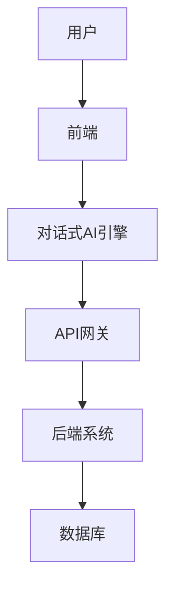

                 


# 构建企业级对话式AI助手：跨系统业务流程自动化与协调

> 关键词：对话式AI助手，跨系统集成，业务流程自动化，自然语言处理，意图识别，实体识别，系统架构

> 摘要：  
企业级对话式AI助手是一种通过自然语言处理技术，实现跨系统业务流程自动化与协调的智能系统。本文将从对话式AI的核心原理出发，结合跨系统集成与业务流程自动化的技术细节，深入探讨企业级对话式AI助手的构建方法。文章将涵盖对话式AI助手的系统架构设计、算法原理、数学模型、系统实现、项目实战及优化建议，为读者提供一个全面的技术指南。

---

## 第1章：对话式AI助手的背景与目标

### 1.1 对话式AI助手的背景

#### 1.1.1 自然语言处理技术的发展
自然语言处理（NLP）技术的进步使得对话式AI助手从简单的关键词匹配逐步发展为能够理解上下文和意图的智能系统。随着深度学习模型的崛起，如BERT、GPT等，对话式AI助手的准确性和流畅性得到了显著提升。

#### 1.1.2 企业级对话式AI的需求
企业级对话式AI助手的需求主要来源于以下几个方面：
- 提升客户服务质量：通过自动化方式解决客户问题，减少人工干预。
- 优化内部协作：实现跨部门、跨系统的业务流程自动化。
- 提高效率：通过智能化的对话流程管理，缩短处理时间。

#### 1.1.3 对话式AI在企业数字化转型中的作用
对话式AI助手作为企业数字化转型的重要工具，能够帮助企业实现以下目标：
- 提供7×24小时的客户支持。
- 实现业务流程的智能化管理。
- 通过数据分析，辅助决策。

### 1.2 对话式AI助手的目标与价值

#### 1.2.1 提升用户体验
对话式AI助手通过自然语言理解（NLU）技术，能够准确识别用户的意图和需求，提供个性化的服务。

#### 1.2.2 优化企业效率
通过自动化处理业务流程，对话式AI助手能够减少人工操作，提高企业的整体效率。

#### 1.2.3 跨系统集成与协调
对话式AI助手能够连接多个系统，协调各个系统的操作，实现业务流程的自动化。

---

## 第2章：对话式AI的核心原理

### 2.1 对话式AI的定义与核心要素

#### 2.1.1 对话式AI的定义
对话式AI助手是一种基于NLP技术的智能系统，能够通过自然语言与用户进行交互，并根据用户的意图执行相应的操作。

#### 2.1.2 对话式AI的核心要素
- **意图识别**：识别用户的意图，如“查询订单状态”。
- **实体识别**：提取对话中的实体信息，如订单号、客户姓名。
- **对话管理**：根据对话上下文，生成合适的回复，并决定下一步操作。

#### 2.1.3 对话式AI与传统聊天机器人的区别
传统聊天机器人主要基于规则库进行匹配，而对话式AI助手则基于深度学习模型，能够理解上下文和意图。

### 2.2 对话式AI的关键技术

#### 2.2.1 自然语言处理（NLP）技术
NLP技术是对话式AI的核心，包括文本分词、句法分析、语义理解等。

#### 2.2.2 意图识别与槽位填充
- **意图识别**：通过模型识别用户的主要意图。
- **槽位填充**：提取与意图相关的实体信息。

#### 2.2.3 对话状态管理与上下文理解
对话式AI需要维护对话的状态，包括用户的历史输入、系统响应等，以便生成连贯的回复。

---

## 第3章：跨系统集成与业务流程自动化

### 3.1 跨系统集成的定义与挑战

#### 3.1.1 跨系统集成的定义
跨系统集成是指将不同系统（如CRM、ERP、数据库等）连接起来，实现数据共享和业务流程自动化。

#### 3.1.2 跨系统集成的主要挑战
- **异构系统集成**：不同系统之间的接口和协议不统一。
- **数据孤岛**：数据分布在不同的系统中，难以共享。
- **实时性要求**：某些业务流程需要实时处理。

#### 3.1.3 跨系统集成的核心技术
- **API接口**：通过API实现系统间的数据交互。
- **消息队列**：如Kafka、RabbitMQ，用于异步通信。
- **服务编排**：通过服务 orchestration 实现业务流程的自动化。

### 3.2 业务流程自动化的实现

#### 3.2.1 业务流程自动化的定义
业务流程自动化是指通过技术手段，将重复性、规则性的业务操作自动化。

#### 3.2.2 业务流程自动化的核心技术
- **工作流引擎**：如Activiti、Camunda，用于定义和执行业务流程。
- **规则引擎**：如Drools，用于动态调整业务规则。
- **自动化工具**：如RPA（机器人流程自动化），用于模拟人工操作。

#### 3.2.3 业务流程自动化的实现步骤
1. **需求分析**：明确需要自动化的业务流程。
2. **流程建模**：使用工具（如BPMN）建模业务流程。
3. **系统集成**：通过API或消息队列实现跨系统的数据交互。
4. **流程执行**：启动并监控业务流程的执行。
5. **优化与维护**：根据反馈优化流程。

---

## 第4章：对话式AI与业务流程协调

### 4.1 对话式AI在业务流程中的作用

#### 4.1.1 对话式AI作为用户与系统交互的桥梁
对话式AI助手通过自然语言理解用户需求，并通过API调用后端系统执行操作。

#### 4.1.2 对话式AI在业务流程中的协调作用
对话式AI助手能够协调多个系统，确保业务流程的顺利执行。

#### 4.1.3 对话式AI在跨系统协作中的价值
- **简化用户操作**：用户通过对话即可完成复杂的业务流程。
- **提高效率**：通过自动化减少人工操作。
- **增强用户体验**：提供个性化的服务。

### 4.2 对话式AI与业务流程协调的实现

#### 4.2.1 对话式AI与业务流程的整合
1. **意图识别**：识别用户的业务需求。
2. **系统调用**：根据需求调用相应的系统API。
3. **流程监控**：实时监控业务流程的执行状态。

#### 4.2.2 对话式AI在业务流程中的具体应用
- **客户服务**：用户查询订单状态，AI助手调用CRM系统查询。
- **内部协作**：员工通过对话式AI助手提交任务，AI助手调用ERP系统执行。

#### 4.2.3 对话式AI与业务流程协调的优化策略
- **上下文管理**：维护对话的上下文，确保流程连贯。
- **错误处理**：在流程执行中，处理可能出现的错误。
- **反馈机制**：用户可以通过对话反馈流程执行结果。

---

## 第5章：系统架构与实现

### 5.1 系统架构设计

#### 5.1.1 系统架构的核心要素
- **前端**：用户与AI助手交互的界面，如Web或移动端。
- **对话式AI引擎**：负责处理自然语言理解和生成。
- **后端系统**：包括CRM、ERP等业务系统。
- **API网关**：统一管理API调用。
- **消息队列**：用于异步通信。

#### 5.1.2 对话式AI系统的架构图


#### 5.1.3 系统架构设计的原则与方法
- **模块化设计**：将系统划分为多个模块，便于维护和扩展。
- **高可用性**：确保系统在故障时仍能提供服务。
- **可扩展性**：支持系统的横向扩展。

### 5.2 对话式AI系统的实现

#### 5.2.1 对话式AI引擎的实现
- **模型训练**：使用深度学习模型进行训练，如BERT、GPT。
- **意图识别**：使用预训练模型进行意图分类。
- **实体识别**：通过正则表达式或预训练模型提取实体。

#### 5.2.2 API网关的实现
- **路由转发**：根据请求路径转发到相应的后端系统。
- **鉴权**：对请求进行身份验证。
- **限流**：防止恶意攻击。

#### 5.2.3 后端系统的集成
- **数据库集成**：将数据存储在关系型数据库中。
- **第三方API调用**：如调用天气API获取天气信息。

---

## 第6章：项目实战

### 6.1 环境安装

#### 6.1.1 安装Python
```bash
python --version
pip install --upgrade pip
```

#### 6.1.2 安装对话式AI框架
```bash
pip install transformers
pip install pytorch
```

### 6.2 系统核心实现源代码

#### 6.2.1 对话式AI引擎的实现
```python
from transformers import pipeline

nlp = pipeline("text-classification", model="bert-base-uncased")
intent_classify = pipeline("text-classification", model="bert-base-uncased", task="text-classification")
```

#### 6.2.2 API网关的实现
```python
from fastapi import FastAPI
from pydantic import BaseModel

app = FastAPI()

@app.post("/api/v1/classify")
async def classify(text: str):
    result = nlp(text)
    return {"intent": result[0]["label"], "score": result[0]["score"]}
```

### 6.3 代码应用解读与分析

#### 6.3.1 对话式AI引擎的解读
- 使用Transformers库中的预训练模型进行意图分类。
- 返回分类结果及置信度。

#### 6.3.2 API网关的解读
- 使用FastAPI框架搭建API服务器。
- 提供文本分类接口，接收请求并返回结果。

### 6.4 实际案例分析

#### 6.4.1 案例背景
用户通过对话式AI助手查询订单状态。

#### 6.4.2 系统实现步骤
1. 用户发送查询订单状态的请求。
2. 对话式AI引擎识别用户的意图。
3. 调用CRM系统查询订单状态。
4. CRM系统返回结果。
5. 对话式AI助手将结果反馈给用户。

### 6.5 项目总结

#### 6.5.1 项目实现的关键点
- 对话式AI引擎的准确率。
- 系统的性能优化。
- 后端系统的集成。

#### 6.5.2 项目优化建议
- 使用更先进的模型，如GPT-3。
- 增加错误处理机制。
- 提供多语言支持。

---

## 第7章：总结与展望

### 7.1 对话式AI助手的总结
对话式AI助手是一种基于NLP技术的智能系统，能够实现跨系统业务流程的自动化与协调。

### 7.2 对话式AI助手的展望
随着技术的发展，对话式AI助手将在更多领域得到应用，如医疗、金融、教育等。

### 7.3 最佳实践Tips
- 选择合适的对话式AI框架。
- 注重系统的性能优化。
- 定期更新模型和规则。

---

通过以上章节的详细讲解，读者可以全面了解对话式AI助手的构建方法，并能够实际操作，实现跨系统业务流程的自动化与协调。

