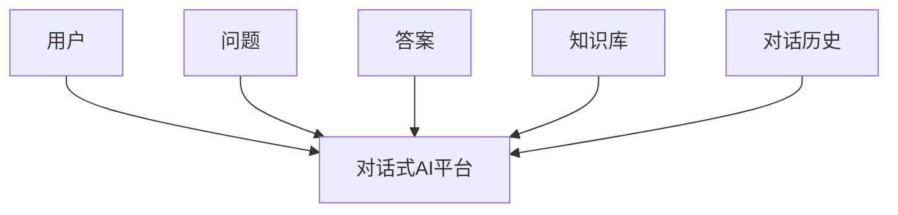
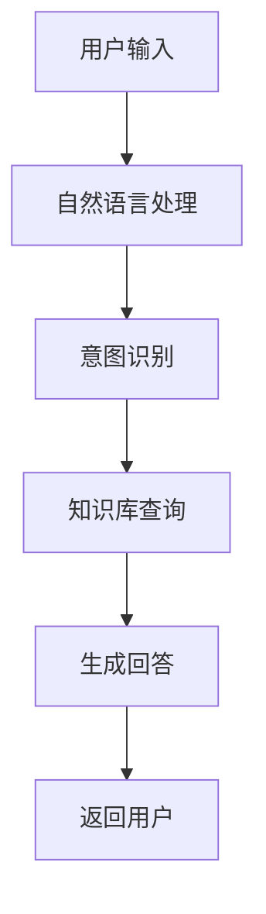
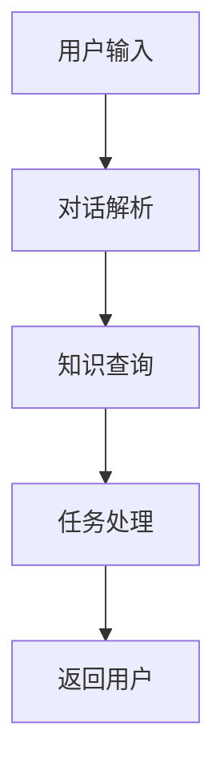
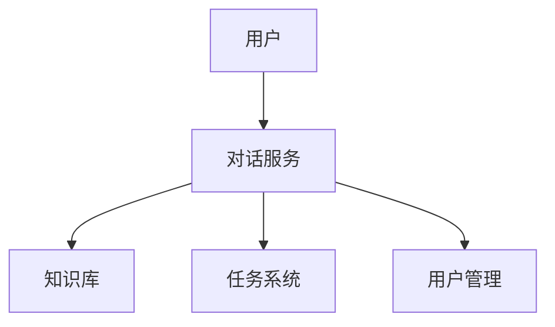
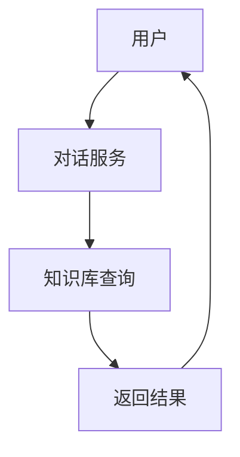

                 


# 构建企业级对话式AI平台：提升内外部沟通效率

> 关键词：企业级AI平台，对话式AI，自然语言处理，知识库，沟通效率

> 摘要：本文详细探讨了构建企业级对话式AI平台的核心技术与方法，从问题背景到系统架构，从算法原理到项目实战，全面解析如何利用对话式AI提升企业内外部沟通效率。文章通过丰富的案例和详细的代码实现，帮助读者掌握构建企业级对话式AI平台的完整流程。

---

## 第一部分：企业级对话式AI平台的背景与核心概念

### 第1章：企业级对话式AI平台的背景与问题背景

#### 1.1 问题背景

##### 1.1.1 传统企业沟通效率的瓶颈
企业内部和外部的沟通效率一直是企业管理中的痛点。传统沟通方式（如邮件、即时通讯工具）存在以下问题：
- **信息传递延迟**：信息需要通过多层传递，导致响应速度慢。
- **信息孤岛**：不同部门或系统之间的信息无法有效整合。
- **知识获取困难**：员工需要花费大量时间查找所需信息。
- **沟通成本高**：面对面会议或远程会议的组织和协调成本较高。

##### 1.1.2 对话式AI在企业沟通中的潜力
对话式AI（Conversational AI）通过自然语言处理技术，能够以更高效、更智能的方式解决企业沟通问题。其优势包括：
- **实时响应**：用户可以在任何时间与AI进行交互，获得即时反馈。
- **自动化处理**：AI能够自动解析用户需求，并调用企业系统完成任务。
- **统一入口**：通过对话式界面，用户可以访问企业内外部的所有资源和服务。

##### 1.1.3 企业级对话式AI的定义与目标
企业级对话式AI平台是一种基于自然语言处理技术的智能化系统，旨在通过对话式交互帮助企业内部员工和外部用户高效完成任务。其目标是：
- 提供统一的沟通入口，整合企业内外部资源。
- 实现自动化任务处理，降低人工成本。
- 提高信息获取效率，优化决策过程。

#### 1.2 问题描述

##### 1.2.1 企业内外部沟通的主要挑战
- **内部沟通**：
  - 部门间协作效率低。
  - 信息传递不及时。
  - 知识共享不足。
- **外部沟通**：
  - 客户服务响应慢。
  - 信息传递不准确。
  - 用户体验差。

##### 1.2.2 对话式AI在企业沟通中的应用场景
- **内部沟通**：
  - 员工问题解答。
  - 任务分派与跟踪。
  - 知识库查询与共享。
- **外部沟通**：
  - 客户服务咨询。
  - 产品信息查询。
  - 业务流程自动化。

##### 1.2.3 当前企业沟通工具的局限性
- **功能单一**：传统工具无法实现自动化任务处理。
- **信息孤岛**：不同系统之间难以集成。
- **用户体验差**：用户需要在多个工具之间切换，操作复杂。

#### 1.3 问题解决

##### 1.3.1 对话式AI的核心优势
- **智能化交互**：通过自然语言理解，提供更智能的对话体验。
- **统一入口**：整合企业内外部资源，提供一站式服务。
- **自动化处理**：通过AI驱动，实现任务自动化。

##### 1.3.2 企业级对话式AI的解决方案
- **构建统一的对话式入口**：整合企业内外部资源，提供统一的对话界面。
- **建立知识库**：构建企业知识库，支持对话式AI的智能回答。
- **实现任务自动化**：通过对话式AI调用企业系统完成任务。

##### 1.3.3 对话式AI平台的边界与外延
- **边界**：对话式AI平台仅负责接收和处理对话请求，不直接处理业务逻辑。
- **外延**：对话式AI平台可以与企业现有的业务系统无缝集成。

#### 1.4 核心概念与联系

##### 1.4.1 对话式AI的实体关系图（ER图）


##### 1.4.2 对话式AI的流程图


#### 1.5 本章小结
本章从企业内外部沟通的痛点出发，详细分析了对话式AI在企业沟通中的潜力和应用场景。通过对比传统沟通工具的局限性，提出了构建企业级对话式AI平台的解决方案，并通过ER图和流程图明确了对话式AI的核心概念和工作流程。

---

## 第二部分：对话式AI的核心算法与数学模型

### 第2章：对话式AI的核心算法原理

#### 2.1 对话式AI的算法原理

##### 2.1.1 基于规则的对话系统
基于规则的对话系统通过预定义的规则和模板来生成回答。优点是简单易懂，缺点是灵活性差，无法处理复杂场景。

##### 2.1.2 基于统计模型的对话系统
基于统计模型的对话系统通过分析海量对话数据，学习对话模式，生成回答。优点是灵活性高，缺点是需要大量数据支持。

##### 2.1.3 基于深度学习的对话系统
基于深度学习的对话系统利用神经网络模型（如Transformer）进行对话生成。优点是生成的回答更自然，缺点是训练成本高。

#### 2.2 神经网络模型的数学基础

##### 2.2.1 神经网络的基本结构
神经网络由输入层、隐藏层和输出层组成，通过权重和激活函数进行信息处理。

##### 2.2.2 深度学习中的损失函数
常用的损失函数包括均方误差（MSE）和交叉熵损失（Cross-Entropy Loss）。

##### 2.2.3 梯度下降与优化算法
常用的优化算法包括随机梯度下降（SGD）和Adam优化器。

#### 2.3 对话式AI的数学模型

##### 2.3.1 编解码模型（Encoder-Decoder）
编解码模型通过编码器将输入序列转换为隐状态，再通过解码器生成输出序列。

##### 2.3.2 注意力机制（Attention）
注意力机制通过计算输入序列中每个位置的重要性，生成加权后的表示。

##### 2.3.3 对话生成的损失函数
$$ \text{损失函数} = -\sum_{i=1}^{n} \log p(y_i|x) $$

#### 2.4 对话式AI的训练与推理

##### 2.4.1 基于预训练模型的微调
通过在大规模通用对话数据上预训练模型，再在企业特定数据上进行微调。

##### 2.4.2 对话历史的处理方法
通过维护对话历史，生成连贯的对话流。

##### 2.4.3 对话生成的数学公式
$$ P(y|x) = \frac{P(y|x,z)}{P(z)} \sum_z P(z) $$

#### 2.5 本章小结
本章详细讲解了对话式AI的核心算法原理，包括基于规则、统计和深度学习的对话系统，以及神经网络模型的数学基础和对话生成的数学公式。

---

## 第三部分：企业级对话式AI平台的系统架构与设计

### 第3章：系统架构设计方案

#### 3.1 系统功能设计

##### 3.1.1 用户需求分析
用户需求包括实时对话、知识查询、任务处理和多语言支持。

##### 3.1.2 系统功能模块划分
系统功能模块包括对话解析模块、知识库模块、任务处理模块和用户管理模块。

##### 3.1.3 系统功能流程图


#### 3.2 系统架构设计

##### 3.2.1 系统架构图


##### 3.2.2 系统接口设计
系统接口包括用户输入接口、知识库接口和任务处理接口。

##### 3.2.3 系统交互流程图


#### 3.3 本章小结
本章详细设计了企业级对话式AI平台的系统架构，包括功能模块划分、系统架构图和系统交互流程图。

---

## 第四部分：企业级对话式AI平台的项目实战

### 第4章：企业级对话式AI平台的实现

#### 4.1 项目介绍
本项目旨在构建一个企业级对话式AI平台，整合企业内外部资源，提供智能化的对话服务。

#### 4.2 环境安装
- 安装Python和必要的Python包（如Flask、TensorFlow）。

#### 4.3 核心实现

##### 4.3.1 对话解析模块
```python
def parse_query(user_input):
    # 自然语言处理逻辑
    return parsed_result
```

##### 4.3.2 知识库模块
```python
class KnowledgeBase:
    def __init__(self, data):
        self.data = data

    def query(self, question):
        # 知识库查询逻辑
        return answer
```

##### 4.3.3 任务处理模块
```python
def process_task(task):
    # 任务处理逻辑
    return result
```

##### 4.3.4 对话历史模块
```python
class ConversationHistory:
    def __init__(self):
        self.history = []

    def add(self, message):
        self.history.append(message)
```

#### 4.4 代码实现与解读
通过代码实现对话式AI平台的核心功能，包括对话解析、知识库查询和任务处理。

#### 4.5 实际案例分析
通过实际案例分析，验证对话式AI平台的性能和效果。

#### 4.6 本章小结
本章通过项目实战，详细讲解了企业级对话式AI平台的实现过程，包括环境安装、核心模块实现和实际案例分析。

---

## 第五部分：企业级对话式AI平台的最佳实践

### 第5章：最佳实践与经验总结

#### 5.1 最佳实践
- **数据质量管理**：确保知识库的数据质量和完整性。
- **模型调优**：通过持续优化模型参数，提高对话生成的效果。
- **安全与隐私保护**：确保用户数据的安全和隐私。

#### 5.2 经验总结
- **系统设计的重要性**：系统架构设计直接影响平台的性能和扩展性。
- **数据的重要性**：高质量的数据是对话式AI平台的核心。
- **持续优化**：对话式AI是一个不断优化的过程，需要持续关注模型性能和用户体验。

#### 5.3 小结
通过本文的分析和实践，我们可以看到企业级对话式AI平台在提升内外部沟通效率方面的巨大潜力。

---

## 总结

本文详细探讨了构建企业级对话式AI平台的核心技术与方法，从问题背景到系统架构，从算法原理到项目实战，全面解析了如何利用对话式AI提升企业内外部沟通效率。通过丰富的案例和详细的代码实现，读者可以系统地掌握构建企业级对话式AI平台的完整流程。

