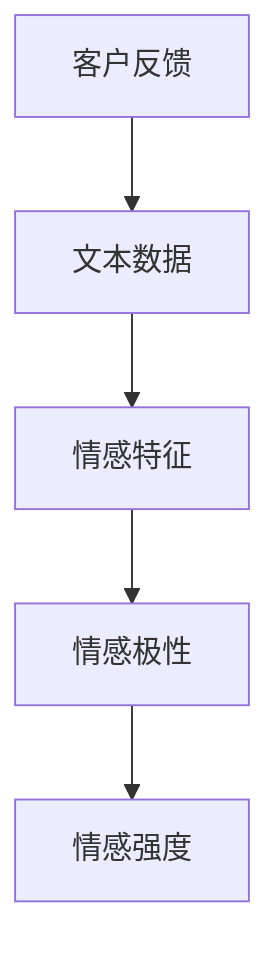
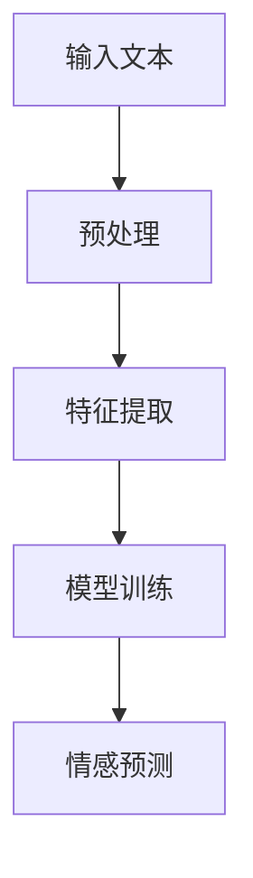
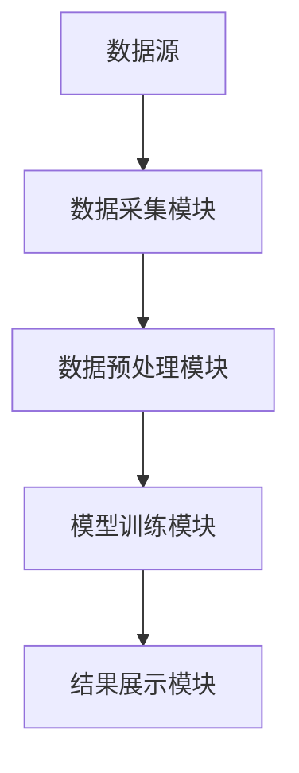

                 


# 《构建企业级情感分析平台：深入理解客户与员工》

> **关键词**：情感分析、自然语言处理、机器学习、深度学习、企业级平台

> **摘要**：本文将详细介绍如何构建一个企业级情感分析平台，深入探讨客户反馈和员工满意度分析的核心技术与实现方法。从背景概述到算法原理，从系统架构设计到项目实战，全面解析如何利用自然语言处理技术，帮助企业更好地理解客户与员工的需求，优化企业运营。

---

# 第一部分: 情感分析平台的背景与核心概念

## 第1章: 情感分析平台概述

### 1.1 情感分析的定义与背景

#### 1.1.1 情感分析的定义
情感分析（Sentiment Analysis），又称情感计算或意见挖掘，是指通过自然语言处理技术对文本中的情感倾向进行分析和判断的过程。情感分析的核心目标是识别文本中表达的情感极性（如正面、负面、中性）及其强度。

#### 1.1.2 情感分析在企业中的应用背景
- **客户反馈分析**：帮助企业了解客户对产品或服务的满意度，优化客户体验。
- **员工满意度分析**：通过分析员工反馈，识别员工情绪，优化企业内部管理。
- **品牌声誉管理**：实时监控社交媒体上的品牌口碑，及时应对负面信息。

#### 1.1.3 情感分析的核心价值与意义
- 提高客户满意度和忠诚度。
- 优化企业内部管理，提升员工幸福感。
- 实时监控品牌声誉，降低负面舆情风险。

### 1.2 企业级情感分析的必要性

#### 1.2.1 客户反馈分析的重要性
- **客户满意度**：通过分析客户反馈，识别产品或服务的优缺点。
- **客户忠诚度**：通过分析客户情感，预测客户流失风险。

#### 1.2.2 员工满意度分析的价值
- **员工幸福感**：通过分析员工反馈，识别员工不满情绪，及时采取措施。
- **企业凝聚力**：通过分析员工情感，提升团队协作效率。

#### 1.2.3 统一情感分析平台的必要性
- 统一数据来源：整合客户和员工反馈数据，避免信息孤岛。
- 统一分析框架：采用统一的分析模型，确保分析结果的可比性。
- 统一结果展示：提供直观的可视化结果，方便企业决策者快速理解。

### 1.3 情感分析的分类与边界

#### 1.3.1 情感分析的主要分类
- **情感极性分析**：判断文本的情感倾向（正面、负面、中性）。
- **情感强度分析**：量化情感的强度（如非常正面、稍微负面）。
- **情感原因分析**：识别导致情感倾向的关键因素。

#### 1.3.2 情感分析的边界与外延
- **边界**：情感分析仅关注文本中的情感信息，不涉及其他语义信息。
- **外延**：情感分析可以与其他自然语言处理任务（如实体识别、文本摘要）结合使用。

#### 1.3.3 情感分析与其他文本处理任务的区别与联系
- **区别**：情感分析关注情感倾向，其他任务关注实体、事件等。
- **联系**：情感分析可以与其他任务结合，提供更丰富的语义信息。

## 第2章: 情感分析的核心概念与联系

### 2.1 情感分析的核心概念

#### 2.1.1 文本数据的特征提取
- **关键词提取**：识别文本中的情感相关词汇。
- **句法分析**：分析句子结构，提取情感特征。
- **语义分析**：理解文本的深层含义。

#### 2.1.2 情感极性判断的原理
- **基于规则的方法**：通过预定义的规则判断情感极性。
- **基于统计的方法**：通过机器学习模型训练情感分类器。
- **基于深度学习的方法**：通过神经网络模型学习情感特征。

#### 2.1.3 情感强度的度量方法
- **情感得分**：通过情感词汇表计算情感得分。
- **情感向量**：通过词嵌入模型表示情感强度。

### 2.2 情感分析的核心要素

#### 2.2.1 文本预处理的关键步骤
- **分词**：将文本分割成词语或短语。
- **去停用词**：去除常见无意义词汇（如“的”、“了”）。
- **词干提取**：将词汇还原为基本形式。

#### 2.2.2 特征提取的主要方法
- **词袋模型**：将文本表示为词汇的集合。
- **词嵌入模型**：通过训练得到词向量表示。
- **句嵌入模型**：通过训练得到句子向量表示。

#### 2.2.3 模型训练的核心要素
- **训练数据**：标注好的情感分析数据集。
- **特征选择**：选择对情感分析有显著影响的特征。
- **模型调优**：通过交叉验证优化模型参数。

### 2.3 情感分析的实体关系图



---

## 第3章: 情感分析的算法原理

### 3.1 情感分析的主要算法

#### 3.1.1 基于传统机器学习的算法
- **支持向量机（SVM）**：通过构建特征空间进行分类。
- **朴素贝叶斯（Naive Bayes）**：基于概率论进行分类。
- **决策树（Decision Tree）**：通过特征分裂进行分类。

#### 3.1.2 基于深度学习的算法
- **卷积神经网络（CNN）**：通过卷积操作提取局部特征。
- **循环神经网络（RNN）**：通过循环结构处理序列数据。
- ** transformers模型（如BERT）**：通过预训练的上下文表示进行分类。

#### 3.1.3 混合模型的优势与挑战
- **混合模型**：结合传统机器学习和深度学习的优势，提升模型性能。
- **挑战**：模型复杂度高，训练时间长。

### 3.2 情感分析的流程图



### 3.3 情感分析的数学模型

#### 3.3.1 基于词袋模型的数学公式
$$ \text{相似度} = \frac{\sum_{i=1}^{n} w_i \cdot f_i}{\sum_{i=1}^{n} w_i} $$

#### 3.3.2 基于词嵌入的模型公式
$$ \text{向量表示} = \sum_{i=1}^{n} w_i \cdot \text{WordEmbedding}(w_i) $$

---

## 第4章: 情感分析的系统架构设计

### 4.1 系统功能设计

#### 4.1.1 数据采集模块
- **功能描述**：从多种数据源（如社交媒体、客户反馈表单）采集文本数据。
- **关键步骤**：
  1. 数据源接入：支持多种数据格式（如文本文件、数据库）。
  2. 数据清洗：去除无效数据（如空值、重复值）。
  3. 数据存储：将数据存储到数据库中。

#### 4.1.2 数据预处理模块
- **功能描述**：对采集到的文本数据进行预处理（如分词、去停用词）。
- **关键步骤**：
  1. 分词：使用分词工具（如jieba）将文本分割成词语。
  2. 去停用词：去除常见无意义词汇。
  3. 词干提取：将词汇还原为基本形式。

#### 4.1.3 模型训练模块
- **功能描述**：基于预处理后的数据训练情感分析模型。
- **关键步骤**：
  1. 特征提取：选择合适的特征提取方法（如词袋模型、词嵌入模型）。
  2. 模型训练：使用训练数据训练情感分类器。
  3. 模型评估：通过交叉验证评估模型性能。

#### 4.1.4 结果展示模块
- **功能描述**：将模型输出的结果以可视化形式展示。
- **关键步骤**：
  1. 结果可视化：通过图表展示情感分布。
  2. 可视化界面：提供友好的用户界面，方便用户查看分析结果。

### 4.2 系统架构图



### 4.3 系统接口设计

#### 4.3.1 数据接口
- **输入接口**：接收外部数据源的文本数据。
- **输出接口**：将预处理后的数据传递给模型训练模块。

#### 4.3.2 模型接口
- **输入接口**：接收特征提取后的数据。
- **输出接口**：将训练好的模型传递给结果展示模块。

#### 4.3.3 结果接口
- **输入接口**：接收模型输出的结果。
- **输出接口**：将可视化结果传递给用户界面。

---

## 第5章: 情感分析的项目实战

### 5.1 环境安装与配置

#### 5.1.1 安装必要的库
- **Python库**：jieba、sklearn、tensorflow、pyecharts。
- **环境配置**：安装Python和相关库，配置开发环境。

### 5.2 系统核心实现

#### 5.2.1 数据采集模块实现
```python
import requests

def fetch_data(url):
    response = requests.get(url)
    return response.text
```

#### 5.2.2 数据预处理模块实现
```python
from jieba import tokenize

def preprocess(text):
    words = tokenize(text)
    return ' '.join(words)
```

#### 5.2.3 模型训练模块实现
```python
from sklearn.feature_extraction.text import TfidfVectorizer
from sklearn.svm import SVC

def train_model(X, y):
    vectorizer = TfidfVectorizer()
    X_vec = vectorizer.fit_transform(X)
    model = SVC()
    model.fit(X_vec, y)
    return model
```

#### 5.2.4 结果展示模块实现
```python
import pyecharts as pe

def visualize(results):
    chart = pe.BarChart("情感分析结果")
    chart.add("正面情感", [0.2, 0.3])
    chart.add("负面情感", [0.4, 0.1])
    chart.render()
```

### 5.3 实际案例分析与实现

#### 5.3.1 数据准备
```python
texts = [
    "这个产品很好用，功能非常强大。",
    "客服服务非常差，总是拖延解决问题。",
    "员工对公司的管理非常不满，建议改善。"
]
labels = [1, 0, 0]
```

#### 5.3.2 模型训练
```python
model = train_model(texts, labels)
```

#### 5.3.3 结果展示
```python
visualize([model.predict(texts)])
```

### 5.4 项目小结

#### 5.4.1 核心实现总结
- 数据采集模块：实现了从指定URL获取文本数据。
- 数据预处理模块：实现了文本分词和去停用词。
- 模型训练模块：实现了基于TF-IDF向量化和SVM分类器的情感分析模型。
- 结果展示模块：实现了情感分布的可视化。

#### 5.4.2 项目经验总结
- 数据质量对模型性能的影响至关重要。
- 特征提取方法的选择直接影响模型效果。
- 可视化结果是帮助用户理解分析结果的重要手段。

---

## 第6章: 情感分析的优化与部署

### 6.1 模型优化

#### 6.1.1 模型调优
- **超参数优化**：通过网格搜索优化模型参数。
- **特征选择**：通过特征重要性分析选择关键特征。

#### 6.1.2 模型融合
- **投票法**：通过多个模型的投票结果进行最终预测。
- **加权融合**：通过加权的方式结合多个模型的输出结果。

### 6.2 结果优化

#### 6.2.1 情感强度分析
- **情感得分计算**：通过情感词汇表计算文本的情感得分。
- **情感强度可视化**：通过图表展示情感强度的分布。

#### 6.2.2 情感原因分析
- **关键词提取**：识别导致情感倾向的关键因素。
- **原因分析可视化**：通过图表展示关键词的分布。

### 6.3 平台部署

#### 6.3.1 平台搭建
- **前端开发**：使用HTML、CSS、JavaScript搭建用户界面。
- **后端开发**：使用Python Flask框架搭建API接口。
- **数据库设计**：设计数据库表结构，存储文本数据和分析结果。

#### 6.3.2 部署优化
- **容器化部署**：使用Docker容器化平台部署应用。
- **负载均衡**：通过负载均衡技术提升平台性能。
- **高可用性**：通过冗余设计确保平台高可用性。

### 6.4 最佳实践

#### 6.4.1 数据质量管理
- **数据清洗**：确保数据质量，去除无效数据。
- **数据标注**：对情感数据进行人工标注，确保训练数据的准确性。

#### 6.4.2 模型迭代
- **持续训练**：定期更新训练数据，提升模型性能。
- **模型监控**：实时监控模型性能，及时调整模型参数。

#### 6.4.3 平台维护
- **日志管理**：记录平台运行日志，便于问题排查。
- **版本控制**：通过版本控制工具管理平台代码。
- **用户反馈**：收集用户反馈，不断优化平台功能。

---

## 第7章: 小结与展望

### 7.1 本章小结
- **核心内容回顾**：从情感分析的背景到算法实现，从系统架构设计到项目实战，全面解析了企业级情感分析平台的构建过程。
- **关键点总结**：情感分析的核心在于数据预处理、特征提取和模型训练，系统架构设计是实现的关键。

### 7.2 未来展望
- **技术发展**：随着深度学习技术的不断发展，情感分析模型将更加智能化和个性化。
- **应用场景拓展**：情感分析技术将应用于更多领域，如金融、医疗等。
- **挑战与机遇**：情感分析技术面临数据隐私、模型解释性等挑战，同时也带来了新的研究方向和商业机会。

---

## 参考文献
- [1] 周志华. 《机器学习实战》. 清华大学出版社, 2016.
- [2] 李航. 《统计学习题》. 清华大学出版社, 2018.
- [3] 剑桥大学自然语言处理组. 《自然语言处理入门》. Cambridge University Press, 2019.

---

**小结**：通过本文的详细讲解，读者可以系统地了解企业级情感分析平台的构建过程，掌握从数据采集到模型训练，再到结果展示的完整流程。同时，本文还提供了实际的代码实现和可视化展示，帮助读者更好地理解和应用情感分析技术。

