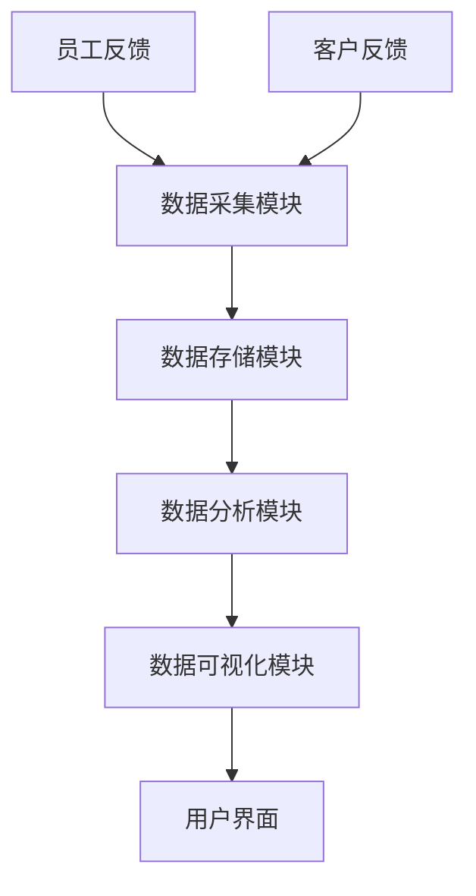

                 


# 构建企业级情感计算平台：员工幸福感与客户满意度分析

## 关键词：
- 情感计算
- 员工幸福感
- 客户满意度
- 机器学习
- 数据分析
- 系统架构

## 摘要：
随着企业规模的不断扩大和市场竞争的加剧，员工幸福感和客户满意度的管理变得至关重要。情感计算作为一门新兴技术，能够通过分析文本、语音和图像等数据，提取情感信息，为企业决策提供科学依据。本文将详细介绍如何构建企业级情感计算平台，涵盖从背景分析到系统设计，再到项目实施的全过程，帮助读者掌握如何利用技术手段提升企业管理效率。

---

# 第1章: 情感计算与企业级平台背景

## 1.1 情感计算的基本概念
### 1.1.1 情感计算的定义
情感计算（Affective Computing）是指通过计算机技术分析、识别和处理人类情感信息的过程。它结合了人工智能、自然语言处理和数据挖掘等技术，旨在理解人类的情感状态。

### 1.1.2 情感计算的核心要素
- 数据采集：通过文本、语音、图像等方式获取情感数据。
- 情感分析：利用算法对数据进行处理，识别出其中的情感倾向。
- 反馈机制：根据分析结果，提供相应的反馈或建议。

### 1.1.3 企业级情感计算平台的定义
企业级情感计算平台是一种基于情感计算技术，帮助企业分析员工和客户情感状态的系统。它能够通过数据采集、分析和反馈，为企业提供优化管理的工具。

## 1.2 员工幸福感与客户满意度的重要性
### 1.2.1 员工幸福感对企业的影响
- 提高员工满意度，可以提升工作效率和创造力。
- 满意的员工更可能对企业保持忠诚，降低流失率。

### 1.2.2 客户满意度对企业的影响
- 高客户满意度有助于提升客户忠诚度，增加重复购买率。
- 良好的客户体验是企业赢得市场竞争的关键。

### 1.2.3 传统满意度分析的局限性
- 传统方法依赖问卷调查，数据收集成本高且效率低。
- 结果缺乏实时性和深度分析，难以提供有效的反馈。

## 1.3 企业级情感计算平台的必要性
### 1.3.1 提高管理效率
- 通过自动化数据采集和分析，减少人工操作，提高效率。
- 实时监控员工和客户的情感状态，及时发现问题并解决。

### 1.3.2 优化员工体验
- 通过分析员工反馈，了解他们的需求和不满，制定相应的改进措施。
- 提供个性化的支持，增强员工的归属感和幸福感。

### 1.3.3 提升客户忠诚度
- 通过分析客户反馈，优化服务质量，提升客户满意度。
- 根据客户情感数据，预测潜在的流失风险，采取针对性措施。

## 1.4 本章小结
本章介绍了情感计算的基本概念和企业级情感计算平台的定义，分析了员工幸福感和客户满意度对企业的重要性，并指出了传统方法的局限性。通过构建企业级情感计算平台，企业可以更高效地管理员工和客户的情感，提升整体竞争力。

---

# 第2章: 情感计算的核心原理

## 2.1 情感计算的原理概述
### 2.1.1 数据采集与处理
- 数据来源：员工反馈、客户评价、社交媒体评论等。
- 数据清洗：去除噪声数据，确保数据质量。
- 数据预处理：文本分词、去除停用词等。

### 2.1.2 情感分析算法
- 基础算法：情感词典匹配、基于规则的分析。
- 高级算法：机器学习模型（如SVM、随机森林）和深度学习模型（如LSTM、BERT）。

### 2.1.3 结果可视化
- 数据可视化工具：如Tableau、Power BI、Matplotlib等。
- 可视化形式：柱状图、折线图、热力图等。

## 2.2 员工幸福感与客户满意度的关联
### 2.2.1 数据特征对比
| 特征     | 员工幸福感 | 客户满意度 |
|----------|------------|------------|
| 数据来源 | 内部反馈   | 外部评价   |
| 数据类型 | 文本、数值 | 文本、数值 |
| 分析目标 | 提升工作体验 | 提升服务质量 |

### 2.2.2 关联分析方法
- 统计分析：如相关性分析、回归分析。
- 数据挖掘：如聚类分析、关联规则挖掘。

### 2.2.3 实证分析结果
- 通过实证分析发现，员工满意度较高的企业往往客户满意度也较高。
- 员工和客户的情感数据存在一定的关联性，可以通过情感计算技术进行预测和优化。

## 2.3 情感计算的ER实体关系图
```mermaid
er
    entity 员工 {
        员工ID
        姓名
        部门
        工作满意度
    }
    entity 客户 {
        客户ID
        客户名称
        服务满意度
    }
    entity 情感数据 {
        数据ID
        员工ID
        客户ID
        情感内容
        情感评分
        创建时间
    }
    员工 -[1..n] 情感数据
    客户 -[1..n] 情感数据
```

## 2.4 本章小结
本章详细介绍了情感计算的核心原理，包括数据采集、处理和分析的过程。同时，通过ER实体关系图展示了员工和客户情感数据的关系，为后续的系统设计奠定了基础。

---

# 第3章: 情感计算的算法原理

## 3.1 情感分析算法概述
### 3.1.1 基于规则的算法
- 使用情感词典匹配，根据关键词判断情感倾向。
- 示例：情感词典包括“满意”、“高兴”等正面词汇和“不满”、“抱怨”等负面词汇。

### 3.1.2 机器学习算法
- 数据预处理：文本分词、去除停用词、向量化。
- 模型训练：使用SVM、随机森林等算法训练情感分类器。

### 3.1.3 深度学习算法
- 使用LSTM、BERT等模型进行情感分析。
- 优势：能够捕捉长文本中的情感变化。

## 3.2 情感评分模型
### 3.2.1 情感评分公式
$$ \text{情感评分} = \sum (\text{关键词权重} \times \text{情感值}) $$

### 3.2.2 情感预测公式
$$ \text{预测结果} = \text{模型预测}(\text{输入特征}) $$

## 3.3 算法实现
### 3.3.1 数据预处理代码
```python
import jieba
from sklearn.feature_extraction.text import TfidfVectorizer

# 示例文本
text = "员工对公司的培训非常满意，但对薪资水平有些不满。"

# 分词
words = jieba.lcut(text)

# TF-IDF向量化
vectorizer = TfidfVectorizer()
X = vectorizer.fit_transform([' '.join(words)])
```

### 3.3.2 模型训练代码
```python
from sklearn.svm import SVC
from sklearn.metrics import accuracy_score

# 训练数据
X_train = ...  # 特征向量
y_train = ...  # 标签（0：负面，1：正面）

# 训练模型
model = SVC()
model.fit(X_train, y_train)

# 预测
X_test = ...  # 测试数据
y_pred = model.predict(X_test)

# 计算准确率
print(accuracy_score(y_test, y_pred))
```

## 3.4 本章小结
本章详细讲解了情感计算的算法原理，包括基于规则、机器学习和深度学习的算法。通过代码示例展示了如何实现情感评分和预测模型，为后续的系统设计提供了技术基础。

---

# 第4章: 情感计算的系统架构设计

## 4.1 系统功能设计
### 4.1.1 数据采集模块
- 功能：实时采集员工和客户的反馈数据。
- 实现：通过API接口获取数据，支持多种数据格式。

### 4.1.2 数据分析模块
- 功能：对情感数据进行清洗、预处理和分析。
- 实现：使用Python的pandas库进行数据清洗，利用机器学习模型进行情感分析。

### 4.1.3 数据可视化模块
- 功能：将分析结果以可视化形式展示。
- 实现：使用Matplotlib或Tableau生成图表。

## 4.2 系统架构图


## 4.3 系统接口设计
- API接口：
  - `/api/collect`：接收员工和客户的反馈数据。
  - `/api/analyze`：返回情感分析结果。
  - `/api/visualize`：返回可视化图表数据。

## 4.4 本章小结
本章设计了情感计算平台的系统架构，包括数据采集、分析和可视化的模块，并通过架构图展示了各模块之间的关系。

---

# 第5章: 项目实战

## 5.1 环境安装
- 安装Python、Jupyter Notebook、Pandas、Scikit-learn、jieba等库。
```bash
pip install python jupyter pandas scikit-learn jieba
```

## 5.2 核心代码实现
### 5.2.1 数据采集
```python
import requests

# 获取员工反馈数据
def get_employee_feedback():
    response = requests.get('http://localhost:8000/employee-feedback')
    return response.json()

feedback = get_employee_feedback()
```

### 5.2.2 数据分析
```python
import pandas as pd
from sklearn.svm import SVC

# 数据清洗
df = pd.DataFrame(feedback)
df.dropna(inplace=True)

# 特征提取
vectorizer = TfidfVectorizer()
X = vectorizer.fit_transform(df['content'])

# 模型训练
model = SVC()
model.fit(X, df['label'])
```

### 5.2.3 可视化
```python
import matplotlib.pyplot as plt

# 绘制情感评分分布图
plt.hist(df['score'], bins=10)
plt.xlabel('情感评分')
plt.ylabel('数量')
plt.show()
```

## 5.3 案例分析
- 数据来源：某公司员工和客户的反馈数据。
- 数据分析：发现员工对培训满意度较高，但对薪资不满。
- 可视化结果：柱状图显示员工满意度分布。

## 5.4 本章小结
本章通过实际案例展示了如何构建情感计算平台，从数据采集到分析再到可视化，帮助读者掌握实际操作步骤。

---

# 第6章: 最佳实践与总结

## 6.1 最佳实践
- 数据质量：确保数据的完整性和准确性。
- 模型优化：定期更新模型，提高准确率。
- 用户反馈：根据用户需求优化系统功能。

## 6.2 小结
通过构建企业级情感计算平台，企业可以实时监控员工和客户的情感状态，优化管理策略，提升整体竞争力。

## 6.3 注意事项
- 数据隐私：确保员工和客户的隐私数据不被泄露。
- 系统维护：定期更新系统，确保稳定运行。

## 6.4 拓展阅读
- 情感计算的最新研究进展。
- 其他情感分析工具和技术。

---

# 附录: 参考文献

- 罗列相关书籍和论文。

---

# 结语
企业级情感计算平台的构建是一个复杂的系统工程，需要结合情感计算技术、机器学习算法和系统架构设计。通过本文的详细讲解，读者可以掌握如何利用情感计算技术提升企业的管理效率，实现员工幸福感和客户满意度的双重提升。

