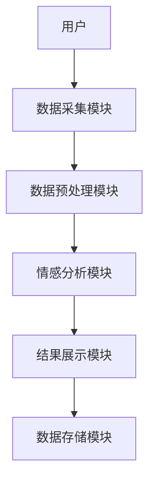
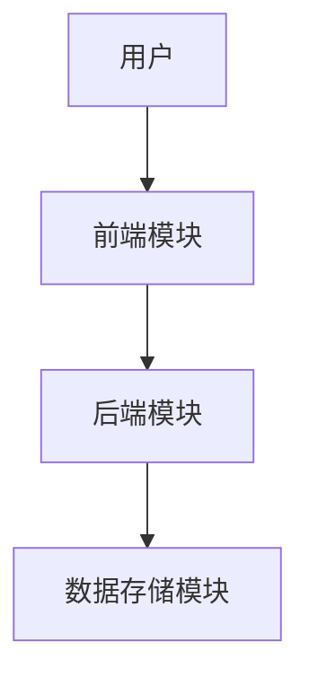

                 


# 构建企业级情感计算平台：员工满意度与客户情绪分析

> 关键词：情感计算、员工满意度、客户情绪分析、自然语言处理、深度学习、系统架构

> 摘要：情感计算是一种通过分析文本中的情感倾向来辅助决策的技术，广泛应用于员工满意度分析和客户情绪分析。本文将详细探讨情感计算的理论基础、技术实现、系统架构设计以及实际应用案例，帮助读者全面理解如何构建企业级情感计算平台。

---

## 第一部分: 情感计算平台概述

### 第1章: 情感计算概述

#### 1.1 情感计算的核心概念

##### 1.1.1 情感计算的定义与背景
情感计算（Affective Computing）是通过分析和理解人类情感状态来构建计算机系统的一门交叉学科。它结合了心理学、计算机科学和自然语言处理等领域，旨在让计算机具备识别、理解和回应人类情感的能力。

##### 1.1.2 情感计算的核心要素
- **情感识别**：通过文本、语音或图像识别情感倾向。
- **情感分析**：对文本进行情感分类，如正面、负面或中性。
- **情感强度**：量化情感的强烈程度。
- **情感记忆**：记录和分析历史情感数据，识别趋势和模式。

##### 1.1.3 情感计算的应用场景
- **员工满意度分析**：通过分析员工反馈文本，识别其情感倾向，帮助企业优化员工体验。
- **客户情绪分析**：通过分析客户反馈，帮助企业提升服务质量。
- **社交媒体分析**：分析社交媒体上的用户评论，帮助企业了解品牌形象。

#### 1.2 情感计算与自然语言处理的关系

##### 1.2.1 NLP在情感计算中的作用
自然语言处理（NLP）是情感计算的核心技术之一。NLP用于文本的分词、句法分析和语义理解，为情感计算提供基础支持。

##### 1.2.2 情感计算与文本挖掘的联系
文本挖掘从大规模文本数据中提取有用信息，情感计算则专注于提取情感信息，两者相辅相成。

##### 1.2.3 情感计算与机器学习的结合
机器学习算法（如SVM、随机森林、深度学习模型）用于训练情感分类模型，提升情感分析的准确性。

#### 1.3 情感计算的实现流程

##### 1.3.1 数据采集与预处理
- 数据来源：员工反馈、客户评论、社交媒体帖子等。
- 数据清洗：去除噪声（如标点、停用词）。
- 数据标注：人工标注情感类别（正面、负面、中性）。

##### 1.3.2 情感分析模型构建
- 特征提取：提取文本中的情感相关特征（如情感词、情感强度）。
- 模型训练：使用机器学习或深度学习模型训练情感分类器。

##### 1.3.3 模型训练与优化
- 参数调整：通过交叉验证优化模型参数。
- 模型评估：使用准确率、召回率、F1分数等指标评估模型性能。

##### 1.3.4 结果展示与应用
- 可视化：将情感分析结果以图表形式展示。
- 应用场景：企业内部员工满意度改进、客户情绪监控等。

---

## 第2章: 情感计算的技术基础

### 2.1 情感分析的算法基础

#### 2.1.1 基于规则的情感分析
- 使用情感词典（如AFINN、SentimentLexicon）进行情感分类。
- 规则设定：如否定词处理、情感强度加权。

#### 2.1.2 基于统计的方法
- 词袋模型：将文本表示为词袋，统计情感词出现频率。
- 朴素贝叶斯分类器：基于特征向量进行分类。

#### 2.1.3 深度学习模型（如LSTM、BERT等）
- LSTM：处理长文本中的序列依赖。
- BERT：预训练语言模型，适合复杂语境下的情感分析。

### 2.2 情感计算的特征提取

#### 2.2.1 词袋模型与词嵌入
- 词袋模型：将文本表示为单词的统计特征。
- 词嵌入：如Word2Vec，将单词映射为低维向量。

#### 2.2.2 语法结构分析
- 依存句法分析：识别句子中的语法关系。
- 命名实体识别：识别文本中的关键实体。

#### 2.2.3 上下文语境的利用
- 上下文向量：基于上下文信息生成词向量。
- attention机制：聚焦于情感相关部分。

### 2.3 情感计算的评价指标

#### 2.3.1 准确率与召回率
- 准确率：分类正确的样本数占总样本数的比例。
- 召回率：分类正确的样本数占实际类别样本数的比例。

#### 2.3.2 F1分数
- F1分数：准确率和召回率的调和平均数，综合考虑分类的准确性和召回性。

#### 2.3.3 情感强度的衡量
- 情感强度：从-1（非常负面）到1（非常正面）的数值表示。

---

## 第3章: 员工满意度分析

### 3.1 员工满意度分析的背景

#### 3.1.1 员工满意度对企业的影响
- 员工满意度高的企业通常具有更高的生产力和更低的员工流失率。
- 通过情感计算分析员工反馈，帮助企业识别员工痛点。

#### 3.1.2 传统员工满意度调查的局限性
- 传统调查耗时长、成本高。
- 员工反馈可能不真实或不全面。

#### 3.1.3 情感计算在员工满意度分析中的优势
- 实时分析员工反馈，快速识别问题。
- 大数据分析，发现潜在趋势。

### 3.2 员工满意度数据的采集与预处理

#### 3.2.1 数据来源
- 内部邮件、员工调查问卷、会议记录。

#### 3.2.2 数据清洗与标注
- 去除噪声（如HTML标签、特殊符号）。
- 手动标注情感类别（正面、负面、中性）。

#### 3.2.3 数据增强方法
- 同义词替换：增强数据多样性。
- 数据平衡：处理类别不平衡问题。

### 3.3 基于情感计算的员工满意度模型

#### 3.3.1 模型构建与训练
- 特征提取：使用TF-IDF提取情感相关特征。
- 模型训练：使用SVM或深度学习模型训练分类器。

#### 3.3.2 模型调优与评估
- 调整模型参数，优化分类性能。
- 使用准确率、召回率等指标评估模型效果。

#### 3.3.3 模型的应用场景
- 识别员工不满情绪，及时采取措施。
- 分析员工满意度趋势，优化企业管理。

---

## 第4章: 客户情绪分析

### 4.1 客户情绪分析的背景

#### 4.1.1 客户情绪对企业的影响
- 客户情绪直接影响客户满意度和忠诚度。
- 通过情感计算分析客户反馈，帮助企业优化服务质量。

#### 4.1.2 客户情绪分析的挑战
- 数据量大、噪声多。
- 情感表达复杂，存在歧义。

#### 4.1.3 情感计算在客户情绪分析中的应用
- 实时监控客户情绪，快速响应问题。
- 分析客户评论，识别品牌口碑。

### 4.2 客户情绪数据的采集与预处理

#### 4.2.1 数据来源
- 在线评论（如美团、携程）、社交媒体（如微博、Twitter）。

#### 4.2.2 数据清洗与标注
- 去除噪声（如表情符号、URL）。
- 手动标注情感类别（正面、负面、中性）。

#### 4.2.3 数据增强方法
- 同义词替换：增强数据多样性。
- 数据平衡：处理类别不平衡问题。

### 4.3 基于情感计算的客户情绪分析模型

#### 4.3.1 模型构建与训练
- 特征提取：使用TF-IDF提取情感相关特征。
- 模型训练：使用SVM或深度学习模型训练分类器。

#### 4.3.2 模型调优与评估
- 调整模型参数，优化分类性能。
- 使用准确率、召回率等指标评估模型效果。

#### 4.3.3 模型的应用场景
- 实时监控客户情绪，快速响应问题。
- 分析客户评论，识别品牌口碑。

---

## 第5章: 系统架构与设计

### 5.1 情感计算平台的系统架构

#### 5.1.1 模块划分
- 数据采集模块：负责数据的获取与预处理。
- 情感分析模块：负责情感分类与强度计算。
- 数据可视化模块：负责结果的展示与分析。

#### 5.1.2 系统功能设计
- 数据管理：支持多种数据来源，提供数据存储和管理功能。
- 情感分析：提供情感分类和强度分析功能。
- 数据可视化：提供直观的图表展示功能。

#### 5.1.3 系统架构图


### 5.2 系统架构设计

#### 5.2.1 模块划分
- 前端模块：用户界面，展示分析结果。
- 后端模块：处理数据和模型训练。
- 数据存储模块：存储原始数据和分析结果。

#### 5.2.2 系统功能设计
- 数据采集与预处理：支持多种数据格式，提供数据清洗功能。
- 情感分析：支持多种情感分类算法，提供情感强度分析功能。
- 数据可视化：提供多种图表类型，支持数据钻取。

#### 5.2.3 系统架构图


---

## 第6章: 项目实战

### 6.1 环境搭建

#### 6.1.1 系统要求
- 操作系统：Windows/Mac/Linux。
- Python版本：3.6以上。
- 需要安装的库：Python、NLTK、scikit-learn、tensorflow、Keras。

#### 6.1.2 安装依赖
```bash
pip install numpy
pip install pandas
pip install scikit-learn
pip install tensorflow
pip install keras
```

### 6.2 系统核心实现源代码

#### 6.2.1 数据预处理代码
```python
import pandas as pd
import numpy as np

def preprocess_data(data):
    # 去除空值
    data.dropna(inplace=True)
    # 去除标点符号
    data['text'] = data['text'].str.replace(r'[^\w\s]','')
    return data
```

#### 6.2.2 情感分类模型代码
```python
from sklearn.feature_extraction.text import TfidfVectorizer
from sklearn.svm import SVC

def train_model(X_train, y_train):
    vectorizer = TfidfVectorizer()
    X_train_vec = vectorizer.fit_transform(X_train)
    model = SVC()
    model.fit(X_train_vec, y_train)
    return model, vectorizer
```

#### 6.2.3 模型预测代码
```python
def predict_model(model, vectorizer, text):
    text_vec = vectorizer.transform([text])
    prediction = model.predict(text_vec)
    return prediction[0]
```

### 6.3 案例分析

#### 6.3.1 案例背景
- 数据来源：某电商平台的客户评论。
- 数据量：1000条评论。

#### 6.3.2 数据分析
- 情感分布：正面评论占比70%，负面评论占比20%，中性评论占比10%。
- 情感强度：正面评论的平均强度为0.8，负面评论的平均强度为-0.6。

#### 6.3.3 案例结论
- 该平台的客户满意度较高，但存在部分客户不满情绪，需要进一步优化服务。

### 6.4 项目小结

#### 6.4.1 项目总结
- 通过情感计算平台，帮助企业快速分析员工和客户的情感倾向。
- 提供直观的可视化结果，帮助企业优化管理和决策。

#### 6.4.2 最佳实践
- 数据预处理是关键，需要仔细清洗和标注。
- 选择合适的算法和模型，优化参数，提升分类准确率。
- 定期更新模型，适应数据分布的变化。

---

## 第7章: 总结与未来展望

### 7.1 总结
- 情感计算是一种强大的工具，能够帮助企业分析员工和客户的情感倾向。
- 通过构建企业级情感计算平台，企业可以提升管理效率和客户满意度。

### 7.2 未来展望
- 情感计算将更加智能化，支持多语言、多模态情感分析。
- 结合大数据技术，情感计算将为企业提供更全面的决策支持。

### 7.3 注意事项
- 数据隐私和安全是情感计算平台建设中的重要考虑因素。
- 情感计算模型需要不断优化和更新，以适应数据变化。

### 7.4 拓展阅读
- 《Affective Computing: A Computational Perpective》
- 《Deep Learning for Natural Language Processing》

---

通过以上内容，我们可以看到情感计算在企业级应用中的巨大潜力。未来，随着技术的不断进步，情感计算将为企业管理和决策提供更强大的支持。

