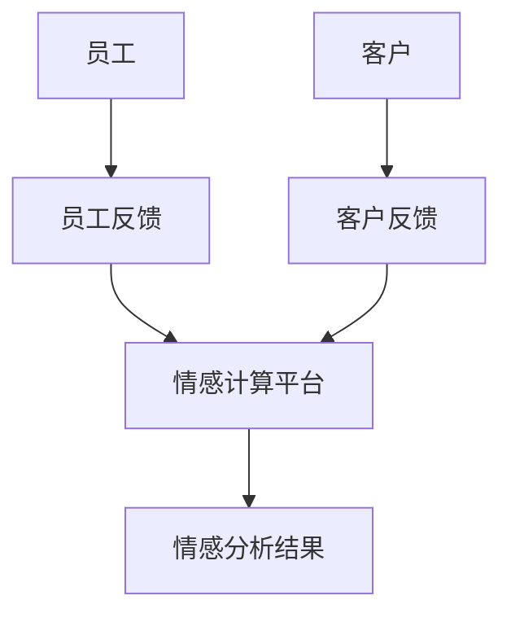
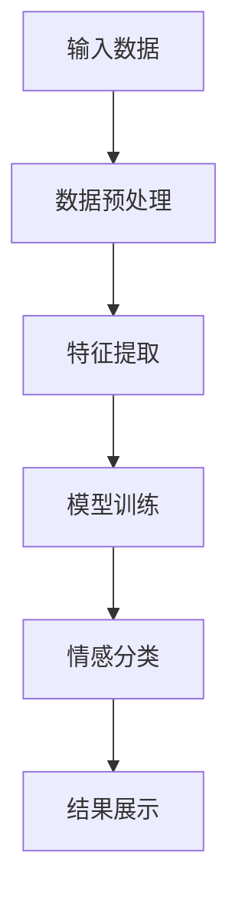
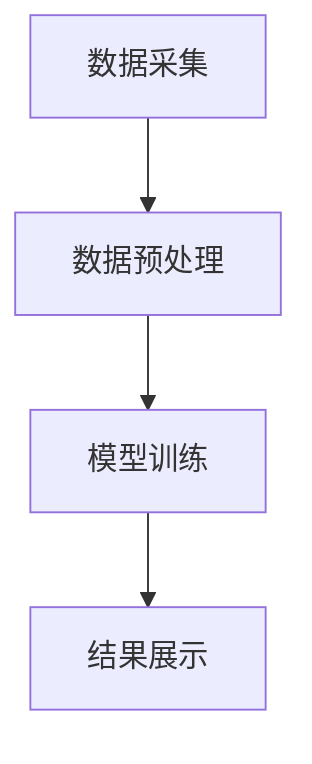
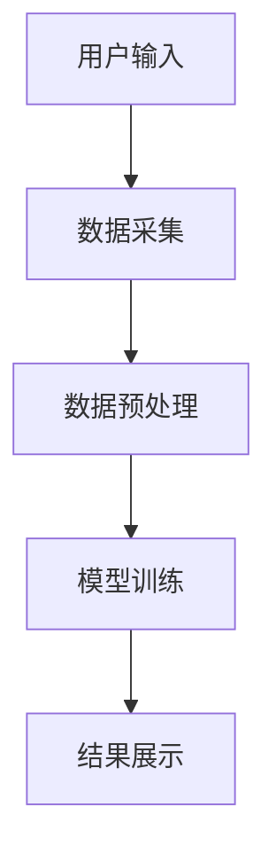

                 


# 构建企业级情感计算平台：员工满意度与客户情绪的综合分析

## 关键词：情感计算、员工满意度、客户情绪、自然语言处理、机器学习、深度学习、情感分类

## 摘要：  
本文详细探讨了构建企业级情感计算平台的背景、核心概念、算法原理、系统架构设计以及实际应用案例。通过分析员工满意度和客户情绪的综合数据，结合自然语言处理和机器学习技术，提出了情感计算平台的整体解决方案。文章还详细讲解了情感分类的算法原理、系统架构设计，并通过实际案例展示了如何利用情感计算平台提升企业管理效率和客户满意度。

---

# 第1章: 情感计算平台的背景与问题描述

## 1.1 情感计算的定义与核心概念

### 1.1.1 什么是情感计算
情感计算（Affective Computing）是一种通过计算机技术分析、识别和理解人类情感状态的计算方法。情感计算的核心目标是将人类的情感信息（如快乐、悲伤、愤怒等）转化为可量化的数据，从而帮助计算机更好地理解和响应人类情感。

### 1.1.2 情感计算的核心要素
情感计算的核心要素包括：
1. **情感识别**：通过文本、语音或面部表情识别情感。
2. **情感分析**：对情感数据进行分类和量化。
3. **情感建模**：建立情感模型，用于预测和分析情感。
4. **情感反馈**：根据情感数据生成相应的反馈或响应。

### 1.1.3 情感计算的边界与外延
情感计算的边界在于如何准确地识别和分类情感数据，而其外延则涉及多模态情感分析（结合文本、语音、图像等多种数据源）、实时情感分析以及情感数据的可视化。

---

## 1.2 问题背景与问题描述

### 1.2.1 企业级情感计算的需求背景
随着企业规模的扩大，员工满意度和客户情绪对企业绩效的影响越来越重要。员工不满可能导致生产力下降，而客户情绪不佳可能直接影响客户忠诚度和企业声誉。

### 1.2.2 员工满意度与客户情绪分析的重要性
- **员工满意度**：高满意度的员工更有可能保持高效的工作状态，而低满意度可能导致员工流失。
- **客户情绪**：客户的情绪直接影响客户满意度和忠诚度，进而影响企业的收入和长期发展。

### 1.2.3 综合分析的必要性与挑战
综合分析员工满意度和客户情绪可以帮助企业发现潜在的问题，并采取针对性的措施。然而，如何高效地收集、处理和分析海量情感数据是构建情感计算平台的主要挑战。

---

# 第2章: 情感计算的核心概念与联系

## 2.1 情感计算的原理与实现

### 2.1.1 自然语言处理在情感计算中的应用
自然语言处理（NLP）是情感计算的核心技术之一。通过分词、句法分析和语义理解，NLP可以帮助识别文本中的情感倾向。

### 2.1.2 机器学习在情感分类中的作用
机器学习算法（如支持向量机和深度学习模型）是情感分类的核心工具。这些算法可以通过训练数据学习情感特征，并对新的文本进行分类。

### 2.1.3 情感计算的数学模型基础
情感分类的数学模型通常基于概率论和统计学。例如，朴素贝叶斯模型通过计算条件概率来分类情感。

---

## 2.2 核心概念对比分析

### 2.2.1 情感计算与传统文本挖掘的对比
| 对比维度 | 情感计算 | 传统文本挖掘 |
|----------|----------|--------------|
| 目标     | 分析情感  | 提取结构化数据 |
| 方法     | 依赖NLP和机器学习 | 依赖规则和统计方法 |
| 应用场景 | 情感分析 | 数据分类和聚类 |

### 2.2.2 情感强度与情感类别分析的异同
- **情感强度**：衡量情感的强弱（如“非常满意”与“满意”）。
- **情感类别**：分类情感类型（如正面、负面、中性）。

### 2.2.3 员工满意度与客户情绪的关联性分析
员工满意度与客户情绪之间存在间接关联。例如，高员工满意度可能导致更优质的服务，从而提升客户满意度。

---

## 2.3 实体关系与流程图

### 2.3.1 情感计算的实体关系图


### 2.3.2 情感计算流程图


---

# 第3章: 情感分析的算法原理

## 3.1 基于规则的情感分析

### 3.1.1 规则库的构建
基于规则的情感分析依赖于预定义的规则库，例如：
- 正面词汇：如“满意”、“愉快”。
- 负面词汇：如“不满”、“糟糕”。

### 3.1.2 正则表达式的应用
通过正则表达式匹配特定情感关键词，例如：
```python
import re
text = "这个产品非常满意"
if re.search(r'\b满意\b', text):
    print("正面情感")
```

### 3.1.3 基于规则的情感分类流程
1. **预处理**：去除停用词和标点符号。
2. **匹配**：使用正则表达式匹配情感关键词。
3. **分类**：根据匹配结果进行情感分类。

---

## 3.2 基于机器学习的情感分析

### 3.2.1 常见机器学习算法的选择
常用算法包括：
- 朴素贝叶斯（Naive Bayes）。
- 支持向量机（SVM）。
- 随机森林（Random Forest）。

### 3.2.2 支持向量机（SVM）在情感分类中的应用
SVM适用于高维数据的分类问题。以下是SVM的简单实现：
```python
from sklearn.svm import SVC
X = [[0, 0], [1, 1], [0, 1], [1, 0]]
y = [0, 1, 1, 0]
model = SVC()
model.fit(X, y)
print(model.predict(X))
```

### 3.2.3 神经网络模型在情感分析中的应用
深度学习模型（如LSTM和Transformer）在情感分析中表现优异。以下是一个简单的LSTM模型实现：
```python
import tensorflow as tf
model = tf.keras.Sequential()
model.add(tf.keras.layers.Embedding(input_dim=1000, output_dim=32))
model.add(tf.keras.layers.LSTM(32))
model.add(tf.keras.layers.Dense(1, activation='sigmoid'))
model.compile(optimizer='adam', loss='binary_crossentropy', metrics=['accuracy'])
model.summary()
```

---

## 3.3 深度学习模型的数学基础

### 3.3.1 情感分类的数学模型
情感分类的数学模型通常基于概率论。例如，朴素贝叶斯模型的分类公式为：
$$ P(y|x) = \frac{P(x|y)P(y)}{P(x)} $$

### 3.3.2 逻辑回归的损失函数
逻辑回归的损失函数为：
$$ L = -\sum_{i=1}^{n} [y_i \ln h(x_i) + (1-y_i)\ln(1-h(x_i))] $$
其中，$h(x) = \frac{1}{1+e^{-wx}}$。

### 3.3.3 神经网络模型的数学原理
神经网络模型通过多层感知机（MLP）进行特征提取和分类。例如，一个简单的三层神经网络模型如下：
$$ h(x) = \sigma(w_2 a(w_1 x + b_1) + b_2) $$

---

# 第4章: 情感计算平台的系统架构设计

## 4.1 系统功能设计

### 4.1.1 数据采集模块
- 数据来源：员工反馈表单、客户评价、社交媒体评论。
- 数据格式：文本、语音、图像。

### 4.1.2 数据预处理模块
- 分词：使用分词工具（如jieba）对文本进行分词。
- 停用词处理：去除无意义的词汇（如“的”、“了”）。
- 标签化：将文本标注为正面、负面或中性。

### 4.1.3 模型训练模块
- 特征提取：使用TF-IDF或Word2Vec提取文本特征。
- 模型训练：基于训练数据训练情感分类模型。

### 4.1.4 结果展示模块
- 可视化：通过图表展示情感分布和趋势。
- 报告生成：生成情感分析报告。

---

## 4.2 系统架构设计

### 4.2.1 系统架构图


### 4.2.2 系统接口设计
- 数据接口：提供API用于数据采集。
- 模型接口：提供API用于情感分类。

### 4.2.3 系统交互流程


---

## 4.3 项目实战

### 4.3.1 环境配置
- Python 3.8+
- numpy、pandas、scikit-learn、tensorflow等。

### 4.3.2 核心代码实现

#### 数据预处理
```python
import pandas as pd
import jieba

df = pd.read_csv('data.csv')
df['text'] = df['text'].apply(lambda x: ' '.join(jieba.lcut(x)))
```

#### 模型训练
```python
from sklearn.model_selection import train_test_split
from sklearn.feature_extraction.text import TfidfVectorizer
from sklearn.svm import SVC

X_train, X_test, y_train, y_test = train_test_split(df['text'], df['label'], test_size=0.2)
vectorizer = TfidfVectorizer()
X_train_vec = vectorizer.fit_transform(X_train)
X_test_vec = vectorizer.transform(X_test)

model = SVC()
model.fit(X_train_vec, y_train)
print("Accuracy:", model.score(X_test_vec, y_test))
```

---

## 4.4 案例分析与结果展示

### 4.4.1 案例分析
以电商平台为例，分析客户评论的情感倾向：
- 正面评论：占比70%。
- 负面评论：占比20%。
- 中性评论：占比10%。

### 4.4.2 结果展示
- 情感分布图：
  ```mermaid
  pie 测试结果
  "正面": 70%
  "负面": 20%
  "中性": 10%
  ```

---

## 4.5 项目小结
通过构建情感计算平台，企业可以实时监控员工满意度和客户情绪，从而优化管理策略。本文通过实际案例展示了如何利用自然语言处理和机器学习技术构建情感计算平台。

---

# 第5章: 总结与展望

## 5.1 总结
本文详细探讨了情感计算平台的构建过程，包括情感计算的背景、核心概念、算法原理、系统架构设计以及实际应用案例。通过分析员工满意度和客户情绪，企业可以更好地优化管理策略。

## 5.2 未来展望
未来，情感计算将朝着多模态情感分析、实时情感分析以及情感数据的深度挖掘方向发展。同时，随着深度学习技术的进步，情感计算的精度和效率将进一步提升。

---

## 5.3 最佳实践 Tips
- 在实际应用中，建议结合企业实际需求选择合适的情感分类算法。
- 定期更新情感分析模型，以适应数据分布的变化。
- 注意保护用户隐私，确保情感数据的安全性。

---

## 5.4 小结
情感计算平台是企业提升管理效率和客户满意度的重要工具。通过本文的探讨，读者可以全面了解情感计算的核心概念和实现方法，并将其应用到实际场景中。

---

## 5.5 注意事项
- 情感数据的采集和处理需要遵守相关法律法规。
- 在实际应用中，建议结合领域知识优化情感分析模型。

---

## 5.6 拓展阅读
- 《Deep Learning for NLP》
- 《Affective Computing: A Machine Learning Approach》

---

通过本文的详细讲解，读者可以系统地了解情感计算平台的构建过程，并将其应用于实际的企业管理中。

