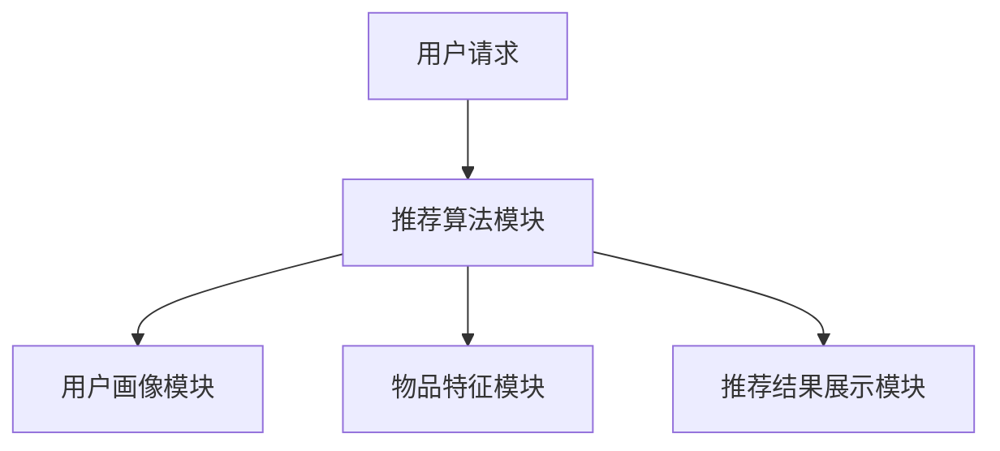

                 


# 构建企业级推荐引擎：跨平台个性化用户体验

## 关键词：推荐引擎，个性化推荐，企业级系统，跨平台，深度学习，协同过滤，用户体验

## 摘要：  
企业级推荐引擎是实现跨平台个性化用户体验的核心技术，本文将从推荐系统的背景、核心概念、算法原理、系统架构、项目实战到优化与展望进行深入分析。通过理论与实践相结合的方式，详细阐述如何构建一个高效、智能且个性化的推荐引擎，助力企业在多平台环境下提升用户体验和商业价值。

---

# 第一部分: 背景与核心概念

## 第1章: 推荐系统概述

### 1.1 推荐系统的基本概念

#### 1.1.1 推荐系统的定义与作用  
推荐系统是一种基于用户行为和数据挖掘技术，为用户推荐个性化内容或产品的技术。在企业级应用中，推荐系统能够显著提升用户体验、提高用户粘性和转化率，同时为企业创造更大的商业价值。

#### 1.1.2 企业级推荐系统的特征  
- **数据驱动**：基于海量用户行为和特征数据进行推荐。  
- **实时性**：支持实时推荐，满足用户即时需求。  
- **个性化**：根据用户偏好和行为动态调整推荐结果。  
- **可扩展性**：支持大规模数据处理和高并发请求。  

#### 1.1.3 跨平台推荐的挑战与意义  
- **跨平台推荐的挑战**：不同平台的用户行为差异大，推荐策略需要灵活调整。  
- **意義**：通过统一的推荐系统实现多平台用户画像的融合，提升用户体验一致性。

### 1.2 推荐系统的分类与应用场景

#### 1.2.1 推荐系统的分类  
- **基于协同过滤的推荐**：基于用户相似性或物品相似性进行推荐。  
- **基于内容的推荐**：基于物品本身的特征进行推荐。  
- **混合推荐模型**：结合协同过滤和深度学习的混合模型。  

#### 1.2.2 推荐系统的应用场景  
- **电商推荐**：推荐商品、个性化购物列表。  
- **社交媒体推荐**：推荐好友、兴趣内容。  
- **视频平台推荐**：推荐视频、个性化播放列表。  
- **新闻推荐**：推荐个性化新闻内容。  

## 第2章: 个性化推荐的核心要素

### 2.1 用户画像与行为分析

#### 2.1.1 用户画像的构建方法  
- **数据收集**：通过日志、用户注册信息、行为数据等多源数据构建用户画像。  
- **特征提取**：提取用户的年龄、性别、兴趣爱好、消费习惯等特征。  
- **画像更新**：根据用户行为动态更新用户画像。  

#### 2.1.2 用户行为数据的分类与特征提取  
- **行为类型**：点击、浏览、收藏、购买等。  
- **特征提取**：基于时间、频率、强度等维度提取用户行为特征。  

### 2.2 物品特征与关系网络

#### 2.2.1 物品特征的表示方法  
- **基于关键词的特征表示**：通过物品的描述信息提取关键词特征。  
- **基于向量的特征表示**：使用Word2Vec等模型将物品特征表示为向量。  

#### 2.2.2 物品间的关系网络构建  
- **协同过滤中的物品相似性计算**：基于用户行为数据计算物品间的相似性。  
- **知识图谱构建**：通过语义分析构建物品间的关系网络。  

### 2.3 个性化推荐的数学模型

#### 2.3.1 推荐系统的评价指标  
- **准确率（Precision）**：推荐结果中相关项的比例。  
- **召回率（Recall）**：推荐结果中覆盖用户实际需求的比例。  
- **F1值**：综合准确率和召回率的指标。  

---

# 第二部分: 算法原理与数学模型

## 第3章: 协同过滤推荐算法

### 3.1 协同过滤的基本原理

#### 3.1.1 基于用户的协同过滤  
- **用户相似性计算**：基于用户的评分数据计算用户间的相似性。  
- **推荐生成**：将目标用户相似用户的行为数据进行加权聚合生成推荐。  

#### 3.1.2 基于物品的协同过滤  
- **物品相似性计算**：基于物品的评分数据计算物品间的相似性。  
- **推荐生成**：将目标用户的评分数据与相似物品的特征进行加权聚合生成推荐。  

#### 3.1.3 混合协同过滤的实现方法  
- **混合推荐模型的构建**：结合基于用户的协同过滤和基于物品的协同过滤的结果，通过加权融合生成最终推荐结果。  

### 3.2 协同过滤的数学模型

#### 3.2.1 用户-物品评分矩阵的构建  
- 用户-物品评分矩阵表示为 \( R \)，其中 \( R_{u,i} \) 表示用户 \( u \) 对物品 \( i \) 的评分。  

#### 3.2.2 基于矩阵分解的协同过滤公式  
- **矩阵分解目标**：将评分矩阵 \( R \) 分解为两个低维矩阵 \( P \) 和 \( Q \)，使得 \( R \approx P Q^T \)。  
- **优化目标**：最小化 \( \sum_{u,i} (R_{u,i} - \sum_{k} P_{u,k} Q_{i,k})^2 \)。  

### 3.3 协同过滤的优缺点分析

#### 3.3.1 优点  
- 简单易实现，适合处理稀疏数据。  

#### 3.3.2 缺点  
- 计算复杂度高，冷启动问题难以解决。  

---

## 第4章: 深度学习推荐算法

### 4.1 基于神经网络的推荐模型

#### 4.1.1 DNN（深度神经网络）推荐模型  
- **模型结构**：将用户特征和物品特征输入DNN网络，通过多层感知机学习非线性关系。  

#### 4.1.2 CNN（卷积神经网络）推荐模型  
- **模型结构**：适用于序列推荐，通过卷积操作提取时序特征。  

#### 4.1.3 RNN（循环神经网络）推荐模型  
- **模型结构**：适用于序列推荐，通过循环结构捕捉序列依赖性。  

### 4.2 深度学习推荐的数学模型

#### 4.2.1 DNN推荐模型公式  
- **输入层**：用户特征 \( x_u \) 和物品特征 \( x_i \)。  
- **输出层**：预测的评分 \( y = \sigma(w x + b) \)，其中 \( \sigma \) 是sigmoid函数。  

#### 4.2.2 注意力机制在推荐中的应用  
- **注意力权重计算**：\( \text{Attention}(Q,K,V) = \text{softmax}(\frac{QK^T}{\sqrt{d}})V \)。  
- **注意力加权和**：将注意力权重与值向量进行加权和，得到最终的注意力输出。  

### 4.3 深度学习推荐的优缺点分析

#### 4.3.1 优点  
- 能够捕捉数据的非线性特征，表达能力强。  

#### 4.3.2 缺点  
- 计算资源消耗大，模型解释性差。  

---

## 第5章: 混合推荐模型

### 5.1 混合推荐模型的构建方法

#### 5.1.1 协同过滤与深度学习的混合  
- **协同过滤结果作为深度学习模型的输入特征**，通过多任务学习优化模型参数。  

#### 5.1.2 基于规则的推荐与机器学习的混合  
- **规则推荐**：根据业务规则生成初步推荐结果。  
- **机器学习推荐**：对规则推荐结果进行优化和调整。  

### 5.2 混合推荐模型的数学表示

#### 5.2.1 基于线性组合的混合模型  
- **混合公式**：\( f(x) = \alpha f_1(x) + (1-\alpha) f_2(x) \)，其中 \( f_1 \) 和 \( f_2 \) 分别是协同过滤和深度学习模型的输出。  

#### 5.2.2 基于门控机制的混合模型  
- **门控权重计算**：\( g(x) = \sigma(w^T x + b) \)。  
- **混合公式**：\( f(x) = g(x) f_1(x) + (1 - g(x)) f_2(x) \)。  

### 5.3 混合推荐模型的优化策略

#### 5.3.1 参数优化方法  
- **超参数调优**：通过网格搜索或随机搜索优化混合比例 \( \alpha \)。  
- **自动微调**：根据实时数据动态调整模型参数。  

#### 5.3.2 模型融合的技巧  
- **特征互补性**：利用不同模型的优势特征进行融合。  
- **模型多样性**：确保不同模型的预测结果具有一定的多样性，避免过度集中。  

---

# 第三部分: 系统架构与设计

## 第6章: 推荐系统架构设计

### 6.1 系统功能设计

#### 6.1.1 用户画像模块  
- **功能**：构建和更新用户画像。  
- **输入**：用户行为数据、用户属性数据。  
- **输出**：用户画像数据。  

#### 6.1.2 推荐算法模块  
- **功能**：基于用户画像和物品特征生成推荐结果。  
- **输入**：用户画像数据、物品特征数据。  
- **输出**：推荐列表。  

#### 6.1.3 推荐结果展示模块  
- **功能**：将推荐结果展示在不同平台上。  
- **输入**：推荐列表、用户请求信息。  
- **输出**：推荐结果页面或接口。  

### 6.2 系统架构设计

#### 6.2.1 系统架构图  


#### 6.2.2 接口设计  
- **API接口**：提供RESTful API接口，支持跨平台调用。  
- **接口协议**：使用JSON格式传输数据，支持HTTP/HTTPS协议。  

#### 6.2.3 系统交互流程  
1. 用户发起推荐请求。  
2. 推荐算法模块接收请求并调用用户画像模块和物品特征模块获取数据。  
3. 推荐算法模块生成推荐列表。  
4. 推荐结果展示模块将推荐列表返回给用户。  

---

## 第7章: 项目实战

### 7.1 环境搭建

#### 7.1.1 开发环境  
- **操作系统**：Linux/Windows/MacOS。  
- **编程语言**：Python。  
- **深度学习框架**：TensorFlow/PyTorch。  
- **推荐系统库**：Surprise、LightFM。  

### 7.2 核心实现

#### 7.2.1 数据预处理  
- **数据清洗**：处理缺失值、异常值。  
- **特征提取**：提取用户和物品的特征向量。  

#### 7.2.2 模型训练  
- **协同过滤模型训练**：使用Surprise库实现基于用户的协同过滤。  
- **深度学习模型训练**：使用TensorFlow实现DNN推荐模型。  

#### 7.2.3 推荐结果生成  
- **推荐列表生成**：基于训练好的模型生成推荐列表。  
- **推荐结果排序**：根据评分或点击率对推荐结果进行排序。  

### 7.3 代码实现

#### 7.3.1 协同过滤模型代码  
```python
from surprise import Dataset, SVD
from surprise.model_selection import train_test_split

# 加载数据集
data = Dataset.load_from_file('rating.csv', format='csv')

# 分割训练集和测试集
train_set, test_set = train_test_split(data, test_size=0.25)

# 初始化模型
model = SVD(n_factors=100, n_iter=20, random_state=42)

# 训练模型
model.fit(train_set)

# 预测评分
for user, item, true_r, est_r in zip(model.test(test_set)):
    print(f"User {user}推荐Item {item}的评分为{est_r}")
```

#### 7.3.2 深度学习模型代码  
```python
import tensorflow as tf
from tensorflow.keras import layers

# 构建DNN模型
model = tf.keras.Sequential([
    layers.Dense(64, activation='relu', input_dim=100),
    layers.Dense(1, activation='sigmoid')
])

# 编译模型
model.compile(optimizer='adam', loss='binary_crossentropy', metrics=['accuracy'])

# 训练模型
model.fit(x_train, y_train, epochs=10, batch_size=32, validation_data=(x_val, y_val))
```

### 7.4 项目小结

#### 7.4.1 项目总结  
通过本项目，我们实现了基于协同过滤和深度学习的推荐系统，验证了不同算法在实际场景中的表现，并通过混合推荐模型进一步提升了推荐效果。  

#### 7.4.2 最佳实践  
- 数据预处理是推荐系统成功的关键，确保数据质量和完整性。  
- 在实际应用中，需要根据业务需求选择合适的推荐算法，并进行充分的调优。  

---

## 第8章: 优化与展望

### 8.1 推荐系统性能优化

#### 8.1.1 模型优化技巧  
- **参数调优**：通过网格搜索或随机搜索优化模型参数。  
- **模型压缩**：使用模型剪枝、知识蒸馏等技术减少模型大小。  

#### 8.1.2 系统优化技巧  
- **分布式计算**：利用分布式计算框架（如Spark）处理海量数据。  
- **缓存优化**：优化推荐结果缓存策略，减少计算开销。  

### 8.2 推荐系统的发展趋势

#### 8.2.1 基于知识图谱的推荐  
- **知识图谱构建**：通过知识抽取、推理构建更复杂的物品关系网络。  
- **知识增强的推荐模型**：结合知识图谱和深度学习模型提升推荐精度。  

#### 8.2.2 联邦学习在推荐中的应用  
- **联邦学习**：通过数据联邦技术在保护数据隐私的前提下进行模型训练。  
- **跨平台推荐**：在不同平台之间共享推荐模型参数，提升推荐效果。  

### 8.3 未来展望

#### 8.3.1 新兴技术对推荐系统的影响  
- **生成式AI**：通过生成式模型生成个性化推荐内容。  
- **多模态推荐**：结合文本、图像、视频等多种模态信息提升推荐效果。  

---

## 第9章: 总结与注意事项

### 9.1 总结  
企业级推荐引擎的构建需要结合多种推荐算法和系统架构设计，通过数据驱动和深度学习技术实现个性化的推荐结果。推荐系统的优化是一个持续的过程，需要根据业务需求和技术发展不断调整和改进。

### 9.2 注意事项  
- **数据隐私保护**：在推荐系统中，必须严格遵守数据隐私保护法规，确保用户数据的安全。  
- **模型解释性**：推荐系统需要具备一定的解释性，帮助用户理解和信任推荐结果。  
- **实时性优化**：在高并发场景下，需要优化推荐系统的响应速度，确保用户体验。  

---

通过以上目录结构，我们能够系统地学习和构建一个高效、智能且个性化的推荐引擎，为企业的跨平台用户提供最优的用户体验。

