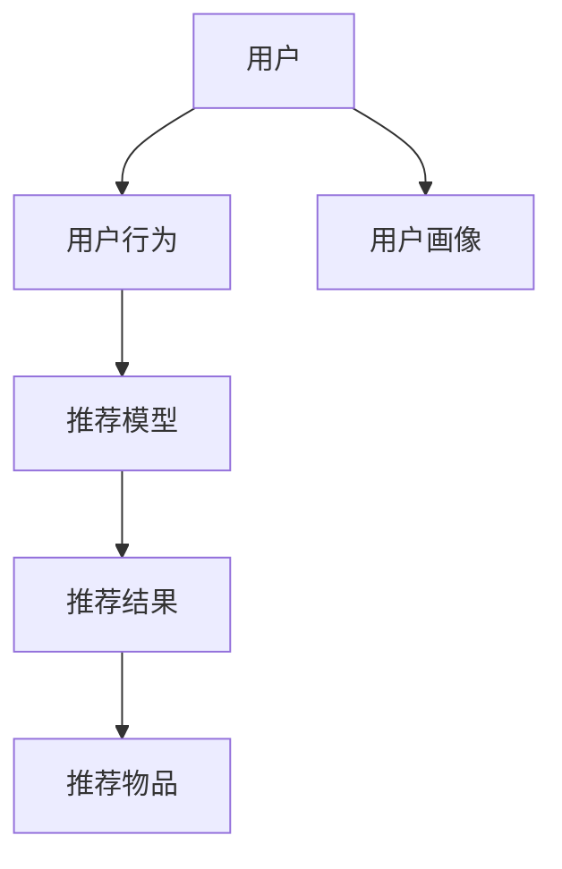
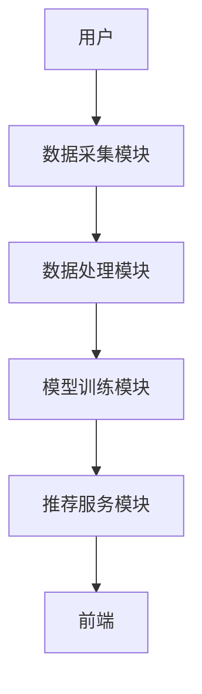

                 


# 构建企业级推荐引擎：跨平台个性化用户体验的智能化实现

> 关键词：企业级推荐引擎、跨平台推荐、个性化推荐、推荐算法、深度学习、系统架构

> 摘要：本文详细探讨了构建企业级推荐引擎的核心概念、算法原理、系统架构以及项目实战。从背景介绍到算法实现，从系统设计到项目案例，本文系统性地分析了如何实现跨平台个性化推荐，提升用户体验。文章结合理论与实践，为技术人员提供了从零开始构建企业级推荐引擎的完整指南。

---

## 第一部分: 企业级推荐引擎的背景与核心概念

### 第1章: 推荐引擎的基本概念与问题背景

#### 1.1 推荐引擎的定义与核心目标
推荐引擎是一种基于用户行为、偏好和数据特征，利用算法生成个性化推荐内容的技术。其核心目标是通过分析用户需求和行为，提供精准的内容或产品推荐，从而提升用户体验和业务转化率。

#### 1.2 问题背景与挑战
- **个性化需求的复杂性**：用户的行为和偏好千差万别，如何准确捕捉用户的潜在需求是推荐引擎的核心挑战。
- **数据规模的庞大性**：企业级推荐引擎需要处理海量数据，包括用户行为数据、商品数据、内容数据等，对计算能力和存储能力提出高要求。
- **跨平台推荐的实现难度**：推荐引擎需要在多个平台（Web、移动端、小程序等）上保持一致性和实时性，增加了系统设计的复杂性。

#### 1.3 核心概念与边界
- **推荐引擎的核心要素**：包括用户画像、推荐算法、推荐结果展示等。
- **跨平台推荐的实现边界**：推荐引擎需要与各个平台的交互层和展示层无缝对接，但推荐算法和数据处理部分可以复用。

---

## 第2章: 企业级推荐引擎的核心概念与联系

### 2.1 推荐引擎的核心原理
推荐引擎的核心原理主要包括协同过滤、基于内容的推荐和混合推荐模型。

#### 协同过滤
- **基于用户的协同过滤**：通过分析用户的相似性，找到与当前用户行为相似的用户群体，基于他们的偏好进行推荐。
- **基于物品的协同过滤**：通过分析物品之间的相似性，找到与当前用户感兴趣物品相关的其他物品进行推荐。
- **混合协同过滤模型**：结合基于用户和基于物品的协同过滤，利用两者的优势提升推荐准确性。

#### 基于内容的推荐
- **文本相似度计算**：通过对商品描述或内容进行特征提取，计算内容之间的相似度，从而进行推荐。
- **特征提取与匹配**：利用文本挖掘、自然语言处理等技术提取内容特征，与用户兴趣进行匹配。

#### 混合推荐模型
- **混合推荐的优势**：结合协同过滤和基于内容的推荐，利用两者互补性提升推荐效果。
- **混合推荐的实现方式**：可以通过加权融合的方式，将协同过滤和基于内容的推荐结果进行整合。

### 2.2 实体关系图


---

## 第3章: 推荐引擎的算法原理

### 3.1 协同过滤算法

#### 基于用户的协同过滤
- **实现步骤**：
  1. 数据预处理：构建用户-物品评分矩阵。
  2. 计算相似度：使用余弦相似度或皮尔逊相关系数计算用户相似度。
  3. 生成推荐：基于相似用户的评分，计算当前用户的推荐评分。
- **数学公式**：
  $$ \text{相似度}(u, v) = \frac{\sum (r_{u,i} - \bar{r}_u)(r_{v,i} - \bar{r}_v)}{\sqrt{\sum (r_{u,i} - \bar{r}_u)^2} \cdot \sqrt{\sum (r_{v,i} - \bar{r}_v)^2}} $$

#### 基于物品的协同过滤
- **实现步骤**：
  1. 数据预处理：构建物品-用户的评分矩阵。
  2. 计算相似度：计算物品之间的相似度。
  3. 生成推荐：基于物品的相似度，计算当前用户的推荐评分。
- **数学公式**：
  $$ \text{相似度}(i, j) = \frac{\sum (r_{u,i} - \bar{r}_i)(r_{u,j} - \bar{r}_j)}{\sqrt{\sum (r_{u,i} - \bar{r}_i)^2} \cdot \sqrt{\sum (r_{u,j} - \bar{r}_j)^2}} $$

### 3.2 基于内容的推荐算法

#### 文本相似度计算
- **实现步骤**：
  1. 文本预处理：分词、去停用词、向量化。
  2. 计算相似度：使用余弦相似度或BM25算法计算文本相似度。
- **数学公式**：
  $$ \text{相似度}(a, b) = \frac{\sum a_i b_i}{\sqrt{\sum a_i^2} \cdot \sqrt{\sum b_i^2}} $$

---

## 第4章: 推荐引擎的系统架构与设计

### 4.1 系统功能设计

#### 数据采集模块
- **功能**：采集用户行为数据、商品数据、内容数据等。
- **实现方式**：通过日志采集、API调用等方式获取实时数据。

#### 特征工程模块
- **功能**：对数据进行清洗、特征提取和转换。
- **实现方式**：利用Python的pandas库进行数据处理，使用自然语言处理技术提取文本特征。

#### 模型训练模块
- **功能**：基于特征数据训练推荐模型。
- **实现方式**：使用机器学习库（如scikit-learn）或深度学习框架（如TensorFlow）进行模型训练。

#### 推荐服务模块
- **功能**：接收用户请求，生成推荐结果。
- **实现方式**：基于训练好的模型，实时生成推荐结果。

### 4.2 系统架构设计

#### 系统架构图


---

## 第5章: 项目实战

### 5.1 环境安装

```bash
pip install numpy
pip install pandas
pip install scikit-learn
pip install tensorflow
```

### 5.2 核心代码实现

#### 协同过滤算法实现

```python
import numpy as np
from sklearn.metrics.pairwise import cosine_similarity

class CollaborativeFiltering:
    def __init__(self):
        self.user_item_matrix = None
        self.user_similarity = None

    def fit(self, user_item_matrix):
        self.user_item_matrix = user_item_matrix
        self.user_similarity = cosine_similarity(self.user_item_matrix.T)

    def predict(self, user_id, item_id):
        user_similarities = self.user_similarity[user_id]
        item_ratings = self.user_item_matrix[:, item_id]
        mask = ~np.isnan(item_ratings)
        avg_rating = np.mean(item_ratings[mask])
        numerator = np.sum(user_similarities[mask] * (item_ratings[mask] - avg_rating))
        denominator = np.sum(user_similarities[mask])
        if denominator == 0:
            return avg_rating
        return avg_rating + (numerator / denominator)
```

---

## 第6章: 总结与最佳实践

### 6.1 总结
本文详细探讨了企业级推荐引擎的构建过程，从核心概念到算法实现，从系统设计到项目实战，为技术人员提供了完整的指南。

### 6.2 最佳实践
- **数据质量**：确保数据的完整性和准确性。
- **模型选择**：根据业务需求选择合适的推荐算法。
- **性能优化**：通过缓存和分布式计算提升推荐效率。

### 6.3 注意事项
- 推荐引擎需要不断迭代优化，根据用户反馈调整模型参数。
- 注意数据隐私和用户隐私保护。

### 6.4 拓展阅读
- 《推荐系统实践》
- 《深度学习推荐系统》

--- 

通过本文的详细讲解，读者可以掌握企业级推荐引擎的构建方法，并在实际项目中灵活应用这些技术。

