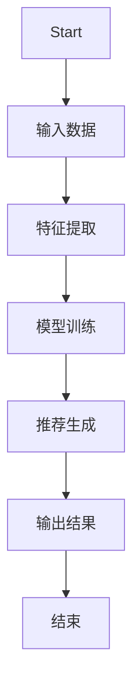
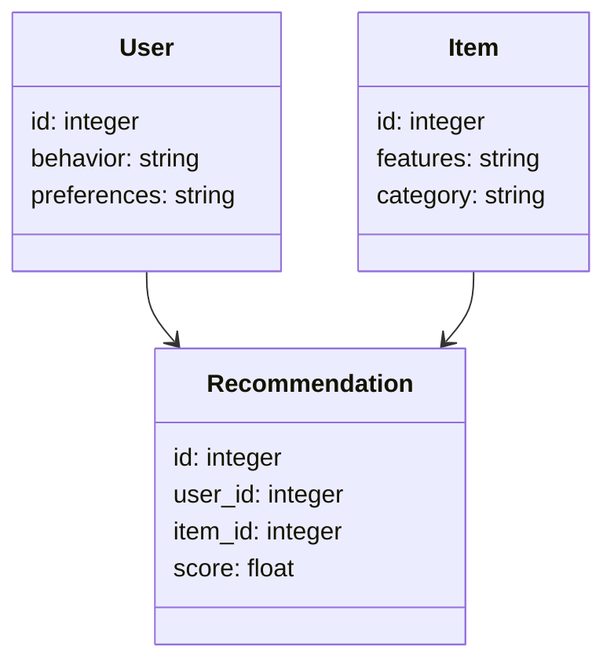
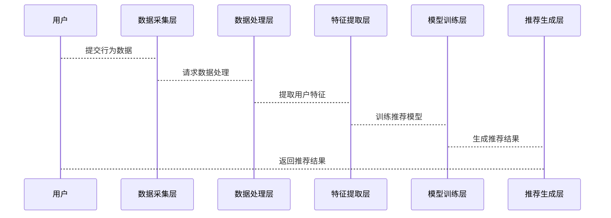

                 


# 构建企业级推荐引擎：跨平台用户行为分析与个性化推荐

## 关键词：企业级推荐引擎、跨平台用户行为分析、个性化推荐、推荐系统、机器学习、用户画像

## 摘要：本文将详细探讨企业级推荐引擎的构建过程，涵盖跨平台用户行为分析与个性化推荐的核心技术。通过系统化的分析和实际案例，深入讲解推荐引擎的工作原理、算法实现、系统架构设计以及项目实战，帮助读者全面掌握构建高效推荐系统的方法。

---

## 第1章: 推荐引擎的背景与定义

### 1.1 什么是推荐引擎
推荐引擎是一种基于用户行为和数据挖掘技术，为用户个性化推荐相关内容的系统。它广泛应用于电商、社交网络、视频平台等领域，旨在提升用户体验和业务转化率。

### 1.2 企业级推荐引擎的特点
企业级推荐引擎需要处理海量数据，支持多平台（PC、移动端、API接口）的推荐需求，并具备高可用性和扩展性。

### 1.3 本章小结
本章通过定义和特点的阐述，帮助读者理解推荐引擎的重要性和应用场景。

---

## 第2章: 推荐引擎的核心概念与联系

### 2.1 推荐引擎的工作原理
推荐引擎通过分析用户行为、提取物品特征，并结合算法模型生成个性化推荐结果。

### 2.2 推荐算法的核心要素
- **用户行为分析**：捕捉用户的点击、浏览、购买等行为，提取用户的兴趣特征。
- **物品特征提取**：通过文本挖掘、图像识别等技术提取物品的属性特征。
- **推荐结果的评估指标**：如准确率、召回率、F1分数等。

### 2.3 推荐引擎的实体关系图


### 2.4 本章小结
本章通过实体关系图和核心要素的分析，帮助读者理解推荐引擎的整体架构和关键组成部分。

---

## 第3章: 推荐算法原理与实现

### 3.1 协同过滤算法
协同过滤是基于用户相似性或物品相似性进行推荐的算法。

#### 3.1.1 基于用户的协同过滤
通过计算用户之间的相似度，将相似用户的评分进行加权平均，生成推荐结果。

#### 3.1.2 基于物品的协同过滤
通过计算物品之间的相似度，将用户已评分的物品相似项推荐给用户。

#### 3.1.3 混合协同过滤模型
结合基于用户的和基于物品的协同过滤，利用两者的优势，提高推荐准确性。

### 3.2 基于内容的推荐算法
基于内容的推荐算法通过分析物品的属性特征，生成与用户兴趣相符的推荐。

#### 3.2.1 文本挖掘与特征提取
使用文本挖掘技术（如TF-IDF）提取文本特征，用于生成推荐结果。

#### 3.2.2 基于向量空间模型的推荐
将文本特征表示为向量，计算向量之间的相似度，生成推荐结果。

#### 3.2.3 深度学习在内容推荐中的应用
利用深度学习模型（如神经网络）提取非线性特征，提高推荐的准确性。

### 3.3 推荐算法的数学模型
协同过滤的数学公式：
$$相似度计算：cos(\theta) = \frac{\sum u_i v_i}{\sqrt{\sum u_i^2} \sqrt{\sum v_i^2}}$$

基于内容的推荐模型：
$$推荐概率：P(i|u) = \sum \alpha_{u,k} \cdot f_k(i)$$

### 3.4 算法实现的流程图


### 3.5 本章小结
本章详细介绍了协同过滤和基于内容的推荐算法，并通过数学公式和流程图帮助读者理解推荐算法的实现过程。

---

## 第4章: 系统分析与架构设计

### 4.1 系统分析
推荐引擎需要处理大规模数据，支持多平台推荐需求，并具备高可用性和扩展性。

### 4.2 系统架构设计
系统架构设计包括数据采集、处理、分析、建模、生成推荐和效果监控模块。

#### 4.2.1 领域模型设计


#### 4.2.2 系统架构设计


### 4.3 系统接口设计
推荐引擎需要提供API接口，支持外部系统调用推荐结果。

### 4.4 系统交互设计


### 4.5 本章小结
本章通过系统架构设计和交互设计，帮助读者理解推荐引擎的整体实现过程。

---

## 第5章: 项目实战

### 5.1 项目背景与目标
以电商推荐系统为例，目标是为用户推荐感兴趣的商品，提升用户购买转化率。

### 5.2 项目环境安装
安装Python、Pandas、Scikit-learn等工具，搭建推荐系统开发环境。

### 5.3 核心实现代码
```python
from sklearn.metrics.pairwise import cosine_similarity
from sklearn.feature_extraction.text import TfidfVectorizer

# 示例数据
texts = ['apple is a fruit', 'banana is a fruit', 'fruit is good']
vectorizer = TfidfVectorizer()
tfidf = vectorizer.fit_transform(texts)
similarity_matrix = cosine_similarity(tfidf)
```

### 5.4 代码解读与分析
- **特征提取**：使用TF-IDF提取文本特征。
- **相似度计算**：利用余弦相似度计算文本之间的相似性。
- **推荐生成**：基于相似度排序，生成推荐结果。

### 5.5 实际案例分析
通过实际数据集，训练推荐模型，并评估模型的准确性和召回率。

### 5.6 本章小结
本章通过实际项目案例，帮助读者理解推荐引擎的开发过程和实现细节。

---

## 第6章: 最佳实践与注意事项

### 6.1 性能优化
- 使用分布式计算优化模型训练。
- 采用增量学习提升推荐实时性。

### 6.2 模型调优
- 调整模型参数，优化推荐准确率和召回率。
- 使用交叉验证评估模型性能。

### 6.3 系统扩展
- 分库分表优化数据存储。
- 异步计算提升系统性能。

### 6.4 数据安全与隐私保护
- 加强用户数据加密，确保数据安全。
- 遵守数据隐私法规，保护用户隐私。

### 6.5 本章小结
本章总结了推荐引擎开发中的注意事项和最佳实践，帮助读者提升推荐系统的性能和安全性。

---

## 第7章: 总结与展望

### 7.1 本项目总结
通过本文的详细讲解，读者掌握了企业级推荐引擎的核心技术和实现方法。

### 7.2 未来展望
未来推荐引擎将更加智能化，结合AI和大数据技术，为用户提供更精准的个性化推荐。

### 7.3 本章小结
本章总结了文章的主要内容，并展望了推荐引擎技术的未来发展方向。

---

## 结束语
通过本文的系统化讲解，读者可以全面掌握企业级推荐引擎的构建方法。希望本文对从事推荐系统开发的读者有所帮助，为实际项目提供参考和借鉴。

---

