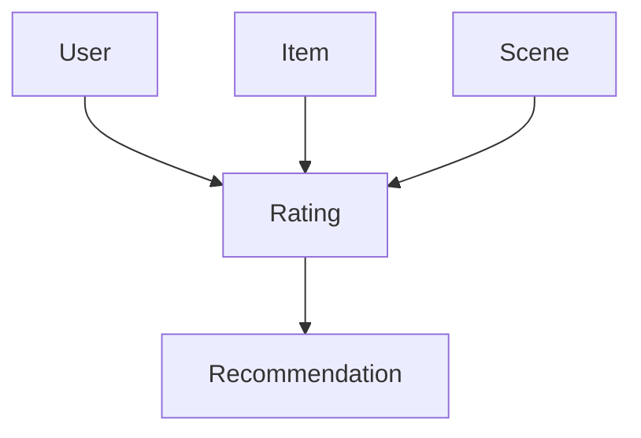

                 


# 《构建企业级推荐系统：个性化产品与服务推荐》

## 关键词：
- 企业级推荐系统
- 个性化推荐
- 推荐算法
- 系统架构
- 项目实战

## 摘要：
本文系统地介绍了企业级推荐系统的构建过程，从核心概念到算法原理，再到系统设计和项目实战，全面解析了如何实现高效的个性化推荐系统。文章通过详细的数学模型、算法实现和系统架构设计，帮助读者掌握推荐系统的精髓。

---

## 目录大纲：

### 第一部分：企业级推荐系统背景与核心概念

#### 第1章：推荐系统概述
- **1.1 推荐系统的定义与背景**
  - 推荐系统的定义
  - 发展历程
  - 企业级推荐系统的必要性
- **1.2 个性化推荐的核心问题**
  - 用户、物品、场景的三元关系
  - 推荐系统的边界与外延
- **1.3 企业级推荐系统的特征**
  - 规模化、高可用性、实时性
  - 多目标优化

#### 第2章：推荐系统的核心概念与联系
- **2.1 推荐系统的核心原理**
  - 协同过滤、内容推荐、混合推荐
- **2.2 实体关系与数据建模**
  - 用户-物品交互关系
  - 用户画像与物品画像
  - 场景与推荐的关系
- **2.3 核心概念对比分析**
  - 不同推荐算法的对比表格
  - 用户-物品-场景的实体关系图（Mermaid）


### 第二部分：推荐系统的算法原理

#### 第3章：协同过滤算法
- **3.1 基于用户的协同过滤**
  - 相似度计算（余弦相似度）
  - 邻域推荐
- **3.2 基于物品的协同过滤**
  - 物品相似度矩阵
  - 应用场景
- **3.3 混合协同过滤的优缺点**
  - 代码实现示例

#### 第4章：基于矩阵分解的推荐算法
- **4.1 矩阵分解的基本原理**
  - SVD算法的数学模型
  - 优缺点分析
- **4.2 SVD算法的实现细节**
  - 矩阵分解步骤
  - 代码实现示例

#### 第5章：基于深度学习的推荐算法
- **5.1 基于神经网络的推荐模型**
  - DNN、GRU、Transformer的应用
  - 深度学习模型的优缺点

### 第三部分：推荐系统的系统分析与架构设计

#### 第6章：推荐系统的应用场景
- **6.1 电商推荐**
  - 商品推荐系统
- **6.2 内容推荐（新闻、视频）**
  - 基于内容的推荐
- **6.3 服务推荐（酒店、旅游）**
  - 场景化推荐

#### 第7章：系统功能设计
- **7.1 用户画像模块**
  - 用户行为分析
- **7.2 物品特征提取模块**
  - 物品属性提取
- **7.3 推荐策略配置模块**
  - 策略制定与优化

#### 第8章：系统架构设计
- **8.1 系统架构图（Mermaid）**
  ```mermaid
  graph TD
      User --> RecommenderSystem
      RecommenderSystem --> Database
      Database --> Items
      Database --> Users
  ```
- **8.2 接口设计**
  - RESTful API设计
- **8.3 交互设计（Mermaid序列图）**
  ```mermaid
  sequenceDiagram
      user ->> RecommenderSystem: 请求推荐
      RecommenderSystem ->> Database: 查询用户数据
      Database ->> RecommenderSystem: 返回用户数据
      RecommenderSystem ->> ItemFeatureExtractor: 提取物品特征
      ItemFeatureExtractor ->> RecommenderSystem: 返回特征向量
      RecommenderSystem ->> User: 返回推荐结果
  ```

### 第四部分：项目实战

#### 第9章：项目实战
- **9.1 环境安装**
  - 安装Python、TensorFlow、Scikit-learn
- **9.2 系统核心实现源代码**
  - 协同过滤算法实现
    ```python
    def collaborative_filtering(user_item_matrix):
        # 计算相似度矩阵
        similarity_matrix = cosine_similarity(user_item_matrix)
        # 找出最相似的用户
        similar_users = find_similar_users(similarity_matrix)
        return similar_users
    ```
- **9.3 案例分析与详细讲解**
  - 实际案例分析
- **9.4 项目小结**
  - 项目总结与优化建议

### 第五部分：最佳实践与注意事项

#### 第10章：最佳实践
- **10.1 算法选择的注意事项**
  - 根据数据类型选择算法
- **10.2 系统优化技巧**
  - 系统性能优化方法
- **10.3 模型调优策略**
  - 参数调整与模型评估

#### 第11章：小结与展望
- **11.1 本章小结**
  - 总结全文内容
- **11.2 未来展望**
  - 推荐系统的未来发展方向

---

通过以上目录大纲，读者可以系统地学习企业级推荐系统的构建过程，从理论到实践，逐步掌握推荐系统的精髓。

