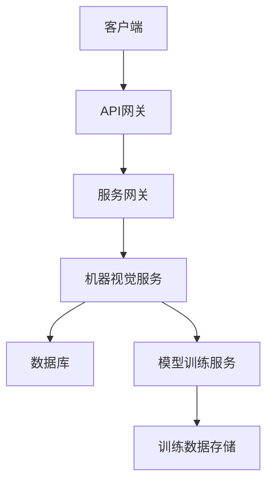

                 


# 构建企业级机器视觉平台：质量控制与安全监测

---

## 关键词
企业级机器视觉、质量控制、安全监测、深度学习、图像处理、系统架构

---

## 摘要
机器视觉技术在企业级应用中发挥着越来越重要的作用，特别是在质量控制与安全监测领域。本文详细探讨了构建企业级机器视觉平台的核心技术、系统架构、算法原理以及实际应用案例。通过分析质量控制与安全监测的核心需求，结合深度学习与图像处理技术，本文为读者提供了一个全面的构建指南，涵盖了从理论到实践的各个层面。

---

## 第一部分: 企业级机器视觉平台概述

### 第1章: 机器视觉与企业应用背景

#### 1.1 机器视觉的基本概念
- **定义与特点**  
  机器视觉是通过计算机模拟人类视觉系统的技术，具有高效性、准确性、非接触性和实时性的特点。

- **核心技术**  
  包括图像采集、图像处理、特征提取、目标识别等技术。

- **应用现状**  
  机器视觉在制造业、医疗、安防等领域广泛应用，特别是在质量检测和安全监控方面。

#### 1.2 企业级机器视觉平台的背景与意义
- **定义与特点**  
  企业级平台是为企业内部应用设计的，具备高可用性、可扩展性和高安全性。

- **质量控制的核心需求**  
  包括自动化检测、高精度识别、实时反馈等功能。

- **安全监测的核心需求**  
  包括实时监控、异常检测、报警机制等。

---

### 第2章: 质量控制与安全监测的核心需求

#### 2.1 质量控制的核心需求
- **定义与目标**  
  质量控制是通过技术手段确保产品符合质量标准的过程。

- **应用场景**  
  包括制造业中的缺陷检测、尺寸测量等。

- **挑战与解决方案**  
  数据量大、环境复杂等问题，解决方案包括优化算法、提高硬件性能等。

#### 2.2 安全监测的核心需求
- **定义与目标**  
  安全监测是通过技术手段预防和检测潜在的安全威胁。

- **应用场景**  
  包括工业安全、公共安全等领域的监控。

- **挑战与解决方案**  
  包括实时性要求高、数据处理复杂等问题，解决方案包括引入边缘计算、增强算法的实时性等。

---

## 第二部分: 机器视觉的核心技术与算法原理

### 第3章: 机器视觉的核心技术

#### 3.1 图像处理技术
- **图像采集与预处理**  
  包括图像采集、去噪、增强等步骤。

- **图像分割与边缘检测**  
  使用Canny边缘检测算法，提取图像中的边缘信息。

- **特征提取与目标识别**  
  使用SIFT算法提取图像特征，进行目标识别。

#### 3.2 深度学习与目标检测
- **深度学习的基本原理**  
  包括神经网络的训练、损失函数的优化等。

- **目标检测算法**  
  介绍YOLO算法的流程，包括特征提取、候选框生成、非极大值抑制等步骤。

- **模型训练与优化**  
  包括数据增强、模型调参、训练策略优化等方法。

### 第4章: 机器视觉算法的数学模型与公式

#### 4.1 图像处理的数学基础
- **图像变换**  
  傅里叶变换用于图像频域分析，公式如下：
  $$ F(k) = \sum_{x=0}^{N-1} f(x) e^{-j2\pi kx/N} $$

- **图像滤波与边缘检测**  
  使用拉普拉斯算子进行边缘检测，公式如下：
  $$ G(x, y) = \sum_{i,j} a_{i,j} I(x+i, y+j) $$

- **图像分割的数学模型**  
  使用阈值分割算法，公式如下：
  $$ \text{分割结果} = \{ x | I(x) > T \} $$

#### 4.2 深度学习的数学基础
- **神经网络的数学模型**  
  使用反向传播算法进行训练，公式如下：
  $$ \frac{\partial L}{\partial w} = \frac{\partial L}{\partial a} \cdot \frac{\partial a}{\partial w} $$

- **卷积神经网络（CNN）**  
  卷积层的数学表达式为：
  $$ f(x) = \sum_{k=1}^{K} w_k * x_k + b $$

- **目标检测算法的数学推导**  
  使用锚框生成候选框，公式如下：
  $$ \text{候选框} = \{ (x_{center}, y_{center}), w, h \} $$

---

## 第三部分: 企业级机器视觉平台的系统架构与设计

### 第5章: 系统架构设计

#### 5.1 系统功能设计
- **功能模块划分**  
  包括数据采集模块、模型训练模块、结果展示模块等。

- **数据采集与处理模块**  
  使用摄像头采集图像，进行预处理和特征提取。

- **模型训练与部署模块**  
  使用深度学习框架（如TensorFlow）进行模型训练和部署。

- **结果展示与反馈模块**  
  将检测结果展示在界面上，并提供反馈机制。

#### 5.2 系统架构图


### 第6章: 系统接口与交互设计

#### 6.1 系统接口设计
- **API接口定义**  
  使用RESTful API，定义接口的输入参数和输出格式。

- **系统交互流程**  
  包括客户端请求、服务处理、结果返回等步骤。

---

## 第四部分: 项目实战

### 第7章: 项目实战

#### 7.1 环境安装
- **安装Python环境**  
  使用Anaconda安装Python 3.8以上版本。

- **安装深度学习框架**  
  安装TensorFlow和PyTorch框架。

- **安装图像处理库**  
  安装OpenCV和 PIL库。

#### 7.2 系统核心实现源代码
- **目标检测代码示例**  
  ```python
  import cv2
  import tensorflow as tf

  def detect_objects(image_path):
      # 加载预训练模型
      model = tf.keras.models.load_model('model.h5')
      # 读取图像
      image = cv2.imread(image_path)
      image = cv2.resize(image, (224, 224))
      image = image / 255.0
      # 预测
      prediction = model.predict(tf.expand_dims(image, axis=0))
      return prediction

  # 使用示例
  detect_objects('test.jpg')
  ```

- **代码解读与分析**  
  代码实现了目标检测功能，包括模型加载、图像预处理和预测步骤。

#### 7.3 实际案例分析
- **案例分析**  
  在制造业中，使用机器视觉检测电子元件的缺陷。

- **详细讲解**  
  包括数据采集、模型训练、部署和应用的具体步骤。

---

## 第五部分: 最佳实践与小结

### 第8章: 最佳实践

#### 8.1 小结
- 机器视觉平台的构建需要结合硬件、算法和系统架构设计。

#### 8.2 注意事项
- 数据质量是关键，需确保数据的多样性和代表性。
- 模型优化需要结合实际场景，进行针对性调整。

#### 8.3 拓展阅读
- 推荐阅读《Deep Learning》和《Computer Vision: Algorithms and Applications》。

---

## 附录: 参考文献

- LeCun, Y., Bengio, Y., & Hinton, G. (2015). Deep learning. Nature, 521(7555), 436-444.
- Everingham, A., Esmaili, N., & Fels, S. (2011). An introduction to the edited volume on computer vision.

---

以上是文章的完整内容，涵盖了构建企业级机器视觉平台的各个方面，包括技术背景、算法原理、系统设计和项目实战。希望对读者有所帮助！

