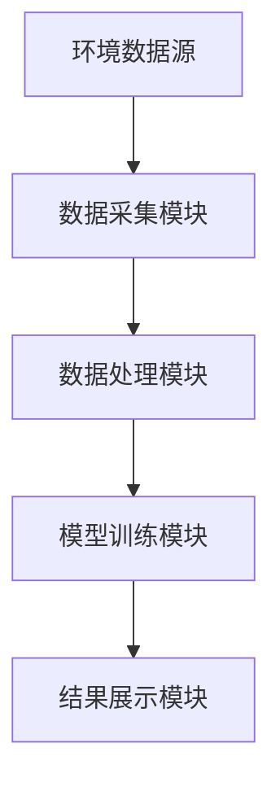
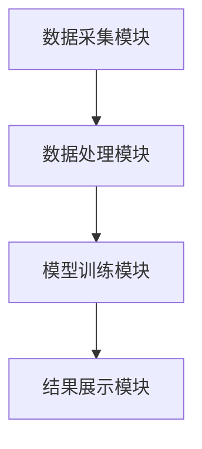
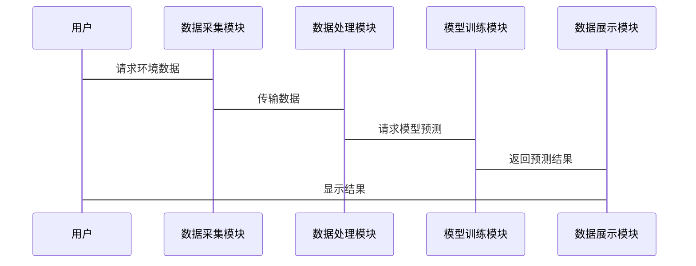

                 


# 构建企业级环境监测AI：助力合规与可持续发展

## 关键词：企业级环境监测，人工智能，可持续发展，数据处理，模型优化

## 摘要：随着全球对可持续发展的关注日益增加，企业级环境监测AI在助力合规与可持续发展方面扮演着越来越重要的角色。本文将详细介绍构建企业级环境监测AI的核心概念、算法原理、系统设计与实现，以及实际项目中的应用。通过本文，读者将能够全面了解如何利用AI技术提升环境监测效率，并实现企业级环境监测的合规与可持续发展目标。

---

# 第1章：环境监测的重要性

## 1.1 环境监测的核心目标

环境监测是指通过各种技术手段对环境因素进行测量和评估，以确保环境质量符合相关法规和标准。其核心目标包括：

- 监测环境质量，确保其在可接受范围内。
- 早期预警潜在的环境问题，避免对环境造成重大损害。
- 为环境政策制定和企业决策提供数据支持。

### 1.1.1 环境监测的传统方法与局限性

传统环境监测方法主要依赖人工采样和实验室分析，这种方法虽然准确，但存在以下局限性：

- **效率低**：人工采样和分析耗时较长，难以满足实时监测的需求。
- **成本高**：需要大量的人力和物力投入。
- **覆盖范围有限**：难以实现大规模、广范围的环境监测。

### 1.1.2 AI在环境监测中的潜力

AI技术的引入为环境监测带来了新的可能性：

- **高效性**：AI可以通过自动化处理大量数据，提高监测效率。
- **实时性**：AI可以实时分析数据，实现环境问题的早期预警。
- **准确性**：通过机器学习算法，AI可以提高监测结果的准确性。

---

## 1.2 企业级环境监测的背景

### 1.2.1 企业级环境监测的定义

企业级环境监测是指企业内部通过技术手段对生产、运营过程中产生的环境因素进行实时监测和评估，以确保企业行为符合相关法规和可持续发展目标。

### 1.2.2 企业级环境监测的典型场景

企业级环境监测的应用场景包括：

- **工业排放监测**：监测企业生产过程中产生的废气、废水和废料的排放情况。
- **能源消耗监测**：监测企业能源的使用情况，优化能源管理。
- **供应链监测**：监测供应链中各环节的环境表现，确保整个供应链的可持续性。

### 1.2.3 企业级环境监测的挑战与机遇

#### 挑战

- **数据量大**：企业级环境监测需要处理大量的环境数据，对数据存储和处理能力提出了更高的要求。
- **数据多样性**：环境数据可能来自多种不同的传感器和数据源，数据格式和类型多样，增加了数据处理的复杂性。
- **模型更新**：环境监测模型需要不断更新以适应环境变化和新的法规要求，这对模型的维护和优化提出了挑战。

#### 机遇

- **技术进步**：AI和大数据技术的快速发展为环境监测提供了新的工具和方法。
- **合规需求**：随着全球对环境保护的重视，企业需要更加严格的环境监测和合规管理，这为企业级环境监测提供了市场需求。
- **可持续发展**：通过环境监测AI，企业可以更好地优化资源利用，减少环境影响，实现可持续发展目标。

---

# 第2章：企业级AI的核心概念

## 2.1 AI在企业级应用中的定位

### 2.1.1 AI在企业中的角色演变

AI在企业中的角色经历了从辅助工具到核心决策支持系统的演变：

- **早期阶段**：AI作为辅助工具，用于简单的数据处理和分析。
- **当前阶段**：AI已经成为企业的重要决策支持系统，广泛应用于数据分析、预测和优化等领域。

### 2.1.2 企业级AI的核心特征

企业级AI的核心特征包括：

- **大规模数据处理能力**：企业级AI需要能够处理海量数据。
- **高可用性**：企业级AI系统需要具备高可用性，确保系统的稳定运行。
- **可扩展性**：企业级AI系统需要具备良好的可扩展性，能够适应业务的增长。

### 2.1.3 企业级AI与传统AI的区别

| 特性 | 企业级AI | 传统AI |
|------|----------|--------|
| 数据量 | 大规模 | 小规模 |
| 复杂性 | 高 | 低 |
| 可用性 | 高 | 中 |
| 部署难度 | 高 | 低 |

---

## 2.2 环境监测AI的系统架构

### 2.2.1 环境监测AI的模块划分

环境监测AI的系统架构通常包括以下几个模块：

- **数据采集模块**：负责采集环境数据。
- **数据处理模块**：对采集到的数据进行清洗、转换和特征提取。
- **模型训练模块**：利用机器学习算法对数据进行建模和训练。
- **结果展示模块**：将模型的输出结果以可视化的方式展示给用户。

### 2.2.2 环境监测AI的数据流图



### 2.2.3 环境监测AI的实体关系图

```mermaid
erd
left닮(EnvironmentData)
left.servers[EnvironmentSensor] -[1..n]--> EnvironmentData
left.servers(EnvironmentData) -->+[r]--> AnalysisResult
```

---

# 第3章：环境监测数据的预处理与特征提取

## 3.1 数据预处理方法

### 3.1.1 数据清洗与标准化

数据清洗是数据预处理的重要步骤，主要包括以下内容：

1. **去除重复数据**：删除重复的记录。
2. **处理缺失值**：根据具体情况选择填充、删除或插值的方法。
3. **标准化**：将数据归一化到统一的范围内，常用的方法包括min-max标准化和z-score标准化。

### 3.1.2 数据降维技术

数据降维技术可以帮助减少数据的维度，提高计算效率。常用的方法包括：

1. **主成分分析（PCA）**：通过线性变换将数据降维。
2. **线性判别分析（LDA）**：用于分类问题的降维。

### 3.1.3 时间序列数据的处理

时间序列数据的处理包括以下步骤：

1. **数据平滑**：去除噪声，常用的方法包括移动平均和指数平滑。
2. **异常值检测**：识别并处理异常值。
3. **时序分解**：将时间序列分解为趋势、季节性和噪声部分。

---

## 3.2 特征提取算法

### 3.2.1 基于统计的特征提取

基于统计的特征提取方法包括：

1. **均值、方差、标准差**：这些统计量可以用来描述数据的分布情况。
2. **自相关函数（ACF）**：用于分析时间序列数据的自相关性。

### 3.2.2 基于模型的特征提取

基于模型的特征提取方法包括：

1. **线性回归**：通过回归系数提取特征的重要性。
2. **主成分分析（PCA）**：通过主成分提取重要的特征。

### 3.2.3 深度学习特征提取

深度学习模型（如CNN、RNN）可以自动提取特征，通常用于图像和时间序列数据的特征提取。

---

# 第4章：环境监测AI的模型构建与优化

## 4.1 环境监测模型的训练流程

### 4.1.1 数据集的划分与处理

数据集通常划分为训练集、验证集和测试集，比例一般为7:1:2。

### 4.1.2 模型训练的优化策略

模型训练的优化策略包括：

1. **学习率调整**：通过调整学习率防止过拟合和欠拟合。
2. **批量规范化（Batch Normalization）**：加速训练过程，提高模型的泛化能力。
3. **早停法（Early Stopping）**：在验证集损失开始增加时停止训练，防止过拟合。

### 4.1.3 模型调优方法

模型调优方法包括：

1. **超参数优化**：使用网格搜索或随机搜索方法优化模型的超参数。
2. **数据增强**：通过增加数据的多样性和鲁棒性来提高模型的性能。
3. **模型集成**：通过集成多个模型的结果来提高模型的性能。

---

## 4.2 常见模型的对比与选择

### 4.2.1 线性回归与分类模型

| 模型 | 线性回归 | 分类模型 |
|------|----------|----------|
| 特点 | 用于预测连续型变量 | 用于分类问题 |
| 适用场景 | 环境质量预测 | 环境分类问题 |

### 4.2.2 支持向量机与决策树

| 模型 | 支持向量机 | 决策树 |
|------|----------|--------|
| 特点 | 适合小样本数据 | 适合复杂决策边界 |
| 适用场景 | 小样本环境分类问题 | 复杂环境分类问题 |

### 4.2.3 神经网络与深度学习模型

神经网络和深度学习模型在处理大规模数据和复杂任务时表现优异，常用于图像识别和自然语言处理任务。

---

# 第5章：系统功能设计与实现

## 5.1 系统功能模块划分

### 5.1.1 数据采集模块

数据采集模块负责从环境传感器中获取实时数据，包括温度、湿度、空气质量等。

### 5.1.2 数据处理模块

数据处理模块对采集到的数据进行清洗、转换和特征提取，为后续的模型训练提供高质量的数据。

### 5.1.3 模型训练模块

模型训练模块利用机器学习算法对数据进行建模和训练，生成环境监测模型。

### 5.1.4 结果展示模块

结果展示模块将模型的输出结果以可视化的方式展示给用户，包括实时环境数据和预测结果。

---

## 5.2 系统功能实现

### 5.2.1 数据采集接口设计

数据采集接口需要支持多种传感器的数据格式，常用协议包括HTTP和MQTT。

### 5.2.2 数据处理流程实现

数据处理流程包括数据清洗、转换和特征提取，通常使用Python的Pandas库和NumPy库进行实现。

### 5.2.3 模型训练与部署

模型训练可以使用Scikit-learn或TensorFlow等框架进行实现，模型部署可以采用Docker容器化技术。

### 5.2.4 结果可视化与报告生成

结果可视化可以使用Matplotlib或Seaborn库进行实现，报告生成可以使用Python的ReportLab库或Jupyter Notebook。

---

# 第6章：系统架构设计与优化

## 6.1 系统架构设计

### 6.1.1 分层架构设计

分层架构设计将系统划分为数据层、业务逻辑层和表现层，各层之间通过接口进行通信。

### 6.1.2 微服务架构

微服务架构将系统功能分解为多个独立的服务，每个服务负责特定的功能模块，提高了系统的可扩展性和可维护性。

---

## 6.2 系统架构图



---

## 6.3 系统接口设计

系统接口设计需要考虑数据格式、接口协议和调用方式，常用接口协议包括RESTful API和GraphQL。

---

## 6.4 系统交互设计

系统交互设计可以通过序列图来展示，例如：



---

# 第7章：项目实战

## 7.1 环境监测AI的构建

### 7.1.1 环境数据采集

环境数据采集可以通过多种方式实现，例如通过传感器采集空气质量和气象数据。

### 7.1.2 数据预处理与特征提取

数据预处理包括数据清洗和标准化，特征提取可以通过统计方法或机器学习方法实现。

### 7.1.3 模型训练与优化

模型训练可以选择合适的机器学习算法，通过超参数优化和数据增强技术来提高模型性能。

### 7.1.4 系统部署与测试

系统部署可以采用云平台（如AWS、Azure）或本地服务器，系统测试包括功能测试和性能测试。

---

## 7.2 环境监测AI的实际案例分析

以空气质量监测为例，详细分析模型的构建和部署过程，包括数据采集、特征提取、模型训练和结果展示。

---

## 7.3 项目小结

通过实际项目的实施，我们可以看到环境监测AI的强大功能和广泛应用前景。企业级环境监测AI不仅可以提高环境监测效率，还可以帮助企业实现合规与可持续发展目标。

---

# 第8章：总结与展望

## 8.1 总结

本文详细介绍了构建企业级环境监测AI的核心概念、算法原理、系统设计与实现，并通过实际案例展示了环境监测AI的应用。环境监测AI的引入不仅可以提高环境监测效率，还可以帮助企业实现合规与可持续发展目标。

## 8.2 未来展望

未来，随着AI技术的不断发展，环境监测AI将更加智能化和自动化。企业可以利用AI技术实现更高效的环境监测和管理，推动全球可持续发展目标的实现。

---

## 最佳实践 Tips

- 在构建企业级环境监测AI系统时，需要充分考虑数据的多样性和复杂性，选择合适的算法和工具。
- 系统设计需要注重模块化和可扩展性，便于后续的功能扩展和性能优化。
- 在实际应用中，需要结合企业的具体需求和环境特点，进行定制化开发和部署。

---

通过本文的详细讲解，读者可以全面了解如何构建企业级环境监测AI系统，并将其应用于实际的环境监测和管理中。

