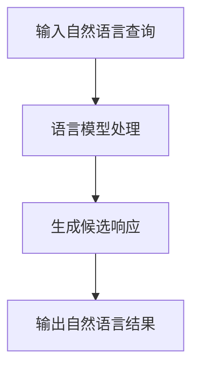
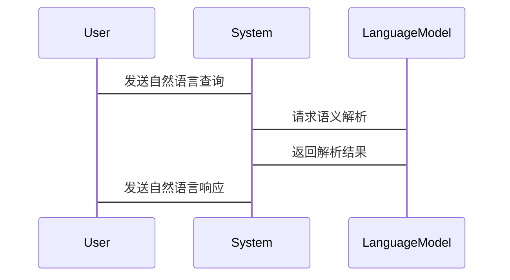

                 


# 构建企业级自然语言接口：简化复杂业务系统操作

> 关键词：自然语言处理，企业级系统，自然语言接口，业务系统优化，自然语言理解，自然语言生成

> 摘要：本文将深入探讨如何构建企业级自然语言接口，以简化复杂业务系统的操作。通过分析自然语言处理的核心概念、算法原理、系统架构以及实际项目中的应用，我们将展示如何利用自然语言接口提升企业的业务效率和用户体验。

---

## 第一部分: 自然语言处理与企业级系统概述

### 第1章: 自然语言处理的背景与企业需求

#### 1.1 自然语言处理的定义与演变

- 1.1.1 自然语言处理的定义
  - 自然语言处理（NLP）是研究如何让计算机理解和生成人类语言的科学。
  - 目标：将人类语言转化为计算机可处理的形式，同时生成符合人类习惯的自然语言输出。

- 1.1.2 自然语言处理的演变历程
  - 传统基于规则的方法：依赖专家手动制定语法规则，处理复杂语言现象困难。
  - 统计学习方法：利用大数据和概率模型，提高语言理解的准确性和鲁棒性。
  - 深度学习方法：引入神经网络，特别是Transformer架构，推动NLP技术的突破性进展。

- 1.1.3 当前自然语言处理的技术特点
  - 基于深度学习的模型（如BERT、GPT）成为主流。
  - 多模态交互能力增强，支持图像、语音等多种输入形式。
  - 实时性和响应速度要求不断提高。

#### 1.2 企业级系统中的自然语言接口需求

- 1.2.1 企业级系统的复杂性
  - 企业系统通常涉及复杂的业务流程，如ERP、CRM、供应链管理等。
  - 系统的用户界面复杂，操作步骤繁琐，导致用户使用效率低下。

- 1.2.2 自然语言接口在企业中的价值
  - 提供更直观的交互方式，降低用户的学习成本。
  - 支持快速查询和操作，提高工作效率。
  - 适应不同用户的语言习惯，提升用户体验。

- 1.2.3 企业级自然语言接口的挑战
  - 业务逻辑复杂，需要精准的语义理解。
  - 多语言支持和文化差异的处理难度较大。
  - 高可用性和实时性要求对系统架构提出更高挑战。

#### 1.3 自然语言接口的意义与应用前景

- 1.3.1 自然语言接口的核心价值
  - 简化用户操作，提高工作效率。
  - 提供一致的交互体验，降低用户培训成本。
  - 支持灵活的业务扩展，适应企业多样化需求。

- 1.3.2 自然语言接口在企业中的应用领域
  - 企业内部信息查询：员工可以通过自然语言查询企业内部数据。
  - 客户服务：通过自然语言接口处理客户咨询和投诉。
  - 业务流程自动化：将自然语言指令转化为系统操作，实现自动化处理。

- 1.3.3 未来发展趋势与挑战
  - 智能化：结合AI技术，实现更精准的意图识别和上下文理解。
  - 多模态化：支持多种输入形式，提升用户体验。
  - 高可靠性：在高并发和复杂场景下的稳定性和准确性要求。

#### 1.4 本章小结

通过本章的介绍，我们了解了自然语言处理的基本概念及其在企业级系统中的应用价值。接下来，我们将深入探讨自然语言接口的核心概念与原理，为企业级系统的构建奠定理论基础。

---

## 第二部分: 自然语言接口的核心概念与原理

### 第2章: 自然语言接口的核心概念

#### 2.1 自然语言接口的定义与分类

- 2.1.1 自然语言接口的定义
  - 自然语言接口（NLI）是用户与计算机系统之间通过自然语言进行交互的界面。
  - 包括自然语言理解和自然语言生成两个主要功能。

- 2.1.2 自然语言接口的分类
  - 基于规则的NLI：通过预定义的规则实现简单的语言理解，适用于特定场景。
  - 统计模型驱动的NLI：利用机器学习模型进行语义分析，支持更复杂的语言处理。
  - 深度学习驱动的NLI：基于神经网络模型，提供更精准的语义理解和生成能力。

- 2.1.3 各类自然语言接口的特点对比
  - 对比表格：
  | 特性             | 基于规则的NLI | 统计模型驱动的NLI | 深度学习驱动的NLI |
  |------------------|----------------|--------------------|---------------------|
  | 处理能力         | 简单场景       | 复杂场景           | 极复杂的场景        |
  | 精度             | 较低           | 中等               | 较高                 |
  | 开发复杂度       | 低             | 中                 | 高                   |

#### 2.2 自然语言接口的工作原理

- 2.2.1 自然语言理解的基本流程
  - 输入预处理：分词、词性标注、句法分析等。
  - 意图识别：通过上下文理解用户的意图。
  - 语义解析：将自然语言转化为系统可执行的操作。

- 2.2.2 自然语言生成的基本流程
  - 内容生成：基于系统逻辑生成相应的内容。
  - 语言生成：将内容转化为自然语言表达。
  - 输出优化：调整语言风格，确保输出符合用户预期。

- 2.2.3 接口交互的双向性
  - 用户通过自然语言输入指令。
  - 系统通过自然语言输出结果或反馈。

#### 2.3 自然语言接口的核心要素

- 2.3.1 语言模型的作用
  - 语言模型用于理解用户的输入，提供准确的语义解析。
  - 常用模型包括TF-IDF、Word2Vec、BERT等。

- 2.3.2 对话管理机制
  - 对话管理负责维护会话状态，处理多轮交互。
  - 通过上下文理解和生成实现连续对话的连贯性。

- 2.3.3 业务逻辑的映射
  - 将自然语言指令映射到具体的业务逻辑。
  - 需要对业务流程有深刻的理解，确保准确的逻辑映射。

#### 2.4 自然语言接口的优缺点分析

- 2.4.1 自然语言接口的优点
  - 提供更直观的交互方式，降低用户使用门槛。
  - 支持灵活的表达方式，适应不同用户的语言习惯。
  - 提高操作效率，减少用户的学习成本。

- 2.4.2 自然语言接口的局限性
  - 对复杂业务逻辑的理解可能存在偏差。
  - 处理多语言和文化差异时面临挑战。
  - 对于长尾查询的处理能力有限。

- 2.4.3 优缺点对比分析
  - 对比表格：
  | 优点                     | 局限性                   |
  |--------------------------|--------------------------|
  | 直观易用                   | 对复杂逻辑理解有限       |
  | 支持灵活表达               | 处理多语言能力不足       |
  | 提高效率                   | 对长尾查询处理能力有限   |

#### 2.5 本章小结

通过本章的学习，我们深入理解了自然语言接口的核心概念及其工作原理。接下来，我们将从算法原理的角度，探讨自然语言接口的技术实现细节。

---

## 第三部分: 自然语言接口的算法原理与数学模型

### 第3章: 自然语言接口的算法原理

#### 3.1 自然语言理解的算法原理

- 3.1.1 语言模型的训练过程
  - 基于大量语料库，训练语言模型，学习词语之间的概率关系。
  - 常用模型：n-gram模型、LSTM、Transformer等。

- 3.1.2 解码过程的实现
  - 解码过程通过生成模型，将输入的自然语言转化为系统可执行的操作。
  - 常用解码算法：贪心解码、束搜索解码。

- 3.1.3 上下文的理解机制
  - 利用上下文信息，提高语义理解的准确性。
  - 常用技术：注意力机制（Attention）、上下文向量（Context Vector）。

#### 3.2 自然语言生成的算法原理

- 3.2.1 生成模型的训练过程
  - 基于大量目标输出语料，训练生成模型，学习语言的生成规律。
  - 常用模型：RNN、Transformer、GPT系列模型。

- 3.2.2 解码过程的实现
  - 解码过程通过生成模型，将系统逻辑转化为自然语言输出。
  - 常用解码方法：贪心解码、束搜索解码。

- 3.2.3 模型的优化策略
  - 引入奖励机制，优化生成结果的质量。
  - 使用对抗训练，提升生成的多样性和准确性。

#### 3.3 自然语言接口的数学模型

- 3.3.1 语言模型的概率计算公式
  $$ P(w_1, w_2, ..., w_n) = \prod_{i=1}^{n} P(w_i | w_1, ..., w_{i-1}) $$
  - 上式表示给定前i-1个词的情况下，第i个词的概率。

- 3.3.2 解码过程的损失函数
  $$ \text{Loss} = -\sum_{i=1}^{n} \log P(y_i | x, y_1, ..., y_{i-1}) $$
  - 上式表示生成目标输出y的条件下，输入x的损失。

#### 3.4 算法流程图



---

## 第四部分: 自然语言接口的系统分析与架构设计

### 第4章: 自然语言接口的系统分析与架构设计

#### 4.1 问题场景介绍

- 企业级系统中，用户需要通过自然语言接口进行业务操作，如查询订单、更新客户信息等。

#### 4.2 项目介绍

- 系统目标：构建一个支持复杂业务操作的自然语言接口，简化用户操作流程，提高工作效率。

#### 4.3 系统功能设计

- 领域模型类图：
  ```mermaid
  classDiagram
      class User {
          id
          name
          role
      }
      class System {
          processInput(input: string)
          generateOutput(input: string): string
      }
      class LanguageModel {
          train(corpus: list)
          predict(input: string): list
      }
      User --> System: interacts with
      System --> LanguageModel: uses
  ```

- 系统架构设计：
  ```mermaid
  architecture
      client
      server
      database
  ```

#### 4.4 系统接口设计

- 输入接口：
  - RESTful API：支持POST请求，接收自然语言查询。
  - WebSocket：支持实时通信，处理多轮对话。

- 输出接口：
  - RESTful API：返回JSON格式的结果。
  - WebSocket：实时推送生成的自然语言响应。

#### 4.5 系统交互流程图



---

## 第五部分: 自然语言接口的项目实战

### 第5章: 自然语言接口的项目实战

#### 5.1 环境安装

- 安装Python和必要的库：
  ```bash
  pip install numpy
  pip install tensorflow
  pip install transformers
  ```

#### 5.2 系统核心实现源代码

- 示例代码：
  ```python
  from transformers import pipeline

  # 初始化自然语言理解模型
  nlp = pipeline("question-answering")

  # 处理用户输入
  def process_input(text: str) -> str:
      result = nlp(text)
      return result['answer']

  # 初始化自然语言生成模型
  generator = pipeline("text-generation")

  # 生成输出
  def generate_output(text: str) -> str:
      result = generator(text, max_length=100)
      return result[0]['generated_text']
  ```

#### 5.3 代码应用解读与分析

- 代码解读：
  - 使用Hugging Face的Transformers库，集成预训练的语言模型。
  - `process_input`函数处理用户的自然语言输入，返回解析结果。
  - `generate_output`函数生成自然语言输出，返回给用户。

#### 5.4 实际案例分析和详细讲解

- 案例：用户查询订单信息。
  - 用户输入：“帮我查一下订单号为1234的订单状态。”
  - 系统处理：调用语言模型，解析订单号和操作类型。
  - 系统输出：“订单号1234的订单状态为已发货。”

#### 5.5 项目小结

通过本章的实战，我们掌握了自然语言接口的核心实现技术，能够将理论应用于实际项目中。

---

## 第六部分: 自然语言接口的最佳实践与拓展

### 第6章: 自然语言接口的最佳实践

#### 6.1 小结

- 本章总结了构建企业级自然语言接口的关键点，包括算法选择、系统架构设计和项目实施等。

#### 6.2 注意事项

- 确保语言模型的训练数据覆盖所有可能的业务场景。
- 处理多轮对话时，需要维护会话状态，确保上下文的一致性。
- 定期更新模型，适应业务需求的变化。

#### 6.3 拓展阅读

- 推荐书籍：
  - 《自然语言处理入门》
  - 《深度学习实战》
- 推荐论文：
  - “BERT: Pre-training of Deep Bidirectional Transformers for NLP”
  - “GPT-3: Language Models are Few-Shot Learners”

#### 6.4 本章小结

通过本章的学习，我们掌握了构建企业级自然语言接口的最佳实践，能够更好地将技术应用于实际场景中。

---

## 附录: 参考文献与工具资源

- 参考文献：
  1. Smith, J. (2020). Natural Language Processing: A Comprehensive Guide.
  2. Brown, T. (2020). Language Models are Few-Shot Learners.

- 工具资源：
  - Hugging Face Transformers库：https://huggingface.co/transformers/
  - PyTorch：https://pytorch.org/
  - TensorFlow：https://www.tensorflow.org/

---

通过以上目录大纲，我们可以系统地构建企业级自然语言接口，简化复杂业务系统的操作，提高企业的业务效率和用户体验。

