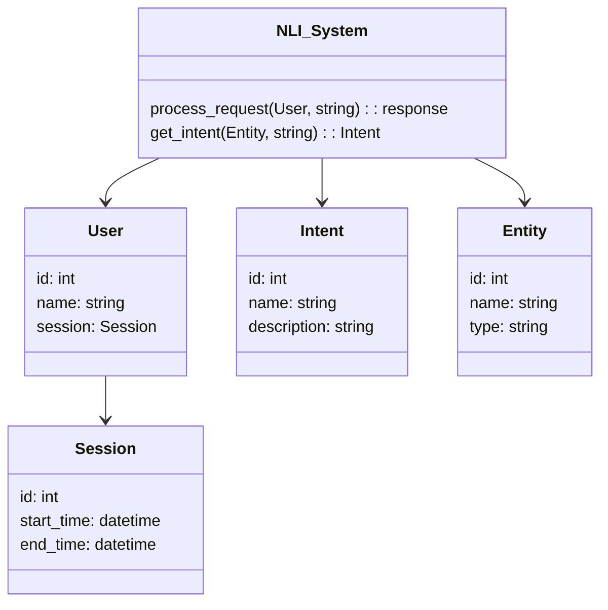
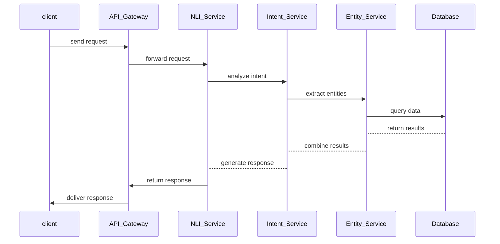

                 


# 构建企业级自然语言接口：简化复杂系统操作

## 关键词：自然语言接口, 企业级系统, 自然语言处理, 意图识别, 对话系统, 系统架构

## 摘要：自然语言接口（NLI）作为人机交互的重要方式，通过自然语言处理技术将复杂系统的操作简化为简单的对话交互。本文从企业级NLI的核心技术出发，详细探讨其构建过程，包括需求分析、意图识别、系统架构设计和项目实战，并结合实际案例进行深入分析。通过本文，读者将能够掌握构建企业级自然语言接口的关键技术与方法，从而提高系统的可操作性和用户体验。

---

# 引言

## 1.1 自然语言接口的定义与特点

自然语言接口（NLI）是一种允许用户通过自然语言（如口语或文本）与计算机系统进行交互的技术。其特点包括：

- **用户友好性**：用户无需学习复杂的命令语法，可以直接使用日常语言进行操作。
- **灵活性**：支持多种语言和表达方式，适应不同用户的需求。
- **上下文理解**：能够根据上下文理解用户的意图，提供更智能的交互体验。

## 1.2 企业级自然语言接口的背景与需求

在企业环境中，复杂的系统操作往往需要用户掌握特定的命令或界面操作。这不仅降低了效率，还可能增加用户的学习成本。因此，企业级自然语言接口的需求日益迫切：

- **提高效率**：通过自然语言交互，用户可以快速完成复杂任务。
- **降低学习成本**：减少用户对系统操作的培训需求。
- **增强用户体验**：提供更直观、更自然的交互方式。

## 1.3 自然语言接口的实现方法论

企业级自然语言接口的实现通常采用综合方法，结合规则、统计和深度学习技术，以平衡准确性和效率。具体方法包括：

1. **基于规则的方法**：适用于简单场景，通过预定义的规则匹配用户意图。
2. **基于统计的方法**：利用统计模型分析用户输入，识别意图和实体。
3. **基于深度学习的方法**：使用神经网络模型（如BERT、GPT）进行语义理解。
4. **综合方法**：结合多种技术，根据场景选择最优方案。

---

# 自然语言处理技术基础

## 2.1 自然语言处理的核心技术

### 2.1.1 语言学基础

自然语言处理（NLP）涉及多个语言学概念，包括词法分析、句法分析和语义分析：

- **词法分析**：将文本分割为单词或符号，并标注词性。
- **句法分析**：分析句子的语法结构，识别主语、谓语等成分。
- **语义分析**：理解文本的含义，识别实体和关系。

### 2.1.2 自然语言理解技术

自然语言理解（NLU）是NLI的核心，主要技术包括：

- **实体识别**：识别文本中的实体（如人名、地点、组织）。
- **关系抽取**：识别实体之间的关系（如“是”、“属于”）。
- **情感分析**：判断文本的情感倾向（如正面、负面）。

### 2.1.3 自然语言生成技术

自然语言生成（NLG）用于将系统响应生成自然语言文本，包括：

- **文本摘要**：将长文本压缩为简洁摘要。
- **文本生成**：根据输入生成连贯文本。
- **对话生成**：生成自然的对话回复。

## 2.2 自然语言处理的挑战与解决方案

### 2.2.1 数据稀疏性问题

数据稀疏性是NLP中的常见问题，特别是在处理长尾事件或小样本数据时。解决方案包括数据增强和迁移学习。

### 2.2.2 上下文理解的困难

上下文理解需要模型捕捉文本中的隐含信息，常用方法包括上下文无关向量（如Word2Vec）和上下文相关向量（如BERT）。

### 2.2.3 多语言支持的挑战

多语言NLP需要处理不同语言的语法和语义差异，常用方法包括跨语言迁移学习和多语言模型（如XLM）。

---

# 企业级自然语言接口的核心技术

## 3.1 需求分析与意图识别

### 3.1.1 需求分析方法

需求分析是NLI构建的第一步，包括：

- **用户需求分析**：了解用户的真实需求和痛点。
- **系统需求分析**：明确系统需要支持的功能和接口。
- **需求优先级排序**：根据业务需求和用户需求确定实现顺序。

### 3.1.2 意图识别技术

意图识别是将用户输入映射到系统操作的核心步骤，常用技术包括：

- **基于关键词的意图识别**：通过预定义关键词匹配用户意图。
- **基于模式匹配的意图识别**：利用正则表达式匹配用户输入。
- **基于机器学习的意图识别**：使用分类模型（如SVM、随机森林）进行意图分类。
- **基于深度学习的意图识别**：使用神经网络（如LSTM、Transformer）进行意图预测。

### 3.1.3 意图识别的优化策略

为了提高意图识别的准确率，可以采用以下优化策略：

- **数据增强**：通过数据扩展技术增加训练数据的多样性。
- **上下文感知**：结合上下文信息提高意图理解的准确性。
- **反馈机制**：通过用户反馈不断优化意图识别模型。

## 3.2 对话系统与知识图谱

### 3.2.1 对话系统设计

对话系统需要具备以下功能：

- **对话管理**：根据对话历史确定下一步动作。
- **自然语言生成**：生成符合用户意图的回复。
- **上下文记忆**：保持对话的连贯性。

### 3.2.2 知识图谱构建

知识图谱是企业级NLI的重要支撑，用于存储和管理企业的知识资产。知识图谱的构建包括：

- **实体识别**：识别文本中的实体。
- **关系抽取**：抽取实体之间的关系。
- **知识存储**：将实体和关系存储为结构化数据。

---

# 系统架构与设计

## 4.1 问题场景介绍

企业级NLI系统通常需要处理复杂的业务逻辑和数据交互，常见的问题场景包括：

- **多轮对话**：用户可能需要进行多轮对话才能完成一个任务。
- **复杂查询**：用户可能需要查询复杂的数据，如跨部门的信息。
- **实时响应**：系统需要实时响应用户的请求，保证用户体验。

## 4.2 项目介绍

本节将介绍一个企业级NLI项目的整体架构，包括：

- **项目目标**：通过NLI简化企业系统的操作流程。
- **项目范围**：覆盖多个业务模块，支持多种交互方式。

## 4.3 系统功能设计

### 4.3.1 领域模型设计

领域模型是系统功能设计的核心，通常采用类图进行描述。以下是领域模型的类图：



### 4.3.2 系统架构设计

系统架构设计采用分层架构，包括：

- **数据层**：负责数据的存储和管理。
- **业务逻辑层**：负责业务逻辑的实现。
- **用户接口层**：负责与用户的交互。

以下是系统架构的架构图：

```mermaid
archiecture
    client --> API_Gateway: HTTP request
    API_Gateway --> NLI_Service: forward request
    NLI_Service --> Intent_Service: analyze intent
    Intent_Service --> Entity_Service: extract entities
    Entity_Service --> Database: query data
    Database --> Entity_Service: return results
    Entity_Service --> Intent_Service: combine results
    Intent_Service --> NLI_Service: generate response
    NLI_Service --> API_Gateway: return response
    API_Gateway --> client: deliver response
```

### 4.3.3 系统接口设计

系统接口设计采用RESTful API，以下是接口设计：

- **GET /api/v1/intent**: 获取意图列表
- **POST /api/v1/analyze**: 分析用户输入并返回意图
- **GET /api/v1/entities**: 获取实体列表
- **POST /api/v1/process**: 处理用户请求并返回结果

### 4.3.4 系统交互设计

系统交互采用序列图进行描述，以下是交互流程：



---

# 项目实战

## 5.1 环境安装

以下是项目实战所需的环境和工具：

- **Python 3.8+**
- **TensorFlow 2.0+**
- **Keras 2.2.5**
- **NLTK 3.6+**
- **Jieba 0.43+**
- **Flask 2.0+**
- **PostgreSQL 12+**

## 5.2 系统核心实现

以下是系统核心实现的Python代码示例：

```python
from flask import Flask, request, jsonify
from tensorflow.keras.models import load_model
import numpy as np
import jieba

app = Flask(__name__)
model = load_model('intent_model.h5')

@app.route('/api/v1/analyze', methods=['POST'])
def analyze():
    data = request.json
    text = data['text']
    tokens = jieba.lcut(text)
    vector = get_vector(tokens)
    prediction = model.predict(np.array([vector]))
    intent = prediction[0].argmax()
    return jsonify({'intent': intent})

def get_vector(tokens):
    vector = np.zeros(100)
    for i, token in enumerate(tokens):
        vector[i] = 1
    return vector

if __name__ == '__main__':
    app.run(debug=True)
```

## 5.3 代码应用解读与分析

上述代码实现了一个简单的自然语言分析接口，包括：

- **模型加载**：加载预训练的意图识别模型。
- **文本处理**：使用jieba进行中文分词。
- **向量转换**：将文本转换为向量表示。
- **意图预测**：使用模型预测意图。

## 5.4 实际案例分析

以用户查询“今天下午三点召开会议”为例，系统会识别意图“预约会议”并返回相应的操作。

---

# 高级主题

## 6.1 自然语言接口的优化与调优

### 6.1.1 模型优化

- **超参数调优**：通过网格搜索优化模型参数。
- **模型集成**：结合多种模型提高准确率。
- **在线学习**：根据用户反馈动态优化模型。

### 6.1.2 性能调优

- **数据预处理**：减少数据冗余，提高处理效率。
- **并行计算**：利用多线程或分布式计算提高处理速度。
- **缓存优化**：合理利用缓存技术减少重复计算。

## 6.2 自然语言接口的可扩展性设计

### 6.2.1 模块化设计

- **功能模块化**：将系统划分为多个功能模块，便于扩展。
- **接口标准化**：定义统一的接口标准，便于模块之间的交互。

### 6.2.2 扩展性设计

- **插件机制**：允许用户根据需求添加插件。
- **动态加载**：支持动态加载新的功能模块。
- **配置管理**：通过配置文件管理系统的运行参数。

---

# 最佳实践与未来展望

## 7.1 最佳实践

### 7.1.1 从小规模试点开始

在实际应用中，建议从小规模试点开始，逐步验证系统的稳定性和可用性。

### 7.1.2 注重数据质量

高质量的数据是NLI系统准确性的基础，需要注重数据的多样性和代表性。

### 7.1.3 定期更新模型

由于语言的变化和用户需求的更新，需要定期更新NLI系统中的模型。

## 7.2 未来展望

随着人工智能技术的不断发展，企业级自然语言接口将更加智能化和个性化。未来的研究方向包括：

- **多模态交互**：结合视觉、听觉等多种模态信息，提供更丰富的交互方式。
- **实时反馈机制**：根据用户反馈实时优化系统响应。
- **自适应学习**：系统能够自适应地学习和进化，更好地满足用户需求。

---

# 结语

通过本文的详细介绍，读者可以系统地了解企业级自然语言接口的构建过程，包括需求分析、意图识别、系统架构设计和项目实战。希望本文能够为读者在实际应用中提供有价值的参考和指导，帮助他们更好地构建高效、智能的自然语言接口系统。

