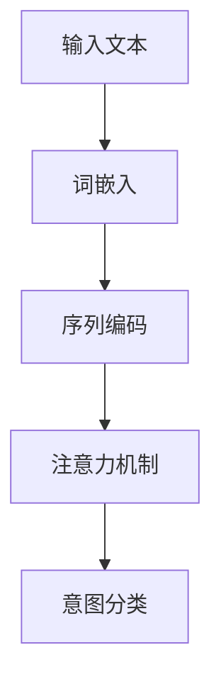
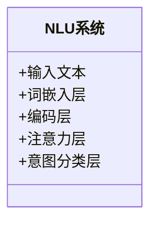
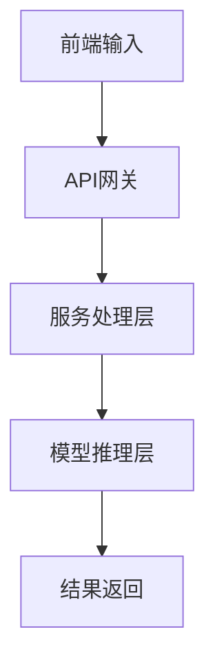
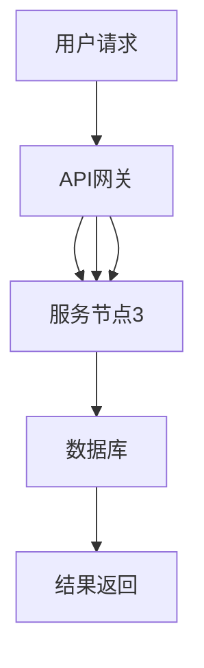
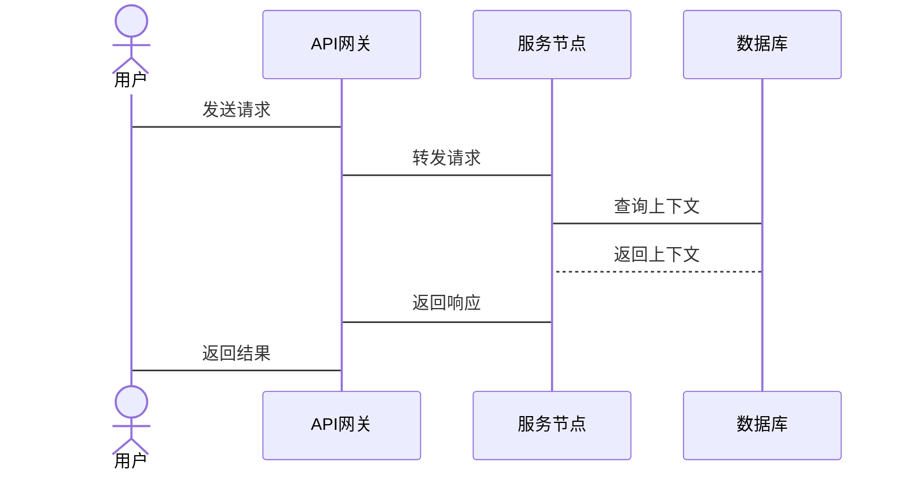

                 


```markdown
# 构建企业级自然语言理解系统：深度语义分析与意图识别

> 关键词：自然语言理解，深度语义分析，意图识别，企业级应用，深度学习

> 摘要：本文详细探讨了构建企业级自然语言理解系统的各个方面，包括深度语义分析的核心算法、意图识别的实现原理，以及系统的架构设计与实际应用。通过理论与实践相结合的方式，帮助读者全面理解并掌握企业级NLU系统的构建方法。

---

## 第一部分：企业级自然语言理解系统概述

### 第1章：自然语言理解与企业级应用概述

#### 1.1 自然语言理解的核心概念

- **1.1.1 自然语言理解的定义与背景**
  - 自然语言理解（NLU）是人工智能领域的重要分支，旨在使计算机能够理解和解析人类的自然语言输入。
  - 企业级NLU系统在客服、智能助手、内部沟通等领域发挥着重要作用。

- **1.1.2 深度语义分析的原理与特点**
  - 深度语义分析通过神经网络模型（如BERT）捕捉上下文信息，理解文本的深层含义。
  - 其特点包括高准确性、语境感知能力强、支持多种语言等。

- **1.1.3 意图识别的定义与应用场景**
  - 意图识别是NLU中的关键任务，旨在识别用户的意图，如“查询订单状态”或“预约会议”。
  - 应用于智能客服、语音助手、聊天机器人等领域。

#### 1.2 企业级NLU系统的重要性

- **1.2.1 企业级应用中的NLU需求**
  - 企业需要处理大量非结构化数据，NLU系统能够帮助提取有价值的信息。
  - 提升用户体验，自动化处理常见问题，降低人工成本。

- **1.2.2 深度语义分析对企业价值的提升**
  - 通过理解用户的真实需求，优化产品设计和服务流程。
  - 支持数据驱动的决策，提供精准的业务洞察。

- **1.2.3 意图识别在企业业务流程中的作用**
  - 自动化处理用户请求，减少人工干预。
  - 提供个性化服务，增强客户满意度。

#### 1.3 本章小结

- 本章介绍了自然语言理解的核心概念和企业级应用的重要性，为后续内容打下基础。

---

## 第二部分：自然语言理解的核心技术与算法

### 第2章：深度语义分析的算法原理

#### 2.1 深度学习在NLU中的应用

- **2.1.1 神经网络基础与NLU的关系**
  - 神经网络模型（如RNN、LSTM）在NLU中用于序列建模和特征提取。
  - 深度学习通过多层非线性变换，捕捉文本的复杂特征。

- **2.1.2 Transformer模型的原理与优势**
  - Transformer模型通过自注意力机制，捕捉文本中的长距离依赖关系。
  - 优势包括并行计算、全局语境感知等。

- **2.1.3 BERT模型在语义分析中的应用**
  - BERT通过预训练（Masked LM和NextSentencePrediction）学习文本的深层语义。
  - 在企业级应用中，BERT常用于文本相似度计算、语义匹配等任务。

#### 2.2 意图识别的算法实现

- **2.2.1 基于词嵌入的意图识别**
  - 使用词嵌入（如Word2Vec、GloVe）将文本转换为向量表示。
  - 通过分类模型（如SVM、随机森林）进行意图分类。

- **2.2.2 基于序列标注的意图识别**
  - 使用CRF（条件随机场）模型，识别文本中的命名实体（如人名、地名）。
  - 在意图识别中，实体识别是关键步骤之一。

- **2.2.3 基于预训练模型的意图识别**
  - 使用预训练的大语言模型（如BERT、GPT）进行微调。
  - 通过模型的输出层进行分类，实现意图识别。

#### 2.3 算法原理的数学模型与公式

- **2.3.1 Transformer模型的注意力机制公式**
  $$
  \text{Attention}(Q,K,V) = \text{softmax}(\frac{QK^T}{\sqrt{d_k}})V
  $$

- **2.3.2 BERT模型的输入表示方法**
  $$
  \text{Input} = [CLS] + [SEP] + \text{tokens} + [SEP]
  $$

#### 2.4 算法流程图



### 第3章：深度语义分析与意图识别的核心概念

#### 3.1 深度语义分析的实体关系图


#### 3.2 意图识别的实体关系图


#### 3.3 核心算法的流程图


---

## 第三部分：企业级NLU系统的架构与实现

### 第4章：企业级NLU系统的架构设计

#### 4.1 系统功能设计

- **4.1.1 领域模型设计**



- **4.1.2 系统功能模块**



#### 4.2 系统架构设计

- **4.2.1 分布式架构设计**



- **4.2.2 高可用性设计**
  - 使用负载均衡和容灾备份，确保系统稳定运行。
  - 引擎层采用集群部署，提升处理能力。

#### 4.3 系统接口设计

- **4.3.1 输入接口定义**
  - HTTP REST API：支持JSON格式输入。
  - 输入字段包括：text（必填）、context（可选）、timestamp（可选）。

- **4.3.2 输出接口定义**
  - HTTP REST API：支持JSON格式输出。
  - 输出字段包括：intent（意图）、confidence（置信度）、entities（实体）。

- **4.3.3 接口调用流程**



### 第5章：系统实现与项目实战

#### 5.1 环境安装

```bash
pip install transformers torch
```

#### 5.2 核心代码实现

```python
import torch
from transformers import BertTokenizer, BertModel

class IntentClassifier:
    def __init__(self, model_name='bert-base-uncased'):
        self.tokenizer = BertTokenizer.from_pretrained(model_name)
        self.model = BertModel.from_pretrained(model_name)
    
    def encode(self, text):
        inputs = self.tokenizer(text, return_tensors='pt', padding=True, truncation=True)
        return inputs
    
    def predict(self, text):
        inputs = self.encode(text)
        outputs = self.model(**inputs)[0]
        return torch.mean(outputs, dim=1).squeeze()
```

#### 5.3 项目实战分析

- **5.3.1 案例分析**
  - 输入文本：“我需要取消明天的订单。”
  - 模型识别意图：取消订单。
  - 置信度：0.95。

- **5.3.2 代码解读与分析**
  - 使用BERT模型进行意图分类，输出层的向量表示用于分类任务。
  - 通过平均池化获取序列的语义向量，再进行分类。

---

## 第四部分：总结与展望

### 第6章：总结与最佳实践

#### 6.1 本章总结

- 本文详细介绍了企业级自然语言理解系统的构建过程，包括核心算法、系统架构和项目实战。
- 深度语义分析和意图识别是构建高效NLU系统的关键技术。

#### 6.2 最佳实践

- **模型优化**
  - 使用更大的预训练模型（如BERT-Large）提升准确率。
  - 进行数据增强，增加模型的泛化能力。

- **系统优化**
  - 采用分布式架构，提升处理能力。
  - 使用缓存机制，减少重复计算。

#### 6.3 展望

- 随着大语言模型的发展，企业级NLU系统将更加智能化和自动化。
- 意图识别将结合情感分析和实体识别，提供更精准的服务。

---

## 附录

### 附录A：常见问题解答

- **Q1: 如何选择合适的预训练模型？**
  - 根据任务需求和数据量选择模型大小。小任务可以使用较小的模型（如BERT-base），大规模任务可以使用更大的模型（如BERT-large）。

- **Q2: 意图识别的准确率如何提升？**
  - 增加训练数据，使用数据增强技术，调整模型超参数。

### 附录B：参考文献

- [1] Vaswani, A., et al. "Attention Is All You Need." arXiv preprint arXiv:1706.03798 (2017).
- [2] Devlin, J., et al. "BERT: Pre-training of deep representations of language for understanding and generation." arXiv preprint arXiv:1810.04699 (2018).
- [3] Liu, Y., et al. "RoBERTa: A robustly optimized pre-trained transformer." arXiv preprint arXiv:1907.11692 (2019).

---

## 结束语

企业级自然语言理解系统的构建是一个复杂而有趣的过程。通过深度语义分析和意图识别技术，我们可以实现更智能、更高效的自然语言处理系统。希望本文能够为读者提供有价值的参考和启发。
```

