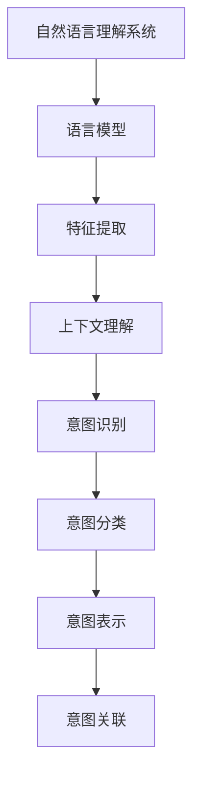
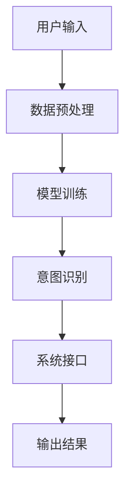

                 


# 构建企业级自然语言理解系统：跨语言语义理解与意图识别

## 关键词：自然语言处理，跨语言语义理解，意图识别，企业级系统，NLU系统，机器学习

## 摘要：本文详细探讨了构建企业级自然语言理解系统的各个方面，包括跨语言语义理解与意图识别的核心概念、算法原理、系统架构及项目实战。文章从背景介绍、核心概念对比、算法模型选择、系统架构设计到实际项目实现，全面分析了如何构建高效可靠的自然语言理解系统，为企业级应用提供理论支持与实践指导。

---

# 第一部分：自然语言理解系统概述

## 第1章：自然语言理解系统背景与挑战

### 1.1 自然语言理解的定义与核心概念

#### 1.1.1 自然语言理解的定义
自然语言理解（Natural Language Understanding, NLU）是自然语言处理（NLP）的重要分支，旨在让计算机能够理解人类语言的语义和意图。NLU的目标是将自然语言文本转换为计算机可处理的结构化信息。

#### 1.1.2 自然语言理解的核心概念
- **语义分析**：识别文本中词语的含义及其组合的语义关系。
- **上下文理解**：理解文本中词语的上下文含义，尤其是处理歧义和多义词。
- **意图识别**：从文本中提取用户的意图或目标。

#### 1.1.3 问题背景与问题描述
随着企业级应用的需求增加，NLU系统需要处理多种语言和复杂的语义场景。跨语言语义理解的需求日益增长，尤其是在全球化背景下，企业需要支持多语言的客户服务、内容推荐和信息检索。

### 1.2 跨语言语义理解的挑战

#### 1.2.1 跨语言语义理解的定义
跨语言语义理解是指在不同语言之间理解文本的语义，实现语言间的语义对齐和信息转换。

#### 1.2.2 跨语言语义理解的关键问题
- **语言差异**：不同语言的语法结构和词汇差异可能导致语义理解的困难。
- **数据稀缺性**：跨语言数据往往不足，影响模型的训练效果。
- **文化差异**：不同语言背后的文化背景可能影响语义的理解。

#### 1.2.3 跨语言语义理解的应用场景
- **多语言客服系统**：支持多种语言的客户咨询和问题解答。
- **跨语言信息检索**：在不同语言间检索相关信息。
- **全球化内容管理**：管理多语言的内容，如新闻、产品描述等。

### 1.3 意图识别的核心挑战

#### 1.3.1 意图识别的定义
意图识别是通过分析文本内容，识别用户表达的主要意图或目标。

#### 1.3.2 意图识别的关键问题
- **意图的多样性**：用户的意图可能非常多样化，需要覆盖广泛的意图类别。
- **上下文依赖性**：某些意图的理解依赖于上下文信息。
- **数据标注**：高质量的标注数据是意图识别模型训练的基础。

#### 1.3.3 意图识别的应用场景
- **智能客服**：识别用户的问题意图，提供针对性的解决方案。
- **语音助手**：识别用户的语音指令，执行相应的操作。
- **社交媒体分析**：分析用户的评论，识别其情感和意图。

### 1.4 企业级自然语言理解系统的建设目标

#### 1.4.1 企业级系统的定义
企业级自然语言理解系统是指为满足企业内部或外部用户需求，构建的高性能、高可靠的自然语言理解系统。

#### 1.4.2 企业级系统的建设目标
- **高准确性**：确保在不同语言和复杂语义场景下，系统能够准确理解用户的意图。
- **高可扩展性**：支持多种语言和多种应用场景的扩展。
- **高可靠性**：系统能够在高并发和复杂场景下稳定运行。

#### 1.4.3 企业级系统的边界与外延
- **边界**：系统仅处理自然语言理解相关任务，不涉及后续的业务逻辑处理。
- **外延**：系统可与企业现有的业务系统集成，提供语义理解和意图识别服务。

---

## 第2章：自然语言理解系统的核心概念

### 2.1 自然语言理解系统的构成要素

#### 2.1.1 语言模型
语言模型用于预测文本中的下一个词，常用于分词、句法分析等任务。

#### 2.1.2 特征提取
特征提取是将文本转换为数值表示的过程，常用的特征包括词向量、句向量和字符向量。

#### 2.1.3 上下文理解
上下文理解是通过分析文本的上下文信息，理解词语的含义和语境。

### 2.2 跨语言语义理解的关键要素

#### 2.2.1 跨语言特征提取
跨语言特征提取是指在不同语言间提取共通的特征，用于跨语言语义理解。

#### 2.2.2 跨语言语义对齐
跨语言语义对齐是指在不同语言间找到语义相似的词语或短语。

#### 2.2.3 跨语言迁移学习
跨语言迁移学习是指利用一种语言的模型知识，迁移到另一种语言的语义理解任务。

### 2.3 意图识别的核心要素

#### 2.3.1 意图分类
意图分类是将文本分类到预定义的意图类别中，如“查询订单状态”、“投诉”等。

#### 2.3.2 意图表示
意图表示是将意图转换为计算机可处理的表示形式，如向量或标签。

#### 2.3.3 意图关联
意图关联是指理解多个意图之间的关系，如用户的主意图和相关意图。

### 2.4 核心概念的对比与联系

#### 2.4.1 核心概念的对比表格

| 概念       | 描述                                                                 |
|------------|----------------------------------------------------------------------|
| 语言模型   | 预测文本中的下一个词，用于分词和句法分析。                           |
| 特征提取   | 将文本转换为数值表示，如词向量和句向量。                             |
| 上下文理解 | 分析文本的上下文信息，理解词语的含义和语境。                         |
| 跨语言对齐 | 在不同语言间找到语义相似的词语或短语。                               |
| 意图分类   | 将文本分类到预定义的意图类别中。                                     |

#### 2.4.2 实体关系图的 Mermaid 流程图



---

## 第3章：自然语言理解系统的算法原理

### 3.1 自然语言理解系统的核心算法

#### 3.1.1 基于传统机器学习的算法
- **TF-IDF**：用于关键词提取和文本相似性计算。
- **SVM**：支持向量机，常用于文本分类任务。

#### 3.1.2 基于深度学习的算法
- **RNN**：循环神经网络，用于序列数据的处理。
- **BERT**：基于变换器的模型，用于跨语言语义理解。
- **ALBERT**：优化的BERT模型，适用于大规模跨语言任务。

### 3.2 跨语言语义理解的算法原理

#### 3.2.1 跨语言特征提取的算法
- **多语言词嵌入**：使用多语言预训练模型，如MBERT，提取跨语言特征。
- **跨语言对齐**：使用对齐模型，如Cross-lingual Alignment，对齐不同语言的词语。

#### 3.2.2 跨语言迁移学习的算法
- **多任务学习**：在多种语言任务上联合训练模型。
- **领域适应**：将一种语言的模型迁移到另一种语言的任务。

### 3.3 意图识别的算法原理

#### 3.3.1 意图分类的算法
- **文本分类模型**：如SVM、随机森林和深度学习模型（如BERT）。
- **集成学习**：将多个模型的预测结果进行集成，提高准确率。

#### 3.3.2 意图表示的算法
- **向量表示**：将意图表示为向量，用于相似性计算。
- **标签表示**：将意图表示为标签，用于分类任务。

#### 3.3.3 意图关联的算法
- **关联规则挖掘**：发现意图之间的关联规则。
- **图结构表示**：将意图表示为图结构，用于关系推理。

### 3.4 算法的数学模型与公式

#### 3.4.1 BERT模型的数学公式
BERT模型通过自注意力机制（self-attention）捕捉文本中的全局依赖关系：

$$
\text{Attention}(Q, K, V) = \text{softmax}\left(\frac{QK^T}{\sqrt{d_k}}\right)V
$$

其中，$Q$ 是查询向量，$K$ 是键向量，$V$ 是值向量，$d_k$ 是键的维度。

#### 3.4.2 跨语言对齐的数学公式
跨语言对齐模型通过计算不同语言词向量的相似性，实现词语对齐：

$$
\text{similarity}(x, y) = \frac{x \cdot y}{\|x\| \|y\|}
$$

其中，$x$ 和 $y$ 分别是两种语言的词向量。

---

## 第4章：自然语言理解系统的系统架构

### 4.1 系统架构设计

#### 4.1.1 数据预处理
- **文本清洗**：去除噪声数据，如停用词和特殊符号。
- **分词与标注**：对文本进行分词和句法标注。

#### 4.1.2 模型训练
- **预训练模型**：使用预训练的BERT或ALBERT模型进行微调。
- **自定义模型**：根据具体任务需求，设计自定义模型。

#### 4.1.3 意图识别
- **意图分类**：使用训练好的模型对文本进行意图分类。
- **意图表示**：将意图表示为向量或标签。

#### 4.1.4 系统接口
- **RESTful API**：提供标准接口，供其他系统调用。
- **WebSocket**：支持实时通信，用于在线意图识别。

### 4.2 系统架构的 Mermaid 图



---

## 第5章：项目实战

### 5.1 环境安装

#### 5.1.1 安装 Python 和相关库
```bash
pip install python
pip install numpy
pip install tensorflow
pip install transformers
```

#### 5.1.2 安装 NLP 工具
```bash
pip install spacy
pip install pytorch
```

### 5.2 核心实现

#### 5.2.1 数据准备
```python
import pandas as pd
data = pd.read_csv('intent_data.csv')
```

#### 5.2.2 模型训练
```python
from transformers import BertTokenizer, BertForTokenClassification
tokenizer = BertTokenizer.from_pretrained('bert-base-multilingual')
model = BertForTokenClassification.from_pretrained('bert-base-multilingual')
model.train()
```

#### 5.2.3 意图识别
```python
def predict_intent(text):
    inputs = tokenizer(text, return_tensors='np')
    outputs = model(**inputs)
    return outputs
```

### 5.3 实际案例分析

#### 5.3.1 案例一：跨语言客服系统
- **输入**：用户发送一条中文查询。
- **处理**：系统将其翻译为英文，调用英文模型进行意图识别。
- **输出**：返回识别的意图和响应。

#### 5.3.2 案例二：多语言新闻分类
- **输入**：多语言新闻文本。
- **处理**：系统分别对每种语言的文本进行意图分类。
- **输出**：分类结果和标签。

### 5.4 项目总结

#### 5.4.1 项目成果
- 成功构建了一个跨语言意图识别系统。
- 系统支持多种语言和多种应用场景。

#### 5.4.2 经验与教训
- 数据质量对模型性能影响巨大。
- 跨语言迁移学习需要大量的跨语言数据支持。

---

## 第6章：总结与展望

### 6.1 总结
本文详细探讨了构建企业级自然语言理解系统的各个方面，包括跨语言语义理解与意图识别的核心概念、算法原理、系统架构及项目实战。通过理论分析和实际案例，展示了如何构建高效可靠的自然语言理解系统。

### 6.2 未来展望
未来，自然语言理解系统将朝着以下方向发展：
- 更强的跨语言能力。
- 更高的意图识别准确率。
- 更好的可解释性和透明度。

---

通过本文的分析和实践，读者可以深入了解如何构建企业级自然语言理解系统，并在实际应用中不断提升系统的性能和效果。

