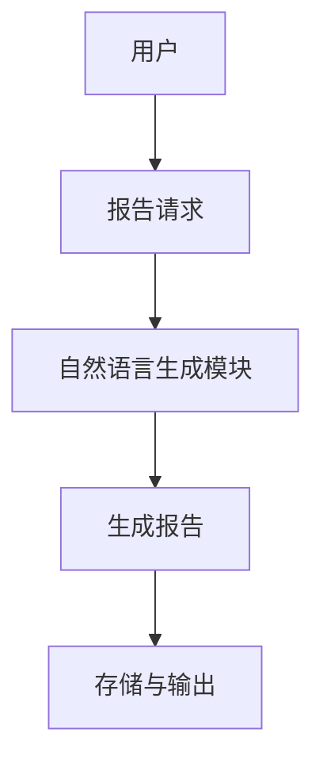
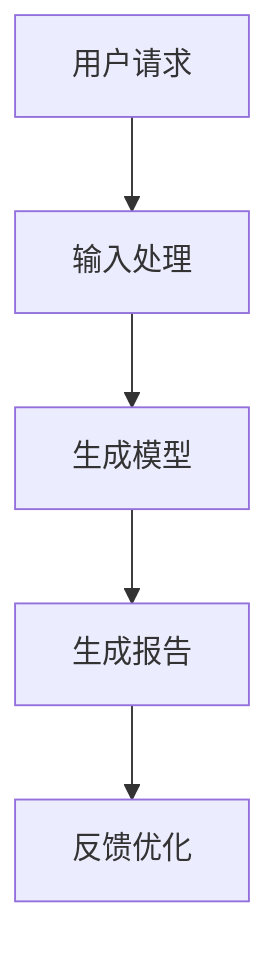
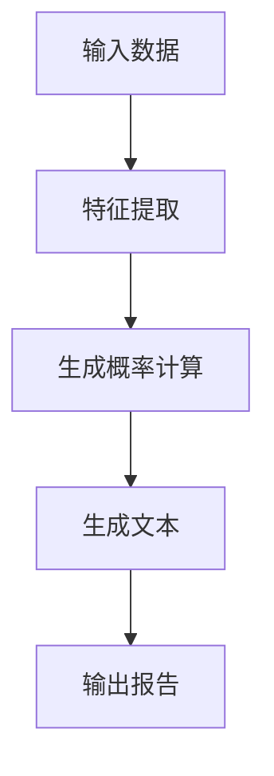
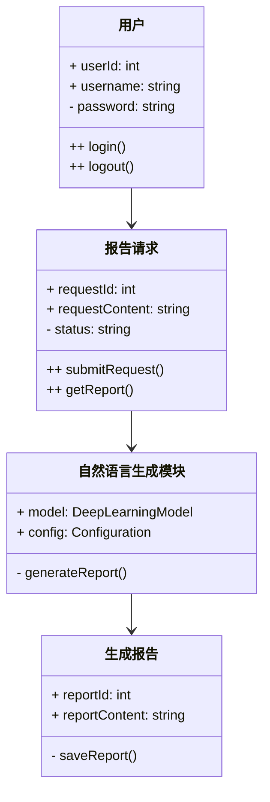
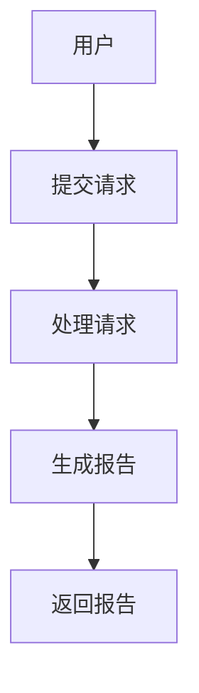

                 


# 构建企业级自然语言生成报告系统：自动化业务报告

> 关键词：自然语言生成（NLG），企业级系统，业务报告自动化，深度学习，自然语言处理（NLP）

> 摘要：本文详细探讨了如何构建一个企业级的自然语言生成报告系统，实现业务报告的自动化生成。文章从系统背景、核心概念、算法原理、系统架构到项目实战，全面分析了构建该系统的各个方面。通过实际案例和代码实现，帮助读者理解如何利用自然语言生成技术提升企业效率。

---

# 第一部分：系统背景与核心概念

## 第1章：企业级自然语言生成报告系统背景介绍

### 1.1 问题背景与描述

在企业信息化建设中，业务报告的生成是一个耗时且繁琐的过程。传统的报告生成方式依赖于人工整理数据、编写内容，不仅效率低下，而且容易出错。随着企业规模的扩大和数据量的激增，传统的报告生成方式已经无法满足企业的需求。

自然语言生成（NLG）技术的出现，为企业提供了自动化的解决方案。通过NLG技术，系统可以根据结构化数据自动生成高质量的自然语言报告，显著提高了效率并降低了成本。

### 1.2 问题解决与边界

#### 1.2.1 自动化报告生成的解决方案
自然语言生成技术可以将结构化数据（如表格、数据库）转化为自然语言文本。通过深度学习模型，系统能够理解数据的语义，并生成符合业务需求的报告。

#### 1.2.2 系统的边界与外延
- **输入数据**：结构化数据（如数据库表）、非结构化数据（如文本）。
- **输出形式**：自然语言文本报告。
- **应用场景**：财务报告、销售分析、项目进度报告等。

#### 1.2.3 核心功能与非功能性需求
- **核心功能**：数据解析、内容生成、格式化输出。
- **非功能性需求**：生成报告的准确率、生成速度、系统的可扩展性。

### 1.3 核心概念与系统架构

#### 1.3.1 系统的核心要素
- **输入数据**：结构化数据或非结构化数据。
- **生成模型**：基于深度学习的自然语言生成模型。
- **输出报告**：格式化文本报告。

#### 1.3.2 实体关系图（ER图）


---

## 第2章：自然语言生成核心概念与联系

### 2.1 核心概念原理

#### 2.1.1 自然语言生成的定义
自然语言生成（NLG）是指将结构化数据或非结构化数据转换为自然语言文本的过程。它结合了自然语言处理（NLP）和人工智能技术，能够生成符合语法规则的文本。

#### 2.1.2 大模型在NLG中的作用
大模型（如GPT系列）通过预训练掌握了大量的语言知识，能够根据输入数据生成高质量的文本。这些模型可以被微调以适应特定的业务场景。

#### 2.1.3 生成模型的训练与优化
生成模型的训练需要大量的语料库，并通过反向传播算法优化模型参数，以最小化生成文本与目标文本之间的差异。

### 2.2 概念属性对比

| 概念          | 属性                          |
|---------------|-------------------------------|
| 输入数据      | 文本、结构化数据              |
| 输出形式      | 自然语言文本                  |
| 模型类型      | 基于规则、统计模型、深度学习模型 |

### 2.3 系统架构图


---

## 第3章：自然语言生成算法原理

### 3.1 算法流程图



### 3.2 数学模型与公式

#### 3.2.1 生成模型的概率分布
$$ P(y|x) = \prod_{i=1}^{n} P(y_i | y_{<i}, x) $$

#### 3.2.2 损失函数
$$ \text{Loss} = -\sum_{i=1}^{n} \log P(y_i | y_{<i}, x) $$

---

## 第4章：系统分析与架构设计方案

### 4.1 问题场景介绍

#### 4.1.1 项目背景
某企业希望利用自然语言生成技术，自动化生成财务报告、销售分析报告等。

### 4.2 系统功能设计

#### 4.2.1 领域模型类图


### 4.3 系统架构设计

#### 4.3.1 系统架构图


### 4.4 系统接口设计

#### 4.4.1 API接口
- **输入接口**：接受结构化数据或非结构化数据。
- **输出接口**：返回生成的自然语言报告。

### 4.5 系统交互流程图


---

## 第5章：项目实战

### 5.1 环境安装

#### 5.1.1 安装Python环境
```bash
python --version
pip install --upgrade pip
```

#### 5.1.2 安装必要的库
```bash
pip install numpy
pip install tensorflow
pip install transformers
```

### 5.2 核心代码实现

#### 5.2.1 数据预处理
```python
import pandas as pd

# 读取结构化数据
data = pd.read_csv('input.csv')
```

#### 5.2.2 模型加载与生成
```python
from transformers import GPT2LMHeadModel, GPT2Tokenizer

tokenizer = GPT2Tokenizer.from_pretrained('gpt2')
model = GPT2LMHeadModel.from_pretrained('gpt2')

# 生成报告
input_text = "分析2023年Q1的销售数据："
inputs = tokenizer.encode(input_text, return_tensors='pt')
outputs = model.generate(inputs, max_length=500)
generated_text = tokenizer.decode(outputs[0], skip_special_tokens=True)
print(generated_text)
```

#### 5.2.3 报告输出与存储
```python
# 存储生成的报告
with open('output_report.txt', 'w') as f:
    f.write(generated_text)
```

### 5.3 案例分析与代码解读

#### 5.3.1 案例分析
以销售数据分析报告为例，系统可以根据销售数据表生成包含销售额、增长率等内容的自然语言报告。

#### 5.3.2 代码实现
```python
import pandas as pd
from transformers import GPT2LMHeadModel, GPT2Tokenizer

# 加载数据
data = pd.read_csv('sales_data.csv')

# 加载模型
tokenizer = GPT2Tokenizer.from_pretrained('gpt2')
model = GPT2LMHeadModel.from_pretrained('gpt2')

# 生成报告
input_text = f"分析{data['year'].max()}年的销售数据："
inputs = tokenizer.encode(input_text, return_tensors='pt')
outputs = model.generate(inputs, max_length=500)
generated_text = tokenizer.decode(outputs[0], skip_special_tokens=True)

# 存储报告
with open('sales_report.txt', 'w') as f:
    f.write(generated_text)
```

### 5.4 项目小结

通过上述步骤，我们可以实现一个简单的自然语言生成报告系统。实际应用中，需要根据具体业务需求对模型进行优化和调整。

---

## 第6章：最佳实践与注意事项

### 6.1 最佳实践

#### 6.1.1 模型优化
- 使用更大的模型（如GPT-3）以提高生成质量。
- 根据具体业务场景微调模型。

#### 6.1.2 数据处理
- 对数据进行清洗和预处理，确保输入数据的高质量。

#### 6.1.3 系统安全
- 对敏感数据进行加密处理，确保数据安全。

### 6.2 小结
本文详细介绍了如何构建企业级自然语言生成报告系统，从背景分析、算法原理到项目实战，全面覆盖了系统的各个方面。

### 6.3 注意事项

- 确保生成报告的准确性，避免因数据错误导致报告内容错误。
- 定期更新模型，以适应业务需求的变化。

### 6.4 拓展阅读

- [《深度学习自然语言处理》](#)
- [《自然语言生成技术入门与实践》](#)

---

# 结语

通过本文的学习，读者可以掌握构建企业级自然语言生成报告系统的核心技术，并能够将其应用到实际业务中，实现业务报告的自动化生成。

