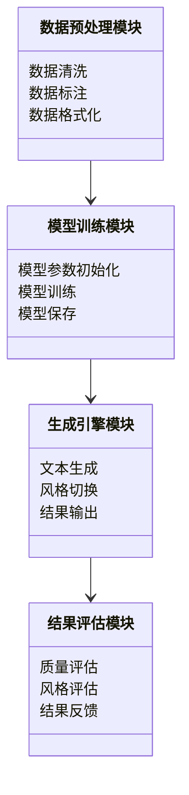
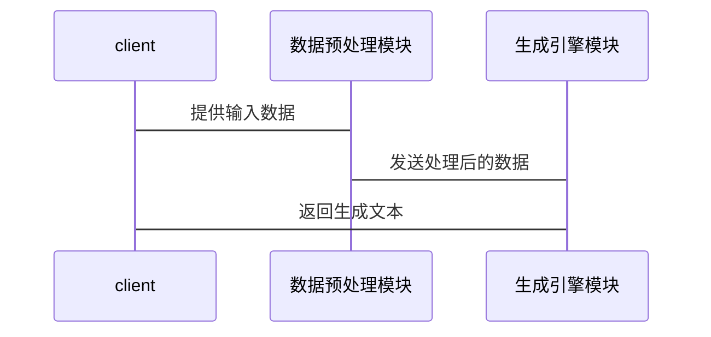

                 


# 构建企业级自然语言生成系统：多语种、多风格报告自动化

## 关键词
- 自然语言生成系统
- 多语种生成
- 多风格生成
- 报告自动化
- 企业级系统

## 摘要
企业级自然语言生成系统能够实现多语种和多风格的报告自动化，其核心在于利用先进的自然语言处理技术，构建高效的生成模型。本文从系统背景、核心概念、算法原理、架构设计到项目实战，全面探讨构建这一系统的各个方面，为企业在多语言、多风格场景下的高效报告生成提供技术指导。

---

## 第一部分: 自然语言生成系统概述

### 第1章: 自然语言生成系统背景与需求

#### 1.1 自然语言生成的定义与技术发展
- **1.1.1 自然语言生成的定义**  
  自然语言生成（Natural Language Generation, NLG）是将结构化数据转化为自然语言文本的过程，涉及语言学、计算机科学和人工智能等多个领域。
  
- **1.1.2 自然语言生成技术的发展历程**  
  自然语言生成技术经历了从基于规则的生成到统计模型，再到深度学习的演变，目前以Transformer和GPT为代表的大语言模型取得了显著进展。

- **1.1.3 企业级自然语言生成系统的独特需求**  
  企业级系统需要高可靠性、可扩展性和定制化能力，支持多语种和多风格的生成需求。

#### 1.2 多语种与多风格生成的挑战
- **1.2.1 多语种生成的核心问题**  
  包括语言间的差异、数据稀缺性以及模型的泛化能力。

- **1.2.2 多风格生成的实现难点**  
  不同风格的生成需要精确控制语言特征，如正式、口语化、简洁等。

- **1.2.3 企业级系统中的实际应用场景**  
  如财务报告、市场分析、客户服务等，要求生成文本准确、专业且符合特定风格。

#### 1.3 报告自动化的价值与意义
- **1.3.1 报告自动化的定义与目标**  
  自动化生成结构化报告，减少人工编写时间，提高效率。

- **1.3.2 企业级报告自动化的优势**  
  提高生产力，降低运营成本，提升报告的一致性和准确性。

- **1.3.3 自动化报告在不同行业的应用潜力**  
  金融、医疗、法律等行业均可受益于自动化报告生成。

#### 1.4 本章小结
- **核心概念回顾**  
  自然语言生成系统的背景、技术发展及其在企业中的应用需求。

- **企业级自然语言生成系统的整体框架**  
  包括数据输入、模型处理、生成输出的完整流程。

---

## 第二部分: 自然语言生成系统的核心概念与技术

### 第2章: 自然语言生成系统的核心原理

#### 2.1 语言模型与生成模型的对比
- **2.1.1 语言模型的基本原理**  
  语言模型通过概率分布预测下一个词，如n-gram模型和Transformer模型。

- **2.1.2 生成模型的实现方式**  
  基于语言模型的生成，如贪心搜索、Beam Search等策略。

- **2.1.3 语言模型与生成模型的联系与区别**  
  语言模型侧重概率预测，生成模型则注重从输入到输出的生成过程。

#### 2.2 多语种生成的实现机制
- **2.2.1 多语种模型的构建方法**  
  使用跨语言迁移学习，共享语言间的特征表示。

- **2.2.2 跨语言迁移学习的原理**  
  利用多语言数据预训练，提升模型的跨语言理解能力。

- **2.2.3 多语种生成中的语言切换策略**  
  通过语言标记或提示词控制生成语言。

#### 2.3 多风格生成的实现方法
- **2.3.1 风格迁移的基本概念**  
  通过风格标记或示例文本，指导生成特定风格的文本。

- **2.3.2 风格控制的实现方式**  
  使用预定义的风格参数或对抗训练方法。

- **2.3.3 不同风格生成的评估指标**  
  包括BLEU、ROUGE等文本相似度指标，以及人工评价。

#### 2.4 本章小结
- **核心概念的总结**  
  语言模型与生成模型的区别，多语种与多风格生成的实现机制。

- **多语种与多风格生成的实现路径**  
  通过跨语言迁移学习和风格控制技术实现复杂的生成需求。

---

## 第三部分: 自然语言生成系统的算法原理

### 第3章: 自然语言生成的主流算法

#### 3.1 Transformer模型的原理与实现
- **3.1.1 Transformer的基本结构**  
  包括编码器和解码器，使用自注意力机制捕捉长距离依赖。

- **3.1.2 自注意力机制的数学公式**  
  $$\text{Attention}(Q, K, V) = \text{softmax}\left(\frac{QK^T}{\sqrt{d_k}}\right)V$$

- **3.1.3 解码器的生成过程**  
  通过解码器逐层生成文本，使用Beam Search优化生成结果。

#### 3.2 GPT系列模型的实现细节
- **3.2.1 GPT模型的训练目标**  
  预测下一个词的概率，使用交叉熵损失函数。

- **3.2.2 掩码预测的实现原理**  
  在解码阶段，对已生成的词进行掩码，防止直接利用未来的信息。

- **3.2.3 GPT模型的生成策略**  
  采用贪心搜索或Beam Search生成高质量文本。

#### 3.3 多语种生成的算法优化
- **3.3.1 跨语言迁移学习的优化方法**  
  使用共享的词嵌入层和任务特定的参数。

- **3.3.2 多任务学习的实现策略**  
  在预训练阶段同时优化多种语言任务。

- **3.3.3 模型压缩与轻量化技术**  
  通过知识蒸馏等方法减少模型大小，提升推理效率。

#### 3.4 多风格生成的算法实现
- **3.4.1 风格标记的引入方法**  
  在输入中添加风格标记，指导生成过程。

- **3.4.2 风格控制的实现方式**  
  使用风格嵌入或对抗训练，控制生成文本的风格特征。

- **3.4.3 风格迁移的评估指标**  
  结合内容相似度和风格匹配度进行综合评估。

#### 3.5 本章小结
- **主流算法的总结**  
  Transformer和GPT系列模型的原理及其在多语种和多风格生成中的应用。

- **多语种与多风格生成的算法优化方向**  
  通过跨语言迁移学习和风格控制技术提升生成效果。

---

## 第四部分: 自然语言生成系统的架构设计

### 第4章: 系统架构与功能设计

#### 4.1 问题场景介绍
- **4.1.1 企业级自然语言生成系统的应用场景**  
  包括财务报告生成、市场分析报告、客户服务响应等。

- **4.1.2 多语种与多风格生成的实际需求**  
  企业可能需要在不同语种和不同风格下生成一致的报告。

- **4.1.3 系统的目标与约束**  
  高可用性、实时性、可扩展性和安全性。

#### 4.2 系统功能设计
- **4.2.1 数据预处理模块**  
  对输入数据进行清洗、标注和格式化处理。

- **4.2.2 模型训练模块**  
  使用多语种和多风格数据训练生成模型。

- **4.2.3 生成引擎模块**  
  根据输入需求生成目标文本，并支持风格切换。

- **4.2.4 结果评估模块**  
  使用多种指标评估生成文本的质量和风格一致性。

#### 4.3 系统架构设计
- **4.3.1 领域模型设计**  
  使用Mermaid类图展示系统的功能模块及其交互。



- **4.3.2 系统架构设计**  
  使用Mermaid架构图展示系统的整体架构。

```mermaid
archiecture
    client --> 数据预处理模块: 请求数据处理
    数据预处理模块 --> 模型训练模块: 提供训练数据
    模型训练模块 --> 生成引擎模块: 加载训练好的模型
    生成引擎模块 --> 结果评估模块: 提供生成结果
    结果评估模块 --> client: 返回评估结果
```

- **4.3.3 系统交互设计**  
  使用Mermaid序列图展示系统交互过程。



#### 4.4 本章小结
- **问题场景的总结**  
  企业级系统的应用场景和实际需求。

- **系统架构与功能设计**  
  包括功能模块的设计和系统的整体架构。

---

## 第五部分: 自然语言生成系统的项目实战

### 第5章: 项目实战与案例分析

#### 5.1 环境安装与配置
- **5.1.1 安装Python与相关库**  
  安装Python 3.8及以上版本，以及TensorFlow、Keras、Hugging Face库等。

- **5.1.2 安装自然语言处理工具**  
  使用Transformers库中的预训练模型，如Bert、GPT等。

- **5.1.3 环境配置与注意事项**  
  配置虚拟环境，确保各库版本兼容。

#### 5.2 系统核心实现
- **5.2.1 数据预处理代码**  
  示例代码如下：

```python
import pandas as pd

def preprocess_data(data):
    # 数据清洗
    data = data.dropna()
    # 数据标注
    data['language'] = data['text'].apply(lambda x: detect_language(x))
    # 数据格式化
    data['style'] = data['text'].apply(lambda x: detect_style(x))
    return data
```

- **5.2.2 模型训练代码**  
  示例代码如下：

```python
from transformers import TFGPT2LMHeadModel, AutoTokenizer

tokenizer = AutoTokenizer.from_pretrained('gpt2')
model = TFGPT2LMHeadModel.from_pretrained('gpt2')
model.trainable = False
```

- **5.2.3 生成引擎代码**  
  示例代码如下：

```python
def generate_text(model, tokenizer, input_text):
    inputs = tokenizer(input_text, return_tensors='np')
    outputs = model.generate(inputs.input_ids, max_length=50)
    return tokenizer.decode(outputs[0].tolist())
```

#### 5.3 项目实战：多语种报告生成
- **5.3.1 项目介绍**  
  实现一个多语种报告生成系统，支持中、英、法等多种语言。

- **5.3.2 系统功能实现**  
  通过风格控制生成不同风格的报告，如正式、简洁等。

- **5.3.3 生成结果分析**  
  对比不同语言和风格下的生成文本质量，评估系统的性能。

#### 5.4 本章小结
- **环境安装与配置**  
  安装必要的库和工具，确保系统的顺利运行。

- **系统核心实现**  
  数据预处理、模型训练和生成引擎的具体实现。

---

## 第六部分: 总结与展望

### 第6章: 总结与展望

#### 6.1 最佳实践 tips
- **6.1.1 系统设计的注意事项**  
  注重模块化设计，确保系统的可扩展性和可维护性。

- **6.1.2 开发中的常见问题**  
  数据不足、模型过拟合、生成结果不可控等。

- **6.1.3 解决方案与优化建议**  
  使用数据增强、模型调优和风格控制技术优化生成效果。

#### 6.2 小结
- **核心内容回顾**  
  从背景需求、核心概念、算法原理到系统设计和项目实战的全面总结。

#### 6.3 注意事项
- **数据隐私与安全**  
  确保生成系统的数据安全和合规性。

- **模型性能优化**  
  通过剪枝和量化技术提升模型的推理效率。

#### 6.4 拓展阅读
- **推荐书籍与论文**  
  《Effective Pretrained Transfer for Low-Resource Languages》、《Style-Transfer via Cycle-Consistent Adversarial Networks》等。

---

通过以上内容，企业可以系统地了解并构建一个多语种、多风格的自然语言生成系统，实现高效、自动化的报告生成，提升企业的生产力和竞争力。

