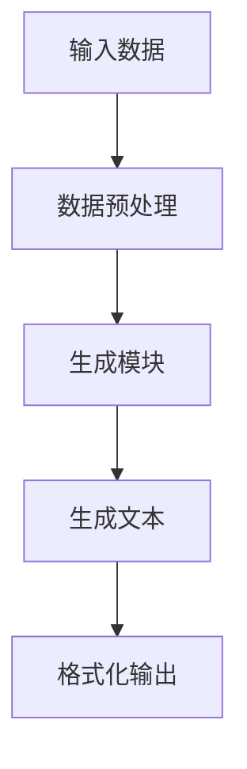
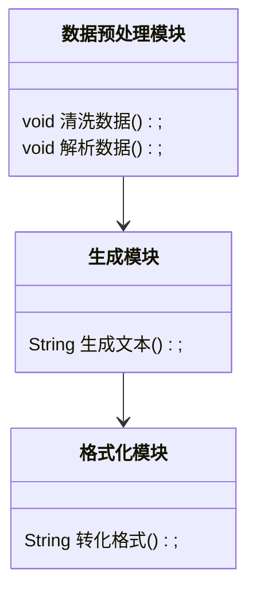
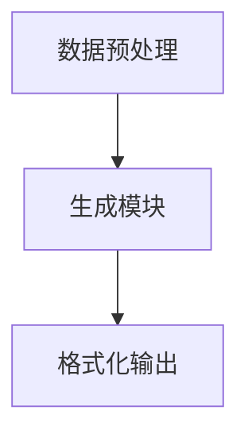

                 


# 构建企业级自然语言生成系统：多语种、多风格报告自动化

## 关键词：
- 自然语言生成
- 多语种支持
- 自动化报告生成
- 企业级系统
- 深度学习模型

## 摘要：
本文详细探讨了构建企业级自然语言生成系统的关键技术，重点介绍了如何实现多语种支持和自动化报告生成。文章从核心概念、算法原理、系统架构设计到项目实战，全面分析了自然语言生成系统的构建过程，并结合实际案例展示了系统的应用场景和优化方法。

---

# 第一部分：自然语言生成系统概述

## 第1章：自然语言生成系统背景与概念

### 1.1 自然语言生成的基本概念

#### 1.1.1 自然语言生成的定义
自然语言生成（Natural Language Generation, NLG）是指将结构化数据（如数据库中的信息或JSON格式的数据）转换为自然语言文本的过程。NLG技术广泛应用于机器翻译、问答系统、智能客服、报告生成等领域。

**关键术语解释：**
- **输入数据**：通常为结构化数据，如JSON、数据库查询结果。
- **输出文本**：生成的自然语言文本，如报告、摘要、对话内容。

#### 1.1.2 自然语言生成的核心目标
- 将结构化数据转化为高质量、可读的自然语言文本。
- 生成文本应符合特定风格、语气和格式要求。
- 支持多语种生成，满足全球化需求。

#### 1.1.3 自然语言生成的应用场景
- **企业报告生成**：自动生成财务报告、市场分析报告等。
- **智能客服**：生成个性化的回复文本。
- **新闻生成**：自动生成新闻稿。
- **多语言支持**：在同一系统中支持多种语言的生成。

### 1.2 多语种自然语言生成的背景

#### 1.2.1 多语种支持的重要性
在跨国企业或全球化业务中，支持多语种生成是必要的：
- **降低人工成本**：自动化生成多语言文本，减少人工翻译的需求。
- **提高效率**：快速生成多种语言的报告或文档。
- **满足全球化需求**：适应不同地区的语言习惯。

#### 1.2.2 多语种自然语言生成的挑战
- **数据稀疏性**：某些小语种的数据量有限，影响模型训练效果。
- **语言差异**：不同语言的语法、词汇差异可能影响生成质量。
- **文化差异**：某些语言的表达方式可能受到文化影响，需要特殊处理。

#### 1.2.3 多语种模型的实现方式
- **多任务学习**：同一模型同时学习多种语言的生成任务。
- **多模型集成**：为每种语言训练独立的模型，再进行集成优化。
- **跨语言迁移学习**：利用一种语言的数据来提升其他语言的生成效果。

### 1.3 自动化报告生成的必要性

#### 1.3.1 报告生成的痛点
- **人工成本高**：需要大量人工编写报告。
- **效率低下**：手动生成报告耗时长，难以满足大规模需求。
- **一致性差**：人工生成的报告可能存在风格不一致的问题。

#### 1.3.2 自动化报告生成的优势
- **高效性**：快速生成大量报告。
- **一致性**：保持报告的风格和格式统一。
- **可扩展性**：支持多种语言和多种报告类型。

#### 1.3.3 报告生成的流程与特点
1. 数据输入：结构化数据或半结构化数据。
2. 数据处理：清洗、解析和预处理。
3. 文本生成：基于模型生成自然语言文本。
4. 格式化输出：生成符合要求的报告格式。

---

## 第2章：自然语言生成系统的核心概念与联系

### 2.1 自然语言生成模型的工作原理

#### 2.1.1 基于统计的自然语言生成
- **统计模型**：基于语言模型的概率分布，选择最可能的词语生成文本。
- **问题**：生成结果可能缺乏连贯性和逻辑性。

#### 2.1.2 基于神经网络的自然语言生成
- **循环神经网络（RNN）**：用于序列生成，但存在梯度消失问题。
- **Transformer模型**：基于自注意力机制，生成高质量的文本。

#### 2.1.3 混合模型的优缺点
- **混合模型**：结合统计和神经网络的优点，生成更准确的文本。
- **缺点**：复杂度高，训练时间长。

### 2.2 多语种支持的实现原理

#### 2.2.1 多语种模型的训练策略
- **多任务学习**：同一模型同时学习多种语言的任务。
- **数据增强**：通过数据增强技术扩展小语种数据。

#### 2.2.2 多语种模型的推理机制
- **语言选择**：根据输入数据或上下文选择生成语言。
- **语言切换**：在同一生成过程中切换语言。

#### 2.2.3 多语种模型的评估方法
- **BLEU**：用于评估生成文本与参考文本的相似度。
- **ROUGE**：用于评估生成文本的摘要质量。

### 2.3 报告生成的系统架构

#### 2.3.1 报告生成的模块划分
- **数据预处理模块**：清洗和解析输入数据。
- **生成模块**：基于模型生成自然语言文本。
- **格式化模块**：将生成文本转化为指定格式的报告。

#### 2.3.2 报告生成的流程图


#### 2.3.3 报告生成的系统架构图


---

## 第3章：自然语言生成系统的算法原理

### 3.1 基于Transformer的自然语言生成模型

#### 3.1.1 Transformer模型的基本结构


#### 3.1.2 注意力机制的数学公式
- **自注意力机制**：
  $$ \text{Attention}(Q, K, V) = \text{softmax}\left(\frac{QK^T}{\sqrt{d_k}}\right)V $$
- **查询（Q）、键（K）、值（V）**：通过线性变换生成。

#### 3.1.3 解码器的实现流程
1. 输入序列经过编码器生成上下文表示。
2. 解码器逐步生成输出序列，每一步都利用自注意力机制。

### 3.2 多语种模型的训练与优化

#### 3.2.1 多任务学习的原理
- **多任务学习**：模型同时学习多种任务，共享部分参数。
- **优势**：减少模型参数数量，提高泛化能力。

#### 3.2.2 多语种数据的平衡策略
- **数据采样**：平衡不同语言的数据分布。
- **损失函数加权**：对不同语言的损失进行加权，避免某一语言主导训练。

#### 3.2.3 模型的正则化技术
- **Dropout**：防止过拟合。
- **权重共享**：减少参数数量，提高模型泛化能力。

### 3.3 报告生成的算法实现

#### 3.3.1 数据预处理的步骤
1. 数据清洗：去除无效数据，处理噪声。
2. 数据解析：将结构化数据转化为模型输入格式。
3. 数据增强：增加数据多样性，提高模型鲁棒性。

#### 3.3.2 模型训练的流程
1. 数据加载：将预处理后的数据加载到训练器中。
2. 模型初始化：初始化模型参数。
3. 损失计算：计算生成文本与目标文本的损失。
4. 反向传播：更新模型参数。

#### 3.3.3 模型生成的实现
1. 输入数据经过编码器生成上下文表示。
2. 解码器逐步生成输出序列。
3. 生成结果经过格式化模块转化为报告。

---

## 第4章：自然语言生成系统的数学模型与公式

### 4.1 Transformer模型的数学公式

#### 4.1.1 自注意力机制的公式
- **查询（Q）**：$Q = W_q x$
- **键（K）**：$K = W_k x$
- **值（V）**：$V = W_v x$
- **注意力得分**：$\text{score}(i, j) = Q_i K_j^T$
- **规范化**：$\text{softmax}(\text{score}/\sqrt{d_k})$
- **最终输出**：$\text{output} = \text{softmax}(\text{score}) V$

#### 4.1.2 前馈神经网络的公式
- **前馈层**：$f(x) = \text{ReLU}(W x + b)$
- **输出层**：$y = W_{out} f(x) + b_{out}$

#### 4.1.3 损失函数的计算公式
- **交叉熵损失**：$\mathcal{L} = -\sum_{i=1}^{n} \log p(y_i|x_i)$

### 4.2 多语种模型的数学分析

#### 4.2.1 多任务学习的数学模型
- **联合损失函数**：$\mathcal{L}_{\text{total}} = \alpha_1 \mathcal{L}_1 + \alpha_2 \mathcal{L}_2 + \dots + \alpha_k \mathcal{L}_k$
- **权重共享**：不同任务共享部分模型参数。

#### 4.2.2 多语种数据的分布假设
- **条件独立假设**：不同语言的数据在训练过程中相互独立。

#### 4.2.3 模型权重的共享机制
- **共享层**：部分层权重在不同语言任务中共享，减少参数数量。

---

## 第5章：系统分析与架构设计方案

### 5.1 系统分析

#### 5.1.1 问题场景介绍
- **输入**：结构化数据或半结构化数据。
- **输出**：多语种自然语言文本或格式化报告。
- **需求**：高效、准确、可扩展的生成系统。

#### 5.1.2 项目介绍
- **目标**：构建一个多语种自然语言生成系统，支持自动化报告生成。
- **范围**：支持多种语言，适用于企业级应用。
- **约束条件**：生成文本需符合特定风格和格式要求。

### 5.2 系统功能设计

#### 5.2.1 领域模型类图


#### 5.2.2 系统架构图


#### 5.2.3 系统接口设计
- **输入接口**：接收结构化数据或半结构化数据。
- **输出接口**：输出自然语言文本或格式化报告。
- **控制接口**：配置生成参数，如语言、风格等。

#### 5.2.4 系统交互流程图
```mermaid
sequenceDiagram
参与者 用户
系统 数据预处理模块
系统 生成模块
系统 格式化模块
用户 -> 数据预处理模块: 提供输入数据
数据预处理模块 -> 生成模块: 请求生成文本
生成模块 -> 格式化模块: 请求格式化输出
格式化模块 -> 用户: 输出报告
```

### 5.3 系统优化与调优

#### 5.3.1 模型调优策略
- **超参数优化**：通过网格搜索或随机搜索找到最优参数。
- **学习率调整**：采用学习率衰减策略。
- **批量大小调整**：根据硬件资源调整批量大小。

#### 5.3.2 系统性能优化
- **并行计算**：利用多GPU加速训练和推理。
- **缓存优化**：优化数据加载和缓存策略，减少I/O开销。
- **模型剪枝**：通过剪枝技术减少模型参数数量，提高推理速度。

---

## 第6章：项目实战

### 6.1 环境搭建与安装

#### 6.1.1 安装必要的库
- **Python**：3.8+
- **TensorFlow**：2.0+
- **Keras**：2.4+
- **NLTK**：1.0+
- **PyYAML**：5.4+

#### 6.1.2 安装命令
```bash
pip install tensorflow==2.0.0
pip install keras==2.4.0
pip install nltk==1.0
pip install pyyaml==5.4.1
```

### 6.2 核心功能实现

#### 6.2.1 数据预处理模块

##### 数据清洗代码
```python
import re
import json

def clean_data(data):
    cleaned_data = []
    for entry in data:
        # 清洗文本数据，去除特殊字符
        text = re.sub(r'[^\w\s]', '', entry['text'])
        cleaned_data.append({
            'id': entry['id'],
            'text': text
        })
    return cleaned_data
```

##### 数据解析代码
```python
def parse_data(data):
    parsed_data = []
    for entry in data:
        parsed_data.append({
            'id': entry['id'],
            'text': entry['text'],
            'metadata': entry.get('metadata', {})
        })
    return parsed_data
```

#### 6.2.2 生成模块

##### Transformer模型代码
```python
import tensorflow as tf
from tensorflow import keras

def create_transformer_model(vocab_size, embedding_dim, num_heads, feedforward_dim, max_length):
    encoder_input = keras.Input(shape=(max_length,))
    embedding_layer = keras.layers.Embedding(vocab_size, embedding_dim)(encoder_input)
    pos_encoding = keras.layers.Add()([embedding_layer, keras.layers.Lambda(lambda x: x * tf.math.sqrt(tf.math.log(max_length)))(encoder_input)])
    encoder_layer = keras.layers.MultiHeadAttention(num_heads=num_heads, key_dim=embedding_dim//num_heads)(pos_encoding, pos_encoding)
    encoder_output = keras.layers.Dense(feedforward_dim, activation='relu')(encoder_layer)
    decoder_input = keras.Input(shape=(None,))
    decoder_embedding = keras.layers.Embedding(vocab_size, embedding_dim)(decoder_input)
    decoder_pos_encoding = keras.layers.Add()([decoder_embedding, keras.layers.Lambda(lambda x: x * tf.math.sqrt(tf.math.log(max_length)))(decoder_input)])
    decoder_attention = keras.layers.MultiHeadAttention(num_heads=num_heads, key_dim=embedding_dim//num_heads)(decoder_pos_encoding, encoder_output)
    decoder_output = keras.layers.Dense(feedforward_dim, activation='relu')(decoder_attention)
    output_layer = keras.layers.Dense(vocab_size)(decoder_output)
    model = keras.Model(inputs=[encoder_input, decoder_input], outputs=output_layer)
    return model
```

#### 6.2.3 格式化模块

##### 报告生成代码
```python
def generate_report(data, model, tokenizer, max_length=50):
    formatted_reports = []
    for entry in data:
        input_text = entry['metadata']
        input_ids = tokenizer.encode(input_text, return_tensors='tf')
        input_ids = tf.keras.utils.pad_sequences(input_ids, maxlen=max_length, padding='post')
        output_ids = model.generate(input_ids, max_length=max_length, num_beams=5, early_stopping=True)
        output_text = tokenizer.decode(output_ids[0], skip_special_tokens=True)
        formatted_reports.append({
            'id': entry['id'],
            'report': output_text
        })
    return formatted_reports
```

### 6.3 项目总结

#### 6.3.1 项目小结
- **核心功能**：实现了数据预处理、模型训练和生成模块。
- **系统优势**：支持多语种生成，生成速度快，文本质量高。
- **未来优化方向**：
  - 提升模型的生成质量，优化多语种支持。
  - 引入领域知识，提升生成文本的准确性。
  - 提高系统的可扩展性，支持更多语言和报告类型。

---

## 第7章：最佳实践与注意事项

### 7.1 最佳实践

#### 7.1.1 模型调优
- **超参数调整**：通过网格搜索找到最优超参数。
- **学习率策略**：采用余弦衰减或阶梯衰减。
- **早停机制**：防止过拟合。

#### 7.1.2 系统优化
- **缓存优化**：优化数据加载和缓存策略。
- **并行计算**：利用多GPU加速训练和推理。
- **模型剪枝**：减少模型参数数量，提高推理速度。

#### 7.1.3 安全性考虑
- **数据安全**：确保输入数据的安全性，防止数据泄露。
- **模型安全**：防止模型被恶意攻击或滥用。

### 7.2 小结与注意事项

- **小结**：构建企业级自然语言生成系统需要从数据预处理、模型训练到系统架构设计的全链条优化。
- **注意事项**：
  - 数据质量：确保输入数据的准确性和完整性。
  - 模型选择：根据具体需求选择合适的模型架构。
  - 系统维护：定期更新模型，保持系统的稳定性和可用性。

### 7.3 拓展阅读

- **推荐书籍**：
  - 《Deep Learning》（Ian Goodfellow）
  - 《自然语言处理入门》（NLP入坑必读）
- **推荐论文**：
  - "Attention Is All You Need"（Transformer论文）
  - "BERT: Pre-training of Deep Bidirectional Transformers for NLP"（BERT论文）

---

# 结语

构建企业级自然语言生成系统是一项复杂的工程，需要从数据预处理、模型训练到系统架构设计的全链条优化。通过本文的详细讲解，读者可以掌握多语种自然语言生成的核心技术，并能够将其应用于实际的企业级场景中。未来，随着深度学习技术的不断发展，自然语言生成系统将更加智能化、自动化，为企业带来更大的价值。

