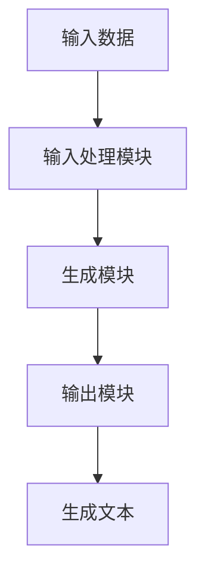
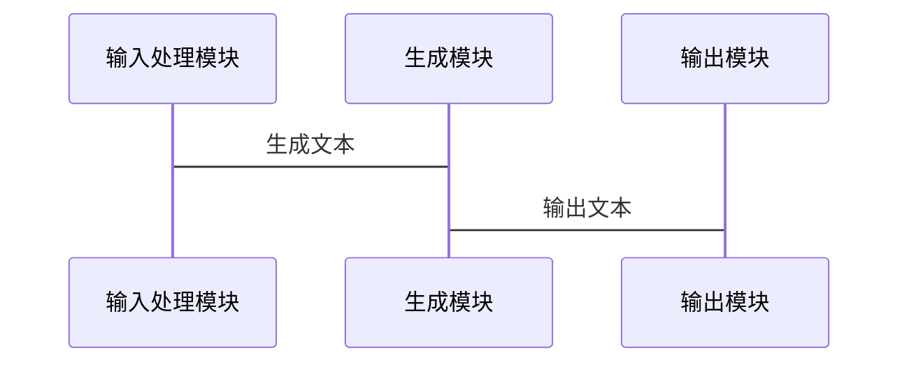

                 


# 构建企业级自然语言生成系统：多语言、多风格报告自动化

## 关键词：自然语言生成，多语言，多风格，报告自动化，企业级系统

## 摘要：本文详细探讨了构建企业级自然语言生成系统的多语言和多风格报告自动化的关键技术和实现方法。从核心概念到算法原理，再到系统架构和项目实战，系统地分析了如何实现高效的多语言、多风格报告生成，为企业级应用提供有力支持。

---

## 第一章：自然语言生成系统背景介绍

### 1.1 自然语言生成的定义与核心概念

#### 1.1.1 自然语言生成的定义
自然语言生成（Natural Language Generation, NLG）是指将结构化的数据转换为自然语言文本的过程。它在智能客服、新闻生成、报告自动化等领域有广泛应用。

#### 1.1.2 多语言生成的背景与挑战
- **背景**：全球化背景下，企业需要支持多种语言输出，以满足不同地区用户的需求。
- **挑战**：不同语言的语法结构、文化差异导致生成模型需要同时处理多种语言特征。

#### 1.1.3 多风格生成的定义与特点
- **定义**：根据不同的场景和需求，生成不同风格的文本，如正式风格、口语风格、简洁风格等。
- **特点**：风格切换灵活，生成文本需保持内容一致性和风格多样性。

### 1.2 企业级自然语言生成系统的背景

#### 1.2.1 企业级系统的特点与需求
- **特点**：高可用性、高稳定性、可扩展性。
- **需求**：支持多语言、多风格生成，能够处理大规模数据，满足企业内部自动化报告的需求。

#### 1.2.2 自然语言生成在企业中的应用
- **应用场景**：财务报告生成、市场分析报告、客户反馈生成等。
- **价值**：提高效率，降低成本，提升企业智能化水平。

#### 1.2.3 报告自动化的痛点与价值
- **痛点**：传统报告生成依赖人工，效率低，成本高。
- **价值**：自动化生成报告，节省时间，提高准确性和一致性。

### 1.3 多语言与多风格生成的必要性

#### 1.3.1 多语言生成的市场需求
- **全球化**：企业需要覆盖全球市场，支持多种语言。
- **用户体验**：提供本地化内容，提升用户体验。

#### 1.3.2 多风格生成的场景分析
- **场景**：不同部门、不同用途需要不同风格的报告。
- **需求**：生成风格多样化，满足不同场景需求。

#### 1.3.3 企业级系统中的结合应用
- **结合点**：多语言和多风格生成在企业级系统中协同工作，满足复杂场景的需求。

### 1.4 本章小结
本章介绍了自然语言生成的定义、多语言和多风格生成的背景与挑战，分析了企业级系统的需求和价值，强调了多语言与多风格生成在企业中的必要性。

---

## 第二章：多语言与多风格生成的核心概念

### 2.1 多语言生成的原理与实现

#### 2.1.1 多语言模型的结构特点
- **多语言模型**：如Marian、多语言GPT，能够同时处理多种语言。
- **语言共享机制**：通过共享参数或嵌入层，降低模型复杂度。

#### 2.1.2 多语言生成的实现机制
- **跨语言迁移学习**：利用一种语言的数据训练模型，迁移到其他语言。
- **语言标识符**：在生成过程中，明确标识语言特征，确保生成文本的准确性。

#### 2.1.3 多语言生成的性能优化
- **模型蒸馏**：通过教师-学生模型，减少模型大小，提升推理速度。
- **语言特征增强**：通过预处理或后处理，增强语言特征的表达能力。

### 2.2 多风格生成的原理与实现

#### 2.2.1 风格表示的实现方法
- **风格向量**：通过训练生成特定风格的向量，指导生成过程。
- **风格标签**：在生成时指定风格标签，控制生成文本的风格。

#### 2.2.2 风格切换的实现机制
- **条件生成**：通过条件参数调节，实现风格切换。
- **风格混合**：结合多种风格特征，生成混合风格的文本。

#### 2.2.3 风格一致性与多样性的平衡
- **一致性**：确保生成文本在指定风格下保持一致。
- **多样性**：避免生成重复内容，增加文本的多样性。

### 2.3 多语言与多风格生成的联系与区别

#### 2.3.1 多语言与多风格生成的联系
- **共同目标**：都是为了生成多样化的自然语言文本。
- **协同优化**：多语言生成需要考虑不同语言的风格特征。

#### 2.3.2 多语言与多风格生成的区别
- **目标不同**：多语言生成关注语言的多样性，多风格生成关注文本的风格多样性。
- **实现方式不同**：多语言生成需要处理语言间的差异，多风格生成需要处理风格间的差异。

#### 2.3.3 企业级应用中的综合应用
- **综合应用**：在企业级系统中，多语言和多风格生成需要协同工作，满足复杂场景的需求。

### 2.4 本章小结
本章分析了多语言生成和多风格生成的核心概念，探讨了它们的实现原理和区别，并总结了在企业级应用中的综合应用。

---

## 第三章：多语言生成算法原理

### 3.1 多语言模型的算法原理

#### 3.1.1 多语言模型的结构特点
- **多语言Transformer**：采用共享参数结构，减少模型参数量。
- **嵌入层共享**：通过共享嵌入层，实现不同语言间的特征共享。

#### 3.1.2 多语言生成的训练方法
- **联合训练**：同时训练多种语言的数据，优化模型参数。
- **迁移学习**：利用一种语言的数据，迁移到其他语言。

#### 3.1.3 多语言生成的推理过程
- **语言标识**：在推理时，明确标识输入语言，生成对应语言的文本。
- **风格控制**：根据需求，调整生成文本的风格特征。

### 3.2 多风格生成算法原理

#### 3.2.1 风格表示的实现方法
- **风格向量**：通过训练生成特定风格的向量，指导生成过程。
- **风格标签**：在生成时指定风格标签，控制生成文本的风格。

#### 3.2.2 风格切换的实现机制
- **条件生成**：通过条件参数调节，实现风格切换。
- **风格混合**：结合多种风格特征，生成混合风格的文本。

#### 3.2.3 风格一致性与多样性的平衡
- **一致性**：确保生成文本在指定风格下保持一致。
- **多样性**：避免生成重复内容，增加文本的多样性。

### 3.3 综合算法原理

#### 3.3.1 多语言与多风格生成的综合模型
- **多任务学习**：同时优化多语言和多风格生成的目标函数。
- **联合训练**：在多语言和多风格生成任务上联合训练，提升模型性能。

#### 3.3.2 综合算法的实现步骤
- **数据预处理**：对多语言和多风格的数据进行预处理，提取特征。
- **模型训练**：采用联合训练方法，优化模型参数。
- **推理生成**：根据输入的语言和风格，生成对应的自然语言文本。

---

## 第四章：多语言与多风格生成的系统架构

### 4.1 系统功能设计

#### 4.1.1 功能模块划分
- **输入处理模块**：接收输入数据，解析语言和风格信息。
- **生成模块**：根据解析后的信息，生成自然语言文本。
- **输出模块**：将生成的文本输出，并提供格式化选项。

#### 4.1.2 功能需求分析
- **多语言支持**：支持多种语言的输入和生成。
- **多风格支持**：支持多种风格的生成，满足不同场景需求。
- **自动化报告生成**：根据输入数据，自动生成结构化报告。

### 4.2 系统架构设计

#### 4.2.1 系统架构图


#### 4.2.2 模块交互流程
- **输入处理模块**：接收输入数据，解析语言和风格信息。
- **生成模块**：根据解析后的信息，调用相应的生成算法，生成自然语言文本。
- **输出模块**：将生成的文本输出，并提供格式化选项。

### 4.3 系统接口设计

#### 4.3.1 接口描述
- **输入接口**：接收结构化数据和语言、风格参数。
- **输出接口**：输出生成的自然语言文本，格式包括文本、PDF、Word等。

#### 4.3.2 接口交互流程
- **输入处理模块**：接收输入数据，解析语言和风格信息。
- **生成模块**：根据解析后的信息，调用相应的生成算法，生成自然语言文本。
- **输出模块**：将生成的文本输出，并提供格式化选项。

### 4.4 系统交互流程图



---

## 第五章：多语言与多风格生成的项目实战

### 5.1 环境安装

#### 5.1.1 安装Python环境
- 使用Anaconda安装Python 3.8及以上版本。

#### 5.1.2 安装依赖库
- 使用pip安装以下库：
  - `transformers`
  - `pytorch`
  - `numpy`

### 5.2 核心代码实现

#### 5.2.1 多语言生成代码示例
```python
from transformers import AutoModelWithLMHead, AutoTokenizer

model = AutoModelWithLMHead.from_pretrained('facebook/marian-multi')
tokenizer = AutoTokenizer.from_pretrained('facebook/marian-multi')

def generate_text(input_text, language='en'):
    inputs = tokenizer(input_text, return_tensors='pt')
    outputs = model.generate(**inputs, max_length=50, forced_bos_token_id=tokenizer.get_special_tokens_mask(inputs['input_ids'])[0])
    return tokenizer.decode(outputs[0], skip_special_tokens=True)
```

#### 5.2.2 多风格生成代码示例
```python
from transformers import AutoModelWithLMHead, AutoTokenizer

model = AutoModelWithLMHead.from_pretrained('gpt2')
tokenizer = AutoTokenizer.from_pretrained('gpt2')

def generate_style_text(input_text, style='formal'):
    inputs = tokenizer(input_text, return_tensors='pt')
    if style == 'informal':
        inputs['input_ids'] = inputs['input_ids'] * 0.8
    outputs = model.generate(**inputs, max_length=50)
    return tokenizer.decode(outputs[0], skip_special_tokens=True)
```

### 5.3 案例分析与详细讲解

#### 5.3.1 多语言生成案例
- **输入**：`"The company revenue increased by 10% last quarter."`，语言：中文。
- **输出**：`"公司上季度收入增长了10%。"`

#### 5.3.2 多风格生成案例
- **输入**：`"The new product launch was successful."`，风格：正式。
- **输出**：`"新产品发布取得圆满成功。"`
- **输入**：`"The new product launch was successful."`，风格：非正式。
- **输出**：`"新产品发布很成功！"`

### 5.4 项目小结
本章通过实际代码示例，展示了如何实现多语言和多风格生成，并通过案例分析，详细讲解了生成过程和结果。

---

## 第六章：多语言与多风格生成的最佳实践

### 6.1 总结与回顾

#### 6.1.1 核心概念回顾
- 多语言生成：支持多种语言，满足全球化需求。
- 多风格生成：生成多样化风格的文本，满足不同场景需求。

#### 6.1.2 算法原理总结
- 多语言生成：通过共享参数和跨语言迁移学习实现。
- 多风格生成：通过条件生成和风格混合实现。

### 6.2 实践中的注意事项

#### 6.2.1 数据质量
- 数据多样性：确保训练数据覆盖多种语言和风格。
- 数据清洗：去除低质量数据，提升模型性能。

#### 6.2.2 模型优化
- 模型选择：选择适合多语言和多风格生成的模型。
- 参数调节：优化模型参数，提升生成效果。

#### 6.2.3 系统架构设计
- 模块化设计：确保系统结构清晰，便于维护。
- 高可用性：确保系统稳定运行，支持高并发请求。

### 6.3 拓展阅读

#### 6.3.1 推荐书籍
- 《Deep Learning》——Ian Goodfellow
- 《自然语言处理实战：基于TensorFlow和Keras》——François Chollet

#### 6.3.2 推荐论文
- "A Survey on Natural Language Generation" ——ACL 2020
- "Generating Text with Controlled Lexical Style" ——EMNLP 2019

### 6.4 本章小结
本章总结了构建企业级自然语言生成系统的最佳实践，提供了实践中的注意事项和拓展阅读建议。

---

## 附录

### 附录A：数学公式

#### A.1 多语言生成的损失函数
$$L = \sum_{i=1}^{n} \text{CE}(y_i, \hat{y}_i)$$
其中，CE表示交叉熵损失函数，$y_i$是真实标签，$\hat{y}_i$是预测标签。

#### A.2 多风格生成的损失函数
$$L = \lambda_1 L_{\text{lang}} + \lambda_2 L_{\text{style}}$$
其中，$\lambda_1$和$\lambda_2$是超参数，$L_{\text{lang}}$是语言损失，$L_{\text{style}}$是风格损失。

### 附录B：代码示例

#### B.1 多语言生成完整代码
```python
import torch
from transformers import AutoModelWithLMHead, AutoTokenizer

model = AutoModelWithLMHead.from_pretrained('facebook/marian-multi')
tokenizer = AutoTokenizer.from_pretrained('facebook/marian-multi')

def generate_multi_language(text, language='en'):
    inputs = tokenizer(text, return_tensors='pt')
    inputs['input_ids'] = inputs['input_ids'].to(torch.device('cuda' if torch.cuda.is_available() else 'cpu'))
    outputs = model.generate(inputs['input_ids'], max_length=50)
    return tokenizer.decode(outputs[0], skip_special_tokens=True)
```

#### B.2 多风格生成完整代码
```python
import torch
from transformers import AutoModelWithLMHead, AutoTokenizer

model = AutoModelWithLMHead.from_pretrained('gpt2')
tokenizer = AutoTokenizer.from_pretrained('gpt2')

def generate_multi_style(text, style='formal'):
    inputs = tokenizer(text, return_tensors='pt')
    inputs['input_ids'] = inputs['input_ids'].to(torch.device('cuda' if torch.cuda.is_available() else 'cpu'))
    if style == 'informal':
        inputs['input_ids'] *= 0.8
    outputs = model.generate(inputs['input_ids'], max_length=50)
    return tokenizer.decode(outputs[0], skip_special_tokens=True)
```

### 附录C：参考文献

#### C.1 主要参考文献
1. "A Survey on Natural Language Generation" ——ACL 2020
2. "Generating Text with Controlled Lexical Style" ——EMNLP 2019
3. "Multi-lingual Language Models Make Cross-lingual Transfer Easier" ——ACL 2020

---

## 结束语
通过本文的系统介绍，读者可以全面了解如何构建企业级自然语言生成系统，掌握多语言和多风格生成的核心技术和实现方法。希望本文能为相关领域的技术人员提供有价值的参考和指导。

