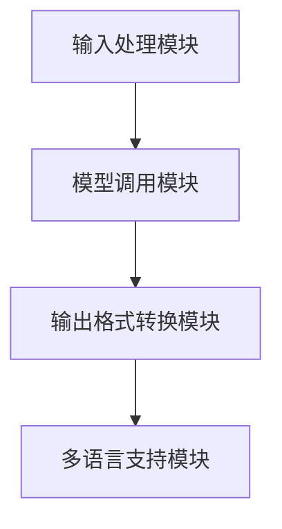
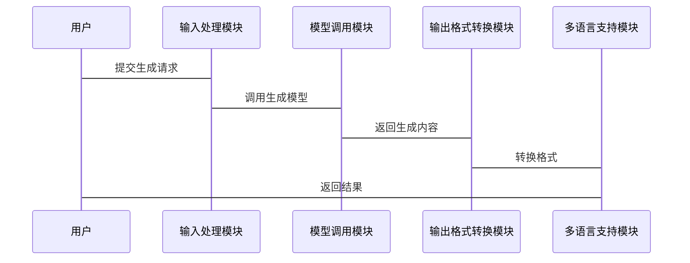

                 


# 构建企业级自然语言生成系统：多语言报告自动化

> 关键词：自然语言生成，多语言报告，企业级系统，深度学习，语言模型

> 摘要：本文详细探讨了构建企业级自然语言生成系统的方法，特别是如何实现多语言报告的自动化。通过分析自然语言生成的核心概念、算法原理、系统架构设计以及项目实战，本文为读者提供了一套完整的解决方案。内容涵盖从基础理论到实际应用的各个层面，帮助读者全面理解并掌握企业级自然语言生成系统的构建方法。

---

# 第一部分: 自然语言生成系统概述

## 第1章: 自然语言生成的背景与需求

### 1.1 自然语言生成的定义与应用
- **1.1.1 自然语言生成（NLG）的定义**  
  自然语言生成是指将结构化数据转换为自然语言文本的过程，涉及文本生成、语法构建和语义优化等技术。

- **1.1.2 自然语言生成的发展历程**  
  从基于规则的生成到现代的深度学习模型，NLG技术经历了从简单到复杂的演变。

- **1.1.3 NLG的主要应用场景**  
  包括报告生成、对话系统、内容创作、数据可视化等领域。

### 1.2 多语言报告自动化的挑战与价值
- **1.2.1 多语言报告的必要性**  
  针对不同语言用户的个性化需求，企业需要生成多语言的报告以满足全球化市场。

- **1.2.2 企业级系统的需求特点**  
  高可用性、可扩展性、安全性以及多语言支持是企业级系统的核心要求。

- **1.2.3 技术挑战与解决方案**  
  包括跨语言模型训练、多语言文本处理和系统架构设计等。

### 1.3 本章小结
本章通过分析自然语言生成的定义、发展历程及其在多语言报告自动化中的应用，明确了构建企业级自然语言生成系统的目标和挑战。

---

# 第二部分: 自然语言生成的核心概念与原理

## 第2章: 自然语言生成的核心概念

### 2.1 自然语言生成的三要素
- **生成目标**：明确生成文本的内容和用途，例如报告、摘要或对话。
- **输入数据**：结构化或半结构化的数据输入，例如表格数据或JSON格式。
- **输出格式**：生成文本的格式要求，例如自然语言文本、Markdown格式或HTML格式。

### 2.2 多语言处理的关键技术
- **语言模型的多语言适配**：通过预训练多语言模型（如mBART、XLM）实现跨语言生成。
- **跨语言文本处理**：包括语言识别、翻译和文本生成等环节。
- **多语言模型的训练策略**：采用多任务学习或数据增强方法提升模型的多语言能力。

### 2.3 企业级系统的扩展性要求
- **高可用性**：系统需要具备故障容错和快速恢复能力。
- **高扩展性**：支持大规模数据处理和高并发请求。
- **高安全性**：确保数据安全和生成内容的合规性。

### 2.4 本章小结
本章详细介绍了自然语言生成的核心概念，包括生成目标、输入输出格式以及多语言处理的关键技术，为后续的系统构建奠定了理论基础。

---

# 第三部分: 自然语言生成的算法原理

## 第3章: 自然语言生成的算法基础

### 3.1 基于统计的自然语言生成算法
- **传统NLP算法简介**：如n-gram模型和马尔可夫链。
- **统计机器翻译的启发**：基于语言模型的生成方法，如BLEU和ROUGE评估指标。
- **基于语言模型的生成方法**：如LSTM和GRU模型的生成机制。

### 3.2 基于深度学习的生成模型
- **RNN与生成式对抗网络（GAN）**：RNN的循环特性与GAN的对抗训练结合，提升生成质量。
- **Transformer模型的提出**：通过自注意力机制和解码器结构实现高效的文本生成。
- **大语言模型的生成机制**：如GPT系列模型的自回归生成方式。

### 3.3 多语言模型的训练与优化
- **跨语言预训练**：通过多语言预训练模型（如mBART）进行初始化。
- **多任务学习**：结合多种任务（如翻译、文本生成）提升模型的泛化能力。
- **模型的微调与适配**：针对特定领域数据进行微调，优化生成效果。

### 3.4 本章小结
本章重点介绍了自然语言生成的算法原理，从传统统计方法到现代深度学习模型，为构建多语言生成系统提供了理论支持。

---

# 第四部分: 自然语言生成系统的架构设计

## 第4章: 系统架构设计

### 4.1 系统功能模块划分
- **输入处理模块**：接收结构化数据并进行预处理。
- **模型调用模块**：调用预训练的语言模型生成文本。
- **输出格式转换模块**：将生成的文本转换为目标格式（如PDF、Word）。
- **多语言支持模块**：实现语言识别和多语言生成。

### 4.2 系统架构图


### 4.3 接口设计与交互流程
- **系统接口定义**：定义RESTful API接口，如POST `/generate`。
- **系统交互流程图**


### 4.5 本章小结
本章通过系统架构设计，明确了各功能模块的分工与协作，为后续的系统实现提供了清晰的蓝图。

---

# 第五部分: 自然语言生成系统的数学模型与算法实现

## 第5章: 自然语言生成的数学模型

### 5.1 Transformer模型的数学公式
- **自注意力机制**：通过查询（Q）、键（K）、值（V）的计算实现自注意力。
  $$ Q = W_q x, K = W_k x, V = W_v x $$
  $$ attention(Q,K,V) = softmax\left(\frac{QK^T}{\sqrt{d_k}}\right)V $$
- **解码器结构**：通过自注意力和前馈网络生成文本。

### 5.2 多语言模型的训练目标
- **跨语言预训练**：通过对比学习（Contrastive Learning）优化跨语言表示。
  $$ \text{loss} = -\log p(x_{i,j} = x_{i,k}) $$
- **多任务学习**：结合翻译、文本生成等任务，共享模型参数。

### 5.3 生成模型的优化策略
- **损失函数**：交叉熵损失函数。
  $$ \mathcal{L} = -\sum_{i=1}^{n} \log p(y_i | y_{<i}) $$
- **生成策略**：基于贪心算法或采样方法生成文本。

### 5.4 本章小结
本章通过数学公式详细讲解了自然语言生成的核心算法，特别是Transformer模型的数学细节。

---

# 第六部分: 项目实战与优化

## 第6章: 项目实战

### 6.1 环境安装与配置
- **安装依赖**：如Python、TensorFlow、Hugging Face Transformers库。
  ```bash
  pip install transformers
  ```

### 6.2 系统核心代码实现
- **输入处理模块**：接收数据并进行预处理。
  ```python
  def preprocess_input(data):
      # 数据预处理逻辑
      return processed_data
  ```

- **模型调用模块**：调用预训练模型生成文本。
  ```python
  from transformers import AutoModelWithLMHead, AutoTokenizer

  model = AutoModelWithLMHead.from_pretrained('facebook/mBART-large')
  tokenizer = AutoTokenizer.from_pretrained('facebook/mBART-large')
  ```

- **输出格式转换模块**：将生成的文本转换为指定格式。
  ```python
  def format_output(output_text, target_format='pdf'):
      # 格式转换逻辑
      return formatted_output
  ```

### 6.3 案例分析与实际应用
- **案例一**：生成英文报告。
- **案例二**：生成中文摘要。

### 6.4 性能优化与扩展
- **模型优化**：通过量化和剪枝优化模型性能。
- **系统扩展**：使用分布式架构提升处理能力。

### 6.5 本章小结
本章通过实际项目案例，详细展示了如何将理论应用于实践，同时提供了一些性能优化的建议。

---

# 第七部分: 最佳实践与总结

## 第7章: 最佳实践

### 7.1 实践总结
- **系统设计**：模块化设计便于维护和扩展。
- **模型选择**：选择合适的预训练模型和优化策略。
- **性能优化**：通过并行计算和缓存优化提升系统性能。

### 7.2 注意事项
- **数据质量**：确保输入数据的准确性和完整性。
- **模型调优**：根据具体任务调整超参数。
- **安全性**：避免生成敏感或不当内容。

### 7.3 拓展阅读
- 推荐阅读《Deep Learning》、《Transformers: State-of-the-Art NLP》等书籍。

### 7.4 本章小结
本章总结了构建企业级自然语言生成系统的关键点，并提供了实际应用中的注意事项和拓展学习的方向。

---

通过以上目录，您可以逐步展开每部分内容，确保每个章节都深入浅出，内容详实。

