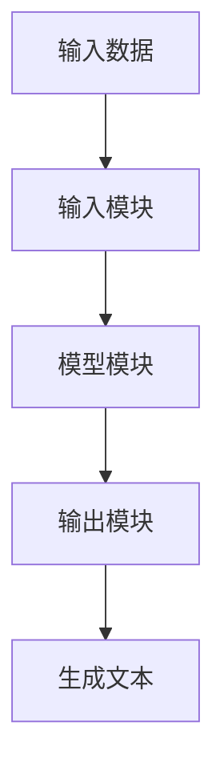
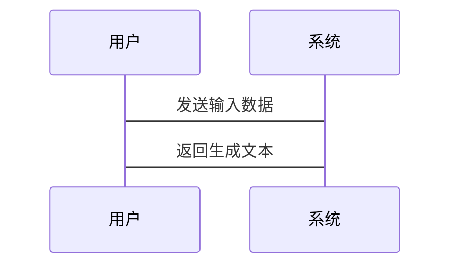

                 


# 构建企业级自然语言生成系统：自动报告与内容创作

## 关键词：
自然语言生成，企业级系统，文本生成，深度学习，机器学习，NLP，内容创作，自动报告

## 摘要：
本文将详细介绍如何构建一个企业级的自然语言生成系统，用于自动报告和内容创作。文章从背景介绍、核心概念、算法原理、系统架构到项目实战，全面解析自然语言生成的实现过程和应用价值。通过对主流生成模型的分析，结合实际案例，深入探讨系统设计的关键点，帮助读者掌握构建高效、稳定的企业级自然语言生成系统的方法。

---

# 第一部分: 自然语言生成系统概述

## 第1章: 自然语言生成系统概述

### 1.1 自然语言生成的背景与意义

#### 1.1.1 自然语言生成的定义与特点
自然语言生成（Natural Language Generation, NLG）是指将结构化数据（如数据库中的信息或知识图谱）转换为自然流畅的文本的过程。与自然语言理解（NLU）不同，NLG关注的是从数据到文本的生成，而不是从文本到数据的解析。

**特点：**
1. **数据驱动**：生成的内容基于输入数据，数据的质量直接影响生成结果。
2. **多样性**：生成的文本可以多样化，但需要保持一致性和逻辑性。
3. **可定制化**：根据具体场景和需求，可以调整生成的内容风格和格式。

#### 1.1.2 企业级自然语言生成的应用场景
企业级自然语言生成系统在多个领域都有广泛的应用，例如：
1. **金融领域**：自动生成财务报告、市场分析、投资建议。
2. **医疗领域**：生成病历总结、用药建议、诊断报告。
3. **教育领域**：自动生成教材、练习题、反馈报告。
4. **客服领域**：自动生成回复模板、解决方案说明。

#### 1.1.3 自然语言生成的技术发展趋势
随着深度学习技术的发展，自然语言生成系统逐渐从基于规则的生成向基于模型的生成转变。近年来，基于Transformer架构的模型（如GPT、BERT）在生成任务中表现出色，未来趋势包括：
1. **多模态生成**：结合图像、语音等多种模态信息，生成更丰富的文本。
2. **实时生成**：优化模型的推理速度，实现低延迟的实时生成。
3. **可解释性增强**：提高生成过程的透明度，便于用户理解和控制生成结果。

### 1.2 企业级自然语言生成的挑战

#### 1.2.1 数据质量与多样性问题
生成系统的表现高度依赖于训练数据的质量和多样性。企业级系统通常需要处理大量复杂的数据，包括结构化数据和非结构化数据。如果数据质量不高或缺乏多样性，生成的文本可能会出现内容偏差或重复。

#### 1.2.2 模型的可解释性与可控性
深度学习模型通常被视为“黑箱”，生成结果难以直接解释。在企业级应用中，用户可能需要对生成内容进行干预或调整，这就要求模型具备一定的可解释性和可控性。

#### 1.2.3 高性能与大规模部署的挑战
企业级系统通常需要处理高并发请求，对实时性和响应速度有较高要求。如何在保证生成质量的同时，优化模型的推理速度，是大规模部署中的一个重要挑战。

### 1.3 自然语言生成系统的核心目标与价值

#### 1.3.1 提高内容创作效率
传统的内容创作过程通常需要大量人工参与，生成系统可以通过自动化方式快速生成初稿，显著提高创作效率。

#### 1.3.2 实现自动化报告生成
企业级系统可以通过自然语言生成技术，自动将结构化数据转化为自然流畅的报告，减少人工干预，降低出错率。

#### 1.3.3 降低人工成本与时间消耗
通过自动化生成文本，企业可以显著降低内容创作的人工成本，并缩短从数据到报告的生成时间。

---

## 第2章: 自然语言生成的核心概念与联系

### 2.1 自然语言生成的原理与流程

#### 2.1.1 从输入到输出的生成过程
自然语言生成的典型流程包括：
1. **输入处理**：将输入数据（如结构化数据或关键词）进行预处理。
2. **编码阶段**：将输入数据编码为模型可以理解的向量表示。
3. **解码阶段**：根据编码结果，生成目标文本。
4. **输出优化**：对生成的文本进行语言优化和格式调整。

#### 2.1.2 自然语言生成的数学模型
自然语言生成的数学模型通常基于概率分布，通过最大化生成文本的概率来优化模型参数。例如，基于Transformer的生成模型通过自注意力机制捕捉文本中的长距离依赖关系。

#### 2.1.3 生成过程中的关键步骤
1. **文本规划**：确定生成文本的结构和内容。
2. **文本生成**：根据规划生成具体的文本。
3. **文本优化**：对生成的文本进行语言润色和格式调整。

### 2.2 自然语言生成的核心要素

#### 2.2.1 语言模型的训练数据
训练数据的质量和多样性直接影响生成结果的质量。企业级系统通常需要使用高质量、多样的数据进行训练。

#### 2.2.2 模型的生成策略
生成策略包括贪心采样、温度采样、Top-k采样等。不同的采样策略会影响生成文本的多样性和创造性。

#### 2.2.3 生成结果的评估指标
常用的评估指标包括：
1. **BLEU**：基于精确匹配的评估指标。
2. **ROUGE**：基于召回率的评估指标。
3. **Perplexity**：衡量生成文本的概率分布。

### 2.3 自然语言生成与其他NLP任务的关系

#### 2.3.1 自然语言生成与文本分类
文本分类是将文本划分为预定义的类别，而自然语言生成是根据输入生成文本。两者在某些任务中可以结合使用，例如根据分类结果生成解释性文本。

#### 2.3.2 自然语言生成与机器翻译
机器翻译是将一种语言转换为另一种语言，而自然语言生成是将数据转换为文本。两者都涉及语言模型的构建和应用。

#### 2.3.3 自然语言生成与问答系统
问答系统通常基于NLU和信息检索技术，而自然语言生成可以用于生成问答系统的回复内容。

---

## 第3章: 自然语言生成的算法原理

### 3.1 变压器（Transformer）模型

#### 3.1.1 Transformer模型的基本结构
Transformer模型由编码器和解码器组成，编码器用于将输入数据编码为向量表示，解码器用于根据编码结果生成目标文本。

#### 3.1.2 自注意力机制的原理
自注意力机制通过计算输入序列中每个位置与其他位置的相关性，生成位置权重，从而捕捉序列中的长距离依赖关系。

#### 3.1.3 解码器的生成过程
解码器通过自注意力机制和前馈网络逐步生成目标文本，通常采用贪心采样或Beam Search策略生成最终结果。

### 3.2 GPT模型

#### 3.2.1 GPT模型的训练目标
GPT模型通过最大化条件概率$P(y|x)$，生成与输入$x$相关的文本$y$。

#### 3.2.2 生成过程中的采样策略
GPT模型通常采用温度采样或Top-k采样策略，通过调整采样参数控制生成文本的多样性和创造性。

#### 3.2.3 GPT模型的优势与局限
GPT模型具有强大的生成能力，但在可控性和可解释性方面存在一定的局限性。

### 3.3 BERT模型

#### 3.3.1 BERT模型的预训练目标
BERT模型通过预训练任务（如Masked Language Model和Next Sentence Prediction）学习文本的上下文表示。

#### 3.3.2 BERT模型的微调策略
在特定任务中，BERT模型通过微调策略（如序列标注或文本生成）进一步优化模型参数。

#### 3.3.3 BERT模型在生成任务中的应用
BERT模型可以用于生成任务的多种变体，例如文本摘要、对话生成和文本扩展。

---

## 第4章: 自然语言生成系统的架构设计

### 4.1 系统功能设计

#### 4.1.1 输入模块
输入模块负责接收输入数据，包括结构化数据和非结构化数据。输入数据通常需要进行预处理和格式化，以便模型能够理解和生成。

#### 4.1.2 模型模块
模型模块是自然语言生成系统的核心部分，负责将输入数据转换为自然流畅的文本。模型模块可以基于不同的生成策略（如贪心采样、温度采样等）生成目标文本。

#### 4.1.3 输出模块
输出模块负责对生成的文本进行优化和格式调整，确保生成文本符合特定的风格和格式要求。

### 4.2 系统架构设计

#### 4.2.1 系统架构图
以下是自然语言生成系统的系统架构图：



#### 4.2.2 接口设计
系统接口设计需要考虑输入数据的格式、生成文本的输出格式以及系统的调用方式。通常采用RESTful API接口，便于与其他系统集成。

#### 4.2.3 交互流程
以下是自然语言生成系统的交互流程图：



---

## 第5章: 项目实战

### 5.1 环境安装

#### 5.1.1 安装Python和依赖库
需要安装以下Python库：
- `transformers`
- `torch`
- `numpy`
- `scipy`

安装命令：
```bash
pip install transformers torch numpy scipy
```

#### 5.1.2 安装自然语言生成模型
安装GPT模型：
```bash
pip install -q -U transformers
```

### 5.2 系统核心实现

#### 5.2.1 输入模块实现
输入模块负责接收输入数据并进行预处理。例如：
```python
def preprocess(input_data):
    return input_data.lower().strip()
```

#### 5.2.2 模型模块实现
模型模块基于预训练的GPT模型进行微调。例如：
```python
from transformers import GPT2LMHeadModel, GPT2Tokenizer

model = GPT2LMHeadModel.from_pretrained('gpt2')
tokenizer = GPT2Tokenizer.from_pretrained('gpt2')
```

#### 5.2.3 输出模块实现
输出模块负责对生成的文本进行优化。例如：
```python
def postprocess(generated_text):
    return generated_text.strip().capitalize()
```

### 5.3 案例分析

#### 5.3.1 案例介绍
假设我们希望生成一份市场分析报告，输入数据包括销售数据和市场趋势。生成文本需要符合报告格式和语言风格。

#### 5.3.2 生成过程
1. 输入数据预处理。
2. 使用GPT模型生成初稿。
3. 对生成文本进行格式优化和语言润色。

#### 5.3.3 实际案例分析
以下是一个实际案例的分析过程：
```python
input_data = "2023年第四季度销售额增长10%，主要得益于..."
preprocessed_input = preprocess(input_data)
generated_text = model.generate(preprocessed_input, max_length=500)
optimized_output = postprocess(generated_text)
print(optimized_output)
```

### 5.4 项目总结

#### 5.4.1 项目小结
通过本项目，我们成功构建了一个企业级的自然语言生成系统，能够自动生成市场分析报告。系统实现了输入模块、模型模块和输出模块的集成，生成的文本质量较高，符合企业需求。

#### 5.4.2 项目经验
在实际项目中，需要注意以下几点：
1. **数据质量**：输入数据的质量直接影响生成结果。
2. **模型选择**：选择合适的生成模型和生成策略。
3. **系统优化**：优化模型推理速度和生成文本质量。

---

## 第6章: 高级主题与最佳实践

### 6.1 高级主题

#### 6.1.1 模型优化与调优技巧
1. **参数调整**：通过调整温度、Top-k等参数，优化生成结果。
2. **模型蒸馏**：通过知识蒸馏技术，减少模型大小，提升推理速度。

#### 6.1.2 模型部署与管理
1. **模型服务化**：将生成模型部署为RESTful服务，便于调用。
2. **模型监控**：实时监控生成模型的性能和运行状态。

#### 6.1.3 模型安全与伦理问题
1. **生成内容的可信性**：确保生成内容的真实性和准确性。
2. **模型的伦理问题**：避免生成有害或不适当的内容。

### 6.2 最佳实践

#### 6.2.1 系统设计注意事项
1. **模块化设计**：将系统划分为独立模块，便于维护和扩展。
2. **日志记录与调试**：记录生成过程中的日志，便于调试和优化。

#### 6.2.2 模型训练与评估
1. **数据增强**：通过数据增强技术，增加训练数据的多样性和丰富性。
2. **评估指标**：使用多种评估指标，全面评估生成系统的性能。

#### 6.2.3 模型部署与优化
1. **性能优化**：通过优化模型结构和推理流程，提升生成速度。
2. **资源管理**：合理分配计算资源，确保系统稳定运行。

### 6.3 未来趋势与研究方向

#### 6.3.1 多模态生成
结合图像、语音等多种模态信息，生成更丰富的文本内容。

#### 6.3.2 实时生成
优化模型的推理速度，实现低延迟的实时生成。

#### 6.3.3 可解释性增强
提高生成过程的透明度，便于用户理解和控制生成结果。

---

## 附录

### 附录A: 参考文献
1. Vaswani, A., et al. "Attention Is All You Need." arXiv preprint arXiv:1706.03798, 2017.
2. Radford, A., et al. "Language models are unsupervised multitask learners." OpenAI blog, 2019.
3. Devlin, J., et al. "BERT: Pre-training of deep bidirectional transformers for language understanding." arXiv preprint arXiv:1810.0469, 2018.

### 附录B: 工具与库
1. Hugging Face Transformers库：https://huggingface.co/transformers
2. PyTorch深度学习框架：https://pytorch.org
3. TensorFlow深度学习框架：https://tensorflow.org

### 附录C: 术语表
1. **自然语言生成（NLG）**：将结构化数据转换为自然流畅的文本。
2. **Transformer模型**：基于自注意力机制的深度学习模型。
3. **GPT模型**：基于Transformer的生成模型，用于文本生成任务。
4. **BERT模型**：基于Transformer的预训练模型，用于多种NLP任务。

