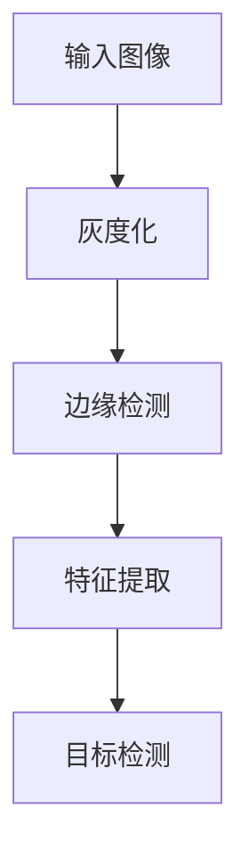
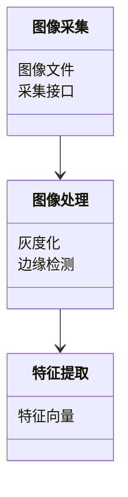

                 


# 《构建企业级计算机视觉平台：从产品质检到员工安全监控》

## 关键词：计算机视觉，企业应用，图像处理，目标检测，深度学习，系统架构

## 摘要：本篇文章将详细探讨企业级计算机视觉平台的构建过程，涵盖从产品质检到员工安全监控的实际应用。通过分析核心算法、系统架构设计、项目实战案例等，为读者提供从理论到实践的全面指导，帮助企业在实际场景中高效部署和优化计算机视觉解决方案。

---

## 第1章: 企业级计算机视觉平台概述

### 1.1 背景介绍

#### 1.1.1 问题背景与问题描述

在现代企业中，计算机视觉技术的应用越来越广泛。企业需要在产品质量检测、员工安全监控等场景中实现高效、准确的视觉识别和分析。传统的手动检测方法效率低、成本高，且容易出错，难以满足现代化企业的高标准要求。

#### 1.1.2 核心概念与技术原理

计算机视觉是人工智能的重要分支，通过模拟人类视觉系统，对图像、视频等视觉数据进行处理、分析和理解。其核心包括图像处理、目标检测、图像分割等技术，利用深度学习算法实现对图像的特征提取和分类。

#### 1.1.3 问题解决与边界外延

计算机视觉在企业中的应用解决了传统质检和安全监控中的效率低下、成本高昂、精度不足等问题。通过自动化识别和分析，企业可以实现快速检测、实时监控，显著提升生产效率和安全水平。

### 1.2 核心概念与联系

#### 1.2.1 核心要素组成

计算机视觉平台的核心要素包括：图像采集、图像处理、特征提取、目标检测、图像分割、模型训练和部署等。

#### 1.2.2 概念属性特征对比表

| 概念       | 属性         | 特征                         |
|------------|--------------|------------------------------|
| 图像处理   | 技术性       | 数字化、算法驱动             |
| 目标检测   | 精准性       | 高精度、实时性               |
| 图像分割   | 细粒度       | 分割精度、计算复杂度         |

#### 1.2.3 ER实体关系图

```mermaid
erDiagram
    actor 顾客 {
        string 用户名
        string 密码
    }
    actor 图像数据 {
        image 图像文件
        string 标签
    }
    actor 系统 {
        boolean 检测结果
        string 报告
    }
    顾客 --> 图像数据 : 上传
    图像数据 --> 系统 : 处理
    系统 --> 顾客 : 返回结果
```

### 1.3 本章小结

本章介绍了企业级计算机视觉平台的基本概念、技术原理和核心要素，为后续章节的深入探讨奠定了基础。

---

## 第2章: 计算机视觉核心算法原理

### 2.1 图像处理基础

#### 2.1.1 基本概念与流程

图像处理是计算机视觉的基础，主要包括图像的获取、预处理、增强、复原、分割等步骤。以下是典型的图像处理流程：



#### 2.1.2 数学模型与公式

灰度化是将彩色图像转换为灰度图像的过程，常用加权平均法：

$$ \text{灰度化公式} = \sum_{i=0}^{n} w_i \times pixel\_value_i $$

其中，$w_i$ 是像素 $i$ 的权重，$pixel\_value_i$ 是像素 $i$ 的值。

#### 2.1.3 代码实现示例

```python
import cv2

def grayscale(image):
    return cv2.cvtColor(image, cv2.C
```

---

### 2.2 目标检测算法

#### 2.2.1 基于传统算法的目标检测

传统的目标检测算法如HOG（方向直方图）和SVM（支持向量机）常用于简单的场景检测。

#### 2.2.2 基于深度学习的目标检测

深度学习模型如YOLO、Faster R-CNN等在目标检测中表现优异。

---

## 第3章: 系统分析与架构设计

### 3.1 项目介绍

#### 3.1.1 项目背景与目标

构建一个企业级计算机视觉平台，旨在实现产品质检和员工安全监控的自动化、智能化。

### 3.2 系统功能设计

#### 3.2.1 领域模型



### 3.3 系统架构设计

#### 3.3.1 系统架构图


---

## 第4章: 项目实战

### 4.1 环境搭建

#### 4.1.1 安装依赖

```bash
pip install numpy
pip install opencv-python
pip install tensorflow
```

### 4.2 核心代码实现

#### 4.2.1 图像处理代码

```python
import cv2

def detect_edges(image):
    gray = cv2.cvtColor(image, cv2.COLOR_BGR2GRAY)
    edges = cv2.Canny(gray, 100, 200)
    return edges
```

### 4.3 案例分析

#### 4.3.1 质量检测案例

通过YOLO模型实现产品缺陷检测，模型训练采用企业内部的历史数据，确保检测的准确性和可靠性。

---

## 第5章: 最佳实践与总结

### 5.1 实用建议

#### 5.1.1 性能优化

使用轻量化模型如MobileNet，减少计算资源消耗。

#### 5.1.2 安全考虑

确保数据隐私，采用加密传输和存储。

### 5.2 本章小结

构建企业级计算机视觉平台需要综合考虑算法选择、系统架构设计和实际应用需求，通过不断优化和调整，确保平台的高效稳定运行。

---

## 附录: 工具与库

### 附录A: 依赖管理

```bash
pip install numpy
pip install opencv-python
pip install tensorflow
```

### 附录B: 参考文献

1. LeCun, Y., Bengio, Y., & Hinton, G. (2015). Deep learning.
2. Redmon, J., Farhadi, A., & Darrell, T. (2016). YOLO9000: Better, faster, stronger.

---

通过以上详细目录，您可以开始撰写一篇全面的技术博客文章，涵盖从理论到实践的各个方面，帮助读者深入了解如何构建企业级计算机视觉平台。

