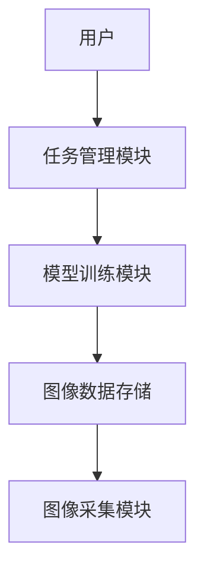
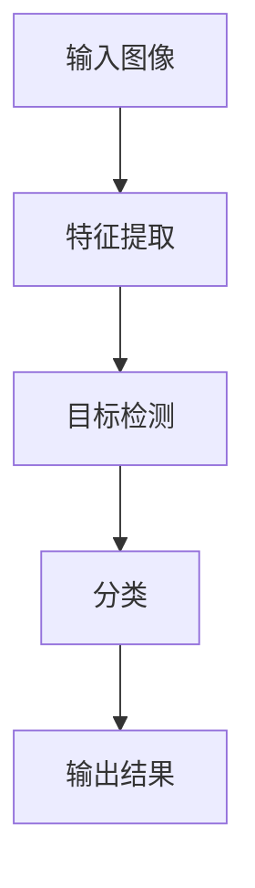
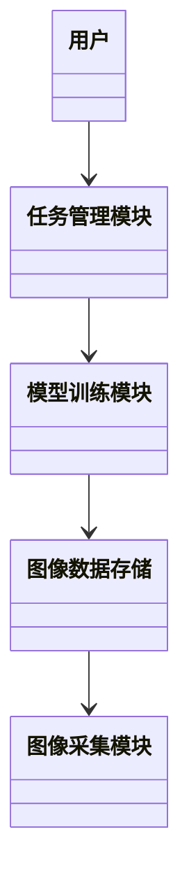
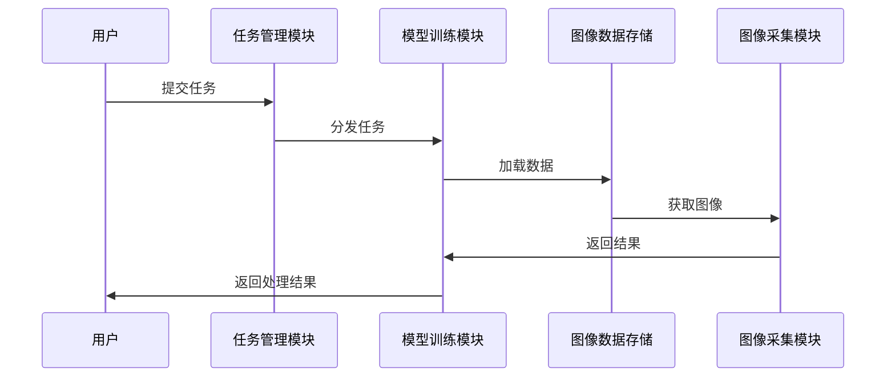

                 


# 构建企业级计算机视觉平台：从质检到安防的全面应用

## 关键词：企业级计算机视觉平台、计算机视觉、深度学习、目标检测、图像识别

## 摘要：  
企业级计算机视觉平台是现代企业智能化转型的重要基础设施。本文从计算机视觉的核心概念出发，详细阐述了企业级计算机视觉平台的系统架构、算法原理、核心技术和实际应用。通过对质检和安防领域的深入分析，展示了计算机视觉技术如何帮助企业实现智能化升级。文章还提供了从理论到实践的详细指导，包括算法实现、系统设计和项目实战等内容，为读者构建企业级计算机视觉平台提供了全面的技术支持和实践参考。

---

## 第一部分：引言

### 1.1 企业级计算机视觉平台的背景与意义  
在工业4.0和人工智能快速发展的背景下，企业级计算机视觉平台已成为企业智能化转型的核心技术之一。计算机视觉技术能够通过图像处理、目标检测、图像识别等手段，为企业提供高效的数据分析和决策支持。  

#### 1.1.1 计算机视觉的定义与应用领域  
计算机视觉（Computer Vision）是利用计算机对图像或视频进行分析和理解的技术。其应用领域包括但不限于：  
- **工业质检**：通过图像识别技术检测产品缺陷。  
- **安防监控**：通过目标检测技术实现人脸识别、行为分析等。  
- **智能交通**：通过图像处理技术实现车牌识别、交通流量监测等。  

#### 1.1.2 企业级计算机视觉平台的重要性  
企业级计算机视觉平台能够将计算机视觉技术与企业业务需求紧密结合，帮助企业在生产、质检、安防等领域实现智能化、自动化。  

#### 1.1.3 从质检到安防的全面应用价值  
计算机视觉技术的应用能够显著提高企业的生产效率、降低人工成本，并通过智能化监控提升安全性。  

### 1.2 本书的目标与读者定位  
本书旨在为读者提供构建企业级计算机视觉平台的全面指导，涵盖从理论到实践的各个环节。  

#### 1.2.1 本书的目标  
帮助读者掌握计算机视觉的核心技术，理解企业级平台的系统架构，并能够实际应用这些技术解决企业问题。  

#### 1.2.2 本书的读者定位  
- 技术人员：希望深入学习计算机视觉技术的企业IT人员。  
- 企业决策者：希望通过技术实现企业智能化转型的管理者。  

#### 1.2.3 本书的结构安排  
本书分为理论基础、算法原理、系统设计、项目实战等部分，内容从浅入深，层层递进。

---

## 第二部分：企业级计算机视觉平台的基础知识

### 2.1 计算机视觉的核心概念  
计算机视觉的核心是通过算法对图像进行分析和理解。  

#### 2.1.1 图像处理基础  
图像处理是计算机视觉的基础，包括图像的获取、预处理（如去噪、锐化）和特征提取。  

#### 2.1.2 深度学习与计算机视觉  
深度学习通过神经网络模型（如卷积神经网络CNN）实现图像识别、目标检测等任务。  

#### 2.1.3 目标检测与图像识别  
目标检测不仅需要识别图像中的目标，还需要定位目标的位置；图像识别则仅需识别目标的类别。  

### 2.2 计算机视觉的关键技术  
#### 2.2.1 图像分割技术  
图像分割将图像划分为多个区域，每个区域对应不同的语义信息。  

#### 2.2.2 特征提取与匹配  
特征提取通过提取图像中的关键特征（如SIFT、HOG）实现图像匹配和目标识别。  

#### 2.2.3 图像增强与数据预处理  
图像增强技术（如对比度调整、颜色校正）能够提升图像质量，帮助模型更好地学习特征。  

---

## 第三部分：企业级计算机视觉平台的核心概念与联系

### 3.1 计算机视觉平台的系统架构  
企业级计算机视觉平台通常包括数据采集、模型训练、推理部署等模块。  

#### 3.1.1 平台的整体架构设计  
- 数据采集模块：负责获取图像数据。  
- 模型训练模块：基于深度学习框架训练模型。  
- 推理部署模块：将训练好的模型部署到实际场景中。  

#### 3.1.2 数据流与功能模块划分  
- 数据预处理：包括图像归一化、标注处理等。  
- 模型训练：包括数据加载、模型构建、损失函数定义、优化器选择等。  
- 推理部署：包括模型加载、输入处理、输出结果解析等。  

#### 3.1.3 平台的可扩展性与灵活性  
通过模块化设计，企业级平台能够根据需求快速扩展功能模块。  

### 3.2 核心概念的原理与联系  
#### 3.2.1 图像特征提取的原理  
图像特征提取通过卷积操作提取图像的空间特征和语义信息。  

#### 3.2.2 目标检测算法的实现原理  
目标检测算法（如YOLO、Faster R-CNN）通过特征提取、边界框回归和分类实现目标检测。  

#### 3.2.3 图像识别模型的训练与优化  
图像识别模型的训练需要通过大量数据进行监督学习，并通过调整超参数优化模型性能。  

### 3.3 实体关系图与流程图  
#### 3.3.1 实体关系图（ER图）设计  
- 实体：图像数据、模型、用户、任务。  
- 关系：数据属于用户，任务由模型处理。  

#### 3.3.2 系统流程图（Mermaid）  


#### 3.3.3 核心算法流程图（Mermaid）  


---

## 第四部分：算法原理与数学模型

### 4.1 卷积神经网络（CNN）原理  
#### 4.1.1 卷积层的数学模型  
卷积层通过滑动窗口对输入数据进行卷积操作：  
$$ y = f(W \ast x + b) $$  
其中，\( W \) 是卷积核，\( x \) 是输入数据，\( b \) 是偏置项，\( f \) 是激活函数。  

#### 4.1.2 池化层的作用与数学表达  
池化层通过下采样减少计算量：  
$$ y_i = \max(x_{i,j}, x_{i,j+1}, x_{i,j+2}) $$  

#### 4.1.3 全连接层与激活函数  
全连接层将卷积层的输出展平，并通过全连接神经网络进行分类。  

### 4.2 目标检测算法原理  
#### 4.2.1 Faster R-CNN算法流程  
Faster R-CNN通过区域建议网络（RPN）生成候选框，再通过RoI池化提取特征并进行分类和回归。  

#### 4.2.2 YOLO算法的实现原理  
YOLO将目标检测问题转化为回归问题，通过单个网络直接预测边界框和类别概率。  

#### 4.2.3 检测模型的损失函数与优化方法  
目标检测模型通常使用多任务损失函数，包括分类损失和回归损失：  
$$ \mathcal{L} = \lambda_1 \mathcal{L}_{cls} + \lambda_2 \mathcal{L}_{reg} $$  

### 4.3 图像分割算法原理  
#### 4.3.1 U-Net网络结构  
U-Net通过跳跃连接实现特征的上下文聚合，适用于医学图像分割等任务。  

#### 4.3.2 深度可分离卷积的应用  
深度可分离卷积通过深度卷积和逐点卷积减少计算量。  

#### 4.3.3 图像分割的评价指标  
常用的评价指标包括IoU（交并比）、mAP（平均精度）。  

### 4.4 算法实现的Python代码示例  
#### 4.4.1 CNN模型的PyTorch实现  
```python
import torch
import torch.nn as nn
import torch.nn.functional as F

class SimpleCNN(nn.Module):
    def __init__(self):
        super(SimpleCNN, self).__init__()
        self.conv = nn.Conv2d(3, 6, kernel_size=3, stride=1, padding=1)
        self.pool = nn.MaxPool2d(2, 2)
        self.fc = nn.Linear(6 * 6 * 6, 10)

    def forward(self, x):
        x = self.conv(x)
        x = self.pool(x)
        x = x.view(-1, 6 * 6 * 6)
        x = self.fc(x)
        return x
```

---

## 第五部分：系统分析与架构设计方案

### 5.1 问题场景介绍  
#### 5.1.1 项目背景  
本文通过构建企业级计算机视觉平台，实现工业质检和安防监控的智能化。  

#### 5.1.2 项目介绍  
项目目标是开发一个支持多场景应用的计算机视觉平台。  

### 5.2 系统功能设计  
#### 5.2.1 领域模型类图（Mermaid）  


#### 5.2.2 系统架构设计（Mermaid）  


#### 5.2.3 系统接口设计  
- 用户接口：通过Web界面提交任务。  
- 数据接口：支持多种数据格式的输入输出。  

#### 5.2.4 系统交互流程图（Mermaid）  


---

## 第六部分：项目实战

### 6.1 环境安装  
- 安装Python、TensorFlow、PyTorch等工具。  

### 6.2 系统核心实现源代码  
#### 6.2.1 图像采集模块  
```python
import cv2

def capture_image():
    cap = cv2.VideoCapture(0)
    ret, frame = cap.read()
    if ret:
        cv2.imwrite("input.jpg", frame)
    cap.release()
```

#### 6.2.2 模型训练模块  
```python
import torch
import torch.nn as nn
import torch.optim as optim

class SimpleClassifier(nn.Module):
    def __init__(self):
        super(SimpleClassifier, self).__init__()
        self.conv = nn.Conv2d(3, 6, kernel_size=3, stride=1, padding=1)
        self.pool = nn.MaxPool2d(2, 2)
        self.fc = nn.Linear(6 * 6 * 6, 10)

    def forward(self, x):
        x = self.conv(x)
        x = self.pool(x)
        x = x.view(-1, 6 * 6 * 6)
        x = self.fc(x)
        return x

# 初始化模型和优化器
model = SimpleClassifier()
optimizer = optim.SGD(model.parameters(), lr=0.001)
criterion = nn.CrossEntropyLoss()

# 训练循环
for epoch in range(num_epochs):
    for batch in dataloader:
        inputs, labels = batch
        outputs = model(inputs)
        loss = criterion(outputs, labels)
        loss.backward()
        optimizer.step()
```

#### 6.2.3 推理部署模块  
```python
def detect_objects(image_path):
    model.eval()
    image = cv2.imread(image_path)
    image = preprocess(image)
    with torch.no_grad():
        outputs = model(image)
        # 解析输出并返回结果
    return results
```

### 6.3 代码应用解读与分析  
- 图像采集模块通过OpenCV获取图像数据。  
- 模型训练模块基于PyTorch框架，实现简单的分类任务。  
- 推理部署模块将训练好的模型应用于实际场景。  

### 6.4 实际案例分析  
以工业质检为例，通过目标检测技术识别产品中的缺陷。  

### 6.5 项目小结  
通过实际案例，展示了企业级计算机视觉平台的构建过程。

---

## 第七部分：总结与展望

### 7.1 总结  
企业级计算机视觉平台的构建需要结合理论与实践，通过深度学习技术实现智能化应用。  

### 7.2 未来展望  
随着AI技术的不断发展，企业级计算机视觉平台将更加智能化、自动化，并扩展到更多应用场景。  

### 7.3 最佳实践 Tips  
- 选择合适的深度学习框架。  
- 注重数据的质量和多样性。  
- 定期优化模型性能。  

---

通过本文的详细讲解，读者可以全面掌握构建企业级计算机视觉平台的核心技术与实践方法，为企业的智能化转型提供有力支持。

