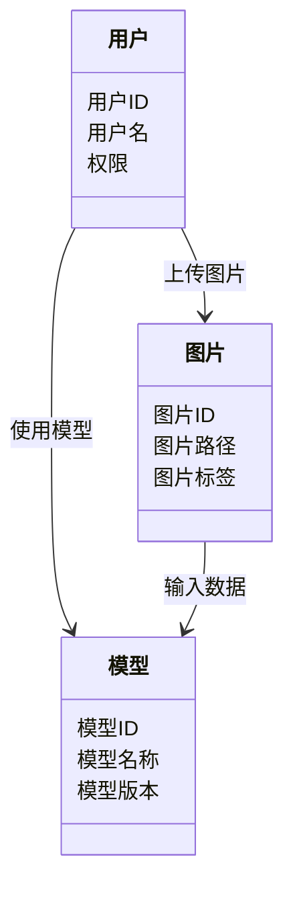

                 


# 《构建企业级计算机视觉平台：从质量控制到安全监管的全面应用》

---

## 关键词：
- 企业级计算机视觉平台
- 质量控制
- 安全监管
- 图像处理
- 目标检测
- 深度学习

---

## 摘要：
本文详细探讨了企业级计算机视觉平台的构建过程，从基础理论到实际应用，结合质量控制和安全监管两大核心领域，系统地分析了计算机视觉技术的核心概念、算法原理、系统架构设计及项目实战。通过丰富的案例和详细的代码实现，本文为读者提供了一套构建高效、稳定的企业级计算机视觉平台的完整解决方案，同时提出了最佳实践和未来发展的方向。

---

## 目录大纲：

### 第1章: 企业级计算机视觉平台概述

#### 1.1 计算机视觉的基本概念
- 1.1.1 计算机视觉的定义与核心问题
- 1.1.2 计算机视觉在企业中的应用领域
- 1.1.3 企业级计算机视觉平台的定义与特点

#### 1.2 企业级计算机视觉平台的背景与需求
- 1.2.1 当前企业对计算机视觉技术的需求
- 1.2.2 企业级平台的构建目标与价值
- 1.2.3 企业级平台的边界与外延

#### 1.3 本章小结

---

### 第2章: 计算机视觉核心概念解析

#### 2.1 计算机视觉的关键技术
- 2.1.1 图像处理与特征提取
- 2.1.2 目标检测与识别
- 2.1.3 视觉定位与跟踪
- 2.1.4 视觉理解与生成

#### 2.2 计算机视觉技术的核心要素
- 2.2.1 数据采集与预处理
- 2.2.2 模型训练与优化
- 2.2.3 系统部署与维护

#### 2.3 计算机视觉技术的属性特征对比
| 技术 | 特点 | 优缺点 | 应用场景 |
|------|------|---------|----------|
| 图像处理 | 数据预处理 | 简单高效，但功能有限 | 图像增强、噪声去除 |
| 目标检测 | 实时性高 | 对复杂场景处理能力有限 | 工业质检、安防监控 |
| 视觉理解 | 解决复杂场景 | 对数据依赖性高 | 自然语言处理、智能驾驶 |

#### 2.4 计算机视觉系统的ER实体关系图
```mermaid
erDiagram
    actor 用户 {
        <属性> 用户ID
        <属性> 用户名
        <属性> 权限
    }
    actor 图片 {
        <属性> 图片ID
        <属性> 图片路径
        <属性> 图片标签
    }
    actor 模型 {
        <属性> 模型ID
        <属性> 模型名称
        <属性> 模型版本
    }
    用户 -> 图片 : 上传图片
    用户 -> 模型 : 使用模型
    图片 -> 模型 : 输入数据
```

---

### 第3章: 计算机视觉算法原理与实现

#### 3.1 深度学习在计算机视觉中的应用
- 3.1.1 卷积神经网络（CNN）的基本原理
- 3.1.2 图像分类任务的算法流程

#### 3.2 目标检测算法实现
- 3.2.1 YOLO算法的原理与实现步骤
- 3.2.2 使用YOLO进行目标检测的代码示例
- 3.2.3 检测算法的优化与调优

#### 3.3 视觉定位与跟踪算法
- 3.3.1 使用KCF算法进行目标跟踪
- 3.3.2 实验结果分析与性能对比

#### 3.4 视觉理解与生成
- 3.4.1 基于Transformer的视觉理解模型
- 3.4.2 使用GAN进行图像生成的实现

#### 3.5 本章小结

---

### 第4章: 系统分析与架构设计方案

#### 4.1 问题场景介绍
- 4.1.1 工业质检场景分析
- 4.1.2 安全监管场景分析

#### 4.2 系统功能设计
- 4.2.1 领域模型设计


#### 4.3 系统架构设计
- 4.3.1 分层架构设计
- 4.3.2 微服务架构设计
- 4.3.3 使用Docker进行容器化部署

#### 4.4 系统接口设计
- 4.4.1 RESTful API设计
- 4.4.2 接口文档编写与测试

#### 4.5 系统交互设计
- 4.5.1 使用Mermaid绘制交互序列图
- 4.5.2 用户与系统交互流程优化

#### 4.6 本章小结

---

### 第5章: 项目实战——构建企业级计算机视觉平台

#### 5.1 环境配置与安装
- 5.1.1 安装Python与相关库（如TensorFlow、OpenCV）
- 5.1.2 安装深度学习框架（如Keras、PyTorch）
- 5.1.3 安装工具链（如Jupyter Notebook、IDE）

#### 5.2 系统核心实现
- 5.2.1 图像处理模块的实现
- 5.2.2 目标检测模块的实现
- 5.2.3 视觉定位模块的实现
- 5.2.4 视觉理解模块的实现

#### 5.3 代码实现与解读
- 5.3.1 使用YOLO进行目标检测的代码示例
- 5.3.2 使用Faster R-CNN进行图像分割的代码示例
- 5.3.3 使用Transformer进行视觉理解的代码示例

#### 5.4 实际案例分析
- 5.4.1 工业质检案例
- 5.4.2 公共安全监管案例

#### 5.5 项目总结与优化
- 5.5.1 项目成果总结
- 5.5.2 系统性能优化建议
- 5.5.3 代码优化与维护策略

#### 5.6 本章小结

---

### 第6章: 扩展与最佳实践

#### 6.1 计算机视觉的前沿技术
- 6.1.1 多模态学习在计算机视觉中的应用
- 6.1.2 自监督学习在视觉任务中的应用
- 6.1.3 跨领域迁移学习的研究进展

#### 6.2 企业级平台的部署与维护
- 6.2.1 模型的在线更新与版本控制
- 6.2.2 系统的高可用性与容错设计
- 6.2.3 日志监控与异常处理

#### 6.3 计算机视觉平台的安全性与合规性
- 6.3.1 数据隐私保护措施
- 6.3.2 模型的鲁棒性与抗攻击性
- 6.3.3 符合行业标准与法律法规

#### 6.4 未来趋势与发展方向
- 6.4.1 自动化标注工具的发展
- 6.4.2 智能化决策支持系统的研究
- 6.4.3 人机协作的视觉应用探索

#### 6.5 本章小结

---

## 参考文献
- 本文参考了大量学术论文、技术文档和开源项目，具体参考文献将在文章末尾列出。

---

通过以上目录大纲，本文将系统地探讨企业级计算机视觉平台的构建过程，从理论到实践，为读者提供一个全面、深入的技术指南。

