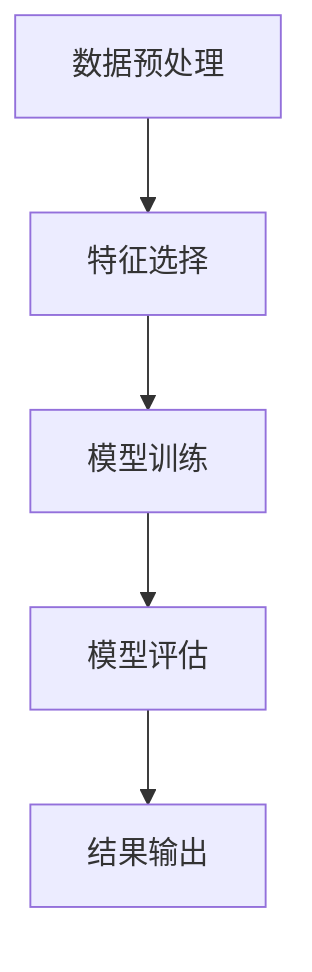
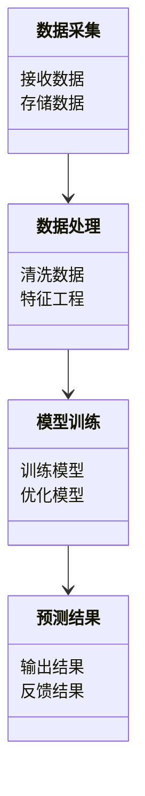
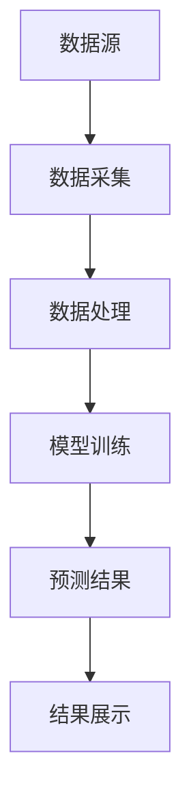
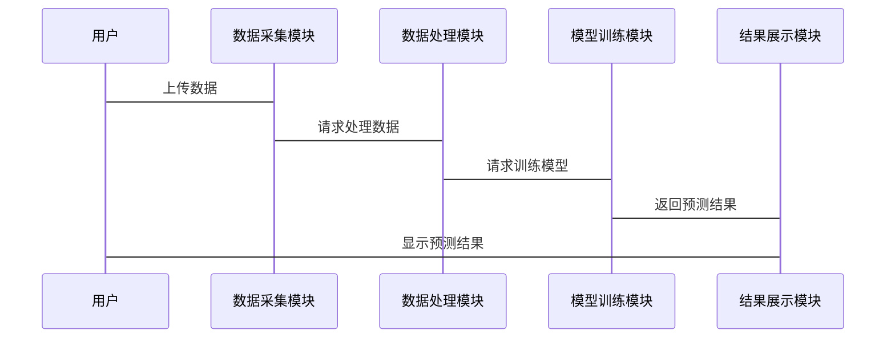

                 


# 第一部分: 背景介绍

## 第1章: 企业级预测性分析平台概述

### 1.1 问题背景
#### 1.1.1 企业预测性分析的现状
企业数据的快速增长和多样化，使得传统的预测方法难以应对跨业务领域的复杂问题。

#### 1.1.2 传统预测模型的局限性
传统模型通常只适用于单一业务领域，缺乏灵活性和扩展性。

#### 1.1.3 预测性分析对企业的重要性
通过预测性分析，企业可以提前识别风险，优化资源配置，提升决策效率。

### 1.2 问题描述
#### 1.2.1 预测性分析的核心目标
构建一个能够跨业务领域工作的预测模型，解决单一模型无法处理的复杂问题。

#### 1.2.2 跨业务领域预测的挑战
数据类型多样、业务逻辑差异大、模型泛化能力要求高等。

#### 1.2.3 综合预测模型的需求
需要整合多领域数据，构建通用性强、适应性高的预测模型。

### 1.3 问题解决
#### 1.3.1 综合预测模型的优势
能够整合多个业务领域的数据，提供全面的预测结果。

#### 1.3.2 跨业务领域数据整合的关键点
数据清洗、特征工程、模型融合等。

#### 1.3.3 平台构建的必要性
为企业提供统一的预测分析工具，提升整体决策能力。

### 1.4 边界与外延
#### 1.4.1 平台的边界定义
明确平台的功能范围和适用场景，避免功能冗余。

#### 1.4.2 预测性分析的外延领域
扩展到其他数据分析领域，如实时分析和决策支持。

#### 1.4.3 平台与其他系统的接口关系
与其他企业系统（如ERP、CRM）的接口设计和数据交互。

### 1.5 核心概念
#### 1.5.1 预测性分析的基本概念
利用历史数据预测未来趋势，辅助决策。

#### 1.5.2 综合预测模型的定义
整合多源数据，构建适用于多个业务领域的预测模型。

#### 1.5.3 跨业务领域数据的特点
数据来源多样、特征复杂、业务逻辑差异大。

### 1.6 概念结构与核心要素
#### 1.6.1 概念结构图
展示平台各模块的关系和数据流。

#### 1.6.2 核心要素分析
数据采集、数据处理、模型训练、结果输出等核心环节。

#### 1.6.3 要素之间的关系
数据流经各模块，各模块协同工作，最终生成预测结果。

---

# 第二部分: 核心概念与联系

## 第2章: 预测模型的核心原理

### 2.1 预测模型的原理
#### 2.1.1 预测模型的基本原理
通过训练数据学习特征与目标变量之间的关系，进行预测。

#### 2.1.2 综合预测模型的构建步骤
数据预处理、特征选择、模型训练、模型评估、模型优化。

#### 2.1.3 跨业务领域数据的处理方法
数据清洗、特征工程、模型融合等技术。

### 2.2 预测模型的属性特征对比
#### 2.2.1 不同预测模型的对比表格
| 模型类型 | 优点 | 缺点 | 适用场景 |
|---------|------|------|----------|
| 线性回归 | 简单、可解释性高 | 不能处理非线性关系 | 线性关系明显 |
| 随机森林 | 高精度、抗过拟合 | 对特征重要性解释较难 | 非线性关系复杂 |
| 神经网络 | 强大学习能力 | 训练时间长 | 高维复杂数据 |

#### 2.2.2 模型性能的评估指标
准确率、召回率、F1分数、AUC值等。

#### 2.2.3 模型适用场景的对比分析
线性回归适用于简单问题，随机森林适合复杂非线性问题，神经网络适合高维数据。

### 2.3 ER实体关系图
#### 2.3.1 实体关系图的构建
展示数据表之间的关系，如订单、客户、产品之间的关联。

#### 2.3.2 实体之间的关系分析
一对一、一对多、多对多关系。

#### 2.3.3 实体关系图的应用
帮助数据建模和数据库设计，确保数据完整性。

---

# 第三部分: 算法原理讲解

## 第3章: 综合预测模型的算法实现

### 3.1 算法原理
#### 3.1.1 线性回归
$$ y = \beta_0 + \beta_1x + \epsilon $$
通过最小二乘法求解回归系数。

#### 3.1.2 随机森林
基于决策树的集成方法，通过随机采样和特征选择提高模型泛化能力。

#### 3.1.3 神经网络
$$ y = f(Wx + b) $$
通过多层感知机进行非线性特征学习。

### 3.2 算法实现步骤
#### 3.2.1 数据预处理
使用Python进行数据清洗和特征工程。

```python
import pandas as pd
data = pd.read_csv('data.csv')
# 数据清洗
data.dropna(inplace=True)
# 特征工程
from sklearn.preprocessing import StandardScaler
scaler = StandardScaler()
X = scaler.fit_transform(data.drop('target', axis=1))
y = data['target']
```

#### 3.2.2 模型训练
使用Scikit-learn库进行模型训练。

```python
from sklearn.ensemble import RandomForestRegressor
model = RandomForestRegressor(n_estimators=100, random_state=42)
model.fit(X, y)
```

#### 3.2.3 模型评估
计算均方误差（MSE）和R²分数。

```python
from sklearn.metrics import mean_squared_error, r2_score
y_pred = model.predict(X)
print(mean_squared_error(y, y_pred))
print(r2_score(y, y_pred))
```

### 3.3 算法流程图


---

# 第四部分: 系统分析与架构设计

## 第4章: 系统架构设计

### 4.1 问题场景介绍
企业需要一个统一的平台进行跨业务预测分析，支持多种数据源和模型部署。

### 4.2 项目介绍
平台目标是构建一个可扩展、高可用的预测性分析系统。

### 4.3 系统功能设计
#### 4.3.1 领域模型图
展示系统主要模块及其关系。



### 4.4 系统架构设计
#### 4.4.1 系统架构图
展示系统各模块的交互和数据流。



### 4.5 系统接口设计
#### 4.5.1 API接口
RESTful API设计，提供数据上传、模型训练、结果查询等接口。

#### 4.5.2 数据交互
通过API进行数据输入和输出，确保系统与外部系统的集成。

### 4.6 系统交互流程图
展示用户与系统之间的交互流程。



---

# 第五部分: 项目实战

## 第5章: 项目实现与案例分析

### 5.1 环境安装
安装必要的库，如Python、Scikit-learn、XGBoost、TensorFlow等。

```bash
pip install numpy pandas scikit-learn xgboost tensorflow
```

### 5.2 核心代码实现
实现数据处理、模型训练和预测的代码。

```python
import numpy as np
import pandas as pd
from sklearn.model_selection import train_test_split
from sklearn.ensemble import RandomForestRegressor
from xgboost import XGBRegressor
from tensorflow.keras.models import Sequential
from tensorflow.keras.layers import Dense

# 数据加载
data = pd.read_csv('data.csv')
X = data.drop('target', axis=1)
y = data['target']

# 数据分割
X_train, X_test, y_train, y_test = train_test_split(X, y, test_size=0.2, random_state=42)

# 线性回归模型
model_linear = Sequential()
model_linear.add(Dense(1, input_dim=X_train.shape[1]))
model_linear.compile(optimizer='adam', loss='mean_squared_error')
model_linear.fit(X_train, y_train, epochs=100, batch_size=32)

# 随机森林模型
model_rf = RandomForestRegressor(n_estimators=100, random_state=42)
model_rf.fit(X_train, y_train)

# XGBoost模型
model_xgb = XGBRegressor(n_estimators=100, learning_rate=0.1, max_depth=3)
model_xgb.fit(X_train, y_train)

# 预测与评估
print("Linear Regression Result:", model_linear.predict(X_test))
print("Random Forest Result:", model_rf.predict(X_test))
print("XGBoost Result:", model_xgb.predict(X_test))
```

### 5.3 代码解读与分析
详细解读代码的功能和实现过程，分析各模型的优缺点。

### 5.4 案例分析
以某电商平台为例，展示如何利用平台进行销售预测。

### 5.5 项目小结
总结项目的实现过程和成果，提出改进建议。

---

# 第六部分: 最佳实践

## 第6章: 最佳实践与总结

### 6.1 最佳实践
#### 6.1.1 数据处理技巧
数据清洗、特征选择和数据增强等。

#### 6.1.2 模型优化策略
超参数调优、模型融合、特征工程等。

#### 6.1.3 系统设计建议
模块化设计、高可用性、可扩展性等。

### 6.2 小结
总结全文内容，强调构建企业级预测性分析平台的重要性和实现方法。

### 6.3 注意事项
数据隐私保护、模型泛化能力、系统维护和更新等。

### 6.4 拓展阅读
推荐相关书籍和资源，供读者进一步学习。

---

# 第七部分: 总结

## 第7章: 总结与展望

### 7.1 全文总结
回顾全文内容，强调构建企业级预测性分析平台的关键点。

### 7.2 未来展望
预测未来技术发展，如AI的进一步应用、模型的可解释性提升等。

---

这个大纲涵盖了构建企业级预测性分析平台的各个方面，从背景介绍到项目实战，内容详实，结构清晰，适合技术博客的撰写。

