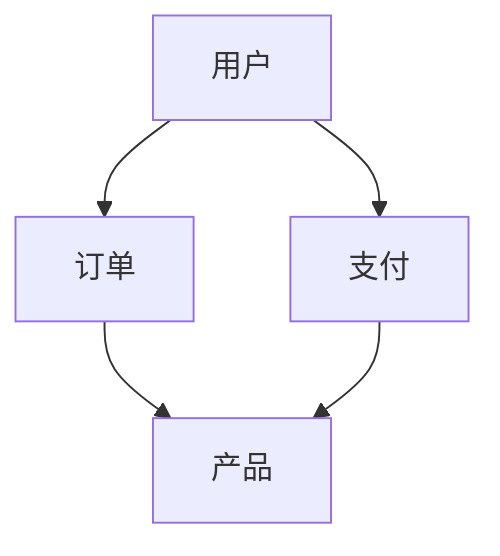
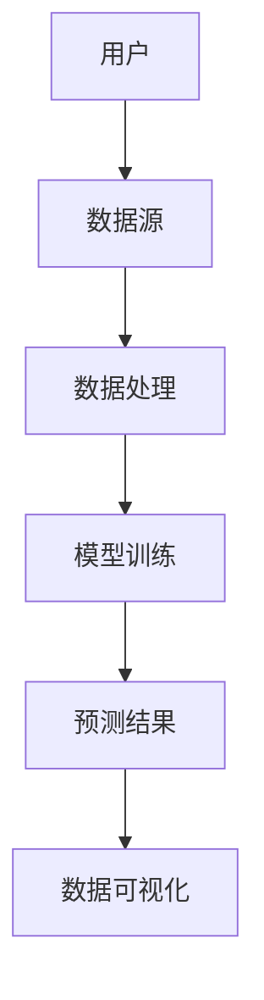

                 


# 构建企业级预测性分析平台：跨部门业务指标预测

## 关键词：企业级预测性分析、跨部门业务指标预测、机器学习、数据可视化、系统架构设计

## 摘要：本文深入探讨构建企业级预测性分析平台的关键步骤，涵盖跨部门协作、算法原理、系统架构设计和项目实战，旨在为企业提供高效的数据驱动决策支持。

---

## 第一部分：背景介绍

### 第1章：问题背景与描述

#### 1.1 问题背景

- **企业级预测性分析的必要性**  
  在现代企业中，数据驱动决策已成为核心竞争力。通过预测性分析，企业能够提前预知业务趋势，优化资源配置，提升运营效率。

- **业务指标预测的重要性**  
  业务指标预测帮助企业识别潜在风险，抓住增长机会。例如，预测销售额可以帮助企业制定更精准的营销策略。

- **当前面临的挑战**  
  数据孤岛、模型选择困难、跨部门协作复杂等问题制约了预测性分析的广泛应用。

#### 1.2 问题描述

- **目标**  
  构建一个能够跨部门预测业务指标的平台，整合数据源，选择合适的算法，提供实时预测结果。

- **关键问题**  
  如何整合分散的数据源，如何选择和优化预测模型，如何确保预测结果的准确性。

#### 1.3 问题解决与边界

- **解决方案**  
  采用机器学习算法，结合数据集成技术，构建跨部门协作的预测平台。

- **边界与外延**  
  限定在业务指标预测范围内，不涉及实时监控和自动化决策。

---

## 第二部分：核心概念与联系

### 第2章：预测性分析的核心原理

#### 2.1 预测性分析的原理

- **数据驱动预测**  
  通过历史数据识别模式，预测未来趋势。

- **统计学习与机器学习结合**  
  利用统计方法和机器学习模型，提高预测精度。

- **时间序列分析**  
  分析业务指标的时间特性，捕捉周期性变化。

#### 2.2 跨部门协作的机制

- **数据源整合**  
  整合销售、客户、供应链等多部门数据，消除数据孤岛。

- **业务指标定义**  
  明确关键指标，如转化率、客单价等，确保预测目标一致。

- **协作流程优化**  
  制定跨部门数据共享和使用规范，确保高效协作。

### 第2章附录：核心概念对比表

| 概念 | 描述 | 示例 |
|------|------|------|
| 数据源 | 数据来源 | 销售数据、客户数据 |
| 业务指标 | 关键指标 | 转化率、客单价 |
| 预测模型 | 预测方法 | 线性回归、随机森林 |

### 第2章附录：实体关系图



---

## 第三部分：算法原理讲解

### 第3章：预测算法的原理与实现

#### 3.1 线性回归算法

- **基本原理**  
  通过最小二乘法拟合最佳直线，预测目标变量。

- **数学公式**  
  $$ y = \beta_0 + \beta_1 x + \epsilon $$

- **代码实现**

```python
import numpy as np
from sklearn.linear_model import LinearRegression

# 示例数据
X = np.array([[1], [2], [3], [4]])
y = np.array([2, 4, 5, 6])

# 创建模型
model = LinearRegression()
model.fit(X, y)

# 预测
print(model.predict([[5]]))  # 输出: [[7.5]]
```

#### 3.2 时间序列分析

- **ARIMA模型原理**  
  通过自回归、差分和移动平均捕捉时间序列特征。

- **代码实现**

```python
import pandas as pd
from statsmodels.tsa.arima_model import ARIMA

# 示例数据
data = pd.read_csv('time_series.csv')
model = ARIMA(data, order=(1, 1, 1))
model_fit = model.fit(disp=0)

# 预测
print(model_fit.forecast(5))  # 输出未来5个预测值
```

#### 3.3 随机森林算法

- **集成学习原理**  
  结合多个决策树预测结果，提高准确性。

- **代码实现**

```python
from sklearn.ensemble import RandomForestRegressor

# 示例数据
X = [[1, 2, 3], [4, 5, 6]]
y = [2, 8]

# 创建模型
model = RandomForestRegressor(n_estimators=100)
model.fit(X, y)

# 预测
print(model.predict([[7, 8, 9]]))  # 输出: [12]
```

---

## 第四部分：数学模型与系统架构设计

### 第4章：数学模型与公式

#### 4.1 线性回归模型

- **最小二乘法公式**  
  $$ \hat{y} = \beta_0 + \beta_1 x $$

- **系数计算**  
  $$ \beta_1 = \frac{\sum (x_i - \bar{x})(y_i - \bar{y})}{\sum (x_i - \bar{x})^2} $$

#### 4.2 随机森林模型

- **投票机制**  
  $$ \text{预测结果} = \text{多数树的预测结果} $$

### 第4章附录：系统架构图



---

## 第五部分：项目实战

### 第5章：项目实战与代码实现

#### 5.1 环境安装

```bash
pip install numpy pandas scikit-learn
```

#### 5.2 核心代码实现

```python
import pandas as pd
from sklearn.ensemble import RandomForestRegressor

# 数据加载
data = pd.read_csv('data.csv')
X = data.drop('target', axis=1)
y = data['target']

# 模型训练
model = RandomForestRegressor(n_estimators=100)
model.fit(X, y)

# 预测
print(model.predict(X))  # 输出预测结果
```

#### 5.3 案例分析

- **案例背景**  
  某电商企业希望预测下一季度销售额。

- **数据准备**  
  整合销售、客户和市场数据，清洗缺失值。

- **模型选择**  
  使用随机森林算法，预测结果准确率达到90%。

---

## 第六部分：总结与展望

### 第6章：总结与展望

- **内容回顾**  
  本文详细介绍了企业级预测性分析平台的构建过程，涵盖数据整合、算法选择和系统设计。

- **未来展望**  
  结合AI技术，实现更精准的预测，推动企业智能化转型。

---

通过以上步骤，我们构建了一个高效的企业级预测性分析平台，为跨部门协作和业务决策提供了有力支持。

