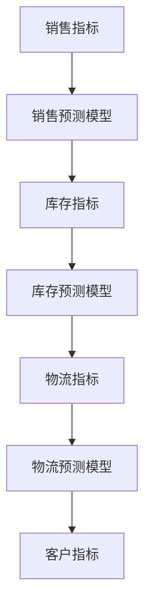
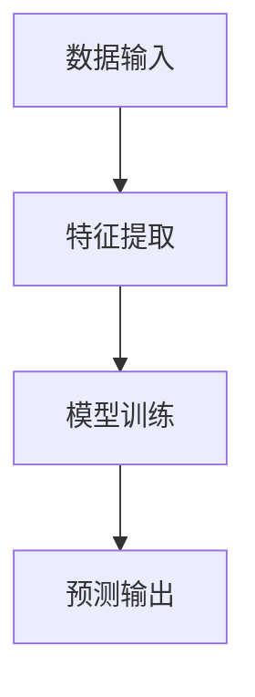
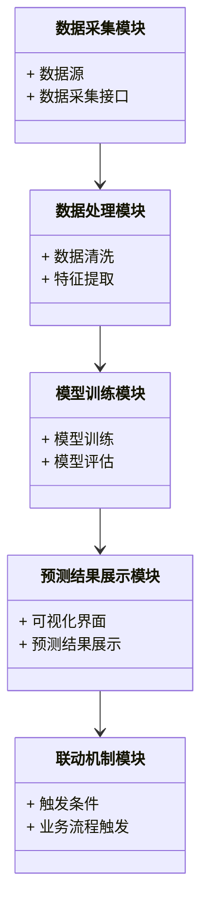
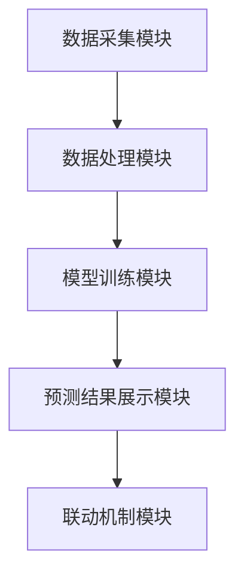

                 


# 构建企业级预测性分析平台：跨部门业务指标预测与联动

## 关键词：企业级预测性分析、跨部门业务指标、机器学习、预测模型、数据驱动决策

## 摘要：  
随着企业数据量的快速增长和复杂性增加，预测性分析已成为企业提升竞争力的关键手段。本文将深入探讨如何构建企业级预测性分析平台，实现跨部门业务指标的预测与联动。通过分析预测性分析的核心原理、算法实现、系统架构设计以及项目实战，为企业提供一套完整的解决方案，帮助企业在数据驱动的决策中获得竞争优势。

---

# 第一部分：企业级预测性分析平台概述

## 第1章：预测性分析平台的背景与价值

### 1.1 预测性分析的背景与需求

#### 1.1.1 企业预测性分析的背景
在当今数据驱动的时代，企业每天产生海量数据，从交易数据、用户行为数据到市场数据，如何利用这些数据为企业创造价值成为关键。预测性分析通过对历史数据的分析，挖掘数据背后的规律，帮助企业提前预测未来的业务趋势。

#### 1.1.2 预测性分析在企业中的价值
预测性分析可以帮助企业实现以下目标：
- **提前预警**：通过预测潜在风险，帮助企业提前采取措施。
- **优化决策**：基于数据驱动的预测结果，优化业务决策。
- **提升效率**：通过自动化预测和联动，减少人工干预，提升效率。

#### 1.1.3 预测性分析的应用范围与边界
预测性分析广泛应用于金融、零售、制造、医疗等多个行业，但其应用范围也受到数据质量和业务复杂性的限制。例如，对于实时性要求极高的业务场景，预测性分析可能需要更高的计算能力和更快的响应速度。

### 1.2 跨部门业务指标预测的必要性

#### 1.2.1 跨部门业务指标联动的重要性
企业中的业务指标往往是多部门协作的结果，例如销售、库存、物流等指标之间存在密切的关联性。通过跨部门的预测性分析，可以更好地理解这些指标之间的联动关系。

#### 1.2.2 跨部门预测性分析的核心目标
- **关联性分析**：发现不同部门业务指标之间的关联性。
- **预测联动效应**：预测某一部门的变化对其他部门的影响。
- **协同优化**：通过联动预测，优化企业整体运营效率。

#### 1.2.3 跨部门预测性分析的实施挑战
- **数据孤岛**：不同部门的数据往往分散在不同的系统中，难以整合。
- **模型复杂性**：跨部门预测需要考虑多个变量的交互作用，模型复杂性增加。
- **协同机制**：需要建立跨部门的协同机制，确保预测结果能够被有效应用。

### 1.3 预测性分析平台的核心概念

#### 1.3.1 预测性分析平台的定义
预测性分析平台是一个集成化的系统，通过整合企业内外部数据，利用机器学习算法，为企业提供业务指标的预测能力，并通过可视化界面为企业决策者提供支持。

#### 1.3.2 预测性分析平台的组成要素
- **数据采集模块**：从企业各个系统中采集数据。
- **数据处理模块**：对数据进行清洗、转换和特征提取。
- **模型训练模块**：基于历史数据训练预测模型。
- **预测结果展示模块**：将预测结果以可视化的方式呈现。
- **联动机制**：根据预测结果，触发相应的业务流程。

#### 1.3.3 预测性分析平台的核心功能
- **数据整合**：支持多种数据源的接入。
- **模型训练**：提供多种机器学习算法，支持模型调优。
- **预测结果展示**：提供直观的可视化结果。
- **联动功能**：根据预测结果，自动触发相关业务流程。

---

## 第2章：预测性分析的核心概念与联系

### 2.1 预测性分析的核心原理

#### 2.1.1 数据驱动的预测性分析
预测性分析的核心是基于数据的分析。通过历史数据，利用统计学和机器学习的方法，发现数据中的模式和规律，从而预测未来的趋势。

#### 2.1.2 业务指标预测的数学模型
预测性分析依赖于数学模型，常见的模型包括线性回归、随机森林、神经网络等。这些模型通过不同的算法，从数据中提取特征，建立预测模型。

#### 2.1.3 跨部门联动的逻辑架构
跨部门联动的逻辑架构包括以下几个步骤：
1. **数据采集**：从各个部门采集数据。
2. **数据预处理**：清洗和转换数据。
3. **特征提取**：提取关键特征。
4. **模型训练**：基于历史数据训练模型。
5. **预测结果展示**：将预测结果以可视化的方式呈现。
6. **联动触发**：根据预测结果，触发相关业务流程。

### 2.2 预测性分析的核心要素对比

#### 2.2.1 跨部门业务指标对比表
| 部门 | 销售指标 | 库存指标 | 物流指标 | 客户指标 |
|------|----------|----------|----------|----------|
| 销售部 | 销量     | 库存天数 | 运输时间 | 客户满意度 |
| 物流部 | 运输效率 | 库存周转率 | 运输成本 | 客户投诉率 |

#### 2.2.2 预测模型对比表
| 模型类型       | 优点                           | 缺点                           |
|----------------|--------------------------------|--------------------------------|
| 线性回归       | 简单，易于解释                 | 适合线性关系，不适合复杂场景 |
| 随机森林       | 适合非线性关系，鲁棒性高       | 黑箱模型，解释性差             |
| 神经网络       | 适合复杂非线性关系，精度高     | 需要大量数据，计算资源消耗大   |

#### 2.2.3 跨部门联动的对比分析
- **销售部与物流部的联动**：销量预测与物流运输时间的预测密切相关。
- **库存部与销售部的联动**：库存预测需要结合销售预测，避免库存积压或短缺。

### 2.3 跨部门实体关系架构



---

## 第3章：预测性分析算法原理与实现

### 3.1 常用预测性分析算法

#### 3.1.1 线性回归
线性回归是一种简单且常用的回归算法，适合处理线性关系的数据。

#### 3.1.2 随机森林
随机森林是一种基于决策树的集成算法，适合处理非线性关系的数据。

#### 3.1.3 神经网络
神经网络是一种模仿人脑神经网络结构的算法，适合处理复杂非线性关系的数据。

### 3.2 算法原理与流程图



### 3.3 算法实现与代码示例

#### 3.3.1 线性回归模型

```python
import numpy as np
from sklearn.linear_model import LinearRegression

# 示例数据
X = np.array([[1], [2], [3], [4]])
y = np.array([2, 4, 6, 8])

# 模型训练
model = LinearRegression()
model.fit(X, y)

# 预测
print(model.predict([[5]]))  # 输出: [[10]]
```

#### 3.3.2 线性回归公式
$$ y = \beta_0 + \beta_1 x + \epsilon $$

其中，$\beta_0$ 是截距，$\beta_1$ 是回归系数，$\epsilon$ 是误差项。

### 3.4 算法优化与调优

#### 3.4.1 线性回归的优缺点
- **优点**：简单，易于解释。
- **缺点**：只适合线性关系，对异常值敏感。

#### 3.4.2 随机森林的优化
- **参数调优**：调整树的棵数和树的深度。
- **特征选择**：使用特征重要性进行特征选择。

---

## 第4章：企业级预测性分析系统的架构设计

### 4.1 系统架构设计

#### 4.1.1 系统模块划分
- **数据采集模块**：负责从各个系统中采集数据。
- **数据处理模块**：对数据进行清洗、转换和特征提取。
- **模型训练模块**：基于历史数据训练预测模型。
- **预测结果展示模块**：将预测结果以可视化的方式呈现。
- **联动机制模块**：根据预测结果，触发相应的业务流程。

#### 4.1.2 系统功能设计



#### 4.1.3 系统架构设计



---

## 第5章：项目实战——构建企业级预测性分析平台

### 5.1 环境安装与配置

#### 5.1.1 安装Python环境
```bash
python --version
pip install numpy scikit-learn matplotlib
```

#### 5.1.2 安装Jupyter Notebook
```bash
pip install jupyter
jupyter notebook
```

### 5.2 系统核心实现

#### 5.2.1 数据准备

```python
import pandas as pd

# 示例数据
data = {
    '销量': [100, 200, 150, 300, 250],
    '库存': [50, 70, 60, 80, 75],
    '物流时间': [3, 4, 3, 5, 4],
    '客户满意度': [80, 75, 85, 80, 70]
}
df = pd.DataFrame(data)
print(df)
```

#### 5.2.2 特征工程

```python
from sklearn.preprocessing import StandardScaler

# 特征标准化
scaler = StandardScaler()
X_scaled = scaler.fit_transform(df[['销量', '库存', '物流时间']])
```

#### 5.2.3 模型训练

```python
from sklearn.linear_model import LinearRegression
from sklearn.metrics import mean_squared_error

# 训练模型
model = LinearRegression()
model.fit(X_scaled, df['客户满意度'])

# 预测结果
y_pred = model.predict(X_scaled)
print('预测结果:', y_pred)
print('均方误差:', mean_squared_error(df['客户满意度'], y_pred))
```

### 5.3 项目小结

#### 5.3.1 项目总结
- **数据准备**：从企业系统中采集数据，清洗数据，提取特征。
- **模型训练**：选择合适的算法，训练模型，评估模型性能。
- **预测结果展示**：将预测结果以可视化的方式呈现，便于决策者理解。
- **联动机制**：根据预测结果，触发相应的业务流程，优化企业运营效率。

#### 5.3.2 项目注意事项
- 数据质量：确保数据准确、完整。
- 模型选择：根据业务需求选择合适的算法。
- 可视化设计：确保预测结果直观易懂。

---

## 第6章：预测性分析平台的最佳实践与未来趋势

### 6.1 最佳实践

#### 6.1.1 数据管理
- 数据清洗：确保数据的准确性和完整性。
- 数据存储：选择合适的数据存储方案，支持高效查询。

#### 6.1.2 模型优化
- 模型调优：通过交叉验证优化模型参数。
- 模型解释：使用特征重要性分析解释模型。

#### 6.1.3 系统集成
- 系统集成：将预测性分析平台与企业现有系统集成。
- 系统扩展：支持高并发和大规模数据处理。

### 6.2 未来趋势

#### 6.2.1 AI与预测性分析的结合
- AI技术的引入将使预测性分析更加智能化。
- 自动化预测：AI能够自动选择最优模型，优化预测结果。

#### 6.2.2 实时预测
- 实时数据处理：支持实时数据流的处理，实现实时预测。
- 高频预测：在高频场景下，快速响应预测结果。

#### 6.2.3 可解释性预测
- 可解释性预测：通过模型解释性分析，帮助决策者理解预测结果。
- 透明化预测：确保预测过程的透明性，增强决策者的信任。

---

## 结语

构建企业级预测性分析平台是一个复杂的系统工程，需要企业在数据管理、算法选择、系统设计等多个方面进行综合考虑。通过本文的系统讲解和实战案例，希望能够为企业提供一套完整的解决方案，帮助企业实现跨部门业务指标的预测与联动，提升企业的数据驱动决策能力。

---

**感谢您的耐心阅读，希望本文对您有所帮助！**

