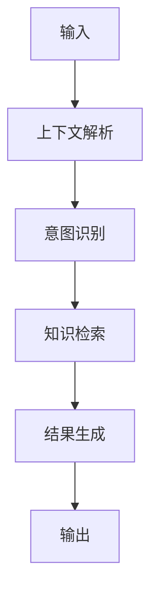
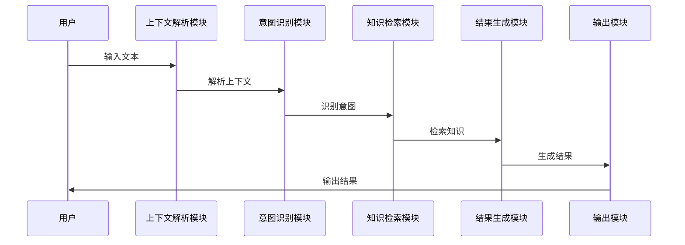

                 


# 构建具有上下文感知能力的AI Agent

## 关键词
AI Agent, 上下文感知, 自然语言处理, 知识图谱, 强化学习, 注意力机制, 深度学习

## 摘要
本文详细探讨了构建具有上下文感知能力的AI Agent的关键技术与方法。从背景介绍到核心概念，从算法原理到数学模型，从系统设计到项目实战，系统地阐述了如何让AI Agent具备理解上下文的能力，从而在复杂场景中实现更智能的交互与决策。通过实际案例分析，本文提供了从理论到实践的完整指南，帮助读者掌握构建上下文感知AI Agent的核心技术与应用。

---

# 第一部分: 构建具有上下文感知能力的AI Agent背景介绍

## 第1章: AI Agent概述

### 1.1 AI Agent的基本概念
#### 1.1.1 什么是AI Agent
AI Agent（人工智能代理）是指能够感知环境、自主决策并执行任务的智能体。它可以理解用户的输入、分析问题、执行操作并返回结果。AI Agent的核心目标是通过智能化的交互和决策，为用户提供高效、准确的服务。

#### 1.1.2 AI Agent的类型
AI Agent可以根据功能和应用场景分为多种类型：
- **简单反应式AI Agent**：基于当前输入做出反应，不依赖历史信息。
- **基于模型的反应式AI Agent**：依赖内部状态模型来决策。
- **目标驱动型AI Agent**：具有明确的目标，通过规划和推理实现目标。
- **学习型AI Agent**：通过机器学习不断优化自身性能。

#### 1.1.3 AI Agent的核心特征
AI Agent的核心特征包括：
1. **自主性**：能够在没有人工干预的情况下自主运行。
2. **反应性**：能够感知环境并实时做出反应。
3. **目标导向**：具备明确的目标，并通过规划和推理实现目标。
4. **学习能力**：能够通过数据和经验不断优化自身性能。

---

### 1.2 上下文感知能力的定义
#### 1.2.1 上下文感知的定义
上下文感知能力是指AI Agent能够理解当前对话或操作的上下文信息，包括用户的历史输入、当前状态、环境信息等。通过上下文感知，AI Agent可以更好地理解用户需求，提供更精准的服务。

#### 1.2.2 上下文感知的重要性
上下文感知能力是构建智能AI Agent的核心能力之一。它能够帮助AI Agent：
- 理解用户的意图和需求。
- 处理复杂场景中的多轮对话。
- 提供更准确、更个性化的服务。

#### 1.2.3 上下文感知的应用场景
上下文感知能力广泛应用于以下场景：
- **智能客服**：通过上下文理解用户需求，提供更精准的服务。
- **智能助手**：通过上下文理解用户的意图，提供更贴心的服务。
- **智能推荐**：基于上下文信息推荐相关内容。

---

## 第2章: 上下文感知AI Agent的背景与问题背景

### 2.1 当前AI Agent的发展现状
目前，AI Agent技术已经取得了显著进展，但在上下文感知能力方面仍存在不足。大多数AI Agent只能处理简单的任务，难以理解复杂的上下文信息。随着自然语言处理和深度学习技术的发展，构建具有上下文感知能力的AI Agent成为可能。

### 2.2 上下文感知能力的必要性
在复杂场景中，AI Agent需要理解用户的上下文信息，才能提供更智能的服务。例如，在医疗领域，AI Agent需要理解患者的病史和用药情况，才能提供准确的诊断建议。

### 2.3 问题背景与问题描述
当前的AI Agent在上下文感知能力方面存在以下问题：
1. **上下文信息不完整**：无法有效整合多源上下文信息。
2. **上下文理解能力有限**：难以理解复杂的上下文关系。
3. **上下文推理能力不足**：无法基于上下文信息进行推理和决策。

### 2.4 问题解决的思路与方法
构建具有上下文感知能力的AI Agent需要从以下几个方面入手：
1. **多源上下文信息整合**：整合用户输入、历史记录、环境信息等多源上下文信息。
2. **深度学习模型应用**：利用深度学习模型（如Transformer）进行上下文理解和推理。
3. **知识图谱构建**：构建领域知识图谱，帮助AI Agent更好地理解上下文信息。

### 2.5 边界与外延
上下文感知AI Agent的边界包括：
1. **输入范围**：限定输入的格式和类型。
2. **处理能力**：限定上下文理解的深度和广度。
3. **应用场景**：限定AI Agent的应用领域和场景。

### 2.6 核心要素组成
构建上下文感知AI Agent的核心要素包括：
1. **上下文解析模块**：负责解析上下文信息。
2. **意图识别模块**：负责识别用户的意图。
3. **知识检索模块**：负责检索相关知识。
4. **结果生成模块**：负责生成最终结果。

---

# 第二部分: 上下文感知AI Agent的核心概念与联系

## 第3章: 核心概念原理

### 3.1 上下文感知的原理
上下文感知的原理包括以下步骤：
1. **上下文解析**：解析用户输入的上下文信息。
2. **意图识别**：识别用户的意图。
3. **知识检索**：检索与意图相关的知识。
4. **结果生成**：生成符合意图的结果。

### 3.2 相关概念对比
以下是上下文感知与其他相关概念的对比：

| 概念         | 定义                                                                 | 特征                     |
|--------------|----------------------------------------------------------------------|--------------------------|
| 自然语言处理 | 通过计算机处理人类语言的技术。                                       | 强调语言理解和生成       |
| 知识图谱     | 通过图结构表示知识的技术。                                         | 强调知识的组织和关联     |
| 强化学习     | 通过试错机制优化决策的技术。                                       | 强调经验驱动的优化       |

### 3.3 核心概念的ER实体关系图
以下是上下文感知AI Agent的核心概念的ER实体关系图：

```mermaid
erd
  entity 上下文信息 {
    <<属性>>
    - 用户输入
    - 历史记录
    - 环境信息
  }

  entity 意图识别 {
    <<属性>>
    - 用户意图
    - 意图类型
  }

  entity 知识检索 {
    <<属性>>
    - 知识库
    - 检索结果
  }
```

---

## 第4章: 上下文感知AI Agent的算法原理

### 4.1 算法原理概述
上下文感知AI Agent的算法原理主要包括以下步骤：
1. **上下文解析**：利用自然语言处理技术解析用户输入的上下文信息。
2. **意图识别**：利用深度学习模型识别用户的意图。
3. **知识检索**：利用知识图谱检索与意图相关的知识。
4. **结果生成**：利用生成模型生成符合意图的结果。

### 4.2 算法原理的Mermaid流程图
以下是算法原理的Mermaid流程图：



### 4.3 算法实现的Python代码示例
以下是算法实现的Python代码示例：

```python
def context_parser(context):
    # 解析上下文的逻辑
    pass

def intent_recognition(text):
    # 意图识别的逻辑
    pass

def knowledge_retrieval(knowledge_base):
    # 知识检索的逻辑
    pass

def result_generator(results):
    # 结果生成的逻辑
    pass
```

---

## 第5章: 数学模型与公式

### 5.1 基础
上下文感知AI Agent的数学模型主要包括以下内容：
1. **自然语言处理模型**：如Transformer模型。
2. **意图识别模型**：如支持向量机（SVM）。
3. **知识检索模型**：如图嵌入模型。

以下是自然语言处理模型的数学公式示例：

$$
\text{Encoder}(x) = \text{LayerNorm}(\text{SelfAttention}(x))
$$

其中，$\text{SelfAttention}$表示自注意力机制，$\text{LayerNorm}$表示层归一化。

---

# 第三部分: 上下文感知AI Agent的系统分析与架构设计

## 第6章: 系统分析与架构设计方案

### 6.1 问题场景介绍
假设我们正在开发一个智能客服系统，用户会通过文字或语音与AI Agent交互，AI Agent需要理解用户的上下文信息，提供准确的客户服务。

### 6.2 系统功能设计
以下是系统的功能设计：

1. **上下文解析模块**：解析用户的输入，提取上下文信息。
2. **意图识别模块**：识别用户的意图。
3. **知识检索模块**：检索与意图相关的知识。
4. **结果生成模块**：生成符合意图的结果。

### 6.3 系统架构设计
以下是系统的架构设计：


### 6.4 系统接口设计
以下是系统的接口设计：

1. **输入接口**：接收用户的输入。
2. **输出接口**：输出最终结果。
3. **知识库接口**：与知识库进行交互。

### 6.5 系统交互设计
以下是系统的交互设计：



---

## 第7章: 项目实战

### 7.1 环境安装
以下是项目实战所需的环境安装步骤：

1. **安装Python**：确保安装了Python 3.8及以上版本。
2. **安装依赖库**：安装所需的依赖库，如TensorFlow、PyTorch等。

### 7.2 系统核心实现源代码
以下是系统核心实现的源代码：

```python
def context_parser(context):
    # 解析上下文的逻辑
    pass

def intent_recognition(text):
    # 意图识别的逻辑
    pass

def knowledge_retrieval(knowledge_base):
    # 知识检索的逻辑
    pass

def result_generator(results):
    # 结果生成的逻辑
    pass
```

### 7.3 代码应用解读与分析
以下是代码应用的解读与分析：

1. **上下文解析模块**：负责解析用户输入的上下文信息。
2. **意图识别模块**：负责识别用户的意图。
3. **知识检索模块**：负责检索与意图相关的知识。
4. **结果生成模块**：负责生成符合意图的结果。

### 7.4 实际案例分析和详细讲解剖析
以下是实际案例分析和详细讲解剖析：

假设用户输入“我需要预约医生”，AI Agent会解析上下文信息，识别用户的意图，并检索相关知识，最终生成预约结果。

### 7.5 项目小结
通过项目实战，我们掌握了构建上下文感知AI Agent的核心技术，包括上下文解析、意图识别、知识检索和结果生成。

---

## 第8章: 最佳实践

### 8.1 小结
构建上下文感知AI Agent需要从背景介绍到核心概念，从算法原理到数学模型，从系统设计到项目实战，系统地进行。

### 8.2 注意事项
在构建上下文感知AI Agent时，需要注意以下几点：
1. **数据质量**：确保数据的准确性和完整性。
2. **模型优化**：不断优化模型性能。
3. **用户体验**：注重用户体验设计。

### 8.3 拓展阅读
推荐以下拓展阅读：
1. **《深度学习入门：基于Python和TensorFlow》**
2. **《自然语言处理实战：基于Python和机器学习》**

---

# 结语
构建具有上下文感知能力的AI Agent是一项复杂的任务，需要综合运用多种技术。通过本文的系统讲解和项目实战，读者可以掌握构建上下文感知AI Agent的核心技术与应用。未来，随着技术的不断发展，上下文感知AI Agent将具有更广泛的应用前景。

