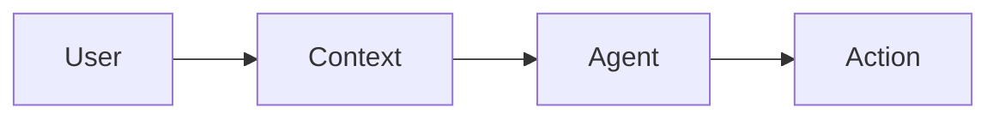
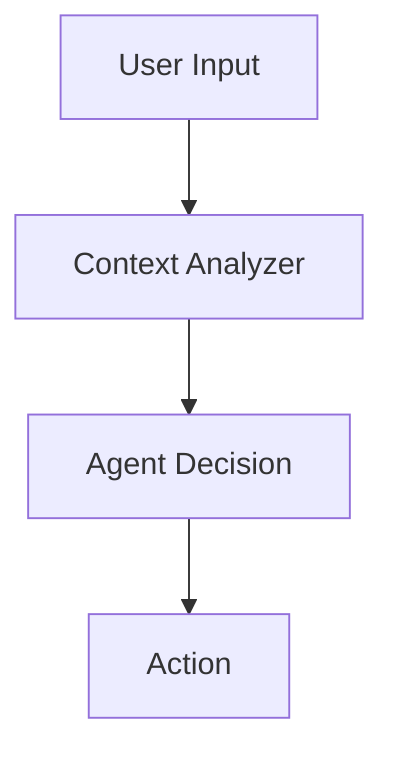
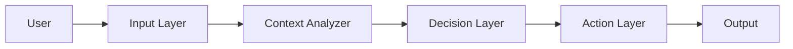
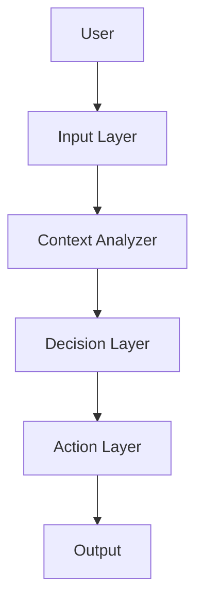

                 


# 构建具有上下文理解能力的AI Agent

## 关键词：AI Agent, 上下文理解, 自然语言处理, 智能系统, 系统架构

## 摘要：构建具有上下文理解能力的AI Agent是实现智能化系统的重要一步。本文通过系统地分析上下文理解的核心原理、AI Agent的架构设计，结合实际项目案例，详细阐述如何构建一个能够理解上下文的智能体。文章内容涵盖背景介绍、核心概念、算法实现、系统架构、项目实战等，为读者提供从理论到实践的全面指导。

---

# 第一部分: 构建具有上下文理解能力的AI Agent背景介绍

# 第1章: AI Agent与上下文理解概述

## 1.1 问题背景与描述

### 1.1.1 当前AI Agent的发展现状
AI Agent（人工智能代理）是一种能够感知环境、自主决策并执行任务的智能系统。随着深度学习和自然语言处理技术的快速发展，AI Agent在各个领域得到了广泛应用，如智能助手、推荐系统和自动驾驶等。

### 1.1.2 上下文理解在AI Agent中的重要性
上下文理解是指AI Agent能够基于当前对话或任务的背景信息，准确理解用户意图的能力。它是实现自然人机交互和复杂任务处理的关键。

### 1.1.3 问题解决的核心目标
构建具有上下文理解能力的AI Agent，核心目标是使其能够理解用户的意图和上下文信息，从而提供更精准的服务和决策支持。

## 1.2 核心概念与定义

### 1.2.1 AI Agent的基本概念
AI Agent是一种智能实体，能够通过感知环境和执行动作来实现特定目标。它具备自主性、反应性、社交能力和持续性等特征。

### 1.2.2 上下文理解的定义与特征
上下文理解是指AI Agent能够结合当前对话或任务的背景信息，理解用户的深层意图。其特征包括情境感知、意图识别和动态更新等。

### 1.2.3 两者之间的关系与区别
AI Agent通过上下文理解能力能够更好地与用户交互，提供更智能化的服务。上下文理解是AI Agent实现智能化的关键技术之一。

## 1.3 问题的边界与外延

### 1.3.1 AI Agent的适用场景
AI Agent适用于需要自主决策和人机交互的场景，如智能客服、智能家居和自动驾驶等。

### 1.3.2 上下文理解的局限性
上下文理解依赖于数据质量和模型性能，存在语义模糊和上下文漂移等问题。

### 1.3.3 相关技术的对比分析
对比传统AI Agent和具有上下文理解能力的AI Agent，后者在交互性和任务处理能力上有显著优势。

## 1.4 概念结构与核心要素

### 1.4.1 AI Agent的核心要素
AI Agent的核心要素包括感知模块、决策模块、执行模块和学习模块。

### 1.4.2 上下文理解的关键属性
上下文理解的关键属性包括情境感知、意图识别和动态更新。

### 1.4.3 两者的结合方式与系统架构
通过将上下文理解模块集成到AI Agent的感知模块中，实现对用户意图的准确理解。

## 1.5 本章小结
本章介绍了AI Agent和上下文理解的基本概念，分析了两者的关系和区别，并探讨了构建具有上下文理解能力的AI Agent的重要性和挑战。

---

# 第2章: 上下文理解与AI Agent的核心原理

## 2.1 核心概念原理

### 2.1.1 上下文理解的基本原理
上下文理解基于自然语言处理技术，通过分析文本中的语义信息，提取用户的意图和背景信息。

### 2.1.2 AI Agent的核心算法
AI Agent的核心算法包括自然语言处理模型（如BERT）、强化学习算法和决策树算法等。

### 2.1.3 两者结合的实现机制
通过将上下文理解模块与AI Agent的决策模块结合，实现对用户意图的准确识别和任务执行。

## 2.2 核心概念对比分析

### 2.2.1 上下文理解与传统NLP的对比
上下文理解注重动态背景信息，而传统NLP主要关注静态文本分析。

### 2.2.2 AI Agent与传统AI的区别
AI Agent具有自主性和社交能力，而传统AI主要专注于特定任务的计算。

### 2.2.3 系统架构的对比分析
基于上下文理解的AI Agent架构包括感知层、决策层和执行层，而传统AI系统通常不具备动态交互能力。

## 2.3 实体关系图与流程图

### 2.3.1 实体关系图（ER图）


### 2.3.2 核心流程图


## 2.4 本章小结
本章分析了上下文理解与AI Agent的核心原理，通过对比分析和图示，明确了两者的结合方式和系统架构。

---

# 第3章: 上下文理解与AI Agent的算法实现

## 3.1 算法原理

### 3.1.1 基于上下文理解的模型选择
选择适合的自然语言处理模型，如BERT或GPT，用于上下文理解任务。

### 3.1.2 AI Agent的核心算法
AI Agent的核心算法包括意图识别、对话管理和任务规划等。

### 3.1.3 两者结合的实现机制
通过将上下文理解模块嵌入到AI Agent的决策模块中，实现对用户意图的准确识别和任务执行。

## 3.2 算法实现

### 3.2.1 上下文理解的实现步骤
1. 数据预处理：对文本数据进行分词和标注。
2. 模型训练：使用预训练的自然语言处理模型进行微调。
3. 意图识别：基于上下文信息，识别用户的意图。

### 3.2.2 AI Agent的实现步骤
1. 系统初始化：加载模型和配置参数。
2. 用户输入处理：接收用户的输入并解析。
3. 上下文分析：结合历史对话信息，理解用户意图。
4. 决策与执行：根据用户意图，生成响应并执行任务。

## 3.3 数学公式

### 3.3.1 意图识别的数学模型
$$ P(y|x) = \frac{P(x|y)P(y)}{P(x)} $$

### 3.3.2 任务规划的数学模型
$$ \text{Value}(s) = \max_{a} [ \text{ Reward}(s,a) + \gamma \cdot \text{Value}(s') ] $$

## 3.4 本章小结
本章详细介绍了上下文理解和AI Agent的算法实现，通过具体的实现步骤和数学公式，明确了两者的结合方式和实现细节。

---

# 第4章: 系统架构与设计

## 4.1 系统架构设计

### 4.1.1 系统功能设计
系统功能包括用户交互、上下文分析、意图识别和任务执行等模块。

### 4.1.2 系统架构图


### 4.1.3 系统交互图


## 4.2 系统接口设计

### 4.2.1 输入接口设计
定义输入接口的API，包括用户输入和历史对话信息。

### 4.2.2 输出接口设计
定义输出接口的API，包括系统响应和任务执行结果。

## 4.3 本章小结
本章通过系统架构设计和接口设计，明确了构建具有上下文理解能力的AI Agent的整体结构和实现方式。

---

# 第5章: 项目实战

## 5.1 项目环境安装

### 5.1.1 系统需求
安装Python、TensorFlow和自然语言处理库。

### 5.1.2 环境配置
使用虚拟环境管理依赖项。

## 5.2 系统核心实现

### 5.2.1 上下文理解实现
代码示例：
```python
def context_analysis(text, history):
    # 实现上下文分析逻辑
    return intent, context
```

### 5.2.2 AI Agent实现
代码示例：
```python
class AI_Agent:
    def __init__(self, model):
        self.model = model
        # 初始化上下文
        self.context = {}
    
    def process_input(self, input_text):
        # 分析输入
        intent, context = context_analysis(input_text, self.context)
        # 更新上下文
        self.context = context
        # 执行任务
        self.execute_task(intent)
```

## 5.3 案例分析与解读

### 5.3.1 案例分析
以智能客服系统为例，展示上下文理解在实际项目中的应用。

### 5.3.2 代码实现解读
详细解读上下文理解和AI Agent的核心代码逻辑。

## 5.4 本章小结
本章通过实际项目案例，展示了构建具有上下文理解能力的AI Agent的实现过程和应用。

---

# 第6章: 最佳实践与总结

## 6.1 最佳实践

### 6.1.1 模型选择
选择适合的自然语言处理模型，确保上下文理解的准确性和效率。

### 6.1.2 系统优化
优化系统架构和接口设计，提高系统的性能和可扩展性。

## 6.2 小结
通过本文的系统介绍和实际案例分析，读者可以全面理解如何构建具有上下文理解能力的AI Agent。

## 6.3 注意事项

### 6.3.1 数据质量问题
确保训练数据的质量和多样性，避免模型偏差。

### 6.3.2 系统维护
定期更新模型和优化系统，保持AI Agent的性能和准确性。

## 6.4 拓展阅读
推荐相关的技术书籍和论文，帮助读者进一步深入学习。

---

# 附录: 代码示例

## 附录A: 上下文理解代码

```python
def context_analysis(text, history):
    # 实现上下文分析逻辑
    return intent, context
```

## 附录B: AI Agent代码

```python
class AI_Agent:
    def __init__(self, model):
        self.model = model
        self.context = {}
    
    def process_input(self, input_text):
        # 分析输入
        intent, context = context_analysis(input_text, self.context)
        # 更新上下文
        self.context = context
        # 执行任务
        self.execute_task(intent)
```

---

# 结语

通过本文的系统介绍和实际案例分析，读者可以全面理解如何构建具有上下文理解能力的AI Agent。希望本文能够为读者提供有价值的指导和启示，帮助他们在实际项目中更好地应用这些技术。

