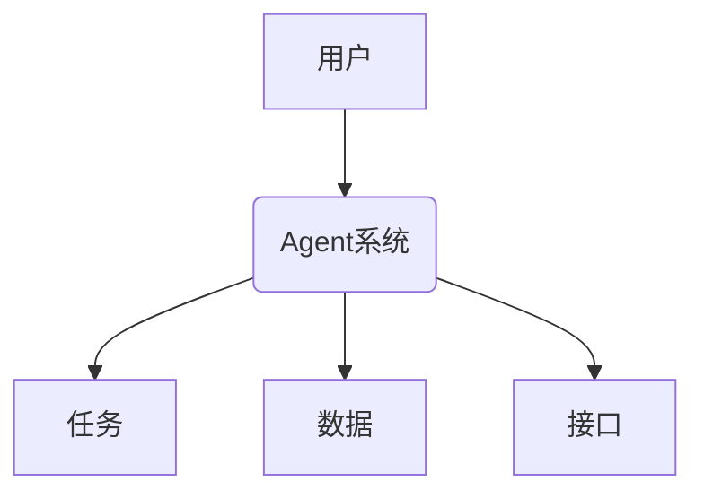
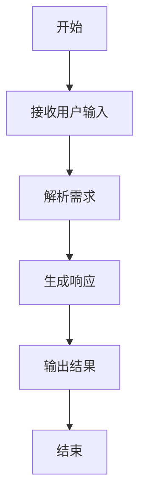

                 


# 构建具有人机协作能力的AI Agent系统

> 关键词：AI Agent，人机协作，系统架构，算法原理，项目实战

> 摘要：本文详细探讨了构建具有人机协作能力的AI Agent系统的各个方面。从背景介绍到核心概念，从算法原理到系统架构，再到项目实战，系统地分析了构建此类系统所需的关键技术和设计原则。通过本文，读者将能够理解AI Agent的基本原理，掌握人机协作的核心技术，并通过实际案例学习如何设计和实现一个高效的AI Agent系统。

---

## 第一部分: 背景与概念

### 第1章: 人机协作AI Agent系统概述

#### 1.1 问题背景
- **1.1.1 当前AI技术的发展现状**
  - 当前，人工智能技术发展迅速，尤其是在自然语言处理、机器学习和深度学习领域取得了显著进展。
  - AI Agent作为人工智能的重要应用形式，能够通过人机交互帮助用户完成复杂任务。
- **1.1.2 人机协作的需求与挑战**
  - 用户需求日益多样化，单靠传统自动化系统无法满足复杂场景的需求。
  - AI Agent需要具备理解用户意图、主动协作的能力，这对系统设计提出了更高要求。
- **1.1.3 AI Agent在实际场景中的应用价值**
  - 提高工作效率，降低人工成本。
  - 提供个性化服务，增强用户体验。
  - 支持复杂决策，提升决策效率。

#### 1.2 问题描述
- **1.2.1 什么是AI Agent**
  - AI Agent是一种能够感知环境、自主决策并执行任务的智能体。
  - 典型应用包括智能助手、推荐系统、自动驾驶等。
- **1.2.2 AI Agent的核心功能与特点**
  - 自主性：能够独立完成任务。
  - 反应性：能够实时感知并响应环境变化。
  - 协作性：能够与人类或其他智能体协作。
- **1.2.3 人机协作的定义与目标**
  - 人机协作是指人类与智能系统共同完成任务的过程。
  - 目标是通过人机协作提高任务完成效率和用户体验。

#### 1.3 问题解决
- **1.3.1 AI Agent的设计原则**
  - 用户中心：以用户体验为核心，设计友好交互界面。
  - 智能性：结合先进的人工智能技术，提升系统智能性。
  - 可扩展性：确保系统能够适应不同场景和需求。
- **1.3.2 人机协作的核心技术**
  - 自然语言处理：实现人机对话。
  - 任务规划：制定任务执行计划。
  - 多模态交互：支持多种交互方式。
- **1.3.3 系统架构的选择与优化**
  - 分层架构：将系统划分为感知层、决策层和执行层。
  - 模块化设计：确保系统各部分独立且易于维护。

#### 1.4 边界与外延
- **1.4.1 AI Agent的适用范围**
  - 适用于需要智能交互和协作的场景，如客服、教育、医疗等领域。
- **1.4.2 与传统AI系统的区别**
  - 传统AI系统通常专注于单一任务，而AI Agent具备多任务处理能力。
  - 传统AI系统不具备自主性和协作性，而AI Agent能够主动与用户协作完成任务。
- **1.4.3 未来发展的可能方向**
  - 更强的自主决策能力。
  - 更高效的协作机制。
  - 更广泛的行业应用。

#### 1.5 概念结构与核心要素
- **1.5.1 AI Agent的组成要素**
  - 用户：系统的服务对象。
  - 任务：系统需要完成的目标。
  - 数据：系统运行所需的信息。
  - 接口：系统与外界交互的通道。
- **1.5.2 人机协作的实现机制**
  - 交互机制：用户与系统通过多种方式交互。
  - 协作机制：系统根据用户需求调整行为。
- **1.5.3 系统的核心功能模块**
  - 输入解析模块：解析用户输入并生成系统响应。
  - 任务规划模块：制定任务执行计划。
  - 输出生成模块：生成符合用户需求的输出。

### 第2章: 核心概念与联系

#### 2.1 核心概念原理
- **2.1.1 AI Agent的基本原理**
  - AI Agent通过感知环境、分析任务需求，生成相应动作以完成任务。
  - 其中，感知环境是通过多种传感器或数据输入接口完成的。
  - 任务规划是基于当前状态和目标，生成一系列动作以达到目标。
- **2.1.2 人机协作的实现机制**
  - 基于自然语言处理技术实现人机对话。
  - 通过上下文理解和意图识别实现协作。
  - 结合反馈机制不断优化协作效果。
- **2.1.3 系统的核心算法与技术**
  - 基于强化学习的决策算法。
  - 基于深度学习的自然语言处理技术。
  - 基于图论的任务规划算法。

#### 2.2 概念属性特征对比
- **2.2.1 AI Agent与传统AI系统的对比**
  | 特性               | AI Agent                      | 传统AI系统                 |
  |--------------------|-------------------------------|---------------------------|
  | 自主性             | 高                           | 低                       |
  | 可协作性           | 高                           | 低                       |
  | 适应性             | 强                           | 弱                       |
- **2.2.2 人机协作与自动化系统的区别**
  | 特性               | 人机协作                     | 自动化系统                 |
  |--------------------|-----------------------------|--------------------------|
  | 交互方式           | 双向互动                     | 单向操作                 |
  | 系统响应           | 根据用户反馈调整行为         | 按预设流程执行           |
  | 适用场景           | 需要灵活协作的复杂场景       | 简单重复性任务           |
- **2.2.3 不同类型AI Agent的特征分析**
  - 智能助手类：如Siri、Alexa，具备语音交互和任务执行能力。
  - 机器人类：如工业机器人、服务机器人，具备物理交互能力。
  - 软件代理类：如推荐系统、自动化工具，主要通过软件形式提供服务。

#### 2.3 ER实体关系图


---

## 第二部分: 算法原理讲解

### 第3章: 算法原理讲解

#### 3.1 算法原理
- **3.1.1 强化学习算法**
  - 强化学习是一种通过试错机制来优化决策策略的算法。
  - 在AI Agent中，强化学习用于任务规划和决策优化。
  - 基于状态、动作和奖励的三元组（S, A, R）进行学习。
- **3.1.2 对话生成算法**
  - 对话生成算法用于实现人机交互中的自然语言理解与生成。
  - 基于Transformer架构的预训练模型（如GPT）进行微调。
  - 通过上下文理解和意图识别生成合适的回复。
- **3.1.3 任务规划算法**
  - 任务规划算法用于生成任务执行的具体步骤。
  - 基于图搜索算法（如A*算法）或基于规划树的算法。
  - 结合领域知识和任务约束生成最优计划。

#### 3.2 算法流程图


#### 3.3 算法数学模型与公式
- **强化学习的数学模型**
  $$ R = r_1 + r_2 + \dots + r_n $$
  其中，\( R \) 是总奖励，\( r_i \) 是第i步获得的奖励。
  $$ Q(s, a) = Q(s, a) + \alpha (r + \gamma \max Q(s', a') - Q(s, a)) $$
  其中，\( \alpha \) 是学习率，\( \gamma \) 是折扣因子。
- **对话生成的数学模型**
  $$ P(y|x) = \prod_{i=1}^{n} P(y_i|y_{<i}, x) $$
  其中，\( y \) 是生成的序列，\( x \) 是输入序列。
  $$ y_i \sim P(y_i|y_{<i}, x) $$
  这是基于条件概率的生成过程。

---

## 第三部分: 系统分析与架构设计

### 第4章: 系统分析与架构设计

#### 4.1 问题场景介绍
- **系统目标**
  - 提供高效的人机协作服务。
  - 支持多种交互方式和任务类型。
- **项目介绍**
  - 开发一个支持多任务处理的AI Agent系统。
  - 系统具备自然语言理解和生成能力。

#### 4.2 系统功能设计
- **领域模型设计**
  ```mermaid
  classDiagram
      class 用户 {
          id
          姓名
          邮箱
      }
      class 任务 {
          id
          名称
          描述
          状态
      }
      class 数据 {
          id
          类型
          内容
      }
      用户 --> 任务
      用户 --> 数据
      任务 --> 数据
  ```

#### 4.3 系统架构设计
- **系统架构图**
  ```mermaid
  graph LR
      A[用户] --> B(输入解析模块)
      B --> C[任务规划模块]
      C --> D[输出生成模块]
      D --> E[用户]
  ```

#### 4.4 系统接口设计
- **输入接口**
  - 支持文本输入、语音输入等多种形式。
- **输出接口**
  - 文本输出、语音输出、动作执行等多种形式。

#### 4.5 系统交互设计
- **交互序列图**
  ```mermaid
  sequenceDiagram
      用户 ->> 输入解析模块: 发送请求
      输入解析模块 ->> 任务规划模块: 分析需求
      任务规划模块 ->> 输出生成模块: 生成响应
      输出生成模块 ->> 用户: 返回结果
  ```

---

## 第四部分: 项目实战

### 第5章: 项目实战

#### 5.1 环境安装
- **安装Python**
  - 安装Python 3.8或更高版本。
- **安装依赖库**
  - 使用pip安装必要的库：
    ```
    pip install numpy pandas scikit-learn transformers
    ```

#### 5.2 系统核心实现源代码
- **输入解析模块**
  ```python
  import transformers

  class InputParser:
      def __init__(self):
          self.model = transformers.AutoModel.from_pretrained('bert-base')

      def parse(self, input_str):
          # 解析输入并生成响应
          return self.model.generate(input_str)
  ```

- **任务规划模块**
  ```python
  from graphviz import Source

  class TaskPlanner:
      def __init__(self):
          self.graph = Source('''
              digraph {
                  A -> B -> C -> D
              }
          ')

      def plan(self, start, end):
          # 根据图结构生成任务计划
          return self.graph.shortest_path(start, end)
  ```

- **输出生成模块**
  ```python
  import numpy as np

  class OutputGenerator:
      def __init__(self):
          self.model = transformers.AutoModel.from_pretrained('gpt2')

      def generate(self, task_description):
          # 根据任务描述生成输出
          return self.model.generate(task_description)
  ```

#### 5.3 代码应用解读与分析
- **代码解读**
  - `InputParser` 类负责解析用户输入并生成系统响应。
  - `TaskPlanner` 类基于图结构进行任务规划。
  - `OutputGenerator` 类根据任务描述生成最终输出。
- **代码分析**
  - 使用了预训练的模型来提高系统的智能化水平。
  - 通过模块化设计提高了系统的可维护性和扩展性。

#### 5.4 实际案例分析
- **案例背景**
  - 用户需要一个智能助手帮助完成日常任务。
- **案例分析**
  - 用户发送请求：“提醒我明天上午10点开会。”
  - 系统解析输入并生成响应：“好的，我会在明天上午10点提醒您开会。”
  - 系统通过任务规划模块将任务加入提醒列表。
  - 系统通过输出生成模块生成提醒信息并发送给用户。

#### 5.5 项目小结
- **项目总结**
  - 成功实现了一个人机协作的AI Agent系统。
  - 系统具备输入解析、任务规划和输出生成三大核心功能。
  - 系统架构合理，代码结构清晰。

---

## 第五部分: 总结与展望

### 第6章: 总结与展望

#### 6.1 最佳实践 tips
- **模块化设计**
  - 确保系统各部分独立且易于维护。
- **算法选择**
  - 根据具体需求选择合适的算法。
- **用户体验**
  - 注重用户体验，设计友好的交互界面。

#### 6.2 小结
- 通过本文的介绍，读者可以系统地了解构建具有人机协作能力的AI Agent系统的各个方面。
- 从理论到实践，文章详细讲解了系统设计、算法实现和项目实战等内容。

#### 6.3 注意事项
- **数据安全**
  - 确保用户数据的安全性和隐私性。
- **系统稳定性**
  - 提高系统的容错能力和恢复能力。
- **性能优化**
  - 不断优化系统性能，提升用户体验。

#### 6.4 拓展阅读
- **推荐书籍**
  - 《人工智能：一种现代的方法》
  - 《深度学习》
- **推荐博客**
  - 运维之美：[https://yinbo.blog](https://yinbo.blog)
  - 专注于人工智能与运维结合的创新研究与实践。

---

通过本文的详细讲解，读者可以系统地掌握构建具有人机协作能力的AI Agent系统的知识和技能。从背景介绍到核心概念，从算法原理到系统架构，再到项目实战，文章内容全面，逻辑清晰，能够帮助读者在实际应用中设计和实现高效的AI Agent系统。

