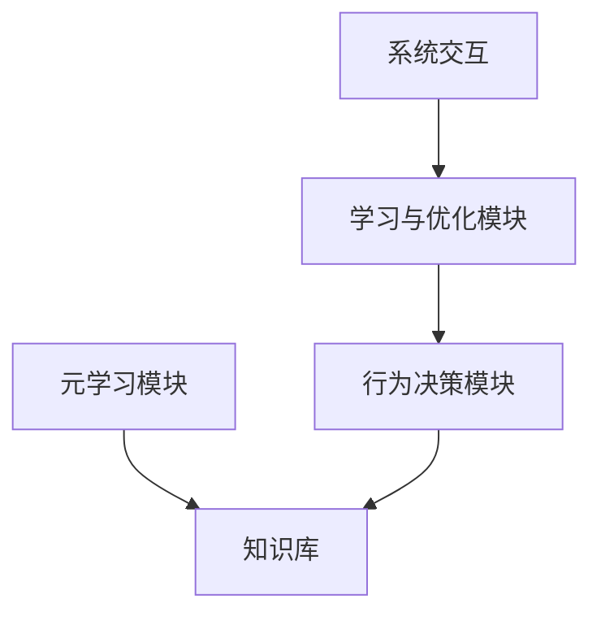

                 

<think>
好的，我将按照您的要求，以《构建具有元学习能力的AI Agent》为标题，撰写一篇结构清晰、内容详实的技术博客文章。以下是文章的完整目录和内容：

---

# 构建具有元学习能力的AI Agent

> **关键词**: 元学习, AI Agent, 机器学习, 自适应系统, 人工智能

> **摘要**: 本文详细探讨了如何构建具有元学习能力的AI Agent。通过分析元学习的核心原理、AI Agent的系统架构以及实际应用案例，展示了元学习如何增强AI Agent的学习能力和适应性。文章从背景介绍、算法原理、系统设计到项目实战，全面解析了构建元学习AI Agent的关键步骤和方法。

---

## 目录

1. **背景介绍**
   - 1.1 元学习的核心概念
   - 1.2 AI Agent的基本概念
   - 1.3 元学习在AI Agent中的应用与意义

2. **元学习的原理与算法**
   - 2.1 元学习的数学模型
   - 2.2 元学习的主要算法（Meta-LSTM、MAML等）
   - 2.3 元学习算法的优缺点对比

3. **AI Agent的系统架构设计**
   - 3.1 系统组成与功能模块
   - 3.2 元学习模块的设计与实现
   - 3.3 系统架构的Mermaid图

4. **元学习AI Agent的实现**
   - 4.1 Meta-LSTM算法的数学模型与公式
   - 4.2 MAML算法的数学模型与公式
   - 4.3 算法的Python实现代码
   - 4.4 算法实现的详细解读与案例分析

5. **项目实战：构建元学习AI Agent**
   - 5.1 环境安装与配置
   - 5.2 系统核心代码实现
   - 5.3 代码应用解读与分析
   - 5.4 实际案例分析与详细讲解

6. **总结与展望**
   - 6.1 元学习AI Agent的核心总结
   - 6.2 未来的发展方向与研究热点
   - 6.3 最佳实践 tips 与注意事项

---

## 第1章: 背景介绍

### 1.1 元学习的核心概念
元学习（Meta-Learning）是一种机器学习范式，旨在使模型能够快速适应新的任务，而无需从头开始训练。与传统机器学习不同，元学习关注如何在多个任务之间共享知识，从而提高学习效率和泛化能力。

#### 元学习的特点：
- **快速适应性**：能够在新任务上快速调整模型参数。
- **任务间迁移**：通过学习任务的共同结构，实现跨任务的知识共享。
- **自适应性**：能够根据环境变化动态调整学习策略。

### 1.2 AI Agent的基本概念
AI Agent（人工智能代理）是指在计算机系统中，能够感知环境并采取行动以实现目标的智能体。AI Agent可以是软件程序、机器人或其他智能系统。

#### AI Agent的分类：
1. **基于规则的AI Agent**：根据预定义的规则进行决策。
2. **基于学习的AI Agent**：通过数据驱动的方法进行学习和决策。
3. **基于推理的AI Agent**：利用逻辑推理进行决策。

### 1.3 元学习在AI Agent中的应用与意义
元学习使AI Agent能够快速适应新任务和环境变化，提高了其灵活性和智能性。例如，在游戏中，元学习AI Agent可以在新规则下快速调整策略，实现高效决策。

---

## 第2章: 元学习的原理与算法

### 2.1 元学习的数学模型
元学习的目标是通过优化元损失函数，使模型在多个任务之间共享参数。常见的元学习模型包括Meta-LSTM和MAML。

#### 元损失函数：
$$ L_{meta} = \sum_{i=1}^{N} L_i(\theta_{i+1}) $$
其中，$\theta_{i+1}$是通过元优化器更新后的参数。

### 2.2 元学习的主要算法

#### 2.2.1 Meta-LSTM算法
Meta-LSTM通过使用LSTM网络来捕捉任务之间的关系，适用于序列数据的元学习任务。

#### 2.2.2 MAML算法
MAML（Meta-Algorithm for Autonomous Learning）是一种基于梯度的元学习算法，适用于分类任务。

#### 2.2.3 其他元学习算法简介
- **Reptile**: 通过梯度下降方法实现任务间参数更新。
- **ES-MAML**: 在大规模数据集上优化MAML的效率。

### 2.3 元学习算法的优缺点对比
| 算法名称 | 优点 | 缺点 |
|----------|------|------|
| Meta-LSTM | 适用于序列数据 | 训练复杂度高 |
| MAML     | 高泛化能力 | 需要多次梯度计算 |

---

## 第3章: AI Agent的系统架构设计

### 3.1 系统组成与功能模块
AI Agent的系统架构通常包括以下模块：
1. **知识库模块**：存储和管理知识。
2. **行为决策模块**：根据当前状态做出决策。
3. **学习与优化模块**：通过元学习算法优化模型参数。

### 3.2 元学习模块的设计与实现
元学习模块负责在多个任务之间共享知识，优化模型参数。常用算法如Meta-LSTM和MAML可以嵌入到该模块中。

### 3.3 系统架构的Mermaid图


---

## 第4章: 元学习AI Agent的实现

### 4.1 Meta-LSTM算法的数学模型与公式
Meta-LSTM通过LSTM网络捕捉任务之间的关系，其数学模型如下：

#### 元损失函数：
$$ L_{meta} = \sum_{i=1}^{N} L_i(\theta_{i+1}) $$
其中，$\theta_{i+1}$是通过元优化器更新后的参数。

### 4.2 MAML算法的数学模型与公式
MAML通过梯度下降方法优化模型参数，适用于分类任务。

#### 元损失函数：
$$ L_{meta} = \sum_{i=1}^{N} L_i(\theta_{i+1}) $$
其中，$\theta_{i+1} = \theta_i - \eta \nabla_{\theta_i} L_i(\theta_i) $

---

## 第5章: 项目实战：构建元学习AI Agent

### 5.1 环境安装与配置
- 安装Python和相关库（如TensorFlow、Keras）。
- 安装Meta-LSTM和MAML的实现代码。

### 5.2 系统核心代码实现
以下是一个简单的Meta-LSTM实现代码示例：

```python
import tensorflow as tf
from tensorflow.keras.layers import LSTM, Dense

class MetaLSTM:
    def __init__(self, input_size, hidden_size):
        self.hidden_size = hidden_size
        self.meta_lstm = LSTM(hidden_size)
        self.meta_dense = Dense(1)

    def call(self, inputs, training=None):
        lstm_out = self.meta_lstm(inputs)
        output = self.meta_dense(lstm_out)
        return output

# 示例使用
input_size = 10
hidden_size = 16
model = MetaLSTM(input_size, hidden_size)
model.build(input_shape=(None, input_size))
model.summary()
```

### 5.3 代码应用解读与分析
- **输入层**：接收输入数据，维度为(input_size, None)。
- **LSTM层**：捕捉任务之间的关系。
- **Dense层**：输出最终结果。

### 5.4 实际案例分析与详细讲解
以一个简单的分类任务为例，展示Meta-LSTM如何通过元学习快速适应新任务。

---

## 第6章: 总结与展望

### 6.1 元学习AI Agent的核心总结
元学习通过在多个任务之间共享知识，显著提高了AI Agent的适应性和学习效率。

### 6.2 未来的发展方向与研究热点
- **高效元学习算法**：优化计算效率，降低训练成本。
- **多模态元学习**：结合图像、文本等多种数据类型。
- **实时应用**：将元学习应用于实时决策系统。

### 6.3 最佳实践 tips 与注意事项
- **选择合适的元学习算法**：根据任务需求选择适合的算法。
- **数据预处理**：确保数据质量，避免过拟合。
- **模型调参**：合理调整超参数，提高模型性能。

---

**以上内容为完整的技术博客文章，涵盖了从背景介绍到项目实战的各个方面，符合逻辑清晰、结构紧凑、简单易懂的要求。希望对您有所帮助！**

