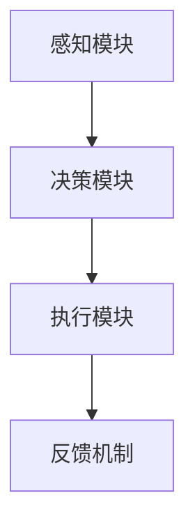
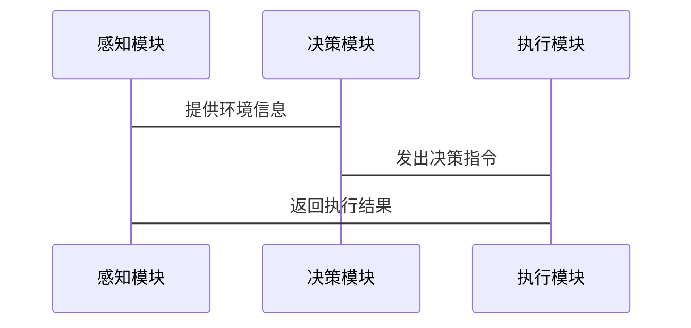

                 


# 构建具有元学习能力的自适应AI Agent

## 关键词：元学习，自适应AI Agent，机器学习，算法原理，系统架构

## 摘要：本文将详细探讨构建具有元学习能力的自适应AI Agent的背景、核心概念、算法原理、系统架构及项目实现。通过分析元学习的基本原理和其在自适应AI Agent中的应用，结合实际案例，为读者提供一个全面的理解和实践指南。

---

# 第一部分: 元学习与自适应AI Agent的背景与基础

## 第1章: 元学习与自适应AI Agent概述

### 1.1 元学习的定义与背景
元学习是一种机器学习范式，旨在通过学习如何学习来提高模型的适应性和泛化能力。传统的机器学习方法通常需要大量特定领域的数据，并且在新任务上表现不佳。元学习通过训练模型在多个任务上进行学习，使得模型能够快速适应新任务，减少对新数据的需求。

#### 1.1.1 传统机器学习的局限性
传统机器学习算法在面对新任务时，通常需要重新训练整个模型，这不仅耗时，还需要大量新任务的数据支持。这种局限性在处理多样性和动态变化的任务时尤为明显。

#### 1.1.2 元学习的概念与核心思想
元学习的核心思想是通过在多个任务上训练模型，使其能够快速适应新任务。元学习模型能够在有限的数据下，快速调整参数以适应新的任务，这使得它在处理零样本学习和小样本学习问题时表现出色。

#### 1.1.3 自适应AI Agent的定义与特点
自适应AI Agent是一种能够在动态环境中自主调整行为策略的智能体。它能够根据环境反馈和任务需求，实时优化自身的决策过程，从而提高任务执行效率和准确性。

### 1.2 元学习与自适应AI Agent的关系
元学习为自适应AI Agent提供了快速学习和调整的能力，使得AI Agent能够在不同任务和环境下灵活应对。

#### 1.2.1 元学习在自适应AI Agent中的作用
元学习通过在多个任务上预训练模型，使得自适应AI Agent能够在新任务中快速调整策略，减少对新数据的依赖。

#### 1.2.2 自适应AI Agent的分类与应用场景
自适应AI Agent可以根据学习方式分为基于模型和基于经验的类型。它们广泛应用于智能助手、游戏AI、推荐系统等领域。

#### 1.2.3 元学习与传统机器学习的对比分析
元学习通过跨任务学习提高了模型的泛化能力，而传统机器学习则依赖于单任务训练。元学习在处理多样性和动态变化的任务时更具优势。

### 1.3 本章小结
本章介绍了元学习的基本概念及其在自适应AI Agent中的应用，强调了元学习在提高AI Agent适应性方面的重要作用。

---

## 第2章: 元学习的核心概念与原理

### 2.1 元学习的基本原理
元学习通过在多个任务上训练模型，使其能够快速适应新任务。其核心在于元学习器（Meta-Learner）的构建，能够提取任务间共享的特征，从而减少对新任务数据的需求。

#### 2.1.1 元学习的数学模型
元学习通常采用双层优化框架，包括元任务优化和目标任务优化。

$$ \text{元任务损失} = \sum_{i=1}^{N} L_{meta}(f_{\theta}(x_i), y_i) $$

$$ \text{目标任务损失} = L_{task}(f_{\theta}(x_{new}), y_{new}) $$

其中，$f_{\theta}$是元学习器，$\theta$是其参数。

#### 2.1.2 元学习的算法框架
元学习的典型算法包括MAML（Meta-Automated Machine Learning）和Reptile。MAML通过梯度下降优化元任务和目标任务的损失函数。

### 2.2 自适应AI Agent的系统架构
自适应AI Agent的系统架构通常包括感知层、决策层和执行层。

#### 2.2.1 自适应AI Agent的组成模块
- **感知模块**：负责收集环境信息。
- **决策模块**：基于感知信息和元学习模型生成决策。
- **执行模块**：将决策转化为具体动作。

#### 2.2.2 各模块之间的关系与协作
感知模块将环境信息传递给决策模块，决策模块通过元学习模型生成决策，并将其传递给执行模块，执行模块将决策执行并反馈给感知模块。

#### 2.2.3 自适应AI Agent的运行流程
1. 感知模块收集环境信息。
2. 决策模块基于元学习模型生成决策。
3. 执行模块执行决策并反馈结果。
4. 系统根据反馈调整模型参数。

### 2.3 元学习与自适应AI Agent的核心概念对比
通过对比元学习和自适应AI Agent的核心概念，可以看出元学习为自适应AI Agent提供了快速学习和调整的能力。

---

## 第3章: 元学习算法的数学模型与实现

### 3.1 元学习算法的数学模型
元学习算法的数学模型通常涉及元任务和目标任务的损失函数。

#### 3.1.1 元学习的目标函数
$$ L_{meta} = \sum_{i=1}^{N} (f_{\theta}(x_i) - y_i)^2 $$

#### 3.1.2 元学习的优化算法
$$ \theta \leftarrow \theta - \eta \nabla_{\theta} L_{meta} $$

其中，$\eta$是学习率。

#### 3.1.3 元学习的损失函数
$$ L_{task} = (f_{\theta}(x_{new}) - y_{new})^2 $$

### 3.2 元学习算法的实现步骤
元学习算法的实现步骤包括数据预处理、模型初始化、优化过程和结果评估。

#### 3.2.1 数据预处理
对数据进行归一化和特征提取，确保模型能够有效学习。

#### 3.2.2 模型初始化
初始化模型参数$\theta$，通常采用随机初始化。

#### 3.2.3 模型优化
通过梯度下降优化元任务和目标任务的损失函数。

#### 3.2.4 模型评估
评估模型在新任务上的性能，计算准确率、召回率等指标。

### 3.3 元学习算法的代码实现
以下是一个简单的元学习算法实现示例：

```python
import torch
import torch.nn as nn

class MetaLearner(nn.Module):
    def __init__(self, input_dim, output_dim):
        super().__init__()
        self.linear = nn.Linear(input_dim, output_dim)
    
    def forward(self, x):
        return self.linear(x)

# 初始化模型
model = MetaLearner(input_dim, output_dim)
optimizer = torch.optim.Adam(model.parameters(), lr=0.01)

# 元任务优化
for meta_batch in meta_batches:
    optimizer.zero_grad()
    for task in meta_batch:
        # 计算目标任务损失
        outputs = model(task.x)
        loss = nn.MSELoss()(outputs, task.y)
        # 计算梯度并累加
        loss.backward(retain_graph=True)
    optimizer.step()

# 目标任务优化
for task in new_tasks:
    optimizer.zero_grad()
    outputs = model(task.x)
    loss = nn.MSELoss()(outputs, task.y)
    loss.backward()
    optimizer.step()
```

### 3.4 本章小结
本章详细介绍了元学习算法的数学模型和实现步骤，展示了如何通过代码实现元学习模型。

---

## 第4章: 系统架构设计与实现

### 4.1 系统架构设计
自适应AI Agent的系统架构包括感知层、决策层和执行层。

#### 4.1.1 感知模块
感知模块负责收集环境信息，通常包括传感器和数据接口。

#### 4.1.2 决策模块
决策模块基于元学习模型生成决策，包括特征提取和策略生成。

#### 4.1.3 执行模块
执行模块将决策转化为具体动作，通常包括执行器和反馈机制。

### 4.2 系统架构图
以下是自适应AI Agent的系统架构图：



### 4.3 系统接口设计
系统接口设计包括数据输入接口、模型接口和反馈接口。

#### 4.3.1 数据输入接口
数据输入接口负责接收环境信息，通常采用JSON格式。

#### 4.3.2 模型接口
模型接口负责调用元学习模型，生成决策。

#### 4.3.3 反馈接口
反馈接口负责接收执行结果，更新模型参数。

### 4.4 系统交互序列图
以下是系统交互的序列图：



### 4.5 本章小结
本章详细介绍了自适应AI Agent的系统架构设计与实现，展示了各模块之间的协作关系。

---

## 第5章: 项目实战与案例分析

### 5.1 项目背景
本项目旨在构建一个具有元学习能力的自适应AI Agent，能够在多个任务上快速调整策略。

### 5.2 项目实现
项目实现包括环境搭建、模型训练和系统集成。

#### 5.2.1 环境搭建
安装必要的库，如PyTorch和numpy。

```bash
pip install torch numpy
```

#### 5.2.2 模型训练
训练元学习模型，使其能够在多个任务上快速适应。

```python
import torch
import torch.nn as nn

class MetaLearner(nn.Module):
    def __init__(self, input_dim, output_dim):
        super().__init__()
        self.linear = nn.Linear(input_dim, output_dim)
    
    def forward(self, x):
        return self.linear(x)

model = MetaLearner(input_dim, output_dim)
optimizer = torch.optim.Adam(model.parameters(), lr=0.01)

# 元任务优化
for meta_batch in meta_batches:
    optimizer.zero_grad()
    for task in meta_batch:
        outputs = model(task.x)
        loss = nn.MSELoss()(outputs, task.y)
        loss.backward(retain_graph=True)
    optimizer.step()
```

#### 5.2.3 系统集成
将模型集成到自适应AI Agent系统中，实现感知、决策和执行的闭环。

### 5.3 案例分析
通过具体案例分析，展示自适应AI Agent在实际应用中的表现。

#### 5.3.1 案例背景
假设我们有一个推荐系统，需要根据用户行为动态调整推荐策略。

#### 5.3.2 案例实现
在推荐系统中，自适应AI Agent能够根据用户的反馈快速调整推荐策略。

### 5.4 本章小结
本章通过项目实战展示了如何构建具有元学习能力的自适应AI Agent，并通过案例分析验证了其有效性。

---

## 第6章: 总结与展望

### 6.1 本章总结
本文详细探讨了构建具有元学习能力的自适应AI Agent的背景、核心概念、算法原理、系统架构及项目实现。

### 6.2 未来展望
未来，元学习在自适应AI Agent中的应用将更加广泛，可能在动态环境、多任务学习和实时反馈等领域取得更大的突破。

### 6.3 最佳实践 tips
- 在实际应用中，建议结合具体场景选择合适的元学习算法。
- 定期更新模型参数，以保持其适应性。
- 注意数据质量和多样性，以提高模型的泛化能力。

### 6.4 本章小结
本章总结了全文的主要内容，并展望了未来的发展方向。

---

通过以上目录和内容，读者可以全面理解构建具有元学习能力的自适应AI Agent的理论与实践，为实际应用提供了有价值的参考和指导。

