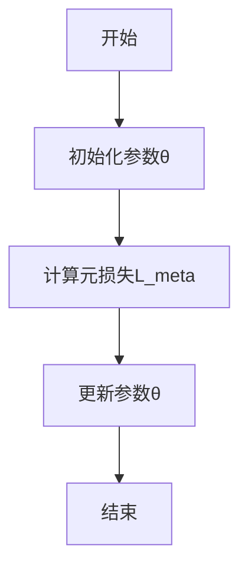
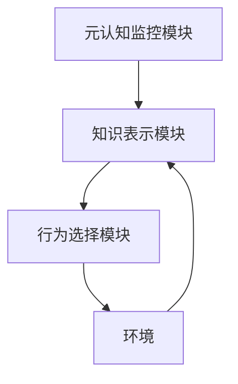

                 


# 构建具有元认知能力的AI Agent

## 关键词：元认知能力、AI Agent、自适应学习、知识表示、系统架构

## 摘要：  
本文深入探讨了构建具有元认知能力的AI Agent的理论基础、算法设计、系统架构及实现方法。通过分析元认知能力的核心概念，结合实际应用场景，详细讲解了如何在AI Agent中实现自我认知与自适应学习。文章内容涵盖元认知模型的数学基础、算法实现、系统设计及项目实战，为读者提供了一套完整的构建方法。

---

## 第1章 元认知与AI Agent概述

### 1.1 元认知能力的定义与特点
元认知能力是指个体对自身认知过程的认知和调控能力，主要包括以下几个方面：
- **自我监控**：对自身认知过程的观察和记录。
- **自我评估**：对自身知识和能力的评估。
- **自我调节**：根据评估结果调整认知策略。

在AI Agent中，元认知能力使其能够：
1. 监控自身的知识库状态。
2. 评估当前任务的需求。
3. 动态调整行为策略。

### 1.2 元认知AI Agent的背景与意义
传统AI Agent通常基于固定的规则或预训练的模型，难以应对复杂多变的环境。元认知AI Agent通过引入自我监控和自适应学习能力，能够更好地应对不确定性，提升任务完成效率。

### 1.3 元认知AI Agent的核心目标
- **自我认知**：了解自身的知识和能力边界。
- **动态调整**：根据环境变化调整行为策略。
- **自适应学习**：通过反馈优化自身的知识和能力。

---

## 第2章 元认知机制的核心原理

### 2.1 元认知的构成与功能
元认知机制由以下几个核心部分组成：
- **监控模块**：实时监控认知过程。
- **评估模块**：评估认知结果的有效性。
- **调节模块**：根据评估结果调整认知策略。

### 2.2 元认知与AI Agent的结合
在AI Agent中，元认知机制通过以下方式实现：
- **知识表示**：使用图结构表示知识，并通过元认知模块监控知识的完整性和准确性。
- **行为选择**：根据当前任务需求和知识状态选择最优行为。

### 2.3 元认知的自适应与学习机制
- **自适应学习**：通过强化学习算法动态优化知识表示和行为选择策略。
- **元学习**：学习如何学习，即通过元认知模块不断优化学习过程。

---

## 第3章 元认知AI Agent的数学模型与算法

### 3.1 元认知模型的数学基础
元认知模型的核心是元学习算法，其数学表达如下：
$$ \theta_{t+1} = \theta_t + \alpha \cdot \nabla_{\theta_t} (L_{meta}) $$
其中，$\theta_t$ 表示第t步的模型参数，$\alpha$ 表示学习率，$L_{meta}$ 表示元损失函数。

### 3.2 元认知算法的核心原理
以下是一个基于元学习的算法流程图：



### 3.3 元认知模型的优化方法
以下是一个元学习算法的Python实现示例：

```python
import torch

def meta_learning_update(theta, grad, alpha=0.1):
    return theta - alpha * grad

# 示例用法
theta = torch.randn(10)
grad = torch.randn(10)
new_theta = meta_learning_update(theta, grad)
```

---

## 第4章 元认知AI Agent的系统架构设计

### 4.1 系统功能模块划分
- **元认知监控模块**：监控知识库的状态。
- **知识表示模块**：存储和管理知识。
- **行为选择模块**：根据任务需求选择最优行为。

### 4.2 系统架构设计
以下是一个元认知AI Agent的系统架构图：



---

## 第5章 项目实战：构建一个简单的元认知AI Agent

### 5.1 环境安装
需要安装以下库：
```bash
pip install torch numpy
```

### 5.2 核心代码实现
以下是一个简单的元认知AI Agent实现：

```python
import torch
import numpy as np

class MetaCognitiveAgent:
    def __init__(self, state_dim, action_dim):
        self.state_dim = state_dim
        self.action_dim = action_dim
        self.theta = torch.randn(state_dim, action_dim)

    def perceive(self, state):
        # 知识表示
        return torch.matmul(state, self.theta)

    def decide(self, state, target):
        # 行为选择
        predicted = self.perceive(state)
        loss = torch.mean((predicted - target)**2)
        # 元学习更新
        self.theta -= 0.1 * torch.mean((predicted - target) * state, dim=0).reshape(-1, 1)
        return predicted.argmax().item()

# 示例用法
agent = MetaCognitiveAgent(10, 5)
state = np.random.randn(10)
target = np.random.randn(5)
action = agent.decide(state, target)
print(f"选择的行为：{action}")
```

### 5.3 案例分析
假设我们在一个分类任务中使用这个AI Agent，通过不断更新参数$\theta$，Agent能够逐步优化其分类能力。

---

## 第6章 总结与展望

### 6.1 本章总结
本文详细讲解了如何构建具有元认知能力的AI Agent，包括理论基础、算法设计和系统实现。

### 6.2 未来展望
未来的研究方向包括：
1. 更复杂的元学习算法。
2. 更高效的元认知监控机制。
3. 元认知能力在多智能体系统中的应用。

---

## 小结

通过本文的讲解，读者可以深入了解元认知AI Agent的核心原理和实现方法，并通过实际案例掌握如何将理论应用于实践。元认知能力的引入使得AI Agent更加智能和自适应，未来随着技术的发展，元认知AI Agent将在更多领域发挥重要作用。

