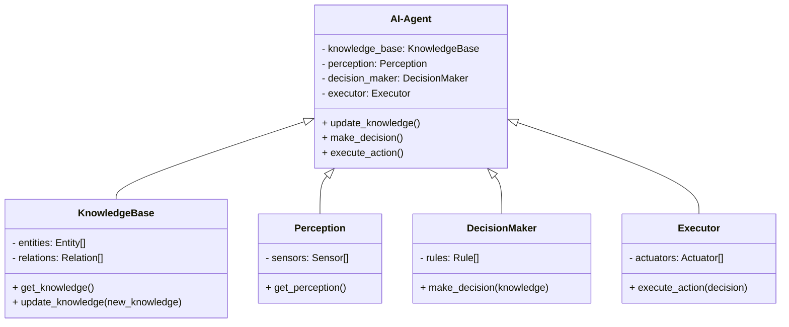

                 


# 构建具有动态知识更新能力的AI Agent

> 关键词：AI Agent，动态知识更新，知识图谱，增量学习，知识蒸馏，机器学习，多模态知识

> 摘要：本文深入探讨了构建具有动态知识更新能力的AI Agent的关键技术与实现方法。从AI Agent的基本概念、动态知识更新的必要性出发，详细分析了动态知识更新的核心原理、算法实现与系统架构设计，最后通过实际项目案例展示了动态知识更新在AI Agent中的应用与效果。本文内容涵盖理论与实践，旨在为读者提供一个全面的构建动态知识更新AI Agent的指导。

---

# 第1章: AI Agent的基本概念与动态知识更新的必要性

## 1.1 AI Agent的定义与核心特征

### 1.1.1 AI Agent的定义

AI Agent（人工智能代理）是指能够感知环境、做出决策并执行操作的智能实体。AI Agent可以是软件程序、机器人或其他智能系统，其核心目标是通过与环境交互来实现特定任务。

**AI Agent的三大核心特征：**

1. **自主性**：AI Agent能够在没有外部干预的情况下自主运行。
2. **反应性**：AI Agent能够实时感知环境并做出反应。
3. **目标导向**：AI Agent的行为始终围绕实现特定目标展开。

### 1.1.2 AI Agent的核心特征

AI Agent的设计需要考虑以下几个核心特征：

1. **知识表示**：AI Agent需要具备表示和存储知识的能力，以便能够理解和推理环境中的信息。
2. **决策能力**：AI Agent需要基于知识和感知信息做出决策。
3. **学习能力**：AI Agent需要具备动态更新知识的能力，以应对环境中的变化。

### 1.1.3 动态知识更新的必要性

在动态变化的环境中，AI Agent需要不断更新其知识库以适应新的情况。动态知识更新的必要性主要体现在以下几个方面：

1. **环境变化**：环境中的信息不断变化，AI Agent需要实时更新知识以保持准确性。
2. **任务需求**：不同任务可能需要不同的知识，动态知识更新能够满足多样化的任务需求。
3. **自我改进**：通过动态知识更新，AI Agent可以不断优化其性能，提高决策的准确性。

---

## 1.2 动态知识更新的背景与挑战

### 1.2.1 当前AI Agent的应用场景

AI Agent的应用场景非常广泛，包括：

1. **智能助手**：如Siri、Alexa等，能够帮助用户完成日常任务。
2. **智能客服**：通过自然语言处理技术为用户提供服务。
3. **自动驾驶**：需要实时感知环境并做出决策。
4. **智能推荐系统**：根据用户行为动态更新推荐策略。

### 1.2.2 知识更新的必要性

在上述应用场景中，知识更新的必要性主要体现在：

1. **实时性**：AI Agent需要实时感知环境变化并做出反应。
2. **准确性**：动态知识更新能够保证知识库的准确性，避免因知识过时导致错误决策。
3. **适应性**：AI Agent需要具备适应不同环境和任务的能力。

### 1.2.3 动态知识更新的挑战

动态知识更新面临以下挑战：

1. **数据获取**：如何高效获取新的知识数据。
2. **知识融合**：如何将新知识与已有知识融合，避免冲突。
3. **计算效率**：动态知识更新需要在有限的计算资源下高效完成。

---

## 1.3 动态知识更新的技术发展趋势

### 1.3.1 知识表示与推理技术的发展

知识表示技术从简单的符号逻辑发展到复杂的知识图谱和向量表示。未来，多模态知识表示将成为主流，能够更好地融合文本、图像等多种信息。

### 1.3.2 知识库的构建与维护

动态知识库的构建需要结合增量学习和在线学习技术，能够实时更新知识库内容。未来，知识蒸馏技术将被广泛应用，以减少知识库的存储和计算开销。

### 1.3.3 多模态知识更新的未来方向

多模态知识更新将结合文本、图像、语音等多种信息，实现更全面的知识表示。同时，基于图神经网络的知识更新技术将推动知识推理的深度和广度。

---

# 第2章: AI Agent的核心概念与动态知识更新的原理

## 2.1 AI Agent的知识表示与推理

### 2.1.1 知识表示的多种方式

知识表示是AI Agent的核心技术之一，常见的知识表示方式包括：

1. **符号逻辑**：通过符号和规则表示知识。
2. **知识图谱**：通过图结构表示实体及其关系。
3. **向量表示**：通过低维向量表示语义信息。

### 2.1.2 知识推理的基本原理

知识推理是基于知识表示进行逻辑推理的过程。常见的推理方法包括：

1. **符号推理**：基于符号逻辑进行推理。
2. **基于图的推理**：基于知识图谱进行路径推理。
3. **概率推理**：基于概率论进行不确定性推理。

### 2.1.3 动态知识更新的逻辑推理

动态知识更新需要结合增量学习和在线学习技术，通过逻辑推理不断更新知识库内容。动态知识更新的逻辑推理过程如下：

1. **知识获取**：从环境中获取新的知识数据。
2. **知识融合**：将新知识与已有知识融合，避免冲突。
3. **知识推理**：基于融合后的知识进行逻辑推理，生成新的知识。

---

## 2.2 动态知识更新的机制与流程

### 2.2.1 知识获取与解析

知识获取是动态知识更新的第一步，主要包括以下步骤：

1. **数据获取**：通过API、传感器等获取新的数据。
2. **数据解析**：将获取的数据解析为结构化格式，如JSON、XML等。
3. **数据清洗**：对解析后的数据进行清洗，去除噪声数据。

### 2.2.2 知识融合与冲突处理

知识融合是将新知识与已有知识融合的过程，需要注意以下几点：

1. **冲突检测**：检测新知识与已有知识之间的冲突。
2. **冲突处理**：通过协商、优先级等方式解决冲突。
3. **知识更新**：将融合后的知识存储到知识库中。

### 2.2.3 知识存储与检索

知识存储与检索是动态知识更新的关键环节，主要包括：

1. **知识存储**：将融合后的知识存储到知识库中。
2. **知识检索**：根据需求快速检索知识库中的相关知识。

---

## 2.3 动态知识更新的数学模型与算法

### 2.3.1 知识更新的数学模型

动态知识更新的数学模型可以通过以下公式表示：

$$ P(k) = P(k-1) \times \alpha + \beta $$

其中，$P(k)$ 表示第k步的知识概率，$P(k-1)$ 表示第k-1步的知识概率，$\alpha$ 表示知识保留系数，$\beta$ 表示新知识引入系数。

---

# 第3章: 动态知识更新的核心算法与实现

## 3.1 增量学习算法

### 3.1.1 增量学习的基本原理

增量学习是一种动态知识更新的核心算法，其基本原理如下：

1. **在线学习**：每次获取一条数据，逐步更新模型。
2. **增量特征**：模型能够动态适应新数据的特征。

### 3.1.2 在线学习的算法实现

以下是在线学习的伪代码实现：

```python
def online_learning(new_data):
    global model
    model.update(new_data)
```

### 3.1.3 增量学习的数学模型

增量学习的数学模型可以通过以下公式表示：

$$ w_{new} = w_{old} + \Delta w $$

其中，$w_{new}$ 表示更新后的模型参数，$w_{old}$ 表示更新前的模型参数，$\Delta w$ 表示参数的增量。

---

## 3.2 知识蒸馏算法

### 3.2.1 知识蒸馏的定义与原理

知识蒸馏是一种动态知识更新的算法，其核心思想是通过教师模型指导学生模型学习知识。

### 3.2.2 知识蒸馏的实现步骤

以下是知识蒸馏的实现步骤：

1. **教师模型训练**：训练一个高性能的教师模型。
2. **学生模型学习**：通过教师模型的软标签进行学习。
3. **模型蒸馏**：将教师模型的知识迁移到学生模型中。

### 3.2.3 知识蒸馏的数学公式

知识蒸馏的数学公式可以通过以下公式表示：

$$ P(y|x) = \argmax_y \sum_{i=1}^{n} P(y|x_i) $$

其中，$P(y|x)$ 表示学生模型的预测概率，$P(y|x_i)$ 表示教师模型的预测概率。

---

## 3.3 动态知识图谱的构建与更新

### 3.3.1 知识图谱的构建流程

知识图谱的构建流程包括：

1. **数据获取**：从多种数据源获取数据。
2. **数据解析**：将数据解析为结构化格式。
3. **知识抽取**：从结构化数据中提取实体及其关系。
4. **知识融合**：将抽取的知识进行融合，消除冲突。
5. **知识存储**：将融合后的知识存储到知识图谱中。

### 3.3.2 动态知识更新的规则

动态知识更新的规则包括：

1. **实体关系更新**：根据新数据更新实体之间的关系。
2. **实体属性更新**：根据新数据更新实体的属性。
3. **实体删除**：当实体不再存在时，删除实体及其相关关系。

### 3.3.3 知识图谱的存储与查询

知识图谱的存储与查询可以通过图数据库实现，常见的图数据库包括Neo4j、RDF等。知识图谱的查询可以通过SPARQL语句实现。

---

# 第4章: 动态知识更新的系统架构与设计

## 4.1 系统架构设计

### 4.1.1 分层架构设计

动态知识更新系统的分层架构设计包括：

1. **感知层**：负责感知环境并获取新知识。
2. **知识层**：负责知识的存储、检索和更新。
3. **决策层**：负责基于知识进行决策。
4. **执行层**：负责执行决策并反馈结果。

### 4.1.2 模块化设计

动态知识更新系统的模块化设计包括：

1. **知识获取模块**：负责获取新知识。
2. **知识融合模块**：负责融合新知识。
3. **知识推理模块**：负责基于知识进行推理。
4. **知识更新模块**：负责更新知识库。

---

## 4.2 系统功能设计

### 4.2.1 领域模型设计

以下是领域模型的Mermaid类图：



### 4.2.2 系统架构设计

以下是系统架构的Mermaid架构图：


---

## 4.3 系统接口设计

### 4.3.1 系统接口设计

动态知识更新系统的接口设计包括：

1. **知识获取接口**：用于获取新知识。
2. **知识融合接口**：用于融合新知识。
3. **知识推理接口**：用于基于知识进行推理。
4. **知识更新接口**：用于更新知识库。

### 4.3.2 系统交互流程图

以下是系统交互的Mermaid流程图：

```mermaid
flowchart TD
    A[Client] --> B[KnowledgeBase]: Query Knowledge
    B --> C[Perception]: Get Perception Data
    C --> B: Update Knowledge
    B --> D[DecisionMaker]: Make Decision
    D --> E[Executor]: Execute Action
    E --> B: Feedback
```

---

# 第5章: 动态知识更新的项目实战

## 5.1 环境安装与配置

### 5.1.1 环境要求

动态知识更新项目的环境要求包括：

1. **操作系统**：Linux/Windows/MacOS
2. **编程语言**：Python 3.6+
3. **依赖库**：numpy, pandas, scikit-learn, neo4j等

### 5.1.2 环境配置

以下是环境配置的代码示例：

```bash
pip install numpy pandas scikit-learn neo4j
```

---

## 5.2 系统核心实现

### 5.2.1 知识抽取模块实现

以下是知识抽取模块的实现代码：

```python
def extract_knowledge(text):
    # 使用自然语言处理技术抽取知识
    return extracted_knowledge
```

### 5.2.2 知识融合模块实现

以下是知识融合模块的实现代码：

```python
def fuse_knowledge(knowledge1, knowledge2):
    # 使用冲突处理算法融合知识
    return fused_knowledge
```

### 5.2.3 知识推理模块实现

以下是知识推理模块的实现代码：

```python
def make_inference(knowledge):
    # 使用逻辑推理算法进行推理
    return inference_result
```

### 5.2.4 知识更新模块实现

以下是知识更新模块的实现代码：

```python
def update_knowledge_base(new_knowledge):
    # 更新知识库
    pass
```

---

## 5.3 实际案例分析

### 5.3.1 案例背景

以智能客服为例，动态知识更新能够帮助智能客服实时更新知识库，提高回答准确率。

### 5.3.2 案例分析

以下是智能客服系统的知识更新流程：

1. **知识获取**：获取新的客户问题和答案。
2. **知识融合**：将新知识与已有知识融合。
3. **知识推理**：基于融合后的知识进行推理，生成回答。
4. **知识更新**：将新知识存储到知识库中。

---

## 5.4 项目总结

### 5.4.1 成功经验

1. **高效的知识获取**：通过多种数据源获取知识。
2. **智能的知识融合**：使用冲突处理算法融合知识。
3. **快速的知识推理**：基于逻辑推理算法生成回答。

### 5.4.2 经验教训

1. **数据质量问题**：数据质量直接影响知识更新的效果。
2. **计算效率问题**：知识更新需要高效的计算资源。

---

# 第6章: 动态知识更新的最佳实践与未来展望

## 6.1 最佳实践

### 6.1.1 知识获取与清洗

1. **数据源多样化**：从多种数据源获取知识。
2. **数据清洗**：去除噪声数据，确保数据质量。

### 6.1.2 知识融合与推理

1. **冲突处理**：使用协商机制解决知识冲突。
2. **逻辑推理**：基于逻辑推理算法进行推理。

### 6.1.3 系统优化

1. **计算优化**：通过并行计算提高知识更新效率。
2. **存储优化**：使用高效的数据结构存储知识。

---

## 6.2 未来展望

### 6.2.1 知识表示与推理的未来方向

1. **多模态知识表示**：结合文本、图像等多种信息，实现更全面的知识表示。
2. **深度推理**：基于图神经网络实现更复杂的知识推理。

### 6.2.2 动态知识更新的未来方向

1. **自适应学习**：AI Agent能够自适应地更新知识库。
2. **实时更新**：实现知识的实时更新与应用。

### 6.2.3 技术融合与创新

1. **知识图谱与区块链**：结合区块链技术实现知识的可信存储与共享。
2. **动态知识更新与边缘计算**：结合边缘计算实现知识的实时更新与应用。

---

## 6.3 总结与展望

动态知识更新是构建智能AI Agent的核心技术之一。通过本文的深入探讨，我们了解了动态知识更新的必要性、核心原理、算法实现与系统架构设计。未来，随着技术的进步，动态知识更新将在更多领域得到广泛应用，推动AI Agent的发展。

---

# 结语

构建具有动态知识更新能力的AI Agent是一项复杂而富有挑战性的任务，但通过不断的技术创新与实践，我们相信AI Agent将能够更好地适应动态变化的环境，为人类带来更多的便利与价值。

--- 

**感谢您的耐心阅读！**

