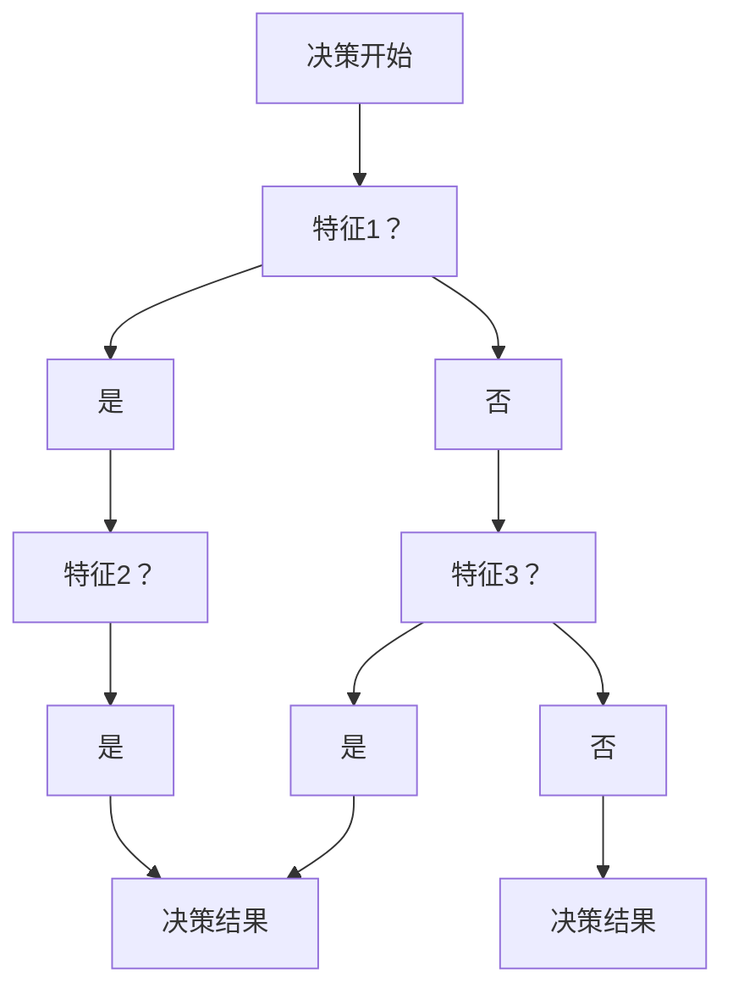
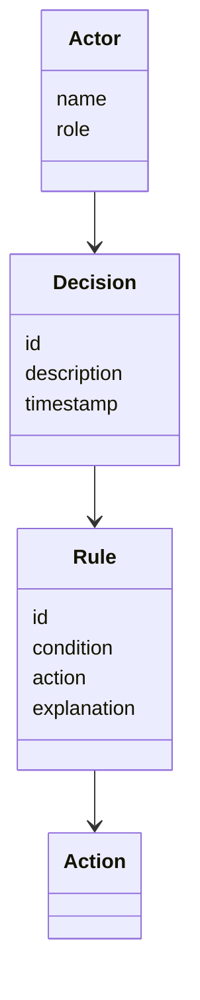

                 


# 构建具有可解释性决策能力的AI Agent

## 关键词
- 可解释性决策
- AI Agent
- 人工智能
- 机器学习
- 决策树
- 系统架构

## 摘要
构建具有可解释性决策能力的AI Agent，旨在通过清晰的逻辑和结构化的方法，解决AI决策系统的可解释性问题。本文从背景、核心概念、算法原理、系统架构到项目实战，全面探讨如何设计和实现具备可解释性决策能力的AI Agent，确保其决策过程透明、可追溯，从而在实际应用中获得信任和可靠性。

---

# 第一部分: 可解释性决策AI Agent的背景与核心概念

## 第1章: 可解释性决策AI Agent的背景与重要性

### 1.1 可解释性决策的背景
#### 1.1.1 AI决策系统的演进历程
人工智能（AI）决策系统经历了从简单规则引擎到复杂机器学习模型的演变。早期的决策系统基于简单的规则和逻辑，而现代系统则依赖于深度学习模型，如神经网络。然而，随着模型复杂性的增加，可解释性逐渐成为一个关键问题。

#### 1.1.2 可解释性决策的重要性
可解释性决策是确保AI系统在关键领域（如医疗、金融、司法）中被信任和合规的基础。决策的可解释性不仅满足监管要求，还能帮助用户理解系统的行为，从而增强信任感。

#### 1.1.3 当前AI决策系统的挑战
尽管AI决策系统在性能和效率上有了显著提升，但其可解释性却成为瓶颈。复杂的模型如深度神经网络通常被视为“黑箱”，难以解释其决策过程。

### 1.2 可解释性决策AI Agent的定义
#### 1.2.1 AI Agent的基本概念
AI Agent是一个能够感知环境、执行任务并做出决策的智能实体。它可以基于当前状态和环境信息，选择最优行动方案。

#### 1.2.2 可解释性决策的核心要素
可解释性决策要求AI Agent的决策过程必须透明，用户能够理解每个决策背后的逻辑和依据。

#### 1.2.3 可解释性决策与传统决策的区别
传统的决策系统通常基于固定规则，而可解释性AI Agent则通过学习模型生成决策，并提供解释。

### 1.3 可解释性决策的边界与外延
#### 1.3.1 决策可解释性的范围
可解释性涵盖从决策逻辑到结果的所有环节，包括输入特征、模型选择和决策规则。

#### 1.3.2 可解释性与不可解释性决策的对比
| 模型类型 | 解释性 | 透明度 | 可控性 |
|----------|--------|--------|--------|
| 决策树   | 高     | 高     | 高     |
| 随机森林 | 中     | 中     | 中     |
| 神经网络 | 低     | 低     | 低     |

#### 1.3.3 可解释性决策的实现方式
可解释性决策可以通过规则集、决策树等模型实现，确保每个决策都有明确的解释。

### 1.4 本章小结
本章介绍了可解释性决策的重要性，分析了当前AI决策系统的挑战，并定义了可解释性决策的核心要素。

---

## 第2章: 可解释性决策AI Agent的核心概念与联系

### 2.1 可解释性决策的核心原理
#### 2.1.1 决策树模型的解释性
决策树是一种直观的可解释性模型，每个节点代表一个决策条件，路径代表决策逻辑。

#### 2.1.2 规则集模型的解释性
规则集模型通过一系列条件语句描述决策逻辑，具有高透明度和可解释性。

#### 2.1.3 解释性模型的优缺点
解释性模型通常在性能上有所牺牲，但透明度高；而不可解释性模型性能优越，但缺乏透明度。

### 2.2 可解释性决策的核心概念对比
#### 2.2.1 决策模型的可解释性对比表格
| 模型类型 | 解释性 | 透明度 | 可控性 |
|----------|--------|--------|--------|
| 决策树   | 高     | 高     | 高     |
| 随机森林 | 中     | 中     | 中     |
| 神经网络 | 低     | 低     | 低     |

### 2.3 可解释性决策的ER实体关系图
```mermaid
er
actor
    name
    role
decision
    id
    description
    timestamp
rule
    id
    condition
    action
    explanation
```

### 2.4 本章小结
本章分析了可解释性决策的核心原理，并通过对比和图表展示了不同模型的优缺点。

---

## 第3章: 可解释性决策AI Agent的算法原理

### 3.1 可解释性决策算法
#### 3.1.1 基于规则的决策树
决策树是一种经典的可解释性模型，通过树状结构展示决策逻辑。

#### 3.1.2 决策树模型的实现


#### 3.1.3 决策树的数学模型
决策树的分类过程可以表示为：
$$
f(x) = \text{sign}(\sum_{i=1}^n w_i x_i)
$$

### 3.2 算法实现
#### 3.2.1 Python代码实现
```python
from sklearn.tree import DecisionTreeClassifier
from sklearn.datasets import make_classification

X, y = make_classification(n_samples=100, n_features=2, n_classes=2, random_state=42)

model = DecisionTreeClassifier()
model.fit(X, y)

print(model.score(X, y))
```

#### 3.2.2 算法原理的数学推导
决策树的每个节点对应一个决策条件，路径代表决策规则。例如，决策树的叶节点对应最终的决策结果。

### 3.3 本章小结
本章详细讲解了可解释性决策算法的实现，通过决策树模型展示了其可解释性。

---

## 第4章: 可解释性决策AI Agent的系统分析与架构设计

### 4.1 问题场景介绍
#### 4.1.1 问题描述
本文设计了一个可解释性决策AI Agent，用于模拟医疗诊断场景。

### 4.2 系统功能设计
#### 4.2.1 领域模型


### 4.3 系统架构设计
#### 4.3.1 系统架构图


### 4.4 接口设计
#### 4.4.1 API接口
```
POST /api/decision
{
    "input": {
        "feature1": value,
        "feature2": value
    }
}
```

### 4.5 本章小结
本章通过系统分析和架构设计，展示了如何构建一个可解释性决策AI Agent的完整系统。

---

## 第5章: 可解释性决策AI Agent的项目实战

### 5.1 环境安装
#### 5.1.1 安装Python
```
python --version
pip install --upgrade pip
```

### 5.2 核心代码实现
#### 5.2.1 决策树模型实现
```python
from sklearn.tree import DecisionTreeClassifier
from sklearn.datasets import make_classification
from sklearn.metrics import accuracy_score

X, y = make_classification(n_samples=100, n_features=2, random_state=42)
model = DecisionTreeClassifier()
model.fit(X, y)

print(accuracy_score(model.predict(X), y))
```

### 5.3 案例分析
#### 5.3.1 医疗诊断案例
假设一个医疗诊断场景，基于患者的症状和检查结果，AI Agent通过决策树模型做出诊断决策，并解释每个决策步骤。

### 5.4 本章小结
本章通过实际项目展示了可解释性决策AI Agent的实现过程和案例分析。

---

## 第6章: 最佳实践与小结

### 6.1 最佳实践
#### 6.1.1 模型选择
优先选择可解释性模型，如决策树和规则集模型。

#### 6.1.2 解释性工具
使用特征重要性分析和模型可视化工具，帮助解释决策过程。

### 6.2 小结
本文详细探讨了构建具有可解释性决策能力的AI Agent的关键环节，从背景、算法、系统设计到项目实战，全面解析了实现过程。

---

## 第7章: 可解释性决策AI Agent的未来展望

### 7.1 发展现状
可解释性AI Agent在医疗、金融等领域的应用逐渐增加。

### 7.2 未来趋势
随着技术进步，可解释性决策AI Agent将在更多领域得到应用，并推动AI技术的普及。

### 7.3 挑战与机遇
尽管面临技术挑战，但可解释性决策AI Agent的未来发展充满机遇。

---

## 附录

### 附录A: 术语解释
- AI Agent：人工智能代理
- 可解释性决策：透明的决策过程

### 附录B: 参考文献
- [1] Mitchell, T. M. (1998). *Machine Learning: A Bayesian Reasoning & Machine Learning Approach*.

---

# 结语
通过本文的系统介绍，读者可以全面理解构建具有可解释性决策能力的AI Agent的各个方面，为实际应用提供理论和实践指导。

