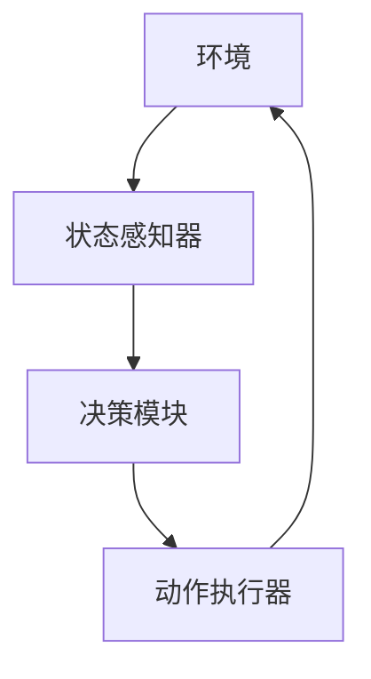

                 


# 构建具有可解释性强化学习能力的AI Agent

## 关键词：强化学习，可解释性，AI Agent，Q-learning，深度强化学习

## 摘要：构建具有可解释性强化学习能力的AI Agent是当前人工智能领域的热点问题。本文从强化学习的基本概念出发，详细探讨了可解释性在强化学习中的重要性，并通过实际案例展示了如何设计和实现一个具有可解释性的AI Agent。文章内容涵盖了强化学习的数学模型、算法原理、系统架构设计以及项目实战，旨在帮助读者全面理解可解释性强化学习的核心思想和实现方法。

---

# 第一部分: 强化学习与可解释性AI Agent基础

## 第1章: 强化学习与可解释性概述

### 1.1 强化学习的基本概念

#### 1.1.1 什么是强化学习
强化学习是一种机器学习范式，通过智能体与环境的交互，学习如何采取一系列行动以最大化累积奖励。其核心在于通过试错机制，逐步优化策略，实现目标。

#### 1.1.2 强化学习的核心要素
- **状态（State）**：智能体所处环境的描述。
- **动作（Action）**：智能体在某一状态下做出的行为选择。
- **奖励（Reward）**：智能体执行动作后，环境给予的反馈，用于指导智能体的行为。
- **策略（Policy）**：智能体选择动作的概率分布，决定如何根据当前状态选择动作。
- **价值函数（Value Function）**：衡量某状态下采取某种动作的长远收益。

#### 1.1.3 强化学习的典型应用场景
- 游戏AI（如AlphaGo）
- 自动驾驶
- 机器人控制
- 自然语言处理中的对话系统

### 1.2 可解释性AI的背景与重要性

#### 1.2.1 为什么需要可解释性
在医疗、金融、司法等高风险领域，AI系统的决策需要透明，以便于验证、信任和责任追溯。

#### 1.2.2 可解释性在AI系统中的作用
- 提高用户信任
- 便于调试和优化
- 符合监管要求
- 促进算法的公平性

#### 1.2.3 强化学习中的可解释性挑战
强化学习依赖于复杂的数学模型，其决策过程往往难以解释。如何在保持性能的同时，提高可解释性，是当前研究的重点。

---

## 第2章: 可解释性强化学习的核心概念

### 2.1 强化学习的数学模型

#### 2.1.1 状态、动作、奖励的定义
- 状态：$s \in S$
- 动作：$a \in A$
- 奖励：$r \in R$

#### 2.1.2 Q-learning算法的基本公式
$$ Q(s,a) = Q(s,a) + \alpha (r + \gamma \max Q(s',a') - Q(s,a)) $$
其中：
- $Q(s,a)$：当前状态下采取动作$a$的期望奖励。
- $\alpha$：学习率。
- $\gamma$：折扣因子。
- $s'$：下一个状态。

#### 2.1.3 动态规划与策略评估
动态规划用于优化价值函数，策略评估用于计算当前策略下的价值函数。

### 2.2 可解释性强化学习的特征

#### 2.2.1 可解释性的衡量标准
- 透明性：用户能够理解AI的决策过程。
- 可追溯性：能够追踪AI的决策路径。
- 简洁性：决策逻辑简单明了。

#### 2.2.2 不同强化学习算法的可解释性对比
| 算法类型         | 可解释性 |
|------------------|----------|
| Q-learning       | 较高     |
| DQN              | 较低     |
| Actor-Critic     | 中等     |

#### 2.2.3 可解释性与模型复杂度的关系
模型复杂度越高，通常可解释性越低。因此，需要在性能和可解释性之间找到平衡。

---

## 第3章: 强化学习算法原理

### 3.1 Q-learning算法详解

#### 3.1.1 Q-learning的基本流程
1. 初始化Q表。
2. 在当前状态下选择一个动作。
3. 执行动作，观察奖励和下一个状态。
4. 更新Q值。
5. 重复，直到收敛。

#### 3.1.2 Q值更新的数学公式
$$ Q(s,a) = Q(s,a) + \alpha (r + \gamma \max Q(s',a') - Q(s,a)) $$

#### 3.1.3 探索与利用策略的平衡
- 探索：尝试新的动作，避免陷入局部最优。
- 利用：根据当前知识选择最优动作。

### 3.2 深度强化学习算法

#### 3.2.1 DQN算法的结构
DQN通过神经网络近似Q值函数，使用经验回放和目标网络提高稳定性和表现。

#### 3.2.2 神经网络在强化学习中的应用
神经网络可以处理高维状态空间，提取特征，提高学习效率。

#### 3.2.3 Actor-Critic算法的原理
Actor负责选择动作，Critic负责评估动作的价值，两者相互优化。

---

## 第4章: 可解释性强化学习的系统架构设计

### 4.1 系统功能设计

#### 4.1.1 状态空间的定义与建模
- 状态空间：所有可能的状态的集合。
- 状态转换：从当前状态到下一个状态的过程。

#### 4.1.2 动作空间的设计与实现
- 动作选择：根据当前状态选择最优动作。
- 动作执行：执行动作并观察环境反馈。

#### 4.1.3 奖励函数的构建与优化
- 奖励设计：定义奖励函数，指导智能体行为。
- 奖励调整：根据实验结果优化奖励机制。

### 4.2 系统架构图



### 4.3 系统接口设计

#### 4.3.1 状态输入接口
- 输入：当前状态$s$。
- 输出：状态特征向量。

#### 4.3.2 动作输出接口
- 输入：状态$s$和动作$a$。
- 输出：执行动作后的奖励$r$和下一个状态$s'$。

#### 4.3.3 奖励反馈接口
- 输入：奖励$r$。
- 输出：更新后的Q值或策略。

---

## 第5章: 项目实战——构建一个可解释性AI Agent

### 5.1 环境安装与配置

#### 5.1.1 安装Python与深度学习框架
- Python：3.8及以上版本。
- 深度学习框架：TensorFlow或PyTorch。

#### 5.1.2 安装依赖库
```bash
pip install numpy gym matplotlib
```

### 5.2 系统核心实现

#### 5.2.1 Q-learning实现

```python
import numpy as np

class QLearningAgent:
    def __init__(self, state_space, action_space, alpha=0.1, gamma=0.9):
        self.state_space = state_space
        self.action_space = action_space
        self.alpha = alpha
        self.gamma = gamma
        self.Q = np.zeros((state_space, action_space))

    def choose_action(self, state):
        return np.argmax(self.Q[state])

    def update(self, state, action, reward, next_state):
        self.Q[state][action] += self.alpha * (reward + self.gamma * np.max(self.Q[next_state]) - self.Q[state][action])
```

#### 5.2.2 DQN实现

```python
import tensorflow as tf
from tensorflow.keras import layers

class DQNAgent:
    def __init__(self, state_space, action_space, units=32, alpha=0.01, gamma=0.9):
        self.state_space = state_space
        self.action_space = action_space
        self.alpha = alpha
        self.gamma = gamma
        self.model = self.build_model()
        self.target_model = self.build_model()

    def build_model(self):
        model = tf.keras.Sequential([
            layers.Dense(units, activation='relu', input_dim=state_space),
            layers.Dense(action_space, activation='linear')
        ])
        model.compile(optimizer=tf.keras.optimizers.Adam(learning_rate=self.alpha), loss='mse')
        return model

    def choose_action(self, state):
        state = tf.expand_dims(tf.convert_to_tensor(state), 0)
        prediction = self.model.predict(state)[0]
        return tf.argmax(prediction).numpy()
```

### 5.3 代码应用解读与分析

#### 5.3.1 Q-learning代码解读
- `QLearningAgent`类初始化Q表，定义学习率和折扣因子。
- `choose_action`方法选择最优动作。
- `update`方法更新Q值。

#### 5.3.2 DQN代码解读
- `DQNAgent`类定义神经网络模型，初始化目标网络和经验回放机制。
- `choose_action`方法通过神经网络预测最优动作。

### 5.4 实际案例分析

#### 5.4.1 环境配置
使用OpenAI Gym库，选择CartPole环境。

#### 5.4.2 训练过程
```python
agent = QLearningAgent(4, 2)
env = gym.make('CartPole-v0')
for _ in range(1000):
    state = env.reset()
    while True:
        action = agent.choose_action(state)
        next_state, reward, done, _ = env.step(action)
        agent.update(state, action, reward, next_state)
        if done:
            break
```

### 5.5 项目小结

- 通过Q-learning和DQN实现可解释性AI Agent。
- 通过实验验证算法的可行性和性能。
- 总结可解释性强化学习的设计要点。

---

## 第6章: 高级主题与未来展望

### 6.1 可解释性与强化学习的安全性

#### 6.1.1 智能体决策的透明性
确保用户能够理解AI Agent的决策过程，避免黑箱操作。

#### 6.1.2 强化学习中的对抗攻击
防止攻击者利用强化学习的不确定性进行攻击。

### 6.2 可解释性强化学习的未来趋势

#### 6.2.1 更高效的可解释性算法
开发新的算法，同时保证性能和可解释性。

#### 6.2.2 多模态可解释性
结合视觉、语言等多种模态信息，提高解释的丰富性。

#### 6.2.3 跨领域应用
将可解释性强化学习应用到更多领域，如教育、医疗等。

---

## 结语

构建具有可解释性强化学习能力的AI Agent是一个复杂而重要的任务。本文从理论到实践，全面探讨了可解释性强化学习的核心思想和实现方法。通过实际案例，读者可以深入了解如何设计和实现一个具有可解释性的AI Agent，并在实际应用中不断提升其性能和可解释性。

---

**Tips：** 在实现可解释性强化学习时，建议优先选择Q-learning等简单算法，逐步优化，确保可解释性与性能的平衡。

