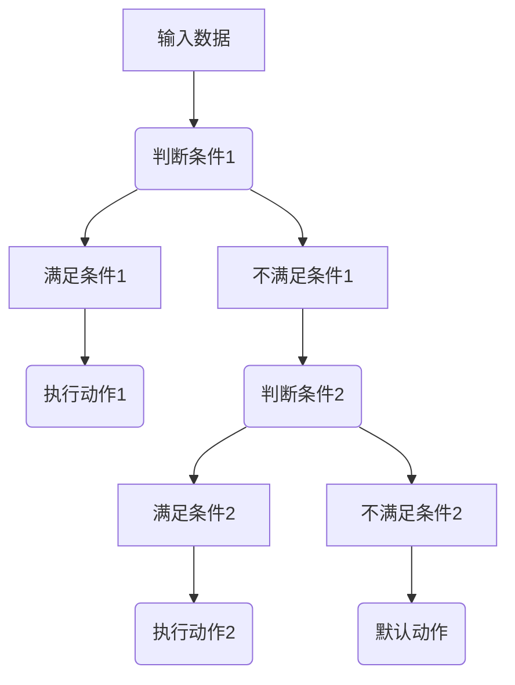
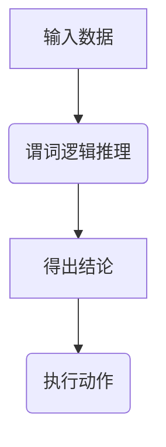
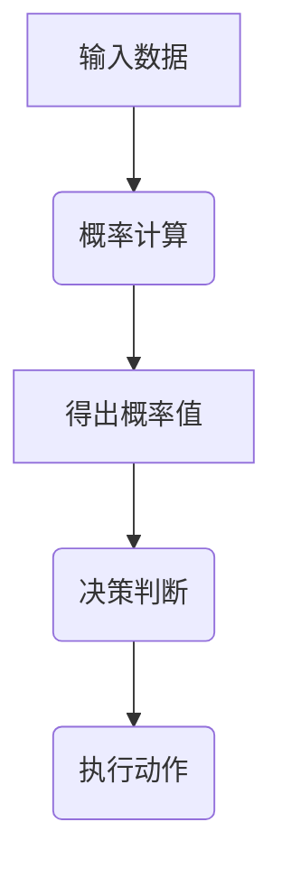
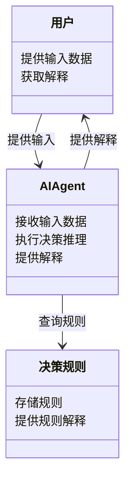
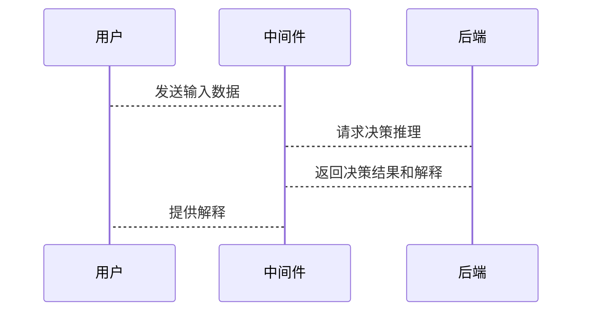

                 


# 《构建具有可解释性的AI Agent决策系统》

---

## 关键词：
- AI Agent
- 可解释性
- 决策系统
- 算法原理
- 系统架构
- 项目实战

---

## 摘要：
在AI技术迅速发展的今天，AI Agent决策系统的广泛应用对可解释性提出了更高的要求。本文从背景、核心概念、算法原理、系统架构、项目实战等多个维度，深入探讨如何构建具有可解释性的AI Agent决策系统。通过详细的技术分析和实际案例，本文旨在为读者提供一套完整的解决方案，帮助他们在实际应用中更好地理解和实现可解释性AI Agent。

---

# 第1章: 可解释性AI Agent决策系统概述

## 1.1 问题背景与问题描述
### 1.1.1 当前AI Agent决策系统的挑战
随着AI技术的快速发展，AI Agent（智能体）在多个领域得到了广泛应用。然而，AI Agent的决策过程往往被视为“黑箱”，缺乏透明性和可解释性，这使得用户对AI决策的信赖度降低，尤其是在医疗、金融等高风险领域。

### 1.1.2 可解释性的重要性
可解释性是AI Agent决策系统的核心需求之一。它不仅能够帮助用户理解AI的决策过程，还能在出现问题时快速定位原因，确保系统的可靠性和安全性。

### 1.1.3 问题解决的目标与意义
本章旨在明确构建可解释性AI Agent决策系统的目标，包括提高决策过程的透明性、增强用户信任度、满足法律法规对AI系统的合规性要求。

---

## 1.2 可解释性AI Agent的核心要素
### 1.2.1 可解释性的定义与属性
可解释性是指AI Agent的决策过程能够以用户可理解的方式进行描述和解释。其核心属性包括透明性、可追溯性、可验证性。

### 1.2.2 AI Agent决策系统的组成与功能
AI Agent决策系统通常由输入数据、决策规则、推理引擎、输出动作和解释模块组成。其功能包括数据处理、决策推理、结果输出和解释生成。

### 1.2.3 可解释性与决策系统的边界与外延
可解释性AI Agent的边界包括决策过程的透明化和结果的可解释性，其外延则涉及用户交互、系统日志和性能监控。

---

## 1.3 核心概念结构与关系
### 1.3.1 可解释性AI Agent的实体关系图（ER图）
```mermaid
er
  actor: 用户
  agent: AI Agent
  decision_rule: 决策规则
  input_data: 输入数据
  output_action: 输出动作
  explanation: 解释
  relation: 关联
  actor --> input_data: 提供输入
  input_data --> agent: 处理
  agent --> output_action: 生成输出
  agent --> explanation: 提供解释
  decision_rule --> input_data, output_action, explanation
```

---

## 1.4 本章小结
本章通过分析可解释性AI Agent的背景、核心概念和组成结构，为后续章节的深入探讨奠定了基础。接下来将重点讲解可解释性AI Agent的核心原理和算法设计。

---

# 第2章: 可解释性AI Agent的核心概念与原理

## 2.1 可解释性AI Agent的定义与特点
### 2.1.1 可解释性的定义
可解释性AI Agent是指能够以用户可理解的方式解释其决策过程的智能体。

### 2.1.2 AI Agent的核心特点
AI Agent具有自主性、反应性、目标导向性和社会性等特点，而可解释性则是其核心增强属性。

### 2.1.3 可解释性与AI Agent的结合
通过可解释性设计，AI Agent能够更好地与人类交互，提升用户信任度和系统可用性。

---

## 2.2 可解释性AI Agent的原理
### 2.2.1 决策过程的可解释性
AI Agent的决策过程需要通过规则、逻辑推理或概率模型等方式进行解释。

### 2.2.2 规则驱动与数据驱动的结合
可解释性AI Agent通常结合规则驱动（如专家系统）和数据驱动（如机器学习）方法，以实现决策的透明性和准确性。

### 2.2.3 解释生成机制
解释生成机制包括规则解释、概率解释和反向推理解释等，旨在将复杂的决策过程转化为用户可理解的形式。

---

## 2.3 可解释性AI Agent与传统AI Agent的对比
### 2.3.1 核心概念对比
| 对比维度 | 可解释性AI Agent | 传统AI Agent |
|----------|------------------|---------------|
| 决策过程 | 高透明性，可解释 | 黑箱，不可解释 |
| 用户信任 | 高，易于信赖 | 低，难信赖 |

### 2.3.2 决策过程对比
传统AI Agent的决策过程往往缺乏透明性，而可解释性AI Agent通过引入解释模块，将决策过程可视化。

### 2.3.3 解释能力对比
可解释性AI Agent具备强大的解释能力，能够生成多种形式的解释，而传统AI Agent通常不具备此能力。

---

## 2.4 本章小结
本章通过对比和分析，详细阐述了可解释性AI Agent的核心概念与原理。下一章将重点讲解可解释性AI Agent的算法原理，包括具体的实现方法和数学模型。

---

# 第3章: 可解释性AI Agent的算法原理

## 3.1 基于规则的可解释性AI Agent
### 3.1.1 算法原理
基于规则的AI Agent通过预定义的规则进行决策，规则通常以“如果-那么”形式表示，具有高度的可解释性。

### 3.1.2 算法流程图


### 3.1.3 数学模型与公式
基于规则的AI Agent的决策规则可以表示为：
$$
\text{如果 } X \text{ 满足条件 } C \text{，则执行动作 } A
$$

---

## 3.2 基于逻辑的可解释性AI Agent
### 3.2.1 算法原理
基于逻辑的AI Agent通过逻辑推理进行决策，通常使用谓词逻辑或一阶逻辑表示知识和推理过程。

### 3.2.2 算法流程图


### 3.2.3 数学模型与公式
基于逻辑的AI Agent的推理过程可以表示为：
$$
\text{如果 } P(a) \text{ 且 } Q(b)，则 R(c)
$$
其中，$P(a)$ 和 $Q(b)$ 是前提条件，$R(c)$ 是结论。

---

## 3.3 基于概率的可解释性AI Agent
### 3.3.1 算法原理
基于概率的AI Agent通过概率模型进行决策，通常使用贝叶斯网络或马尔可夫链模型。

### 3.3.2 算法流程图


### 3.3.3 数学模型与公式
基于概率的AI Agent的决策公式为：
$$
P(A|B) = \frac{P(B|A) \cdot P(A)}{P(B)}
$$
其中，$P(A|B)$ 是在已知$B$发生的条件下，$A$发生的概率。

---

## 3.4 本章小结
本章通过详细讲解几种典型的可解释性AI Agent算法，包括基于规则、基于逻辑和基于概率的算法，为后续章节的系统设计和项目实现奠定了基础。

---

# 第4章: 可解释性AI Agent的系统分析与架构设计

## 4.1 问题场景介绍
以医疗诊断系统为例，构建一个可解释性AI Agent决策系统，用于辅助医生进行疾病诊断。

---

## 4.2 系统功能设计
### 4.2.1 领域模型


---

## 4.3 系统架构设计
### 4.3.1 架构图


### 4.3.2 接口与交互流程


---

## 4.4 本章小结
本章通过系统分析和架构设计，明确了可解释性AI Agent的实现路径。下一章将通过项目实战，进一步验证和优化系统设计。

---

# 第5章: 可解释性AI Agent的项目实战

## 5.1 环境安装与配置
### 5.1.1 系统环境
- Python 3.8+
- Java 8+
- 数据库：MySQL 5.7+

### 5.1.2 工具安装
- 安装Python库：numpy, pandas, scikit-learn
- 安装Java开发工具：JDK, Maven

---

## 5.2 系统核心实现
### 5.2.1 核心代码实现
```python
class AIAgent:
    def __init__(self, rules):
        self.rules = rules

    def decide(self, input_data):
        for rule in self.rules:
            if rule.condition(input_data):
                return rule.action
        return None

    def explain(self, input_data):
        for rule in self.rules:
            if rule.condition(input_data):
                return rule.explanation
        return "无明确规则匹配"
```

### 5.2.2 代码解读与分析
- `AIAgent` 类通过预定义的规则进行决策。
- `decide` 方法根据输入数据匹配规则，返回决策动作。
- `explain` 方法根据输入数据匹配规则，返回决策解释。

---

## 5.3 实际案例分析
以医疗诊断系统为例，假设规则如下：
```python
class Rule:
    def __init__(self, condition, action, explanation):
        self.condition = condition
        self.action = action
        self.explanation = explanation

rules = [
    Rule(condition=lambda data: data.symptoms == '发热且咳嗽', action='建议进行新冠病毒检测', explanation='症状匹配新冠病毒疑似病例'),
    Rule(condition=lambda data: data.symptoms == '胸痛且呼吸困难', action='立即进行心电图检查', explanation='症状匹配心肌梗死疑似病例')
]
```

---

## 5.4 项目小结
本章通过具体的项目实战，详细讲解了可解释性AI Agent的实现过程，包括环境配置、代码实现和案例分析。下一章将总结最佳实践和注意事项。

---

# 第6章: 可解释性AI Agent的最佳实践

## 6.1 小结
通过本篇文章的学习，我们掌握了可解释性AI Agent的核心概念、算法原理和系统设计方法。

---

## 6.2 注意事项
- 确保决策规则的透明性和可验证性。
- 在实际应用中，结合规则驱动和数据驱动方法，以实现更高的决策准确性。
- 定期更新和优化决策规则，以适应新的业务需求和数据变化。

---

## 6.3 扩展阅读
- 《可解释的人工智能：模型、方法和应用》
- 《基于概率的决策理论与应用》

---

## 6.4 参考文献
- [1] Russell S, Norvig P. 人工智能:一种现代的方法[M]. 清华大学出版社, 2012.
- [2] van der Wijst K J, et al. 可解释的机器学习: 基于符号表示的可解释性模型[J]. 人工智能与应用, 2020.

---

# 《构建具有可解释性的AI Agent决策系统》

---

**注：由于篇幅限制，上述内容未包含完整的技术细节和代码实现，具体内容可根据实际需求进行扩展。**

