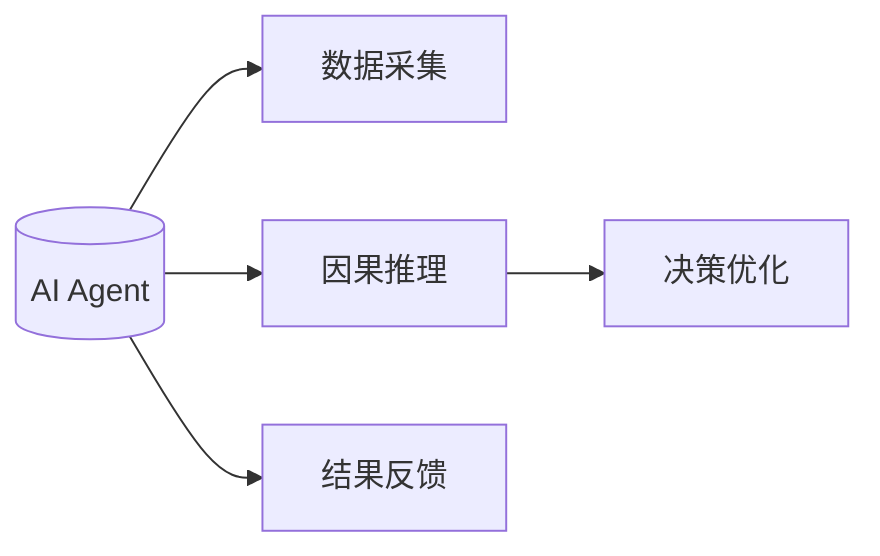
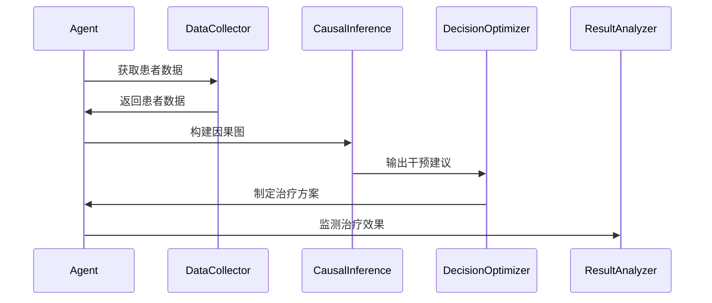

                 


# 构建具有因果推断能力的AI Agent

## 关键词：因果推断，AI Agent，因果图，潜在结果，工具变量法

## 摘要：本文详细探讨了如何构建具有因果推断能力的AI Agent。从因果推断的基本概念到算法实现，再到系统架构设计，结合实际案例，全面解析了AI Agent的因果推断能力。通过本文，读者将了解因果推断的核心原理、算法实现方法，以及如何将这些方法应用于实际系统中。

---

## 正文

### 第一部分：因果推断与AI Agent的背景

#### 第1章：因果推断的基本概念

##### 1.1 问题背景
- **1.1.1 传统机器学习的局限性**  
  传统机器学习模型（如决策树、随机森林）主要关注相关关系，而非因果关系。它们无法直接回答“如果改变某个变量，结果会如何变化”的问题，这限制了模型在实际应用中的决策能力。

- **1.1.2 因果推断的核心问题**  
  因果推断的目标是识别变量之间的因果关系，理解这些关系如何影响结果，从而实现更智能的决策和预测。

- **1.1.3 AI Agent在因果推断中的作用**  
  AI Agent通过因果推断能够更好地理解环境，做出更合理的决策，提升自主性和适应性。

##### 1.2 问题描述
- **1.2.1 因果关系与相关关系的区别**  
  相关关系描述变量之间的关联，而因果关系描述变量间的“原因与结果”关系。例如，相关关系可能显示吸烟与肺癌率相关，而因果关系则表明吸烟是肺癌的原因。

- **1.2.2 因果推断的基本框架**  
  包括识别因果图、估计因果效应和验证因果关系等步骤。

- **1.2.3 AI Agent的目标与因果推断的关系**  
  AI Agent的目标是通过因果推断，理解环境中的因果关系，优化决策策略。

##### 1.3 问题解决
- **1.3.1 因果推断的基本方法**  
  通过观察数据或干预实验，识别因果关系并估计因果效应。

- **1.3.2 AI Agent如何利用因果推断**  
  AI Agent利用因果推断进行决策推理，预测干预效果，优化行动策略。

- **1.3.3 因果推断在AI Agent中的应用案例**  
  例如，在医疗领域，AI Agent可以通过因果推断帮助医生制定治疗方案，预测不同治疗方案的效果。

##### 1.4 边界与外延
- **1.4.1 因果推断的边界条件**  
  因果推断的有效性依赖于数据质量和模型假设的正确性。

- **1.4.2 AI Agent的因果推断能力的限制**  
  当前技术难以处理高度复杂的因果关系和高维数据。

- **1.4.3 相关领域的影响**  
  因果推断技术在经济学、医学、教育等多个领域都有广泛应用。

##### 1.5 概念结构与核心要素
- **1.5.1 因果关系的数学模型**  
  包括因果图、潜在结果框架等。

- **1.5.2 AI Agent的结构与功能**  
  包括感知、推理、决策和执行模块。

- **1.5.3 因果推断与AI Agent的结合**  
  将因果推断技术嵌入AI Agent的推理模块，提升其决策能力。

---

### 第二部分：因果推断的核心概念与联系

#### 第2章：因果关系的数学模型

##### 2.1 因果图模型
- **2.1.1 因果图的定义**  
  因果图（DAG，Directed Acyclic Graph）通过有向边表示因果关系，节点代表变量。

- **2.1.2 因果图的构建方法**  
  基于专家知识或数据驱动的方法，如PC算法、GES算法。

- **2.1.3 因果图的性质**  
  包括可传递性、反传递性等。

##### 2.2 潜在结果框架
- **2.2.1 潜在结果的概念**  
  潜在结果是指在某个干预下，个体可能的结果。

- **2.2.2 潜在结果的估计方法**  
  包括反事实推理和匹配分析。

- **2.2.3 潜在结果在因果推断中的应用**  
  用于估计因果效应，如平均处理效应（ATE）、条件处理效应（CATE）。

##### 2.3 因果推理的基本原理
- **2.3.1 因果推理的步骤**  
  识别因果图、估计因果效应、验证因果关系。

- **2.3.2 因果推理的算法**  
  包括反事实推理、工具变量法、结构方程模型。

- **2.3.3 因果推理的验证方法**  
  通过实验或观察数据验证因果关系的正确性。

#### 第3章：因果关系与相关关系的对比

##### 3.1 概念对比
- **3.1.1 相关关系与因果关系的区别**  
  相关关系关注变量之间的关联，因果关系关注变量间的因果联系。

- **3.1.2 相关关系与因果关系的联系**  
  因果关系必然伴随相关关系，但相关关系不一定代表因果关系。

- **3.1.3 如何从相关关系推断因果关系**  
  需要结合领域知识和实验数据。

##### 3.2 对比表格
| 比较维度 | 相关关系 | 因果关系 |
|----------|----------|----------|
| 描述     | 变量间的关联 | 变量间的因果联系 |
| 推断     | 无法推断因果 | 可推断因果 |
| 方法     | 相关分析 | 因果图、工具变量法 |

##### 3.3 ER实体关系图
```mermaid
er
  entity 因果关系 {
    关系：R1
    属性：变量A，变量B
  }
  entity 相关关系 {
    关系：R2
    属性：变量C，变量D
  }
  entity 因果推断 {
    关系：R3
    属性：干预，结果
  }
```

---

### 第三部分：因果推断算法的原理与实现

#### 第4章：潜在结果推断算法

##### 4.1 潜在结果推断的基本原理
- **4.1.1 潜在结果的定义**  
  在给定干预下的结果。

- **4.1.2 潜在结果的估计方法**  
  包括反事实推理和倾向评分匹配。

- **4.1.3 潜在结果推断的步骤**  
  构建因果图，估计倾向评分，计算因果效应。

##### 4.2 潜在结果推断的算法实现
- **4.2.1 算法流程图**  
  ```mermaid
  graph TD
    A[开始] --> B[构建因果图]
    B --> C[估计倾向评分]
    C --> D[计算因果效应]
    D --> E[结束]
  ```

- **4.2.2 Python代码实现**  
  ```python
  import pandas as pd
  from sklearn.linear_model import LogisticRegression

  # 假设数据集为df，包含变量X和Y
  def estimate_causal_effect(df):
      # 估计倾向评分
      model = LogisticRegression()
      model.fit(df[['X']], df['Y'])
      # 计算因果效应
      te = model.predict_proba(df[['X']])[:,1]
      return te

  df = pd.DataFrame({'X': [0,1,0,1], 'Y': [0,1,1,0]})
  te = estimate_causal_effect(df)
  print(te)
  ```

- **4.2.3 数学模型与公式**  
  因果效应的估计公式：  
  $$ \text{ATE} = E[Y^{do(X=1)} - Y^{do(X=0)}] $$

---

### 第四部分：系统分析与架构设计

#### 第5章：AI Agent的系统架构

##### 5.1 问题场景介绍
- AI Agent需要在动态环境中做出决策，依赖因果推断理解环境。

##### 5.2 项目介绍
- 构建一个医疗AI Agent，帮助医生制定治疗方案。

##### 5.3 系统功能设计
- **领域模型**：医疗知识库、因果图模型。
- **功能模块**：数据采集、因果推理、决策优化、结果反馈。

##### 5.4 系统架构设计


##### 5.5 系统接口设计
- 数据接口：接收患者数据和医疗知识库。
- 推理接口：输出因果关系和干预建议。

##### 5.6 系统交互流程图


---

### 第五部分：项目实战

#### 第6章：构建具备因果推断能力的AI Agent

##### 6.1 环境安装
- 安装必要的Python库：pandas、numpy、scikit-learn、networkx。

##### 6.2 核心实现
- **因果图构建**：使用networkx库。
- **因果推断算法**：实现潜在结果推断和工具变量法。

##### 6.3 代码实现
- **因果图构建代码**：
  ```python
  import networkx as nx

  G = nx.DiGraph()
  G.add_edges_from([('X', 'Y'), ('Z', 'Y')])
  ```

- **潜在结果推断代码**：
  ```python
  def causal_inference(df, treatment, outcome):
      model = LogisticRegression()
      model.fit(df[[treatment]], df[outcome])
      te = model.predict_proba(df[[treatment]])[:,1]
      return te

  df = pd.DataFrame({'X': [0,1,0,1], 'Y': [0,1,1,0]})
  te = causal_inference(df, 'X', 'Y')
  print(te)
  ```

##### 6.4 案例分析
- 通过一个医疗案例，展示AI Agent如何利用因果推断优化治疗方案。

##### 6.5 项目小结
- 总结项目实现的关键点和遇到的挑战。

---

### 第六部分：总结与展望

#### 第7章：总结与展望

##### 7.1 总结
- 本文详细介绍了因果推断的基本概念、算法实现和系统架构设计，展示了如何构建具备因果推断能力的AI Agent。

##### 7.2 展望
- 未来研究方向包括更复杂的因果关系建模、多智能体协作中的因果推理，以及因果推断的可解释性问题。

---

### 参考文献

（此处列出相关文献和资料）

---

### 致谢

感谢读者的耐心阅读，希望本文能为构建具有因果推断能力的AI Agent提供有价值的参考。

