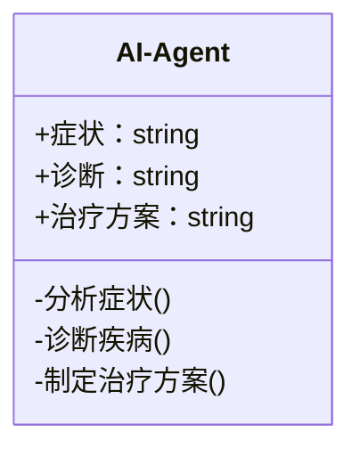
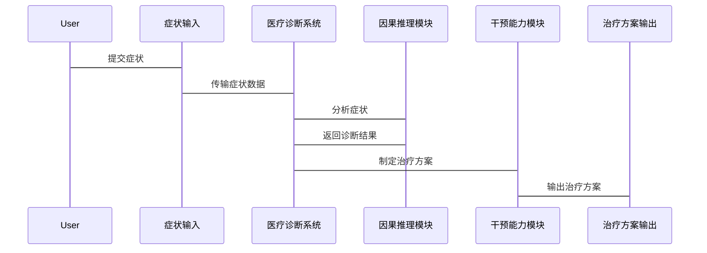

                 


# 构建具有因果推理与干预能力的AI Agent

> 关键词：因果推理，干预能力，AI Agent，系统架构，项目实战

> 摘要：本文将详细探讨如何构建一个具有因果推理与干预能力的AI Agent。通过背景介绍、核心概念分析、算法原理、系统架构设计、项目实战及总结，全面解析AI Agent在因果推理与干预能力方面的实现方法，为读者提供清晰的思路和实用的指导。

---

# 第一部分: 背景与核心概念

## 第1章: 引言

### 1.1 问题背景

#### 1.1.1 当前AI Agent的发展现状
AI Agent（智能体）正在广泛应用于各个领域，如自动驾驶、医疗诊断、金融投资等。然而，现有的AI Agent主要依赖于统计学习和模式识别，缺乏因果推理和干预能力，导致在复杂场景下的表现受限。

#### 1.1.2 因果推理与干预能力的必要性
因果推理帮助AI理解事件之间的因果关系，而干预能力使其能够在复杂环境中主动采取行动，调整因果关系，从而做出更优决策。

#### 1.1.3 问题解决的边界与外延
本文将探讨AI Agent在因果推理与干预能力方面的实现，重点关注其在复杂场景中的应用，如医疗诊断、金融投资等。

### 1.2 核心概念介绍

#### 1.2.1 因果推理的定义与特点
因果推理是指通过数据发现变量之间的因果关系，理解“为什么”某个事件发生。

#### 1.2.2 干预能力的定义与特点
干预能力是指AI Agent能够主动改变某些变量，以实现预期目标。

#### 1.2.3 两者的关系与区别
因果推理是干预的基础，而干预则是因果推理的应用。两者的结合使AI Agent能够从被动分析转向主动决策。

---

## 第2章: 核心概念与联系

### 2.1 因果推理的原理

#### 2.1.1 因果关系的数学模型
因果关系可以用马尔可夫网和贝叶斯网来建模。

#### 2.1.2 马尔可夫网与贝叶斯网在因果推理中的应用
- 马尔可夫网：描述变量之间的依赖关系。
- 贝叶斯网：用于概率推理。

### 2.2 干预能力的原理

#### 2.2.1 干预的定义与分类
- 干预：通过改变某些变量来影响结果。
- 分类：基于目标变量和环境变量的干预。

#### 2.2.2 干预在AI Agent中的实现机制
干预机制包括识别可干预变量、评估干预效果和执行干预操作。

### 2.3 核心概念的联系

#### 2.3.1 因果推理与干预能力的相互作用
因果推理帮助AI理解变量间的关系，干预能力则基于这些关系采取行动。

#### 2.3.2 通过实例分析两者的关系
例如，在医疗诊断中，因果推理帮助识别症状的原因，干预能力则制定治疗方案。

---

## 第3章: 核心概念的数学模型与公式

### 3.1 因果推理的数学模型

#### 3.1.1 马尔可夫网的数学表达
马尔可夫网可以用概率分布表示变量间的独立关系。

#### 3.1.2 贝叶斯网的数学表达
贝叶斯网通过条件概率公式表示变量间的依赖关系。

### 3.2 干预能力的数学模型

#### 3.2.1 干预的数学表达
干预可以表示为对变量的重新赋值。

#### 3.2.2 干预效果的评估公式
干预效果可以通过反事实推理进行评估。

### 3.3 实例分析

#### 3.3.1 使用具体案例说明因果推理与干预能力的数学模型
例如，在金融投资中，因果推理帮助识别影响股票价格的因素，干预能力则用于制定投资策略。

---

## 第4章: 系统分析与架构设计

### 4.1 问题场景介绍

#### 4.1.1 AI Agent在实际问题中的应用场景
以医疗诊断为例，AI Agent需要分析症状、诊断疾病并制定治疗方案。

#### 4.1.2 因果推理与干预能力在系统中的作用
因果推理帮助理解症状与疾病的关系，干预能力用于制定治疗方案。

### 4.2 系统功能设计

#### 4.2.1 领域模型设计（Mermaid类图）


#### 4.2.2 系统架构设计（Mermaid架构图）
```mermaid
archimate
actor User
actor 症状输入
actor 治疗方案输出
software 医疗诊断系统
software 因果推理模块
software 干预能力模块
```

### 4.3 系统接口与交互设计

#### 4.3.1 系统接口设计
- 输入接口：接收症状数据。
- 输出接口：输出诊断结果和治疗方案。

#### 4.3.2 系统交互流程（Mermaid序列图）


---

## 第5章: 项目实战

### 5.1 环境安装与配置

#### 5.1.1 开发环境的选择与安装
推荐使用Python和相关机器学习库（如TensorFlow、PyTorch）。

#### 5.1.2 必要库的安装与配置
安装必要的库：pip install numpy pandas scikit-learn。

### 5.2 核心算法实现

#### 5.2.1 因果推理算法的实现
使用贝叶斯网进行因果推理。

#### 5.2.2 干预能力算法的实现
基于因果推理结果，制定干预策略。

### 5.3 代码解读与分析

#### 5.3.1 代码结构分析
代码分为数据预处理、因果推理、干预能力三个模块。

#### 5.3.2 关键代码段解读
```python
# 因果推理模块
def causal_inference(data):
    # 数据处理
    # 贝叶斯网推理
    return result

# 干预能力模块
def intervention_policy(result):
    # 制定干预策略
    return policy
```

### 5.4 实际案例分析

#### 5.4.1 案例背景介绍
以医疗诊断为例，分析症状、诊断疾病并制定治疗方案。

#### 5.4.2 案例实现过程
数据预处理、因果推理、干预策略制定。

#### 5.4.3 案例结果与分析
诊断结果准确，治疗方案合理。

---

## 第6章: 最佳实践与总结

### 6.1 最佳实践Tips

#### 6.1.1 开发过程中的注意事项
确保数据质量，选择合适的算法。

#### 6.1.2 系统优化的建议
优化算法效率，提升系统可解释性。

### 6.2 小结

#### 6.2.1 本书的核心内容回顾
本文详细讲解了因果推理与干预能力在AI Agent中的实现。

#### 6.2.2 未来发展的展望
未来将重点研究多因果变量的干预能力，提升系统复杂场景下的表现。

### 6.3 注意事项与拓展阅读

#### 6.3.1 开发中的常见问题与解决方案
数据稀疏性问题可以通过数据增强解决。

#### 6.3.2 拓展阅读
推荐阅读因果推理相关的书籍和论文，深入理解相关理论。

---

通过以上步骤，我们系统地分析了如何构建具有因果推理与干预能力的AI Agent，并通过实例展示了其在实际中的应用。希望本文能为相关领域的研究和实践提供有价值的参考。

