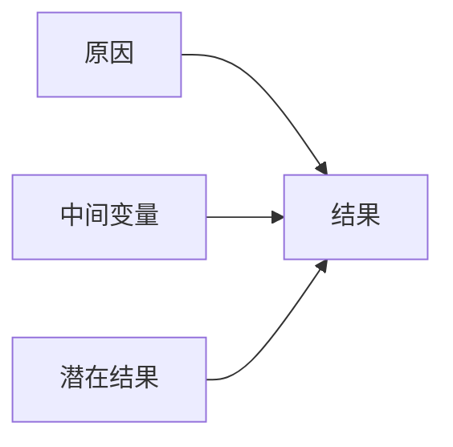
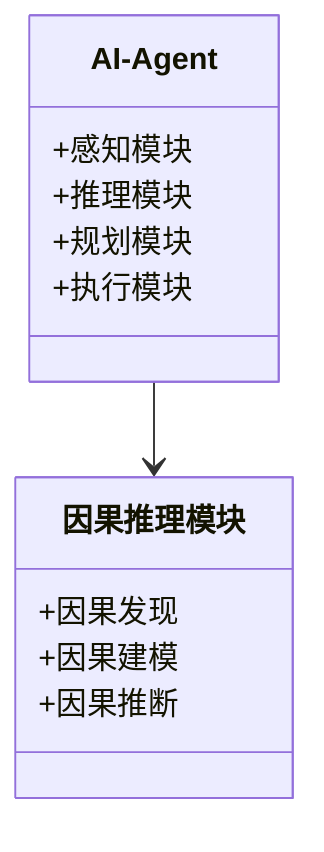
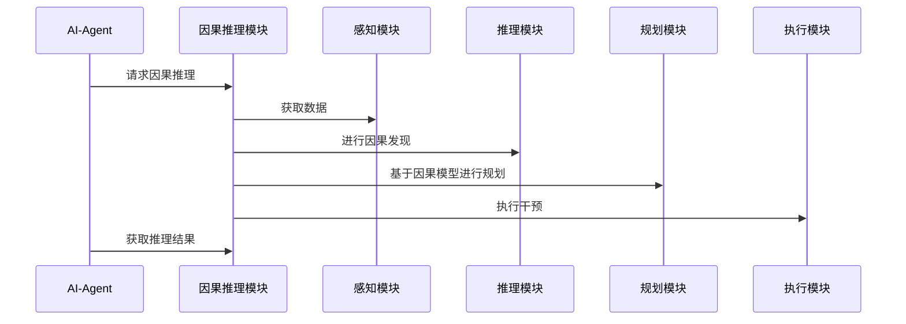

                 


# 构建具有因果推理能力的AI Agent

## 关键词：因果推理，AI Agent，人工智能，因果关系，系统架构，算法原理

## 摘要：本文详细探讨了构建具有因果推理能力的AI Agent的背景、核心概念、算法原理、系统架构、项目实现及最佳实践。通过分析因果推理的基本原理、算法实现和系统设计，为读者提供从理论到实践的全面指导。

---

# 第一部分: 构建具有因果推理能力的AI Agent背景介绍

## 第1章: 问题背景与概念结构

### 1.1 问题背景

#### 1.1.1 当前AI Agent的发展现状
AI Agent（人工智能代理）近年来取得了显著进展，广泛应用于自动驾驶、智能助手、推荐系统等领域。然而，大多数AI Agent仅具备基于相关性的预测能力，缺乏因果推理能力，难以处理复杂的因果关系问题。

#### 1.1.2 因果推理在AI Agent中的重要性
因果推理是理解因果关系的核心能力，能够帮助AI Agent更好地处理干预、反事实推理等问题。在现实世界中，因果推理是解决复杂决策问题的关键。

#### 1.1.3 问题解决的必要性与紧迫性
随着AI Agent的应用场景越来越复杂，仅仅依赖相关性分析已无法满足需求。构建具有因果推理能力的AI Agent已成为提升智能系统决策能力的重要方向。

### 1.2 问题描述

#### 1.2.1 AI Agent的基本定义与功能
AI Agent是一种智能实体，能够感知环境、执行任务并做出决策。其核心功能包括感知、推理、规划和执行。

#### 1.2.2 因果推理的核心问题
因果推理的核心问题是识别因果关系，并基于这些关系进行推理和决策。这需要解决因果发现、因果推断和反事实推理等问题。

#### 1.2.3 当前AI Agent在因果推理中的局限性
现有的AI Agent主要依赖相关性分析，缺乏对因果关系的深入理解，难以处理复杂的干预和反事实推理问题。

### 1.3 问题解决

#### 1.3.1 构建具有因果推理能力的AI Agent的目标
通过引入因果推理技术，提升AI Agent的决策能力和复杂问题处理能力。

#### 1.3.2 解决方案的选择与优化
选择合适的因果推理算法，优化系统架构，确保因果推理能力的高效实现。

#### 1.3.3 技术路线与实现路径
技术路线包括因果发现、因果建模和因果推断三个主要阶段，实现路径涉及算法实现、系统集成和应用优化。

### 1.4 边界与外延

#### 1.4.1 因果推理的边界条件
因果推理的边界条件包括数据质量和干预可行性等。

#### 1.4.2 相关概念的区分与联系
因果推理与其他推理方法（如相关性分析、归纳推理）既有区别又有联系。

#### 1.4.3 技术实现的局限性与未来发展方向
当前技术的局限性包括因果关系的复杂性和数据的稀疏性，未来发展方向包括更高效的因果发现算法和更强大的推理能力。

### 1.5 概念结构与核心要素

#### 1.5.1 AI Agent的组成要素
AI Agent的组成要素包括感知模块、推理模块、规划模块和执行模块。

#### 1.5.2 因果推理的核心要素
因果推理的核心要素包括因果关系、因果模型和因果推断。

#### 1.5.3 相关概念的对比分析
因果推理与其他推理方法的对比分析，包括相关性分析、归纳推理和演绎推理。

---

# 第二部分: 因果推理的核心概念与联系

## 第2章: 因果推理的原理与机制

### 2.1 因果推理的原理

#### 2.1.1 因果关系的基本定义
因果关系是指一个事件（原因）导致另一个事件（结果）发生的关系。

#### 2.1.2 因果推理的基本模型
因果推理的基本模型包括因果图、贝叶斯网络和潜在结果框架。

#### 2.1.3 因果推理的核心算法
因果推理的核心算法包括因果发现算法（如PC算法）和因果推断算法（如背门调整法）。

### 2.2 因果推理的机制

#### 2.2.1 因果链的构建与分析
因果链的构建与分析包括识别因果路径和评估因果强度。

#### 2.2.2 因果关系的强度与稳定性
因果关系的强度与稳定性取决于数据质量和干预方式。

#### 2.2.3 因果推理的动态调整机制
因果推理的动态调整机制包括在线因果发现和自适应因果推断。

### 2.3 因果推理与相关概念的对比

#### 2.3.1 因果推理与相关性分析
因果推理关注因果关系，而相关性分析关注变量之间的关联。

#### 2.3.2 因果推理与归纳推理
因果推理基于因果关系进行推理，归纳推理基于观察数据总结规律。

#### 2.3.3 因果推理与演绎推理
因果推理从因果模型出发进行推理，演绎推理从一般规则出发推导具体结论。

## 第3章: 因果推理的实体关系与系统架构

### 3.1 因果推理的实体关系



### 3.2 因果推理的系统架构



### 3.3 因果推理的系统架构设计

#### 3.3.1 系统功能设计
系统功能包括因果发现、因果建模和因果推断。

#### 3.3.2 系统架构图


#### 3.3.3 系统接口设计
系统接口包括因果推理模块与AI Agent的交互接口。

#### 3.3.4 系统交互序列图


---

# 第三部分: 因果推理的算法原理

## 第4章: 因果推理的算法实现

### 4.1 因果发现算法

#### 4.1.1 PC算法
PC算法是一种用于发现因果关系的算法，基于条件独立性测试。

#### 4.1.2 Fast Causal Discovery (FCD) 算法
FCD算法是一种高效的因果发现算法，适用于大数据场景。

#### 4.1.3 基于贝叶斯网络的因果发现
基于贝叶斯网络的因果发现方法结合了概率推理和因果关系。

### 4.2 因果推断算法

#### 4.2.1 背门调整法
背门调整法是一种常用的因果推断方法，基于因果图的结构信息。

#### 4.2.2 因子分解法
因子分解法是一种基于潜在结果的因果推断方法。

#### 4.2.3 因果森林
因果森林是一种基于机器学习的因果推断方法，适用于高维数据场景。

### 4.3 因果推理的数学模型

#### 4.3.1 因果图的表示
因果图的表示使用有向图，节点表示变量，边表示因果关系。

#### 4.3.2 因果模型的数学表达
因果模型可以用概率分布表示，例如 $P(Y|do(X=x), X=x)$。

#### 4.3.3 因果推断的公式
因果推断的公式包括 $P(Y|do(X=x)) = \sum_{w} P(Y|X=x, W=w) P(W=w)$。

### 4.4 算法实现与代码示例

#### 4.4.1 因果发现算法实现
```python
def pc_algorithm(data):
    # 实现PC算法的具体步骤
    pass
```

#### 4.4.2 因果推断算法实现
```python
def backdoor_adjustment(data, treatment, outcome, covariates):
    # 实现背门调整法的具体步骤
    pass
```

---

# 第四部分: 系统分析与架构设计

## 第5章: 系统分析与架构设计

### 5.1 问题场景介绍

#### 5.1.1 问题背景
构建具有因果推理能力的AI Agent需要解决因果发现、因果建模和因果推断三个主要问题。

#### 5.1.2 项目介绍
本项目旨在开发一个具有因果推理能力的AI Agent，能够处理复杂的因果关系问题。

### 5.2 系统功能设计

#### 5.2.1 领域模型设计


#### 5.2.2 系统架构设计


#### 5.2.3 系统接口设计
系统接口包括因果推理模块与AI Agent的交互接口。

#### 5.2.4 系统交互设计


### 5.3 系统实现与优化

#### 5.3.1 系统实现
系统实现包括因果推理模块的实现和AI Agent的集成。

#### 5.3.2 系统优化
系统优化包括算法优化和系统架构优化，以提高因果推理的效率和准确性。

---

# 第五部分: 项目实战

## 第6章: 项目实现与案例分析

### 6.1 环境安装与配置

#### 6.1.1 环境依赖
需要安装Python、相关库（如因果推理库）和开发工具。

#### 6.1.2 环境配置
配置开发环境，包括Python版本、库的安装和配置文件的设置。

### 6.2 系统核心实现

#### 6.2.1 因果发现算法实现
```python
def pc_algorithm(data):
    # 实现PC算法的具体步骤
    pass
```

#### 6.2.2 因果推断算法实现
```python
def backdoor_adjustment(data, treatment, outcome, covariates):
    # 实现背门调整法的具体步骤
    pass
```

#### 6.2.3 系统集成与测试
系统集成与测试包括单元测试、集成测试和性能测试。

### 6.3 代码实现与应用解读

#### 6.3.1 代码实现
```python
def pc_algorithm(data):
    # 实现PC算法的具体步骤
    pass
```

#### 6.3.2 代码应用解读
解读代码实现，说明每部分代码的功能和作用。

### 6.4 案例分析与详细讲解

#### 6.4.1 案例背景
案例背景包括问题描述、数据来源和目标。

#### 6.4.2 数据分析
数据分析包括数据预处理、特征提取和数据可视化。

#### 6.4.3 系统实现
系统实现包括因果发现、因果建模和因果推断的具体实现。

#### 6.4.4 结果解读
结果解读包括因果关系的可视化和推理结果的分析。

### 6.5 项目小结

#### 6.5.1 项目总结
总结项目的实现过程和主要成果。

#### 6.5.2 经验与教训
总结项目中的经验教训，为未来项目提供参考。

---

# 第六部分: 最佳实践、小结与展望

## 第7章: 最佳实践与小结

### 7.1 最佳实践

#### 7.1.1 系统设计建议
系统设计建议包括模块化设计、高效算法选择和系统可扩展性设计。

#### 7.1.2 开发与调试技巧
开发与调试技巧包括代码规范、调试方法和性能优化技巧。

#### 7.1.3 测试与验证策略
测试与验证策略包括单元测试、集成测试和性能测试。

### 7.2 小结

#### 7.2.1 核心内容总结
总结本文的核心内容，包括因果推理的基本原理、算法实现和系统设计。

#### 7.2.2 关键点回顾
回顾本文的关键点，包括因果关系的发现、建模和推断。

### 7.3 展望与未来方向

#### 7.3.1 未来研究方向
未来研究方向包括更高效的因果发现算法和更强大的因果推断方法。

#### 7.3.2 技术发展趋势
技术发展趋势包括因果推理与机器学习的结合和因果推理在AI Agent中的广泛应用。

---

# 结语

构建具有因果推理能力的AI Agent是一项具有挑战性的任务，但通过深入理解因果推理的原理、算法实现和系统设计，我们可以开发出更智能、更可靠的AI系统。未来，随着因果推理技术的不断发展，AI Agent将在更多领域发挥重要作用。

---

# 参考文献

（此处列出相关参考文献）

