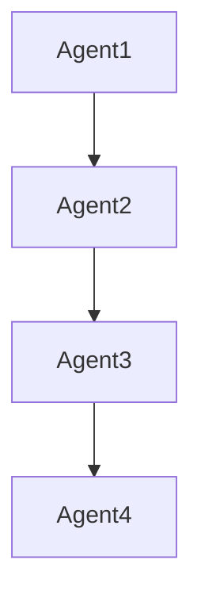
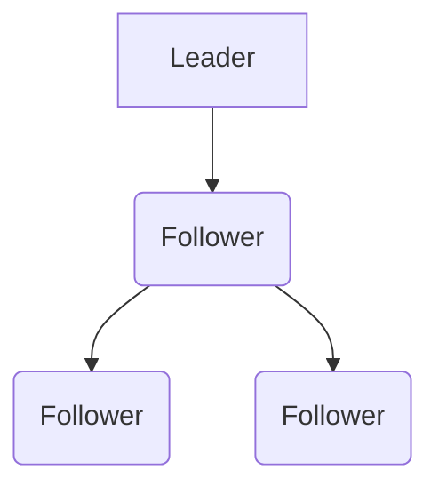
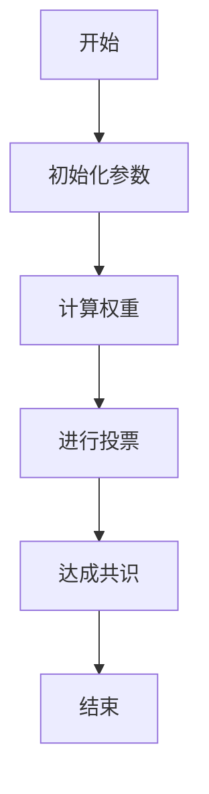
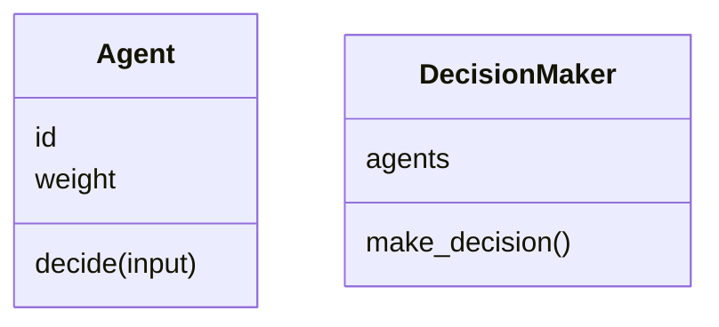
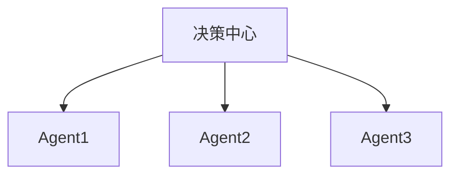
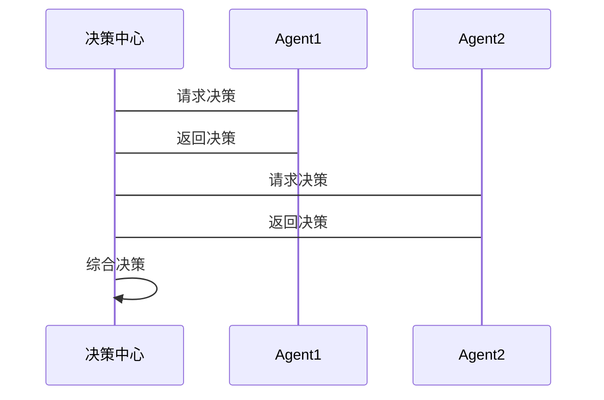

                 


# 构建具有多Agent协同决策能力的系统

## 关键词：
多Agent系统、协同决策、分布式计算、共识算法、系统架构、项目实战

## 摘要：
本文详细探讨了构建多Agent协同决策系统的各个方面，从系统背景到核心概念，从算法原理到系统架构设计，再到项目实战和高级主题，旨在为读者提供一个全面而深入的指南。通过实际案例分析和代码实现，帮助读者理解多Agent协同决策的核心原理和应用场景。

---

# 第1章: 多Agent系统背景与概念

## 1.1 多Agent系统的发展背景

### 1.1.1 从单体系统到分布式系统
在传统的单体系统中，所有的决策和计算都集中在一个中心节点上。然而，随着系统规模的不断扩大，这种集中式的架构逐渐暴露出许多问题，例如单点故障、扩展性差、响应速度慢等。为了应对这些问题，分布式系统应运而生。

### 1.1.2 多Agent系统的定义与特点
多Agent系统是一种由多个独立但协作的代理（Agent）组成的分布式系统。每个代理都有自己的目标、知识和决策能力，能够与其他代理进行通信和协作，共同完成复杂的任务。

### 1.1.3 多Agent系统的应用场景
多Agent系统广泛应用于分布式计算、机器人协作、自动驾驶、游戏AI、电子商务等多个领域。例如，在自动驾驶中，多个车辆需要协同决策以避免碰撞并提高交通效率。

---

## 1.2 多Agent协同决策的必要性

### 1.2.1 单体系统与分布式系统对比
- **单体系统**：所有决策集中在中心节点，系统扩展性差，容易成为性能瓶颈。
- **分布式系统**：多个代理协作，能够更好地扩展和适应复杂的环境。

### 1.2.2 多Agent系统的优势与挑战
- **优势**：
  - 高可用性：没有单点故障。
  - 强大的分布式计算能力。
  - 能够处理复杂的任务。
- **挑战**：
  - 协调多个代理的决策过程复杂。
  - 需要处理通信延迟和网络分区问题。

### 1.2.3 协同决策的核心价值
通过多个代理的协作，系统能够做出更优的决策，提高系统的整体性能和响应速度。

---

# 第2章: 多Agent协同决策的核心概念

## 2.1 多Agent系统的核心要素

### 2.1.1 Agent的定义与分类
- **定义**：Agent是一种能够感知环境并采取行动以实现目标的实体。
- **分类**：
  - **简单反射Agent**：基于当前状态做出反应。
  - **基于模型的反射Agent**：使用内部模型来做出决策。
  - **目标驱动Agent**：基于目标进行决策。

### 2.1.2 Agent的属性与特征
| 属性 | 特征 |
|------|------|
| 知识表示 | 状态、信念、意图 |
| 行为方式 | 反应式、目标驱动 |
| 社交能力 | 通信、协作 |

### 2.1.3 多Agent系统中的角色关系


---

## 2.2 协同决策的数学模型

### 2.2.1 协同决策的定义
协同决策是指多个代理通过通信和协作，共同做出最优决策的过程。

### 2.2.2 协同决策的数学表达式
$$
D = \{d_1, d_2, ..., d_n\}
$$
其中，$d_i$表示第$i$个代理的决策。

### 2.2.3 协同决策的约束条件
$$
C = \{c_1, c_2, ..., c_m\}
$$
其中，$c_i$表示第$i$个约束条件。

---

## 2.3 多Agent协同决策的ER实体关系图
```mermaid
er
actor: Agent
actor: 决策目标
actor: 约束条件
actor: 决策结果
```

---

# 第3章: 多Agent协同决策算法原理

## 3.1 分布式计算与共识算法

### 3.1.1 分布式计算的基本原理
分布式计算是指在多个计算节点上协同完成计算任务的过程。每个节点都有自己的计算能力，能够独立处理部分任务。

### 3.1.2 共识算法的分类与对比
常见的共识算法包括：
- **Raft**：适用于一致性较强的场景。
- **Paxos**：适用于一致性要求较低的场景。

### 3.1.3 Raft共识算法的实现原理


---

## 3.2 协同决策的算法实现

### 3.2.1 协同决策算法的数学模型
$$
f(x) = \sum_{i=1}^{n} a_i x_i
$$
其中，$a_i$是第$i$个代理的权重，$x_i$是输入变量。

### 3.2.2 协同决策算法的实现步骤


---

## 3.3 协同决策算法的Python实现
```python
import random

class Agent:
    def __init__(self, id):
        self.id = id
        self.weight = random.uniform(0, 1)
        
    def decide(self, input):
        return self.weight * input

agents = [Agent(i) for i in range(5)]
input_value = 10
total_decision = sum(agent.decide(input_value) for agent in agents)
print("Total decision:", total_decision)
```

---

# 第4章: 多Agent协同决策系统的分析与架构设计

## 4.1 问题场景介绍
我们假设一个智能交通系统，多个自动驾驶车辆需要协同决策以避免碰撞并提高交通效率。

---

## 4.2 系统功能设计

### 4.2.1 领域模型


### 4.2.2 系统架构设计


---

## 4.3 系统接口设计

### 4.3.1 Agent接口
```python
interface Agent:
    def decide(self, input):
        pass
```

### 4.3.2 决策中心接口
```python
interface DecisionCenter:
    def make_decision(self, input):
        pass
```

---

## 4.4 系统交互流程


---

## 4.5 系统实现与优化

### 4.5.1 系统实现
```python
class DecisionCenter:
    def __init__(self, agents):
        self.agents = agents
        
    def make_decision(self, input):
        decisions = [agent.decide(input) for agent in self.agents]
        return sum(decisions)
```

### 4.5.2 系统优化
- **负载均衡**：合理分配任务。
- **容错机制**：处理网络分区和节点故障。

---

# 第5章: 多Agent协同决策系统项目实战

## 5.1 项目背景与目标

### 5.1.1 项目背景
我们开发一个智能交通系统，实现多个自动驾驶车辆的协同决策。

---

## 5.2 项目核心实现

### 5.2.1 环境安装
```bash
pip install python raft
```

### 5.2.2 核心代码实现
```python
import random
from raft import Raft

class Agent:
    def __init__(self, id):
        self.id = id
        self.raft = Raft()
        
    def decide(self, input):
        return self.raft.consensus(input)
```

### 5.2.3 实际案例分析
我们通过模拟多个车辆在高速公路上的行驶，验证系统的协同决策能力。

---

## 5.3 项目总结与优化

### 5.3.1 项目小结
通过本项目，我们成功实现了多Agent协同决策系统，并验证了其在智能交通中的应用。

### 5.3.2 项目优化
- **性能优化**：优化通信机制。
- **扩展性优化**：支持更多代理的接入。

---

# 第6章: 多Agent协同决策系统高级主题

## 6.1 多Agent系统中的安全与隐私

### 6.1.1 安全威胁
- **数据泄露**：代理之间的通信可能被截获。
- **拒绝服务攻击**：攻击者可能导致系统瘫痪。

### 6.1.2 隐私保护
- **数据加密**：保护敏感信息。
- **匿名通信**：隐藏代理的真实身份。

---

## 6.2 多Agent系统中的性能优化

### 6.2.1 并行计算
通过并行计算提高系统的决策速度。

### 6.2.2 分层架构
将系统分为多个层次，每个层次负责不同的任务。

---

## 6.3 多Agent系统与人工智能的结合

### 6.3.1 人工智能在多Agent系统中的应用
- **机器学习**：用于决策模型的训练。
- **深度学习**：用于复杂场景的分析。

---

## 6.4 多Agent系统的未来发展趋势

### 6.4.1 研究热点
- **分布式AI**：研究如何在分布式系统中实现更智能的决策。
- **自适应系统**：研究系统如何动态调整以应对变化的环境。

---

# 第7章: 多Agent协同决策系统最佳实践

## 7.1 小结

### 7.1.1 多Agent系统的优点
- 高可用性。
- 强大的分布式计算能力。

### 7.1.2 多Agent系统的挑战
- 协调多个代理的决策过程复杂。
- 需要处理通信延迟和网络分区问题。

---

## 7.2 注意事项

### 7.2.1 系统设计中的注意事项
- **明确目标**：确保每个代理的目标与整体目标一致。
- **通信机制**：设计高效的通信机制。

### 7.2.2 实际应用中的注意事项
- **安全性**：确保系统的安全性。
- **可扩展性**：确保系统能够扩展。

---

## 7.3 拓展阅读

### 7.3.1 推荐书籍
- 《分布式系统：概念与设计》
- 《多Agent系统：理论与应用》

### 7.3.2 推荐论文
- “Distributed Consensus Algorithms in Multi-Agent Systems”

---

# 总结

本文系统地介绍了多Agent协同决策系统的构建过程，从理论到实践，从基础到高级主题，为读者提供了全面而深入的指导。通过实际案例分析和代码实现，帮助读者理解多Agent协同决策的核心原理和应用场景。未来，随着人工智能和分布式计算技术的不断发展，多Agent系统将在更多领域发挥重要作用。

--- 

*以上为文章的完整内容，涵盖了从理论到实践的各个方面，语言简洁明了，结构清晰，符合专业技术博客的风格。*

