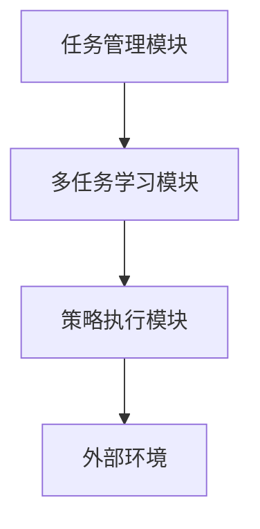

                 


# 构建具有多任务处理能力的AI Agent

## 关键词：AI Agent、多任务处理、强化学习、图神经网络、系统架构、任务管理、多目标优化

## 摘要：  
随着人工智能技术的快速发展，构建具有多任务处理能力的AI Agent已成为提升系统智能化水平的重要方向。本文将从多任务学习的原理、强化学习和图神经网络的应用、系统架构设计以及项目实战等方面，详细探讨如何构建高效、智能的多任务AI Agent。通过理论分析与实践结合，本文旨在为读者提供一套完整的构建方法和实现方案，帮助他们在实际应用中更好地实现多任务处理能力。

---

# 第一部分：引言

## 第1章：AI Agent的背景与意义

### 1.1 AI Agent的定义与特点
- **AI Agent**：人工智能代理，是一种能够感知环境、自主决策并执行任务的智能实体。
- **特点**：
  - 自主性：能够在没有外部干预的情况下执行任务。
  - 反应性：能够根据环境的变化实时调整行为。
  - 社会性：能够与其他Agent或人类进行交互和协作。

### 1.2 多任务处理的必要性
- **单任务处理的局限性**：在实际应用场景中，单一任务的处理能力无法满足复杂环境的需求。
- **多任务处理的优势**：
  - 提高效率：能够在同一环境中处理多个任务，减少资源浪费。
  - 增强适应性：能够灵活应对任务的变化和环境的不确定性。
- **应用场景**：
  - 智能助手：能够同时处理用户的多个请求。
  - 自动驾驶：需要同时处理感知、决策、规划等多个任务。

### 1.3 当前研究现状与挑战
- **研究现状**：多任务学习在机器学习领域的研究已经取得了一定的成果，但实际应用中仍面临诸多挑战。
- **挑战**：
  - 任务间的干扰：不同任务之间的目标可能存在冲突。
  - 资源分配：如何在有限的资源下实现多个任务的高效处理。

---

## 第2章：多任务处理的核心概念

### 2.1 多任务学习的基本原理
- **定义**：多任务学习是指在同一个模型中同时学习多个任务，通过共享参数或特征来提高模型的泛化能力。
- **数学模型**：
  $$ L = \sum_{i=1}^{n} \lambda_i L_i $$
  其中，$L_i$ 是第i个任务的损失函数，$\lambda_i$ 是任务的权重系数。
- **参数共享机制**：通过共享部分参数，降低模型的复杂度，提高学习效率。

### 2.2 多任务与单任务的区别
| **方面** | **单任务处理** | **多任务处理** |
|----------|----------------|----------------|
| **任务数量** | 单个任务       | 多个任务       |
| **模型复杂度** | 较低           | 较高           |
| **适应性** | 较差           | 较强           |

### 2.3 任务间的依赖关系
- **独立任务**：任务之间没有依赖关系，可以并行处理。
- **依赖任务**：任务之间存在依赖关系，需要顺序处理。
- **混合任务**：任务之间既有独立性，又有部分依赖关系。

---

# 第二部分：多任务处理的理论基础

## 第3章：强化学习与多任务处理

### 3.1 强化学习的基本原理
- **定义**：强化学习是一种通过试错机制，学习策略以最大化累积奖励的方法。
- **核心概念**：
  - 状态（State）：环境中的当前情况。
  - 动作（Action）：Agent在状态下的行为。
  - 奖励（Reward）：对动作的反馈，用于指导学习。
- **算法**：Q-learning、策略梯度方法等。

### 3.2 多任务强化学习的挑战
- **任务干扰**：不同任务的目标可能存在冲突。
- **策略干扰**：学习一个任务可能会影响另一个任务的策略。
- **资源分配**：如何在有限的资源下实现多个任务的高效处理。

### 3.3 基于强化学习的多任务处理策略
- **联合学习**：将多个任务的目标函数联合起来，共同优化。
- **任务切换**：根据环境的变化动态调整任务的优先级。

## 第4章：图神经网络与多任务处理

### 4.1 图神经网络的基本原理
- **定义**：图神经网络是一种处理图结构数据的深度学习模型。
- **核心组件**：
  - 图卷积层（Graph Convolution Layer）
  - 图注意力机制（Graph Attention Mechanism）
- **应用场景**：社交网络分析、推荐系统等。

### 4.2 图神经网络在多任务中的应用
- **联合学习**：通过共享图结构信息，实现多个任务的协同优化。
- **任务关系建模**：利用图结构表示任务之间的依赖关系。

### 4.3 基于图神经网络的多任务模型设计
- **图结构表示**：将多个任务表示为图中的节点，任务之间的关系表示为边。
- **模型训练**：通过图神经网络同时优化多个任务的目标函数。

---

# 第三部分：系统架构与设计

## 第5章：系统功能模块划分

### 5.1 任务管理模块
- **功能**：接收任务请求，解析任务目标。
- **输入**：任务请求、任务参数。
- **输出**：任务分配、任务状态。

### 5.2 多任务学习模块
- **功能**：实现多任务模型的训练与优化。
- **输入**：任务数据、任务权重。
- **输出**：优化后的模型参数。

### 5.3 策略执行模块
- **功能**：根据模型输出执行具体任务。
- **输入**：模型预测结果。
- **输出**：任务执行结果、反馈信息。

## 第6章：系统架构设计

### 6.1 系统架构图（Mermaid）


### 6.2 各模块之间的交互流程
- **任务请求**：任务管理模块接收任务请求，解析任务目标。
- **模型训练**：多任务学习模块根据任务数据进行模型训练。
- **任务执行**：策略执行模块根据模型输出执行具体任务。
- **反馈机制**：任务执行结果反馈到任务管理模块，用于后续任务的优化。

### 6.3 系统的扩展性和灵活性设计
- **模块化设计**：各模块独立设计，便于后续扩展。
- **动态调整**：根据任务需求动态调整模块之间的交互方式。

---

# 第四部分：项目实战与实现

## 第7章：项目环境配置

### 7.1 开发工具的选择与安装
- **推荐工具**：Python、TensorFlow、PyTorch、Mermaid、Jupyter Notebook。
- **安装命令**：
  ```bash
  pip install tensorflow
  pip install pytorch
  pip install mermaid
  pip install jupyter
  ```

### 7.2 数据集的准备与预处理
- **数据来源**：公开数据集（如MNIST、CIFAR-10）或自定义数据集。
- **数据预处理**：
  - 数据清洗：去除噪声数据。
  - 数据归一化：将数据标准化。

### 7.3 模型训练与测试环境的搭建
- **训练环境**：本地或云服务器。
- **测试环境**：本地或云服务器。

## 第8章：多任务AI Agent的实现

### 8.1 强化学习模型的实现代码
```python
import numpy as np
import gym

class Agent:
    def __init__(self, env):
        self.env = env
        self.observation_space = env.observation_space
        self.action_space = env.action_space

    def act(self, observation):
        # 简单策略：随机选择动作
        return self.env.action_space.sample()

env = gym.make('CartPole-v0')
agent = Agent(env)

observation = env.reset()
while True:
    action = agent.act(observation)
    observation, reward, done, info = env.step(action)
    if done:
        observation = env.reset()
```

### 8.2 图神经网络模型的实现代码
```python
import tensorflow as tf
from tensorflow.keras import layers

class Graph Neural Network:
    def __init__(self):
        self.model = self.build_model()

    def build_model(self):
        inputs = layers.Input(shape=(None, 128))
        x = layers.Conv1D(64, 2, activation='relu')(inputs)
        x = layers.MaxPooling1D(2)(x)
        x = layers.Flatten()(x)
        outputs = layers.Dense(10, activation='softmax')(x)
        return tf.keras.Model(inputs=inputs, outputs=outputs)

model = Graph Neural Network().model
model.compile(optimizer='adam', loss='sparse_categorical_crossentropy', metrics=['accuracy'])
model.fit(...)
```

### 8.3 系统接口的设计与实现
- **任务管理接口**：
  - 接收任务请求：`receive_task()`
  - 分配任务：`assign_task()`
- **多任务学习接口**：
  - 训练模型：`train_model()`
  - 优化模型：`optimize_model()`
- **策略执行接口**：
  - 执行任务：`execute_task()`
  - 返回结果：`return_result()`

## 第9章：实验结果与分析

### 9.1 实验设计与数据采集
- **实验设计**：在不同任务场景下测试系统的性能。
- **数据采集**：记录系统的响应时间、准确率等指标。

### 9.2 实验结果的可视化
- **可视化工具**：Matplotlib、Seaborn。
- **结果展示**：绘制系统在不同任务下的性能曲线。

### 9.3 系统性能的评估与优化
- **评估指标**：准确率、响应时间、资源利用率。
- **优化策略**：动态调整任务优先级、优化模型参数。

---

# 第五部分：最佳实践与总结

## 第10章：实践中的注意事项

### 10.1 任务之间的平衡与协调
- **任务权重调整**：根据任务的重要性动态调整权重。
- **任务切换策略**：制定合理的任务切换规则，确保系统高效运行。

### 10.2 模型的泛化能力提升
- **数据增强**：通过增加数据的多样性提高模型的泛化能力。
- **模型集成**：结合多个模型的优势，提高系统的整体性能。

### 10.3 系统的可维护性与可扩展性
- **模块化设计**：各模块独立设计，便于后续维护和扩展。
- **接口标准化**：统一各模块之间的接口，确保系统的可扩展性。

## 第11章：项目总结与未来展望

### 11.1 项目总结
- **主要成果**：构建了一个具有多任务处理能力的AI Agent系统。
- **经验总结**：在系统设计和实现过程中需要注意任务之间的平衡与协调，优化模型的泛化能力。

### 11.2 未来展望
- **技术发展趋势**：随着AI技术的不断发展，多任务处理能力将更加智能化和高效化。
- **研究方向**：探索更高效的多任务学习方法，提升系统的适应性和灵活性。

---

# 结语

通过本文的详细探讨，我们了解了构建具有多任务处理能力的AI Agent的重要性和实现方法。从理论分析到项目实战，我们逐步构建了一个完整的多任务AI Agent系统。未来，随着技术的不断进步，多任务处理能力的AI Agent将在更多领域得到广泛应用，为人类社会的发展带来更大的价值。

