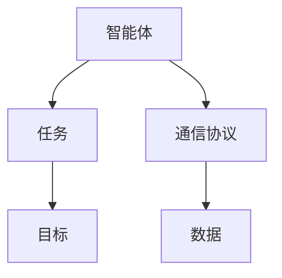
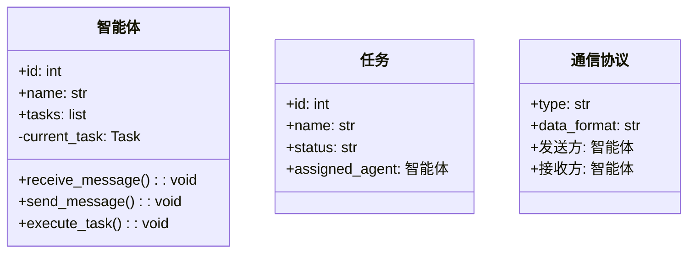
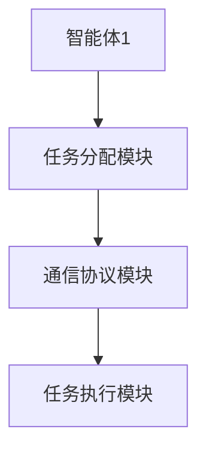

                 


# 构建具有多智能体协作能力的AI系统

## 关键词：多智能体协作、AI系统、分布式计算、通信协议、任务分配、协作机制

## 摘要：  
在现代AI系统中，多智能体协作已经成为实现复杂任务的关键技术。本文将详细探讨多智能体协作的核心概念、算法原理、系统架构设计以及实际项目中的应用。通过分析多智能体协作的背景、核心概念和算法实现，读者将能够理解如何构建高效、协同工作的多智能体AI系统。

---

# 第一部分：多智能体协作AI系统背景与核心概念

## 第1章：多智能体协作AI系统概述

### 1.1 多智能体协作的基本概念

#### 1.1.1 多智能体协作的定义  
多智能体协作（Multi-Agent Collaboration）是指多个智能体通过共享信息、协同决策和相互作用，共同完成复杂任务的过程。每个智能体都是一个独立的实体，具有感知环境、自主决策和协作的能力。

#### 1.1.2 多智能体协作的核心特点  
- **分布式智能**：每个智能体独立运行，能够自主决策。  
- **协作性**：智能体之间通过通信和协调，共同完成任务。  
- **动态性**：环境和任务目标可能动态变化，智能体需要灵活调整策略。  

#### 1.1.3 多智能体协作与传统AI的区别  
传统的单智能体AI系统（如专家系统）依赖于中心化的决策机制，而多智能体协作系统通过分布式的决策和通信实现任务目标。

### 1.2 多智能体协作的背景与问题背景

#### 1.2.1 多智能体协作的起源与发展  
多智能体协作的概念起源于分布式人工智能（DAI）领域，20世纪90年代开始逐步应用于机器人、分布式系统和游戏AI等领域。

#### 1.2.2 当前AI系统协作的主要问题  
- **信息孤岛**：各个智能体之间缺乏有效的通信机制。  
- **协作效率**：智能体之间的协调可能导致效率低下。  
- **动态环境适应性**：复杂动态环境中协作困难。  

#### 1.2.3 多智能体协作的必要性与优势  
- **任务复杂性**：单个智能体难以完成复杂任务，需要协作完成。  
- **鲁棒性**：通过多个智能体的协作，可以提高系统的容错性和可靠性。  
- **灵活性**：智能体可以根据环境变化动态调整协作策略。  

### 1.3 多智能体协作的定义与问题描述

#### 1.3.1 多智能体协作的定义  
多智能体协作系统由多个智能体组成，通过通信和协作完成共同目标。

#### 1.3.2 多智能体协作的核心问题  
- **通信机制**：如何高效地传递信息。  
- **任务分配**：如何将任务分配给合适的智能体。  
- **协作策略**：如何制定协作规则以实现共同目标。  

#### 1.3.3 多智能体协作的边界与外延  
多智能体协作的边界包括智能体的数量、协作范围和通信方式。外延则涉及分布式计算、分布式系统和分布式AI等领域。

### 1.4 多智能体协作的概念结构与核心要素

#### 1.4.1 多智能体协作的组成要素  
- **智能体**：系统的基本单元，负责感知和决策。  
- **通信协议**：智能体之间信息传递的规则。  
- **协作机制**：智能体之间协同工作的规则。  

#### 1.4.2 各要素之间的关系与作用  
智能体通过通信协议传递信息，协作机制决定协作方式。

#### 1.4.3 多智能体协作的系统结构  
系统结构包括中心化和去中心化两种模式。中心化模式有一个协调器，而去中心化模式则没有。

## 1.5 本章小结  
本章介绍了多智能体协作的基本概念、背景、核心问题和系统结构，为后续章节奠定了基础。

---

# 第二部分：多智能体协作的核心概念与联系

## 第2章：多智能体协作的核心原理

### 2.1 多智能体协作的核心概念

#### 2.1.1 智能体的定义与属性  
智能体是具有感知、决策和行动能力的实体，分为反应式和认知式两种类型。

#### 2.1.2 多智能体协作的基本原理  
多智能体协作通过通信和协作机制，共同完成任务。

#### 2.1.3 多智能体协作的关键技术  
- **通信协议**：定义智能体之间的信息传递规则。  
- **任务分配**：将任务分配给合适的智能体。  
- **协作机制**：制定协作规则以实现共同目标。  

### 2.2 多智能体协作的核心概念对比

#### 2.2.1 智能体类型对比  
| 类型       | 描述                                                                 |
|------------|----------------------------------------------------------------------|
| 反应式     | 基于当前感知做出反应，无内部状态。                                      |
| 认知式     | 具有内部状态和规划能力，能够制定长期目标。                            |

#### 2.2.2 协作机制对比  
| 机制       | 描述                                                                 |
|------------|----------------------------------------------------------------------|
| 去中心化    | 智能体之间无中心协调器，自主协作。                                     |
| 中心化      | 有一个协调器负责任务分配和监控。                                     |

#### 2.2.3 通信协议对比  
| 协议       | 描述                                                                 |
|------------|----------------------------------------------------------------------|
| HTTP        | 常见的请求-响应协议，适用于Web服务。                                   |
| MQTT        | 适用于物联网设备间的轻量级通信。                                     |

### 2.3 多智能体协作的ER实体关系图



### 2.4 本章小结  
本章详细分析了多智能体协作的核心概念和相关技术，为后续章节的算法实现奠定了基础。

---

# 第三部分：多智能体协作的算法原理

## 第3章：多智能体协作的核心算法

### 3.1 多智能体协作的分布式计算算法

#### 3.1.1 分布式计算的基本原理  
分布式计算通过将任务分解到多个节点并行执行，提高计算效率。

#### 3.1.2 分布式计算在多智能体协作中的应用  
例如，在分布式机器人系统中，每个机器人负责一部分任务，通过通信协议协调动作。

#### 3.1.3 分布式计算的优缺点  
优点：提高计算效率；缺点：需要处理通信延迟和网络分区问题。

### 3.2 多智能体协作的通信协议算法

#### 3.2.1 通信协议的基本原理  
通信协议定义了智能体之间的信息传递规则，例如数据格式和交互流程。

#### 3.2.2 通信协议在多智能体协作中的应用  
例如，在自动驾驶系统中，车辆之间通过V2V通信协议实时交换信息。

#### 3.2.3 通信协议的实现步骤  
1. 确定通信需求：智能体需要哪些信息。  
2. 设计数据格式：如JSON或Protobuf。  
3. 实现通信接口：如TCP/IP或WebSocket。  

### 3.3 多智能体协作的任务分配算法

#### 3.3.1 任务分配的基本原理  
任务分配算法将任务分配给合适的智能体，基于智能体的能力和当前负载。

#### 3.3.2 基于Dijkstra算法的任务分配  
Dijkstra算法用于找到任务分配的最短路径，确保任务分配的效率和公平性。

#### 3.3.3 Dijkstra算法的实现步骤  
1. 构建任务分配图：节点代表智能体，边代表任务分配的开销。  
2. 使用Dijkstra算法计算最小路径。  
3. 将任务分配给路径最优的智能体。  

#### 3.3.4 用Python实现的任务分配算法  
```python
import heapq

def dijkstra(graph, start, end):
    dist = {node: float('infinity') for node in graph}
    dist[start] = 0
    heap = [(0, start)]
    visited = set()
    
    while heap:
        current_dist, current_node = heapq.heappop(heap)
        if current_node in visited:
            continue
        visited.add(current_node)
        for neighbor, weight in graph[current_node].items():
            if dist[neighbor] > current_dist + weight:
                dist[neighbor] = current_dist + weight
                heapq.heappush(heap, (dist[neighbor], neighbor))
    return dist[end]

graph = {
    'A': {'B': 1, 'C': 2},
    'B': {'C': 1, 'D': 3},
    'C': {'D': 1},
    'D': {}
}

print(dijkstra(graph, 'A', 'D'))  # 输出：3
```

### 3.4 本章小结  
本章详细讲解了多智能体协作中的分布式计算和任务分配算法，为实际应用提供了理论基础。

---

# 第四部分：多智能体协作的系统架构设计

## 第4章：系统架构与接口设计

### 4.1 系统功能设计

#### 4.1.1 领域模型类图


#### 4.1.2 系统架构图


### 4.2 系统接口设计

#### 4.2.1 接口定义  
- `receive_message(sender, message)`：接收消息。  
- `send_message(receiver, message)`：发送消息。  
- `assign_task(agent, task)`：分配任务。  

#### 4.2.2 接口交互流程  
1. 智能体接收任务分配模块的分配指令。  
2. 智能体通过通信协议模块发送确认消息。  
3. 任务执行模块开始执行任务。  

### 4.3 本章小结  
本章通过系统架构设计，明确了多智能体协作系统的功能模块和接口设计。

---

# 第五部分：多智能体协作的项目实战

## 第5章：项目实战与案例分析

### 5.1 项目介绍

#### 5.1.1 项目背景  
以智能交通系统为例，多个智能体协作完成交通管理任务。

#### 5.1.2 项目目标  
实现多智能体协作的交通信号灯控制。

### 5.2 核心代码实现

#### 5.2.1 环境配置  
安装Python和必要的库，如`networkx`和`matplotlib`。

#### 5.2.2 核心代码  
```python
import networkx as nx
import matplotlib.pyplot as plt

class Agent:
    def __init__(self, id):
        self.id = id
        self.tasks = []
    
    def receive_message(self, message):
        print(f"Agent {self.id} receives message: {message}")
    
    def send_message(self, message, receiver):
        print(f"Agent {self.id} sends message: {message} to {receiver.id}")

class Task:
    def __init__(self, id, description):
        self.id = id
        self.description = description
        self.status = "pending"
        self.agent = None

def main():
    agent1 = Agent(1)
    agent2 = Agent(2)
    task1 = Task(1, "控制交通信号灯")
    
    agent1.send_message("开始执行任务", agent2)
    agent2.receive_message("开始执行任务")

if __name__ == "__main__":
    main()
```

#### 5.2.3 代码解读  
- `Agent`类：定义智能体的基本功能，包括接收和发送消息。  
- `Task`类：定义任务的基本属性。  
- `main()`函数：初始化智能体和任务，模拟消息传递过程。  

### 5.3 案例分析

#### 5.3.1 项目总结  
通过智能交通系统的案例，展示了多智能体协作的实际应用。

#### 5.3.2 经验总结  
- 通信协议的设计需要考虑实时性和可靠性。  
- 任务分配算法的选择需要根据具体场景优化。  

### 5.4 本章小结  
本章通过实际项目案例，详细讲解了多智能体协作系统的实现过程。

---

# 第六部分：多智能体协作的最佳实践

## 第6章：最佳实践与小结

### 6.1 小结

#### 6.1.1 核心知识点回顾  
- 多智能体协作的基本概念和核心原理。  
- 通信协议和任务分配算法的设计与实现。  
- 系统架构设计和实际项目案例分析。  

#### 6.1.2 本章重点  
- 理解多智能体协作的核心概念。  
- 掌握任务分配和通信协议的实现方法。  
- 学会设计高效的系统架构。  

### 6.2 注意事项

#### 6.2.1 设计注意事项  
- 确保通信协议的高效性和可靠性。  
- 任务分配算法需要根据具体场景优化。  

#### 6.2.2 实施注意事项  
- 在实际项目中，需要考虑系统的扩展性和容错性。  
- 定期监控和优化协作机制。  

### 6.3 拓展阅读

#### 6.3.1 推荐书籍  
- 《Multi-Agent Systems: Algorithm and Applications》  
- 《Distributed Artificial Intelligence》  

#### 6.3.2 推荐博客与文章  
- [Multi-Agent Collaboration in Distributed Systems](https://example.com)  
- [Distributed AI and its Applications](https://example.com)  

### 6.4 本章小结  
本章总结了多智能体协作系统的关键点，并提供了实际应用中的注意事项和拓展阅读建议。

---

# 作者观点与总结

通过本文的详细讲解，我们了解了多智能体协作AI系统的核心概念、算法实现和系统架构设计。实际项目案例进一步验证了这些理论的应用价值。在设计多智能体协作系统时，需要综合考虑通信协议、任务分配算法和系统架构，以确保系统的高效和可靠。

---

# 结语

多智能体协作是未来AI系统发展的重要方向，随着技术的进步，其应用将更加广泛。希望本文能为读者在构建多智能体协作AI系统时提供有价值的参考和启发。

---

# 附录

## 附录A：常用算法与工具

- **Dijkstra算法**：用于任务分配。  
- **MQTT协议**：适用于智能体之间的轻量级通信。  
- **Kafka**：分布式流处理平台，用于大规模数据传输。  

## 附录B：参考文献

1. Russell, S., & Norvig, P. (2010). Artificial Intelligence: A Modern Approach.  
2. Wooldridge, M. J. (2009). An Introduction to Multi-Agent Systems.  

---

通过以上详细的结构和内容安排，我们可以系统地构建一个具有多智能体协作能力的AI系统，涵盖从理论到实践的各个方面。

