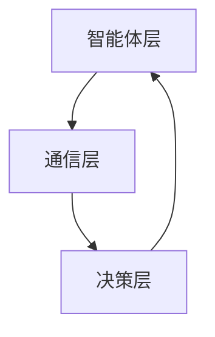

                 


# 构建具有多智能体协同决策能力的系统

> 关键词：多智能体、协同决策、系统架构、算法实现、项目实战

> 摘要：本文将从多智能体协同决策的基本概念出发，逐步深入探讨其核心算法、系统架构设计、数学模型以及实际项目实现。通过理论分析与实践案例结合的方式，全面解析如何构建一个高效、可靠的多智能体协同决策系统，为读者提供系统化的知识体系和实践指导。

---

# 第一部分：多智能体协同决策系统概述

## # 第1章：多智能体协同决策系统背景介绍

### ## 1.1 多智能体协同决策的核心概念
#### ### 1.1.1 多智能体系统的基本概念
多智能体系统（Multi-Agent System，简称MAS）是由多个智能体（Agent）组成的分布式系统，每个智能体都是一个能够感知环境、做出决策并执行动作的独立实体。智能体之间通过通信和协作完成共同目标，从而实现整体系统的优化。

#### ### 1.1.2 协同决策的定义与特征
协同决策是指多个智能体通过协作和信息共享，共同完成决策过程，以达到整体最优或个体最优的过程。其主要特征包括：
- **分布式性**：决策过程分布在多个智能体中。
- **协作性**：智能体之间通过协作实现共同目标。
- **动态性**：环境和任务需求可能动态变化。

#### ### 1.1.3 多智能体协同决策的背景与应用背景
随着人工智能技术的快速发展，多智能体协同决策在多个领域得到了广泛应用，如自动驾驶、机器人协作、分布式任务分配等。本文将重点探讨多智能体协同决策的核心算法、系统架构设计以及实际项目实现。

---

## # 第2章：多智能体协同决策的核心概念与联系

### ## 2.1 多智能体系统的基本原理
#### ### 2.1.1 多智能体系统的结构与组成
多智能体系统由以下几部分组成：
- **智能体**：能够感知环境、做出决策并执行动作的实体。
- **环境**：智能体所处的外部世界，包括静态和动态部分。
- **通信机制**：智能体之间交换信息的渠道。
- **协作机制**：智能体之间通过协作完成共同目标的规则和策略。

#### ### 2.1.2 多智能体系统的核心属性对比
表2-1：多智能体系统与单智能体系统的对比

| 属性             | 单智能体系统                  | 多智能体系统                  |
|------------------|------------------------------|------------------------------|
| 决策主体         | 单个智能体                   | 多个智能体                   |
| 信息共享         | 内部信息，不共享              | 智能体之间信息共享           |
| 协作能力         | 无协作                       | 强协作                       |
| 系统复杂度       | 简单                         | 复杂                         |

#### ### 2.1.3 多智能体系统的ER实体关系图

```mermaid
erd {
  title 多智能体系统ER图
  作用：智能体 -> 决策：做出决策
  决策：智能体 -> 环境：影响环境
  通信：智能体 <--> 智能体：信息共享
  环境：智能体 -> 环境：感知环境
}
```

---

### ## 2.2 多智能体协同决策的算法原理
#### ### 2.2.1 分布式计算与多智能体协作
分布式计算是多智能体协作的基础，其核心思想是将任务分解为多个子任务，由不同的智能体分别执行。通过通信和协作，各个智能体协同完成整体任务。

#### ### 2.2.2 博弈论在多智能体决策中的应用
博弈论是研究多个智能体之间策略选择的理论，常用于分析多智能体系统的决策过程。其中，纳什均衡是一个重要的概念，表示在给定其他智能体策略的情况下，某个智能体无法通过单方面改变策略而获得更好收益的状态。

#### ### 2.2.3 强化学习在多智能体协作中的应用
强化学习是一种通过试错方式优化决策策略的方法。在多智能体系统中，每个智能体通过与环境和其他智能体的交互，逐步优化自己的策略，从而实现协作目标。

---

### ## 2.3 多智能体协同决策的数学模型
#### ### 2.3.1 纳什均衡的数学表达式
纳什均衡的数学表达式如下：

$$
\text{对于所有智能体 } i, \text{在其他智能体策略 } \sigma_{-i} \text{下，智能体 } i \text{的策略 } \sigma_i \text{是最佳反应。}
$$

#### ### 2.3.2 多智能体价值函数的数学模型
多智能体系统的价值函数可以表示为：

$$
V = \sum_{i=1}^{n} v_i
$$

其中，\( v_i \) 是第 \( i \) 个智能体的价值函数。

---

## # 第3章：多智能体协同决策系统的算法实现

### ## 3.1 分布式计算与多智能体协作算法
#### ### 3.1.1 分布式计算的基本原理
分布式计算将任务分解为多个子任务，由不同的智能体分别执行，并通过通信机制实现任务的协同。

#### ### 3.1.2 多智能体协作算法的实现步骤
1. **任务分解**：将整体任务分解为多个子任务。
2. **智能体分配**：将子任务分配给不同的智能体。
3. **通信协作**：智能体之间通过通信机制共享信息。
4. **任务执行**：智能体各自执行分配的任务。
5. **结果汇总**：将各个智能体的结果汇总，完成整体任务。

#### ### 3.1.3 分布式计算在多智能体协作中的应用

```mermaid
graph TD
    A[任务分解] -> B[智能体分配]
    B -> C[通信协作]
    C -> D[任务执行]
    D -> E[结果汇总]
```

---

### ## 3.2 博弈论在多智能体决策中的应用
#### ### 3.2.1 博弈论的基本概念与定理
博弈论研究多个决策者（智能体）在竞争或合作环境下的策略选择问题。主要定理包括纳什均衡、极大极小定理等。

#### ### 3.2.2 博弈论在多智能体协作中的具体应用
博弈论常用于分析多智能体系统的竞争与合作关系，例如在分布式任务分配中，智能体可以通过博弈论找到最优策略。

#### ### 3.2.3 博弈论在多智能体决策中的优缺点分析
- **优点**：能够有效分析多智能体系统中的策略选择问题。
- **缺点**：在复杂系统中，博弈论的计算复杂度较高。

---

### ## 3.3 强化学习在多智能体协作中的应用
#### ### 3.3.1 强化学习的基本原理与算法
强化学习通过智能体与环境的交互，逐步优化决策策略。常用算法包括Q-learning、Deep Q-Network（DQN）等。

#### ### 3.3.2 多智能体强化学习的实现步骤
1. **环境建模**：定义智能体所处的环境。
2. **策略选择**：智能体选择动作。
3. **环境反馈**：环境对智能体的动作做出反馈。
4. **策略优化**：智能体根据反馈优化策略。

#### ### 3.3.3 多智能体强化学习在实际中的应用案例
例如，在自动驾驶中，多个智能体可以通过强化学习实现协作决策。

---

## # 第4章：多智能体协同决策系统的数学模型与公式

### ## 4.1 多智能体系统的数学模型
#### ### 4.1.1 多智能体系统的状态空间表示
状态空间可以表示为：

$$
S = \{s_1, s_2, \ldots, s_n\}
$$

其中，\( s_i \) 表示第 \( i \) 个智能体的状态。

#### ### 4.1.2 多智能体系统的动作空间表示
动作空间可以表示为：

$$
A = \{a_1, a_2, \ldots, a_n\}
$$

其中，\( a_i \) 表示第 \( i \) 个智能体的动作。

#### ### 4.1.3 多智能体系统的奖励函数设计
奖励函数可以表示为：

$$
R = \sum_{i=1}^{n} r_i
$$

其中，\( r_i \) 是第 \( i \) 个智能体的奖励。

---

### ## 4.2 协作收益的数学计算
#### ### 4.2.1 协作收益的定义与计算公式
协作收益可以表示为：

$$
\text{协作收益} = \sum_{i=1}^{n} c_i
$$

其中，\( c_i \) 是第 \( i \) 个智能体的协作收益。

#### ### 4.2.2 协作收益在多智能体系统中的应用
协作收益用于衡量多个智能体协作的效果，是系统优化的重要指标。

#### ### 4.2.3 协作收益的优化与提升方法
通过优化协作收益的计算公式，可以提升多智能体系统的整体性能。

---

### ## 4.3 纳什均衡的数学分析
#### ### 4.3.1 纳什均衡的定义与性质
纳什均衡是多智能体系统中一个重要的概念，表示在其他智能体策略不变的情况下，某个智能体的策略无法通过单方面改变而获得更好的收益。

#### ### 4.3.2 纳什均衡在多智能体系统中的应用
纳什均衡可以用于分析多智能体系统中的策略选择问题。

#### ### 4.3.3 纳什均衡的计算与验证方法
纳什均衡的计算可以通过求解博弈论中的极大极小问题来实现。

---

## # 第5章：多智能体协同决策系统的系统架构设计

### ## 5.1 系统功能设计
#### ### 5.1.1 系统的功能模块划分
多智能体协同决策系统通常包括以下几个功能模块：
- **智能体管理模块**：负责智能体的注册、管理与分配。
- **通信协作模块**：负责智能体之间的信息共享与协作。
- **任务分配模块**：负责将任务分配给不同的智能体。
- **决策控制模块**：负责系统的整体决策与控制。

#### ### 5.1.2 系统的功能流程设计
1. **任务分解**：将整体任务分解为多个子任务。
2. **智能体分配**：将子任务分配给不同的智能体。
3. **通信协作**：智能体之间通过通信机制共享信息。
4. **任务执行**：智能体各自执行分配的任务。
5. **结果汇总**：将各个智能体的结果汇总，完成整体任务。

#### ### 5.1.3 系统的功能实现步骤
1. **环境感知**：智能体感知环境信息。
2. **任务分配**：系统将任务分配给智能体。
3. **协作执行**：智能体通过协作完成任务。
4. **结果反馈**：系统对任务结果进行反馈。

---

### ## 5.2 系统架构设计
#### ### 5.2.1 系统架构的总体设计
多智能体协同决策系统的总体架构包括以下几个部分：
- **智能体层**：负责具体任务的执行。
- **通信层**：负责智能体之间的信息共享。
- **决策层**：负责系统的整体决策与控制。

#### ### 5.2.2 系统架构的详细设计
1. **智能体层**：每个智能体都有自己的决策模块和执行模块。
2. **通信层**：通过消息队列或事件总线实现智能体之间的通信。
3. **决策层**：负责系统的整体协调与控制。

#### ### 5.2.3 系统架构的交互流程图



---

## # 第6章：多智能体协同决策系统的项目实战

### ## 6.1 项目背景与目标
#### ### 6.1.1 项目背景介绍
本项目旨在构建一个具有多智能体协同决策能力的系统，通过实际案例展示多智能体协同决策的核心算法与系统架构设计。

#### ### 6.1.2 项目目标
- 实现多智能体协同决策的核心算法。
- 构建多智能体协同决策的系统架构。
- 展示多智能体协同决策的实际应用。

---

### ## 6.2 系统环境与工具安装
#### ### 6.2.1 系统运行环境
- 操作系统：Linux/Windows/MacOS
- 开发工具：Python/Java/C++
- 依赖库：NumPy、TensorFlow、PyTorch等

#### ### 6.2.2 系统核心实现源代码

```python
class Agent:
    def __init__(self, id):
        self.id = id
        self.state = None
        self.action = None

    def perceive(self, environment):
        self.state = environment.get_state()

    def decide(self):
        # 具体决策逻辑根据环境状态决定
        pass

    def execute(self):
        # 执行动作
        pass
```

---

### ## 6.3 代码实现与解读
#### ### 6.3.1 系统核心实现代码
```python
class Environment:
    def __init__(self):
        self.agents = []
        self.states = {}

    def add_agent(self, agent):
        self.agents.append(agent)

    def get_state(self, agent):
        return self.states.get(agent.id, None)
```

#### ### 6.3.2 代码应用解读与分析
1. **环境类**：负责管理智能体和环境状态。
2. **智能体类**：负责感知环境、做出决策并执行动作。

---

### ## 6.4 实际案例分析
#### ### 6.4.1 案例背景与需求分析
以自动驾驶为例，多个智能体协同完成交通决策。

#### ### 6.4.2 案例实现与代码分析
```python
class TrafficAgent(Agent):
    def decide(self):
        # 根据环境状态做出决策
        if self.state == 'red':
            self.action = 'stop'
        elif self.state == 'green':
            self.action = 'go'
```

#### ### 6.4.3 案例分析与结果解读
通过案例分析，验证多智能体协同决策算法的有效性和可行性。

---

## # 第7章：多智能体协同决策系统的总结与展望

### ## 7.1 总结
#### ### 7.1.1 多智能体协同决策的核心算法
多智能体协同决策的核心算法包括分布式计算、博弈论和强化学习。

#### ### 7.1.2 多智能体协同决策的系统架构
多智能体协同决策的系统架构包括智能体层、通信层和决策层。

#### ### 7.1.3 多智能体协同决策的实际应用
多智能体协同决策在自动驾驶、机器人协作等领域得到了广泛应用。

---

### ## 7.2 未来展望
#### ### 7.2.1 多智能体协同决策的技术发展趋势
随着人工智能技术的不断发展，多智能体协同决策系统将更加智能化和高效化。

#### ### 7.2.2 多智能体协同决策在更多领域的应用
未来，多智能体协同决策将在更多领域得到应用，如智慧城市、智能医疗等。

---

## # 第8章：多智能体协同决策系统的最佳实践

### ## 8.1 小结
#### ### 8.1.1 多智能体协同决策的核心要点
- 分布式计算
- 博弈论
- 强化学习

#### ### 8.1.2 多智能体协同决策的系统架构设计
- 智能体层
- 通信层
- 决策层

---

### ## 8.2 注意事项
#### ### 8.2.1 多智能体协同决策的实现难点
- 通信机制的设计
- 协作策略的优化
- 系统性能的提升

#### ### 8.2.2 多智能体协同决策的系统优化
- 算法优化
- 系统架构优化
- 通信机制优化

---

### ## 8.3 拓展阅读
#### ### 8.3.1 多智能体协同决策的经典论文
-《Multi-Agent Systems: Algorithmic, Complexity Theoretic, and Logical Foundations》

#### ### 8.3.2 多智能体协同决策的技术博客与书籍推荐
- 推荐书籍：《Multi-Agent Systems》
- 推荐技术博客：[Multi-Agent Systems Blog](#)

---

通过以上目录大纲，读者可以系统地学习多智能体协同决策的核心算法、系统架构设计以及实际项目实现。从理论到实践，逐步深入，掌握多智能体协同决策系统的核心内容。

