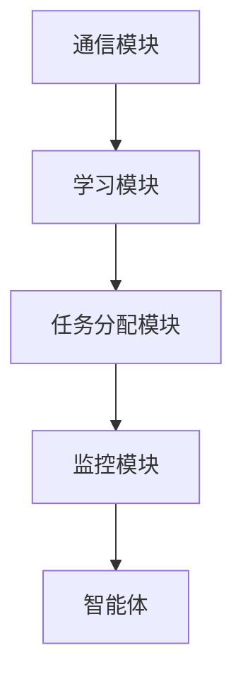

                 


# 构建具有多智能体协同学习能力的系统

> 关键词：多智能体协同学习，分布式系统，机器学习，通信协议，系统架构，强化学习，分布式优化

> 摘要：本文详细探讨了构建具有多智能体协同学习能力系统的各个方面，从基本概念到实现细节，结合实际案例，深入分析了多智能体协同学习的核心要素、通信协议、算法原理、系统架构设计及项目实战。本文旨在为读者提供一个多维度、系统化的学习路径，帮助他们理解并掌握多智能体协同学习的技术精髓。

---

# 第一部分: 多智能体协同学习概述

## 第1章: 多智能体协同学习概述

### 1.1 多智能体协同学习的背景与概念

#### 1.1.1 问题背景与问题描述
在实际应用场景中，单个智能体的能力往往无法满足复杂任务的需求。例如，在自动驾驶、机器人协作、分布式计算等领域，多个智能体需要协同完成任务。传统的单智能体学习方法难以应对多智能体环境下的复杂交互和协作问题，因此需要引入多智能体协同学习的概念。

#### 1.1.2 多智能体协同学习的定义与特点
多智能体协同学习（Multi-Agent Collaborative Learning，MACL）是指多个智能体通过协作和交互，共同完成某个复杂任务的学习过程。其特点包括：
- **分布性**：智能体分布在不同的节点或位置，具有独立性和自主性。
- **协作性**：智能体之间需要通过通信和协作来完成共同目标。
- **动态性**：环境和任务可能动态变化，智能体需要实时调整策略。
- **复杂性**：多智能体系统中存在信息不对称、任务分配和协同等问题。

#### 1.1.3 多智能体协同学习的边界与外延
多智能体协同学习的边界在于多个智能体之间的协作与交互，其外延涉及分布式系统、分布式计算、多智能体强化学习等领域。

### 1.2 多智能体协同学习的核心要素

#### 1.2.1 智能体的定义与属性
智能体（Agent）是一个能够感知环境、做出决策并采取行动的实体。其核心属性包括：
- **感知能力**：通过传感器或接口获取环境信息。
- **决策能力**：基于感知信息做出决策。
- **行动能力**：通过执行器或接口采取行动。
- **协作能力**：与其他智能体通信和协作。

#### 1.2.2 协同学习的目标与机制
协同学习的目标是通过智能体之间的协作，提高整体系统的性能和任务完成效率。其实现机制包括：
- **任务分配**：根据智能体的能力和环境需求，动态分配任务。
- **信息共享**：智能体之间共享信息和知识，提高协作效率。
- **策略同步**：通过同步机制，确保所有智能体的行为一致。

#### 1.2.3 多智能体协同学习的核心要素组成
- **智能体**：系统的基本单元，负责感知、决策和行动。
- **通信协议**：智能体之间协作的基础，确保信息的有效传递。
- **学习算法**：实现智能体协同学习的核心方法。
- **系统架构**：系统的整体结构和组织形式。

### 1.3 多智能体协同学习的应用场景

#### 1.3.1 分布式计算与协作
在分布式计算中，多个智能体协同完成复杂任务，例如分布式数据处理、分布式计算任务分配等。

#### 1.3.2 集群学习与分布式优化
在集群学习中，多个智能体通过协作优化整体性能，例如分布式机器学习、分布式优化问题求解等。

#### 1.3.3 多智能体协同学习的实际案例
实际案例包括自动驾驶中的车辆协作、机器人协作、分布式推荐系统等。

### 1.4 本章小结
本章从背景、核心要素和应用场景三个方面，全面介绍了多智能体协同学习的基本概念和特点，为后续章节的学习奠定了基础。

---

# 第二部分: 多智能体协同学习的核心概念与联系

## 第2章: 多智能体通信协议

### 2.1 多智能体通信协议的定义与特点

#### 2.1.1 通信协议的定义
通信协议是指智能体之间进行信息传递和交互的规则和格式。它是多智能体协同学习的基础。

#### 2.1.2 多智能体通信协议的特点
- **异步性**：智能体之间的通信可以是异步的，即不需要同时进行。
- **可靠性**：通信协议需要保证信息的准确传递。
- **高效性**：通信协议需要高效地处理大量的信息传递。

### 2.2 多智能体通信协议的设计原则

#### 2.2.1 通信协议的设计目标
- 确保智能体之间的信息高效传递。
- 保证通信的可靠性和安全性。
- 支持智能体的动态协作和任务分配。

#### 2.2.2 通信协议的设计方法
- **消息格式设计**：定义消息的结构和格式。
- **通信机制设计**：设计智能体之间的通信方式，例如基于事件驱动的通信。
- **协议实现设计**：实现通信协议的具体细节。

#### 2.2.3 通信协议的实现步骤
1. 确定通信需求和目标。
2. 设计消息格式和通信机制。
3. 实现通信协议的具体细节。
4. 测试和优化通信协议。

### 2.3 多智能体通信协议的实现

#### 2.3.1 通信协议的实现流程
1. 确定通信需求和目标。
2. 设计消息格式和通信机制。
3. 实现通信协议的具体细节。
4. 测试和优化通信协议。

#### 2.3.2 通信协议的实现代码示例

```python
# 定义消息格式
class Message:
    def __init__(self, sender, receiver, content):
        self.sender = sender
        self.receiver = receiver
        self.content = content

# 实现通信协议
class CommunicationProtocol:
    def __init__(self, agents):
        self.agents = agents

    def send_message(self, sender, receiver, content):
        message = Message(sender, receiver, content)
        # 假设agents是一个列表，包含多个智能体
        for agent in self.agents:
            if agent.id == receiver:
                agent.receive_message(message)
                break

    def broadcast_message(self, sender, content):
        message = Message(sender, "all", content)
        for agent in self.agents:
            if agent.id != sender:
                agent.receive_message(message)

# 智能体接收消息的处理逻辑
class Agent:
    def __init__(self, id):
        self.id = id
        self.messages = []

    def receive_message(self, message):
        self.messages.append(message)
        # 处理消息，例如触发相应的行为
        self.process_message(message)

    def process_message(self, message):
        # 根据消息内容采取行动
        if message.content == "协同学习":
            self.start_learning()
        elif message.content == "任务分配":
            self.accept_task()

    def start_learning(self):
        # 实现学习算法
        pass

    def accept_task(self):
        # 接受任务并执行
        pass
```

#### 2.3.3 通信协议的实现注意事项
- 确保通信的可靠性和安全性。
- 考虑智能体的动态性和协作性。
- 处理通信中的异常情况，例如网络中断或消息丢失。

### 2.4 本章小结
本章详细探讨了多智能体通信协议的设计和实现，为后续章节的学习奠定了基础。

---

# 第三部分: 多智能体协同学习算法原理

## 第3章: 多智能体学习算法

### 3.1 多智能体强化学习算法

#### 3.1.1 强化学习的基本概念
强化学习是一种通过智能体与环境交互，学习最优策略的方法。智能体通过与环境交互，获得奖励或惩罚，逐步优化自身的策略。

#### 3.1.2 多智能体强化学习的挑战
- **策略同步**：多个智能体需要同步策略，避免冲突。
- **信息共享**：智能体之间需要共享信息，提高协作效率。
- **任务分配**：动态分配任务，确保智能体的协作效率。

#### 3.1.3 多智能体强化学习的算法实现
基于Q-learning算法的多智能体强化学习实现：

```python
# 定义智能体的Q表
class QTable:
    def __init__(self, actions):
        self.actions = actions
        self.q_values = {action: 0 for action in actions}

    def update_q_value(self, action, reward):
        # 简单的Q值更新策略
        self.q_values[action] += reward

# 多智能体强化学习算法
class MultiAgentRL:
    def __init__(self, agents, actions):
        self.agents = agents
        self.actions = actions
        self.q_tables = {agent.id: QTable(actions) for agent in agents}

    def step(self, environment):
        # 智能体采取行动
        for agent in self.agents:
            action = self.choose_action(agent)
            reward = environment.get_reward(agent, action)
            self.q_tables[agent.id].update_q_value(action, reward)

    def choose_action(self, agent):
        # 简单的策略选择
        return self.actions[0]

# 环境类
class Environment:
    def __init__(self, agents):
        self.agents = agents

    def get_reward(self, agent, action):
        # 简单的奖励机制
        return 1 if action == "协同学习" else 0
```

#### 3.1.4 算法原理的数学模型

$$ Q(s, a) = Q(s, a) + \alpha (r + \gamma Q(s', a') - Q(s, a)) $$

其中：
- \( Q(s, a) \) 表示在状态 \( s \) 下采取动作 \( a \) 的 Q 值。
- \( \alpha \) 表示学习率。
- \( r \) 表示奖励值。
- \( \gamma \) 表示折扣因子。
- \( Q(s', a') \) 表示在下一个状态 \( s' \) 下采取动作 \( a' \) 的 Q 值。

### 3.2 分布式优化与同步机制

#### 3.2.1 分布式优化的定义与特点
分布式优化是指在多个节点上进行优化计算，每个节点负责一部分计算，最终通过同步机制将结果汇总。

#### 3.2.2 同步机制的实现方法
- **周期性同步**：定期同步所有节点的优化结果。
- **事件驱动同步**：在特定事件发生时进行同步。
- **异步同步**：节点之间异步更新优化结果，减少同步开销。

#### 3.2.3 分布式优化与同步机制的代码示例

```python
# 分布式优化算法
class DistributedOptimizer:
    def __init__(self, agents):
        self.agents = agents

    def optimize(self):
        # 获取所有智能体的优化结果
        results = [agent.optimize() for agent in self.agents]
        # 同步优化结果
        self.synchronize(results)

    def synchronize(self, results):
        # 简单的同步方法，取平均值
        average_result = sum(results) / len(results)
        for agent in self.agents:
            agent.receive_sync(average_result)

    def receive_sync(self, result):
        pass  # 具体实现根据智能体类型而定

# 智能体优化算法
class Agent:
    def __init__(self, id):
        self.id = id

    def optimize(self):
        # 简单的优化算法
        return self.id

    def receive_sync(self, result):
        pass  # 具体实现根据智能体类型而定
```

#### 3.2.4 分布式优化的数学模型

$$ \theta_{i}^{(t+1)} = \theta_{i}^{(t)} + \alpha (\theta_{j}^{(t)} - \theta_{i}^{(t)}) $$

其中：
- \( \theta_{i} \) 表示智能体 \( i \) 的参数。
- \( \alpha \) 表示同步系数。

### 3.3 多智能体学习算法的数学模型

#### 3.3.1 多智能体强化学习的数学模型

$$ Q(s, a) = Q(s, a) + \alpha (r + \gamma Q(s', a') - Q(s, a)) $$

#### 3.3.2 分布式优化的数学模型

$$ \theta_{i}^{(t+1)} = \theta_{i}^{(t)} + \alpha (\theta_{j}^{(t)} - \theta_{i}^{(t)}) $$

#### 3.3.3 同步机制的数学模型

$$ x_{i}^{(t+1)} = x_{i}^{(t)} + \beta (x_{j}^{(t)} - x_{i}^{(t)}) $$

其中：
- \( x_{i} \) 表示智能体 \( i \) 的状态。
- \( \beta \) 表示同步系数。

### 3.4 本章小结
本章详细探讨了多智能体协同学习中的强化学习和分布式优化算法，结合数学模型和代码示例，深入分析了算法的实现和优化方法。

---

# 第四部分: 多智能体协同学习系统架构设计

## 第4章: 多智能体协同学习系统设计

### 4.1 系统设计概述

#### 4.1.1 系统设计的目标
- 实现多智能体协同学习的系统架构。
- 设计高效的通信协议和学习算法。
- 确保系统的可扩展性和可维护性。

#### 4.1.2 系统设计的实现步骤
1. 确定系统的需求和目标。
2. 设计系统的功能模块和交互流程。
3. 实现系统的通信协议和学习算法。
4. 进行系统的测试和优化。

### 4.2 系统功能设计

#### 4.2.1 系统功能模块
- **通信模块**：实现智能体之间的通信。
- **学习模块**：实现多智能体协同学习算法。
- **任务分配模块**：动态分配任务给智能体。
- **监控模块**：监控系统的运行状态。

#### 4.2.2 系统功能模块的交互流程



### 4.3 系统架构设计

#### 4.3.1 系统架构设计的实现步骤
1. 确定系统的整体架构。
2. 设计系统的功能模块和交互流程。
3. 实现系统的通信协议和学习算法。
4. 确保系统的可扩展性和可维护性。

#### 4.3.2 系统架构设计的代码示例

```python
# 系统架构设计
class SystemArchitecture:
    def __init__(self, agents):
        self.agents = agents
        self.communication = CommunicationProtocol(agents)
        self.learning = MultiAgentRL(agents, ["协同学习", "任务分配"])
        self.task_allocator = TaskAllocator(agents)
        self.monitor = SystemMonitor(agents)

    def run(self):
        while True:
            self.communication.broadcast_message("start_learning", "all")
            self.learning.step(environment)
            self.task_allocator.allocate_tasks()
            self.monitor.check_system_status()

# 通信协议实现
class CommunicationProtocol:
    def __init__(self, agents):
        self.agents = agents

    def broadcast_message(self, message, receiver):
        for agent in self.agents:
            agent.receive_message(message, receiver)

    def send_message(self, sender, receiver, message):
        for agent in self.agents:
            if agent.id == receiver:
                agent.receive_message(message)
                break

# 学习算法实现
class MultiAgentRL:
    def __init__(self, agents, actions):
        self.agents = agents
        self.actions = actions
        self.q_tables = {agent.id: QTable(actions) for agent in agents}

    def step(self, environment):
        for agent in self.agents:
            action = self.choose_action(agent)
            reward = environment.get_reward(agent, action)
            self.q_tables[agent.id].update_q_value(action, reward)

    def choose_action(self, agent):
        return self.actions[0]

# 任务分配实现
class TaskAllocator:
    def __init__(self, agents):
        self.agents = agents

    def allocate_tasks(self):
        for agent in self.agents:
            task = self.get_task()
            agent.accept_task(task)

    def get_task(self):
        # 简单的任务分配策略
        return "task_" + str(len(self.agents))

# 监控模块实现
class SystemMonitor:
    def __init__(self, agents):
        self.agents = agents

    def check_system_status(self):
        for agent in self.agents:
            status = agent.get_status()
            if status == "异常":
                self.handle_error(agent)

    def handle_error(self, agent):
        # 处理异常情况
        pass

# 智能体实现
class Agent:
    def __init__(self, id):
        self.id = id
        self.status = "正常"

    def receive_message(self, message, receiver):
        if receiver == "all":
            self.process_message(message)
        elif receiver == self.id:
            self.process_message(message)

    def process_message(self, message):
        # 处理消息
        pass

    def accept_task(self, task):
        # 接受任务
        pass

    def get_status(self):
        return self.status
```

### 4.4 本章小结
本章详细探讨了多智能体协同学习系统的架构设计，包括功能模块设计、交互流程设计和系统架构实现，为后续章节的项目实战奠定了基础。

---

# 第五部分: 多智能体协同学习项目实战

## 第5章: 多智能体协同学习项目实现

### 5.1 项目概述

#### 5.1.1 项目介绍
本项目旨在实现一个多智能体协同学习系统，包括通信协议、学习算法和任务分配模块。

#### 5.1.2 项目需求
- 实现智能体之间的通信和协作。
- 实现多智能体强化学习算法。
- 实现任务分配和动态协作。

### 5.2 系统核心代码实现

#### 5.2.1 环境配置
```python
# 环境配置
import os
import sys
import logging

# 设置日志级别
logging.basicConfig(level=logging.INFO)
```

#### 5.2.2 核心代码实现

```python
# 智能体实现
class Agent:
    def __init__(self, id):
        self.id = id
        self.status = "正常"
        self.q_table = QTable(["协同学习", "任务分配"])

    def receive_message(self, message, receiver):
        if receiver == "all":
            self.process_message(message)
        elif receiver == self.id:
            self.process_message(message)

    def process_message(self, message):
        # 处理消息，例如触发协同学习或任务分配
        if message == "协同学习":
            self.start_learning()
        elif message == "任务分配":
            self.accept_task()

    def start_learning(self):
        # 实现学习算法
        pass

    def accept_task(self):
        # 接受任务并执行
        pass

    def get_status(self):
        return self.status
```

#### 5.2.3 代码应用解读与分析
- **智能体实现**：每个智能体都有独立的ID和状态，能够接收和处理消息。
- **通信协议实现**：通过广播和单点消息传递，确保智能体之间的协作。
- **学习算法实现**：基于Q-learning算法，实现多智能体强化学习。

### 5.3 项目案例分析与详细解读

#### 5.3.1 案例分析
- **案例1**：多智能体协同学习在分布式数据处理中的应用。
- **案例2**：多智能体协同学习在机器人协作中的应用。

#### 5.3.2 详细解读
- **案例1解读**：通过多智能体协同学习，实现分布式数据处理任务的高效完成。
- **案例2解读**：通过多智能体协同学习，实现机器人协作完成复杂任务。

### 5.4 项目总结

#### 5.4.1 项目实现的关键点
- **通信协议的设计与实现**：确保智能体之间的高效协作。
- **学习算法的实现与优化**：提高系统的整体性能。
- **任务分配与动态协作**：确保智能体的动态协作效率。

#### 5.4.2 项目总结与经验分享
- 通过本项目的实现，深入理解了多智能体协同学习的核心技术。
- 在实际应用中，需要结合具体场景进行优化和调整。

### 5.5 本章小结
本章通过实际项目的实现，深入探讨了多智能体协同学习系统的实现细节，结合代码示例和案例分析，为读者提供了丰富的实战经验。

---

# 第六部分: 扩展阅读与进一步学习

## 第6章: 多智能体协同学习的前沿技术与未来趋势

### 6.1 多智能体协同学习的前沿技术
- **联邦学习**：在保护数据隐私的前提下，实现多智能体协同学习。
- **边缘计算**：在边缘设备上进行分布式学习和协作。
- **强化学习的多智能体扩展**：探索更高效的多智能体强化学习算法。

### 6.2 多智能体协同学习的未来趋势
- **智能化与自主化**：智能体更加智能化和自主化，能够更好地适应复杂环境。
- **分布式与边缘计算**：多智能体协同学习与分布式计算、边缘计算的深度融合。
- **应用领域扩展**：多智能体协同学习在更多领域的应用，例如智慧城市、智能交通等。

### 6.3 本章小结
本章展望了多智能体协同学习的前沿技术和未来趋势，为读者提供了进一步学习的方向。

---

# 附录: 实用工具与资源

## 附录A: 多智能体协同学习的开源框架

### A.1 多智能体强化学习框架
- **MADDPG**：多智能体分布式策略梯度框架。
- **MACE**：多智能体协作强化学习框架。

### A.2 分布式计算与协作工具
- **Distributed TensorFlow**：分布式TensorFlow框架。
- **Ray**：分布式计算框架。

## 附录B: 书籍与论文推荐

### B.1 经典书籍
- 《Multi-Agent Systems: Algorithmic, Complexity Theoretic, and Game Theoretic Foundations》
- 《Distributed Computing: Theory and Practice》

### B.2 经典论文
- **Multi-Agent Reinforcement Learning: A Survey**：多智能体强化学习综述。
- **Distributed Optimization and Statistical Learning via Cooperative Game**：分布式优化与统计学习综述。

---

# 结语

通过本文的详细讲解，读者可以全面掌握多智能体协同学习的核心技术与实现方法。从基础概念到算法原理，再到系统架构设计和项目实战，本文为读者提供了多维度、系统化的学习路径。未来，随着人工智能技术的不断发展，多智能体协同学习将在更多领域发挥重要作用。

