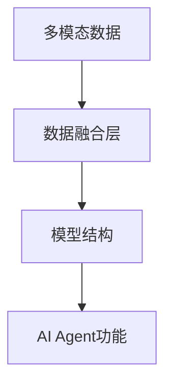
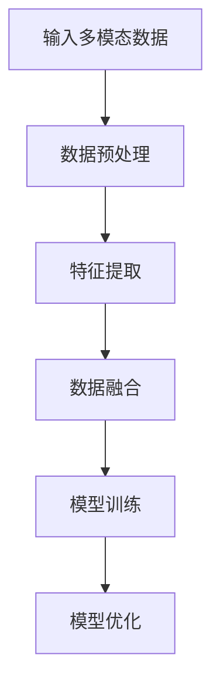
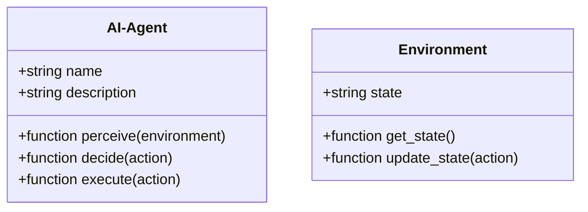
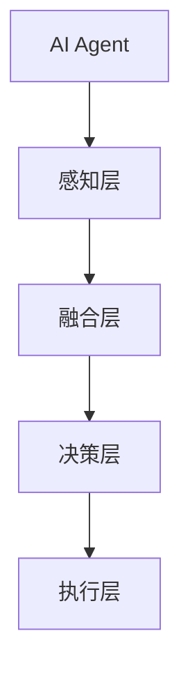

                 


# 构建具有多模态学习能力的AI Agent

> 关键词：多模态学习，AI Agent，数据融合，模型训练，系统架构

> 摘要：本文系统地介绍了如何构建具有多模态学习能力的AI Agent。从多模态学习的基本概念到AI Agent的核心功能，从算法原理到系统架构，本文提供了详细的理论分析和实践指导。通过对比分析、流程图和代码示例，深入探讨了多模态学习在AI Agent中的应用，帮助读者掌握构建多模态AI Agent的关键技术。

---

## 第一部分: 多模态学习与AI Agent概述

### 第1章: 多模态学习与AI Agent背景介绍

#### 1.1 多模态学习的定义与背景
- **多模态数据的定义**  
  多模态数据是指来自不同感官渠道（如视觉、听觉、文本等）的多种类型数据，能够提供更全面的信息。
- **多模态学习的核心概念**  
  多模态学习是指在同一模型中同时利用多种模态的数据进行学习，能够提升模型的泛化能力和鲁棒性。
- **多模态学习与单模态学习的对比**  
  | 对比维度 | 单模态学习 | 多模态学习 |
  |----------|------------|------------|
  | 数据来源 | 单一类型    | 多种类型    |
  | 信息量   | 较低       | 较高       |
  | 应用场景 | 简单任务    | 复杂任务    |

#### 1.2 AI Agent的基本概念
- **AI Agent的定义**  
  AI Agent是一种智能体，能够感知环境、自主决策并执行任务。
- **AI Agent的核心功能**  
  - 感知环境：通过传感器或数据接口获取信息。
  - 决策推理：基于获取的信息进行分析和推理。
  - 行为执行：根据决策结果执行操作。
- **多模态AI Agent的独特优势**  
  多模态AI Agent能够同时处理多种类型的数据，提高感知和决策的准确性。

#### 1.3 多模态学习在AI Agent中的应用前景
- **多模态学习的潜在应用场景**  
  - 智能助手：结合语音和文本进行交互。
  - 智能监控：结合视频和音频进行异常检测。
  - 智能医疗：结合图像、文本和传感器数据进行诊断。
- **多模态AI Agent在企业中的价值**  
  提高效率、降低成本、增强用户体验。
- **多模态学习面临的挑战与机遇**  
  - 挑战：数据融合难度大、模型复杂性高。
  - 机遇：提升AI系统的智能化水平。

---

## 第2章: 多模态学习的核心概念与联系

### 2.1 多模态数据的融合原理
- **数据融合的基本概念**  
  数据融合是指将来自不同模态的数据进行整合，以提取更丰富的信息。
- **多模态数据融合的方法**  
  - 特征级融合：在特征提取阶段进行融合。
  - 决策级融合：在决策阶段进行融合。
- **数据融合的优缺点对比**  
  | 方法 | 优点                     | 缺点                     |
  |------|--------------------------|--------------------------|
  | 特征级 | 提高模型的表达能力       | 实现复杂度较高           |
  | 决策级 | 实现简单                 | 表达能力有限             |

### 2.2 多模态学习的模型结构
- **多模态模型的基本组成**  
  - 输入层：接收多模态数据。
  - 感知层：对数据进行特征提取。
  - 融合层：对特征进行融合。
  - 输出层：生成最终结果。
- **多模态模型的训练策略**  
  - 联合训练：同时优化多个模态的参数。
  - 对抗训练：通过生成对抗网络进行模态间协作。
- **多模态模型的评估指标**  
  - 准确率：分类任务的性能指标。
  - F1值：综合考虑精确率和召回率。
  - 治愈率：模型对异常情况的处理能力。

### 2.3 多模态学习与AI Agent的实体关系图


---

## 第3章: 多模态学习的算法原理

### 3.1 多模态数据融合算法
- **多模态数据融合的基本流程**  
  1. 数据预处理：标准化和归一化。
  2. 特征提取：使用CNN、RNN等模型提取特征。
  3. 数据融合：通过注意力机制或对抗网络进行融合。
- **基于注意力机制的融合方法**  
  $$\alpha_i = \frac{\exp(e_i)}{\sum_{j=1}^{n} \exp(e_j)}$$
- **基于生成对抗网络的融合方法**  
  $$L_{\text{adv}} = \mathbb{E}_{x,y}[\log D(x,y)] + \mathbb{E}_{x,z}[\log (1 - D(x,z))]$$

### 3.2 多模态学习的模型训练
- **多模态模型的训练目标**  
  最小化损失函数，最大化模型的准确率。
- **多模态模型的损失函数**  
  $$L = -\sum_{i=1}^{n} y_i \log p(y_i)$$
- **多模态模型的优化策略**  
  使用Adam优化器，调整学习率。

### 3.3 多模态学习的算法流程图


---

## 第4章: 多模态学习的数学模型与公式

### 4.1 多模态数据的概率分布
- **多模态数据的概率密度函数**  
  $$p(x) = \sum_{i=1}^{k} \pi_i p_i(x)$$
- **多模态数据的联合分布**  
  $$p(x,y) = p(y|x) \cdot p(x)$$
- **多模态数据的条件分布**  
  $$p(y|x) = \frac{p(y)p(x|y)}{p(x)}$$

### 4.2 多模态学习的损失函数
- **多模态学习的交叉熵损失**  
  $$L = -\sum_{i=1}^{n} y_i \log p(y_i)$$
- **多模态学习的对抗损失**  
  $$L_{\text{adv}} = \mathbb{E}_{x,y}[\log D(x,y)] + \mathbb{E}_{x,z}[\log (1 - D(x,z))]$$

---

## 第5章: 多模态学习的系统架构设计

### 5.1 问题场景介绍
- **问题场景**  
  构建一个能够处理文本、图像和语音数据的多模态AI Agent，用于智能客服系统。

### 5.2 系统功能设计
- **领域模型类图**  


### 5.3 系统架构设计
- **系统架构图**  


---

## 第6章: 项目实战

### 6.1 环境安装
```bash
pip install numpy
pip install tensorflow
pip install keras
```

### 6.2 核心代码实现
```python
import numpy as np
import tensorflow as tf
from tensorflow import keras

class MultiModalAgent:
    def __init__(self):
        self.models = {}
    
    def build_model(self, modality):
        # 构建单模态模型
        if modality == 'text':
            self.models[modality] = self._build_text_model()
        elif modality == 'image':
            self.models[modality] = self._build_image_model()
        elif modality == 'audio':
            self.models[modality] = self._build_audio_model()
    
    def _build_text_model(self):
        model = keras.Sequential()
        model.add(keras.layers.Embedding(1000, 32))
        model.add(keras.layers.LSTM(32))
        model.add(keras.layers.Dense(1, activation='sigmoid'))
        return model
    
    def _build_image_model(self):
        model = keras.Sequential()
        model.add(keras.layers.Conv2D(32, (3,3), activation='relu'))
        model.add(keras.layers.MaxPooling2D((2,2)))
        model.add(keras.layers.Flatten())
        model.add(keras.layers.Dense(1, activation='sigmoid'))
        return model
    
    def _build_audio_model(self):
        model = keras.Sequential()
        model.add(keras.layers.Conv1D(32, 3, activation='relu'))
        model.add(keras.layers.MaxPooling1D(2))
        model.add(keras.layers.Flatten())
        model.add(keras.layers.Dense(1, activation='sigmoid'))
        return model
    
    def fuse_models(self):
        # 融合模型
        pass
```

---

## 第7章: 最佳实践

### 7.1 小结
- 多模态学习能够显著提升AI Agent的性能和能力。
- 构建多模态AI Agent需要综合考虑数据融合、模型训练和系统架构设计。

### 7.2 注意事项
- 数据预处理是关键，需确保数据质量。
- 模型训练时，需平衡各模态的权重。
- 系统架构设计需考虑扩展性和可维护性。

### 7.3 拓展阅读
- "Multi-modal Deep Learning for Image Captioning"。
- "Attention Mechanisms in Multi-modal Neural Networks"。

---

通过以上内容，读者可以系统地掌握构建具有多模态学习能力的AI Agent的关键技术，从理论到实践都能得到充分的指导。

