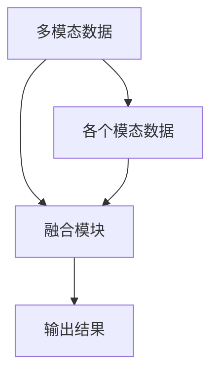
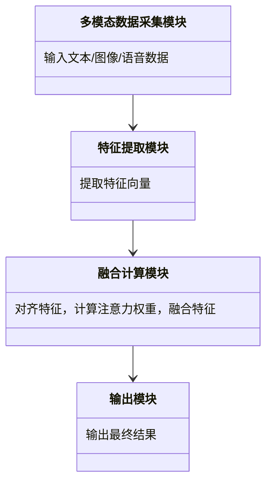
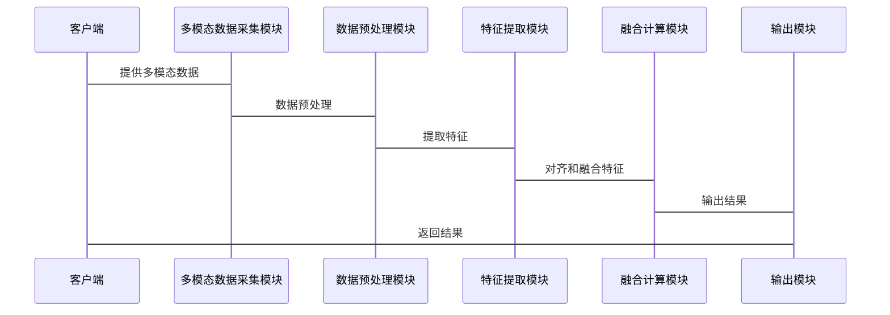

                 


# 构建具有多模态融合能力的AI Agent

---

## 关键词：
多模态融合，AI Agent，注意力机制，特征对齐，深度学习

---

## 摘要：
本文将详细探讨如何构建具有多模态融合能力的AI Agent。从背景介绍、核心概念到算法原理，再到系统架构设计和项目实战，我们将全面解析多模态融合的关键技术及其在AI Agent中的应用。通过具体案例分析和代码实现，本文将帮助读者掌握多模态融合的核心原理和实际应用技巧。

---

# 第一部分: 多模态融合AI Agent的背景与核心概念

## 第1章: 多模态融合AI Agent的背景与问题描述

### 1.1 多模态融合的背景与意义
#### 1.1.1 多模态数据的定义与特点
多模态数据是指来自不同感官渠道（如视觉、听觉、触觉、嗅觉、味觉）或数据类型（如文本、图像、语音、视频等）的数据。其特点包括：
- **异构性**：不同模态的数据具有不同的特征和表示形式。
- **互补性**：不同模态的数据可以互补，提供更全面的信息。
- **多样性**：多模态数据能够覆盖更广泛的应用场景。

#### 1.1.2 多模态融合在AI Agent中的重要性
AI Agent需要处理复杂的现实场景，单模态数据往往不足以应对多样化的任务需求。多模态融合能够显著提升AI Agent的感知能力、理解能力和决策能力。

#### 1.1.3 多模态融合的典型应用场景
- **智能助手**：结合语音和文本理解，提供更智能的交互体验。
- **自动驾驶**：融合视觉、雷达和语音数据，提升环境感知能力。
- **智能安防**：结合视频、语音和传感器数据，实现更精准的监控。

### 1.2 AI Agent的基本概念与分类
#### 1.2.1 AI Agent的定义与核心特征
AI Agent是一种具有感知、推理、决策和执行能力的智能体，能够根据环境信息自主完成任务。

#### 1.2.2 单模态AI Agent与多模态AI Agent的区别
- **单模态AI Agent**：仅利用单一模态数据进行感知和决策。
- **多模态AI Agent**：能够融合多种模态数据，提升感知和决策能力。

#### 1.2.3 多模态AI Agent的分类与应用领域
- **跨模态融合**：将不同模态的数据进行联合分析。
- **多模态分类**：基于多种模态数据进行分类任务。
- **多模态生成**：结合多种模态数据生成新的内容。

### 1.3 多模态融合AI Agent的问题背景
#### 1.3.1 当前AI Agent的局限性
- 单一模态数据的局限性：难以应对复杂场景。
- 模态间信息割裂：缺乏有效融合机制。

#### 1.3.2 多模态融合带来的解决方案
- 提供更全面的信息感知能力。
- 提升复杂场景下的决策准确性。

#### 1.3.3 多模态融合的核心挑战
- **数据异构性**：不同模态数据的特征空间差异大。
- **计算复杂度**：多模态数据的融合需要更高的计算资源。
- **模型设计**：如何设计高效的融合模型是关键。

### 1.4 多模态融合AI Agent的边界与外延
#### 1.4.1 多模态融合的边界条件
- 融合的数据类型和模态数量有限。
- 融合的目标任务明确。

#### 1.4.2 多模态融合的外延范围
- 扩展到更多模态数据的融合。
- 应用于更广泛的任务场景。

#### 1.4.3 多模态融合与其他技术的关系
- **深度学习**：多模态融合依赖于深度学习技术进行特征提取和模型训练。
- **自然语言处理**：多模态融合与NLP技术密切相关。
- **计算机视觉**：多模态融合结合CV技术提升视觉感知能力。

### 1.5 本章小结
本章介绍了多模态融合AI Agent的背景、核心概念、分类和挑战，为后续章节奠定了基础。

---

## 第2章: 多模态融合的核心概念与联系

### 2.1 多模态数据的特征与属性对比
#### 2.1.1 各种模态数据的特征分析
- **文本**：序列性、语义性。
- **图像**：空间性、细节性。
- **语音**：时序性、情感性。

#### 2.1.2 多模态数据的属性对比表格
| 模态类型 | 特征维度 | 数据格式 | 信息特点 |
|----------|----------|----------|----------|
| 文本      | 序列、语义 | 离散/连续 | 高语义性 |
| 图像      | 空间、细节 | 矩阵      | 高维性    |
| 语音      | 时序、情感 | 波形      | 时间依赖性 |

#### 2.1.3 数据特征与融合方式的关系
数据特征决定了融合方式的选择。例如，文本和图像的语义特征可以通过注意力机制进行融合。

### 2.2 多模态融合的实体关系图
#### 2.2.1 实体关系图的Mermaid流程图


### 2.3 多模态融合的核心原理
#### 2.3.1 多模态融合的基本原理
通过特征对齐和注意力机制，将不同模态的数据转化为统一的特征空间，然后进行融合。

#### 2.3.2 融合过程中的关键因素
- **特征对齐**：确保不同模态的特征在语义上对齐。
- **权重分配**：根据任务需求分配不同模态的权重。

#### 2.3.3 融合效果的评价指标
- **准确性**：融合后模型的分类或识别准确率。
- **鲁棒性**：模型对噪声或数据缺失的鲁棒性。

### 2.4 本章小结
本章详细分析了多模态数据的特征与属性，以及多模态融合的核心原理和关系。

---

## 第3章: 多模态融合AI Agent的算法原理

### 3.1 多模态数据的特征对齐算法
#### 3.1.1 特征对齐的定义与作用
特征对齐是指将不同模态的数据映射到相同的特征空间，以便后续融合。

#### 3.1.2 基于深度学习的特征对齐方法
- **自对齐网络**：通过自适应对齐策略，实现特征对齐。
- **对比学习**：通过对比不同模态的特征，学习对齐策略。

#### 3.1.3 对齐算法的实现步骤
1. **特征提取**：分别提取不同模态的特征。
2. **特征对齐**：将不同模态的特征对齐到统一空间。
3. **融合特征**：将对齐后的特征进行融合。

### 3.2 多模态融合的注意力机制
#### 3.2.1 注意力机制的基本原理
注意力机制通过计算不同模态特征的重要性，动态分配权重。

#### 3.2.2 多模态注意力模型的构建
- **自注意力机制**：计算同一模态内的注意力权重。
- **跨模态注意力机制**：计算不同模态间的注意力权重。

#### 3.2.3 注意力机制的数学表达式
$$\text{Attention}(Q, K, V) = \text{softmax}\left(\frac{QK^T}{\sqrt{d_k}}\right)V$$

### 3.3 多模态融合的策略与算法
#### 3.3.1 基于加权融合的策略
- **线性加权**：将不同模态的特征按权重相加。
- **非线性加权**：使用激活函数进行非线性融合。

#### 3.3.2 基于深度学习的融合算法
- **多模态变换网络**：通过深度网络进行特征变换和融合。
- **多模态图神经网络**：利用图结构进行多模态数据的融合。

### 3.4 本章小结
本章详细讲解了多模态融合的核心算法，包括特征对齐和注意力机制。

---

## 第4章: 多模态融合AI Agent的系统架构设计

### 4.1 问题场景介绍
构建一个多模态融合AI Agent，需要考虑数据采集、特征提取、融合计算和结果输出等环节。

### 4.2 系统功能设计
#### 4.2.1 领域模型Mermaid类图


### 4.3 系统架构设计
#### 4.3.1 系统架构Mermaid架构图
```mermaid
archiitecture
    客户端 --> 多模态数据采集模块
    多模态数据采集模块 --> 数据预处理模块
    数据预处理模块 --> 特征提取模块
    特征提取模块 --> 融合计算模块
    融合计算模块 --> 输出模块
    输出模块 --> 客户端
```

### 4.4 系统接口设计
- **输入接口**：接收多模态数据。
- **输出接口**：输出融合结果。

### 4.5 系统交互Mermaid序列图


### 4.6 本章小结
本章详细设计了多模态融合AI Agent的系统架构和接口。

---

## 第5章: 多模态融合AI Agent的项目实战

### 5.1 环境安装
- **Python**：3.8+
- **深度学习框架**：TensorFlow/PyTorch
- **依赖库**：numpy, matplotlib, scikit-learn

### 5.2 系统核心实现源代码
#### 5.2.1 特征对齐代码示例
```python
import torch

def align_features(query, key, value):
    # 计算注意力权重
    attention_weights = torch.softmax(torch.matmul(query, key.T) / torch.sqrt(torch.mean(key.shape[1].float())), dim=-1)
    # 融合特征
    aligned_features = torch.matmul(attention_weights, value)
    return aligned_features
```

#### 5.2.2 注意力机制代码示例
```python
def attention_mechanism(Q, K, V):
    # 计算注意力权重
    attention_weights = torch.softmax((Q @ K.T) / torch.sqrt(K.shape[1]), dim=-1)
    # 融合特征
    output = (Q @ (attention_weights.T @ V))
    return output
```

### 5.3 代码应用解读与分析
- **特征对齐代码**：将不同模态的特征对齐到统一空间。
- **注意力机制代码**：动态分配不同模态的权重。

### 5.4 实际案例分析
- **案例1**：文本和图像的融合分类。
- **案例2**：语音和视频的融合识别。

### 5.5 项目小结
本章通过实际案例展示了多模态融合AI Agent的实现过程。

---

## 第6章: 多模态融合AI Agent的最佳实践

### 6.1 小结
- 多模态融合是提升AI Agent能力的重要技术。
- 特征对齐和注意力机制是核心算法。

### 6.2 注意事项
- 数据异构性可能导致融合困难。
- 模型设计需要考虑计算效率和任务需求。

### 6.3 拓展阅读
- 《多模态学习：理论与应用》
- 《深度学习中的注意力机制》

### 6.4 本章小结
本章总结了多模态融合AI Agent的关键点和注意事项。

---

## 总结
构建具有多模态融合能力的AI Agent是一项具有挑战性的任务，但其带来的优势也是显而易见的。通过本文的详细讲解，读者可以掌握多模态融合的核心原理和实际应用技巧，为后续的研究和实践奠定坚实基础。

--- 

**文章结束**

