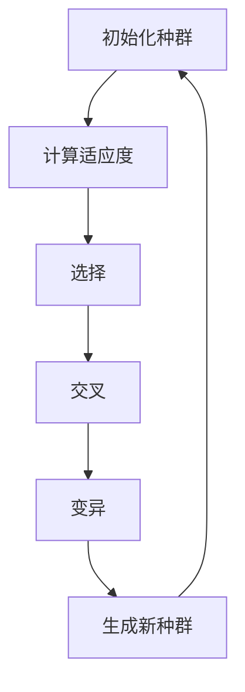
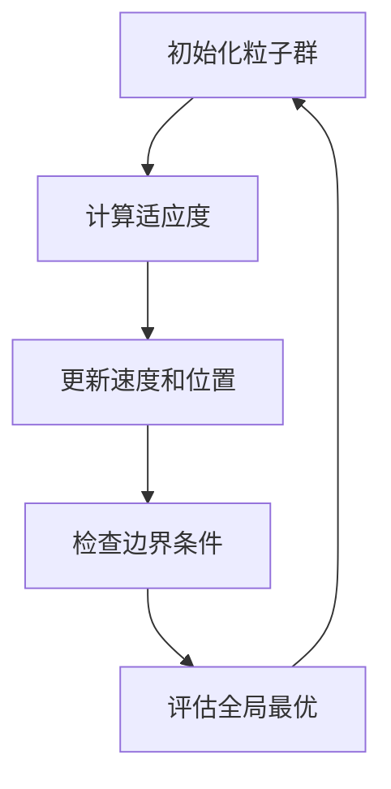
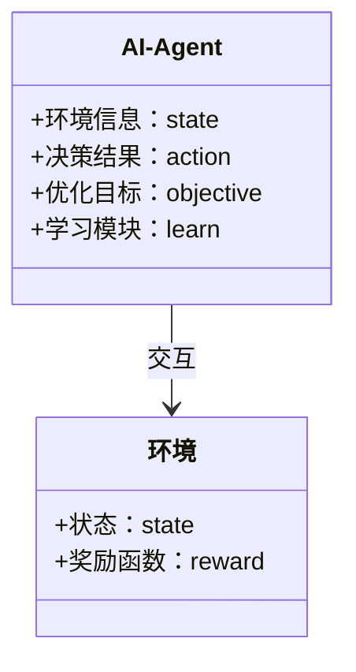

                 


# 构建具有多目标优化决策能力的AI Agent

> 关键词：多目标优化、AI Agent、强化学习、优化算法、系统架构

> 摘要：本文旨在探讨如何构建具有多目标优化决策能力的AI Agent。通过分析多目标优化的核心概念、算法原理、系统架构设计以及实际项目案例，本文为读者提供从理论到实践的全面指导，帮助他们在复杂环境中构建高效的AI Agent。

---

## 第一部分: 多目标优化与AI Agent概述

### 第1章: 多目标优化的基本概念

#### 1.1 问题背景与定义
多目标优化（Multi-objective Optimization, MOO）是指在多个目标函数同时进行优化的过程，这些目标函数之间可能存在冲突，无法同时达到最优。与单目标优化不同，MOO的目标是找到一个或多个折中的解，这些解在所有目标之间达到平衡。

#### 1.2 AI Agent的基本概念
AI Agent是一种智能体，能够在环境中感知状态、采取行动，并通过决策过程实现目标。AI Agent可以是软件程序、机器人或其他智能系统，具备自主决策的能力。

#### 1.3 多目标优化与AI Agent的结合
AI Agent需要在复杂环境中做出决策，通常面临多个目标的权衡。例如，在自动驾驶中，AI Agent需要同时优化安全性、舒适性和效率，这些目标之间可能存在冲突。

### 1.4 多目标优化的核心特点
- **目标多样性**：多个目标函数通常相互冲突。
- **Pareto最优性**：在Pareto前沿上的解无法在所有目标上同时优化。
- **权重分配**：需要根据具体场景为各个目标分配权重。

---

## 第二部分: 多目标优化的数学模型与算法原理

### 第2章: 多目标优化的数学模型

#### 2.1 多目标优化的数学表示
多目标优化问题可以表示为：
$$
\min_{x} f_1(x), f_2(x), \ldots, f_n(x)
$$
其中，$x$ 是决策变量，$f_i(x)$ 是目标函数。

#### 2.2 约束条件
多目标优化问题通常还包含约束条件：
$$
g_i(x) \leq 0, \quad h_j(x) = 0
$$
其中，$g_i(x)$ 是不等式约束，$h_j(x)$ 是等式约束。

### 第3章: 多目标优化算法原理

#### 3.1 遗传算法（GA）
遗传算法是一种模拟自然选择的优化算法，适用于多目标优化问题。

##### 算法流程（Mermaid图）


##### 适应度函数设计
适应度函数用于评估解的优劣：
$$
f(x) = \text{目标函数值}
$$

#### 3.2 粒子群优化（PSO）
粒子群优化是一种基于群体智能的优化算法。

##### 算法流程（Mermaid图）


---

## 第三部分: AI Agent的系统架构与设计

### 第4章: AI Agent的系统架构

#### 4.1 系统功能设计
AI Agent系统通常包括以下功能模块：
- **感知模块**：获取环境信息。
- **决策模块**：基于多目标优化算法做出决策。
- **执行模块**：执行决策动作。
- **学习模块**：优化决策策略。

#### 4.2 系统架构设计（Mermaid图）


---

## 第四部分: 项目实战与进阶内容

### 第5章: 项目实战——智能投资组合优化

#### 5.1 项目背景
构建一个AI Agent，使其能够在股票投资中实现收益与风险的多目标优化。

#### 5.2 环境安装
安装必要的库：
```bash
pip install numpy matplotlib
```

#### 5.3 核心实现（Python代码）
```python
import numpy as np

def evaluate_portfolio(weights, returns):
    # 计算收益和风险
    portfolio_return = np.dot(weights, returns.mean())
    portfolio_risk = np.sqrt(np.dot(weights.T, np.dot(returns.cov(), weights)))
    return -portfolio_return, -portfolio_risk

# 初始化权重
weights = np.random.random(3)
weights = weights / sum(weights)

# 简单优化
optimal_weights = np.array([0.4, 0.3, 0.3])
print(optimal_weights)
```

#### 5.4 案例分析
通过调整权重，AI Agent可以在不同风险水平下找到最优收益。

---

## 第五部分: 进阶内容与研究方向

### 第6章: 多目标优化的前沿研究

#### 6.1 多智能体协作
研究多个AI Agent之间的协作优化问题。

#### 6.2 分布式多目标优化
在分布式系统中实现多目标优化。

#### 6.3 深度学习与多目标优化的结合
利用深度学习模型直接优化多目标问题。

---

## 第六部分: 总结与展望

### 6.1 总结
本文详细介绍了构建具有多目标优化决策能力的AI Agent的理论与实践方法，涵盖了从基础概念到算法实现再到系统设计的全过程。

### 6.2 展望
未来的研究方向包括更高效的算法设计、多智能体协作优化以及与深度学习的结合。

---

通过以上内容，读者可以系统地了解多目标优化与AI Agent的核心概念，并掌握实际应用的技巧。

