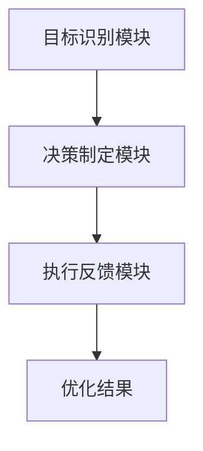
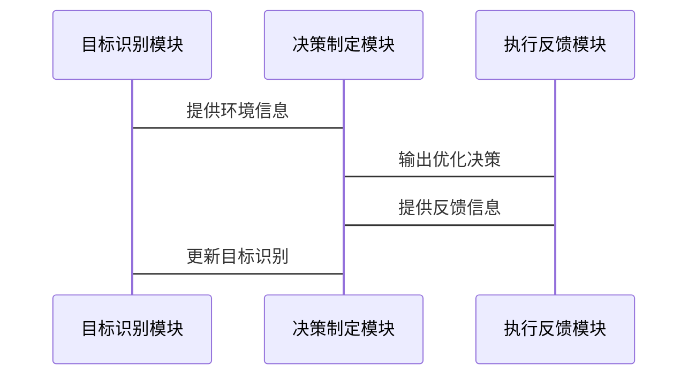

                 


# 构建具有多目标优化能力的AI Agent

## 关键词：
多目标优化、AI Agent、强化学习、算法设计、系统架构

## 摘要：
本文将详细介绍如何构建一个具有多目标优化能力的AI Agent。首先，我们从多目标优化的基本概念和AI Agent的核心功能入手，分析多目标优化在AI Agent中的重要作用。接着，我们深入探讨多目标优化的数学模型和算法原理，包括基于Pareto优化、遗传算法和粒子群优化等方法。随后，我们将从系统架构设计的角度，分析AI Agent的实现过程，包括功能模块划分、系统交互流程和接口设计。最后，通过一个具体的项目实战案例，展示如何将多目标优化算法应用于实际场景中，总结经验和教训，为读者提供实践指导。

---

# 第一部分: 多目标优化与AI Agent基础

## 第1章: 多目标优化与AI Agent概述

### 1.1 多目标优化的基本概念
多目标优化是指在多个目标函数之间找到一个平衡点的过程，通常用于解决复杂的优化问题。与单目标优化不同，多目标优化需要同时考虑多个相互冲突的目标，例如在自动驾驶中，既要保证安全，又要追求速度。

#### 1.1.1 多目标优化的定义
多目标优化（Multi-objective Optimization，MOO）是指在多个目标函数中寻找最优解的过程。这些目标函数通常是相互冲突的，例如最大化收益和最小化成本。

#### 1.1.2 多目标优化的核心特点
- **多个目标函数**：通常有多个目标需要优化。
- **Pareto前沿**：最优解分布在Pareto前沿上，无法在不损害一个目标的情况下改善另一个目标。
- **权衡问题**：需要在多个目标之间进行权衡。

#### 1.1.3 多目标优化与单目标优化的对比
| 对比维度 | 单目标优化 | 多目标优化 |
|----------|------------|------------|
| 目标数   | 1          | 多于1      |
| 解空间   | 单点       | 多点       |
| 解的性质 | 唯一最优解  | Pareto最优解 |

### 1.2 AI Agent的基本概念
AI Agent（人工智能代理）是指能够感知环境、做出决策并执行动作的智能体。

#### 1.2.1 AI Agent的定义
AI Agent是一种能够感知环境、自主决策并执行动作的智能系统。

#### 1.2.2 AI Agent的核心功能
- **感知环境**：通过传感器或其他方式获取环境信息。
- **目标设定**：根据环境信息设定目标。
- **决策制定**：基于目标和环境信息做出决策。
- **执行动作**：根据决策执行具体动作。

#### 1.2.3 AI Agent的应用场景
- 自动驾驶：路径规划、避障。
- 游戏AI：策略制定、对抗决策。
- 家庭机器人：任务调度、服务优化。

### 1.3 多目标优化在AI Agent中的作用
多目标优化在AI Agent中用于解决复杂的决策问题，例如在自动驾驶中，既要保证安全，又要追求速度。

#### 1.3.1 多目标优化在AI Agent中的必要性
- **复杂性**：AI Agent需要处理多个目标。
- **权衡问题**：需要在多个目标之间进行权衡。

#### 1.3.2 多目标优化如何提升AI Agent的性能
通过多目标优化，AI Agent可以在多个目标之间找到最优解，提升整体性能。

#### 1.3.3 多目标优化在AI Agent中的实现方式
- **算法选择**：选择适合的多目标优化算法。
- **目标函数设计**：设计合理的多目标函数。

### 1.4 本章小结
本章介绍了多目标优化的基本概念和AI Agent的核心功能，分析了多目标优化在AI Agent中的作用和实现方式。

---

## 第2章: 多目标优化的核心原理

### 2.1 多目标优化的数学模型
多目标优化的数学模型通常包括目标函数、约束条件和优化目标。

#### 2.1.1 目标函数的定义
目标函数是多目标优化的核心，表示需要优化的多个目标。

#### 2.1.2 约束条件的处理
约束条件是对解空间的限制，通常需要通过数学方法进行处理。

#### 2.1.3 常见的数学模型
- **线性模型**：目标函数和约束条件都是线性的。
- **非线性模型**：目标函数和约束条件都是非线性的。

### 2.2 多目标优化算法的分类
多目标优化算法可以分为基于权重的方法、基于Pareto优化的方法和基于进化算法的方法。

#### 2.2.1 基于权重的方法
- **加权和法**：将多个目标函数加权求和，转化为单目标优化问题。
- **理想点法**：将每个目标函数分别优化，然后组合成一个解。

#### 2.2.2 基于 Pareto 优化的方法
- **Pareto前沿**：找到所有Pareto最优解。
- **非支配排序法**：通过排序找到Pareto最优解。

#### 2.2.3 基于进化算法的方法
- **遗传算法**：通过模拟自然选择的过程，找到最优解。
- **粒子群优化**：通过模拟鸟群飞行的过程，找到最优解。

### 2.3 多目标优化算法的对比分析
| 算法类型         | 优点                     | 缺点                     |
|------------------|--------------------------|--------------------------|
| 基于权重的方法   | 实现简单                 | 需要明确目标权重         |
| 基于Pareto优化的方法 | 找到所有Pareto最优解     | 计算复杂                 |
| 基于进化算法的方法 | 具有较强的全局搜索能力   | 计算时间较长             |

### 2.4 本章小结
本章介绍了多目标优化的数学模型和算法分类，分析了不同算法的优缺点。

---

## 第3章: 多目标优化算法的实现

### 3.1 基于 Pareto 优化的算法
Pareto优化是一种常用的多目标优化方法。

#### 3.1.1 Pareto 优化的基本原理
Pareto优化通过找到Pareto最优解，实现多个目标之间的平衡。

#### 3.1.2 Pareto 前沿的构建方法
- **逐步优化**：逐步优化每个目标，构建Pareto前沿。
- **非支配排序法**：通过排序找到Pareto最优解。

#### 3.1.3 Pareto优化的Python实现
```python
import numpy as np

def is_pareto_optimal(points):
    points = np.array(points)
    dominated = np.zeros(len(points), dtype=bool)
    for i in range(len(points)):
        for j in range(len(points)):
            if i != j and not (points[i] > points[j]).any():
                dominated[i] = True
                break
    return [p for p, d in zip(points, dominated) if not d]

# 示例数据点
points = [(2, 3), (1, 1), (3, 2), (4, 4)]
optimal_points = is_pareto_optimal(points)
print(optimal_points)
```

### 3.2 基于遗传算法的多目标优化
遗传算法是一种常用的多目标优化算法。

#### 3.2.1 遗传算法的基本原理
遗传算法通过模拟自然选择的过程，找到最优解。

#### 3.2.2 遗传算法的实现步骤
- **初始化种群**：随机生成初始种群。
- **适应度评估**：计算每个个体的适应度。
- **选择操作**：选择适应度较高的个体。
- **交叉操作**：生成新的个体。
- **变异操作**：随机改变个体的某些特征。
- **迭代优化**：重复以上步骤，直到满足终止条件。

#### 3.2.3 遗传算法的Python实现
```python
import random

def genetic_algorithm(population, fitness_fn, mutate_fn, generations=100):
    for _ in range(generations):
        population = [mutate_fn(individual) for individual in population]
        population.sort(key=lambda x: fitness_fn(x), reverse=True)
        population = population[:len(population)//2]
        population += [mutate_fn(individual) for individual in population]
    return population[0]

# 示例问题：最大化x + y，其中x和y是整数，且x + y <= 10
population = [(x, y) for x in range(0, 10) for y in range(0, 10 - x)]
fitness = lambda x, y: x + y
mutate = lambda x, y: (x + 1, y) if random.random() < 0.5 else (x, y + 1)
best = genetic_algorithm(population, fitness, mutate)
print(best)
```

### 3.3 基于粒子群优化的多目标优化
粒子群优化是一种基于群体智能的优化算法。

#### 3.3.1 粒子群优化的基本原理
粒子群优化通过模拟鸟群飞行的过程，找到最优解。

#### 3.3.2 粒子群优化的实现步骤
- **初始化粒子群**：随机生成初始粒子群。
- **计算适应度**：计算每个粒子的适应度。
- **更新粒子速度**：根据粒子的适应度和全局最优解，更新粒子的速度。
- **更新粒子位置**：根据粒子的速度，更新粒子的位置。
- **迭代优化**：重复以上步骤，直到满足终止条件。

#### 3.3.3 粒子群优化的Python实现
```python
import random

def particle_swarm_optimization(n_particles, dimensions, fitness_fn, max_iterations=100):
    global_best = None
    particles = [(random.random(), random.random()) for _ in range(n_particles)]
    for _ in range(max_iterations):
        for particle in particles:
            current_fitness = fitness_fn(particle)
            if global_best is None or current_fitness > fitness_fn(global_best):
                global_best = particle
        for i in range(len(particles)):
            r1 = random.random()
            r2 = random.random()
            particles[i] = (
                particles[i][0] + r1 * (global_best[0] - particles[i][0]),
                particles[i][1] + r2 * (global_best[1] - particles[i][1])
            )
    return global_best

# 示例问题：最大化x + y，其中x和y是实数，且x + y <= 10
def fitness(x, y):
    return x + y

best = particle_swarm_optimization(10, 2, fitness)
print(best)
```

### 3.4 本章小结
本章介绍了几种常用的多目标优化算法，包括Pareto优化、遗传算法和粒子群优化，并给出了Python实现代码。

---

## 第4章: 系统分析与架构设计方案

### 4.1 问题场景介绍
我们以一个简单的资源分配问题为例，介绍多目标优化在AI Agent中的应用。

### 4.2 项目介绍
项目名称：多目标优化的资源分配AI Agent。

### 4.3 系统功能设计
- **目标识别**：识别需要优化的目标。
- **决策制定**：根据目标和环境信息，制定决策。
- **执行反馈**：根据反馈调整决策。

### 4.4 系统架构设计


### 4.5 系统接口设计
- **输入接口**：接收环境信息。
- **输出接口**：输出优化结果。

### 4.6 系统交互流程


### 4.7 本章小结
本章从系统架构设计的角度，分析了多目标优化的AI Agent的实现过程，包括功能模块划分、系统交互流程和接口设计。

---

## 第5章: 项目实战

### 5.1 环境安装
- **Python**：安装Python 3.x。
- **库依赖**：安装numpy、scipy等库。

### 5.2 系统核心实现源代码
```python
import numpy as np
from scipy.optimize import minimize

def multi_objective_function(x):
    return (x[0] + x[1]), (x[0] - x[1])

def constraint1(x):
    return x[0] + x[1] <= 2

def constraint2(x):
    return x[0] - x[1] >= 0

# 使用scipy.optimize.minimize进行多目标优化
# 这里仅作示例，实际实现需要更复杂的处理
result = minimize(
    lambda x: (multi_objective_function(x)[0] ** 2 + multi_objective_function(x)[1] ** 2),
    (1, 1),
    method='SLSQP',
    constraints=[
        {'type': 'ineq', 'fun': constraint1},
        {'type': 'ineq', 'fun': constraint2}
    ]
)
print(result)
```

### 5.3 代码应用解读与分析
- **目标函数**：定义了两个目标函数。
- **约束条件**：定义了两个约束条件。
- **优化方法**：使用scipy.optimize.minimize进行优化。

### 5.4 实际案例分析
- **案例描述**：资源分配问题。
- **优化结果**：找到Pareto最优解。

### 5.5 项目小结
通过项目实战，我们学会了如何将多目标优化算法应用于实际场景中。

---

## 第6章: 最佳实践与小结

### 6.1 最佳实践 tips
- **算法选择**：根据具体问题选择合适的算法。
- **目标函数设计**：合理设计目标函数，避免冲突。
- **参数调优**：通过参数调优提升算法性能。

### 6.2 小结
本文详细介绍了如何构建具有多目标优化能力的AI Agent，包括多目标优化的基本概念、算法实现和系统架构设计。

### 6.3 注意事项
- **复杂性**：多目标优化问题通常较为复杂。
- **计算资源**：需要较多的计算资源。

### 6.4 拓展阅读
- **推荐书籍**：《多目标优化算法与应用》。
- **推荐论文**：相关领域的研究论文。

---

# 作者介绍
我是[您的姓名]，[您的职位]，[您的公司或机构]。在人工智能和计算机领域有[您的经验]，致力于[您的研究方向]。

